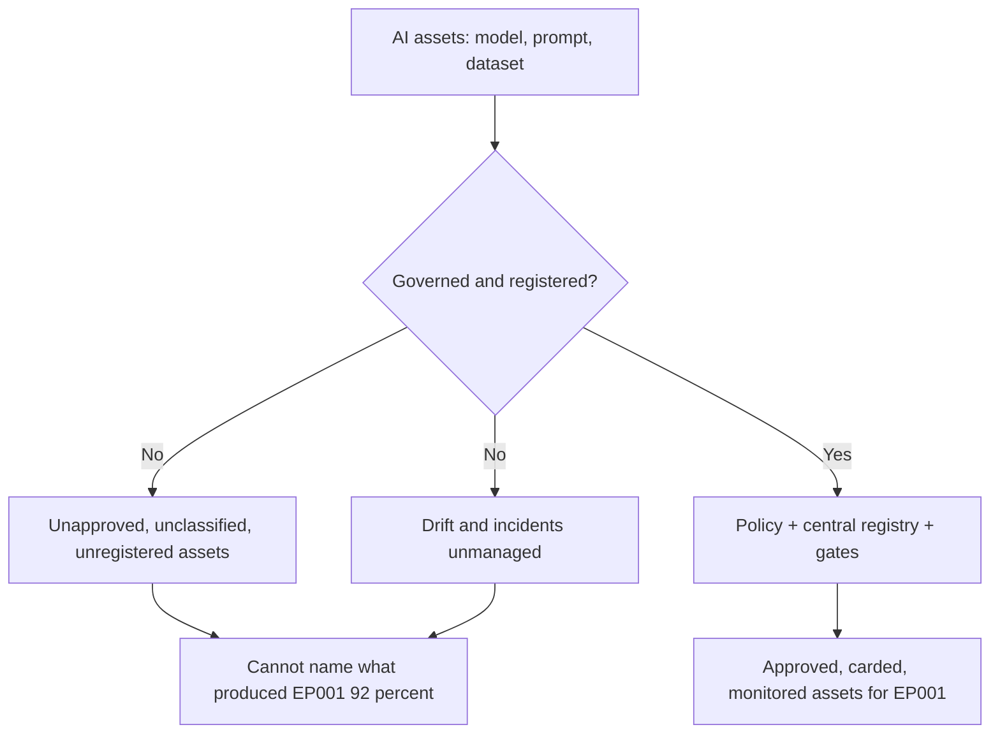
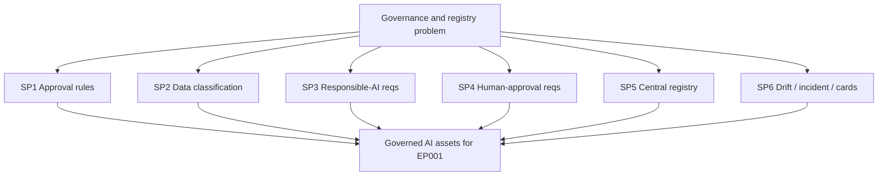
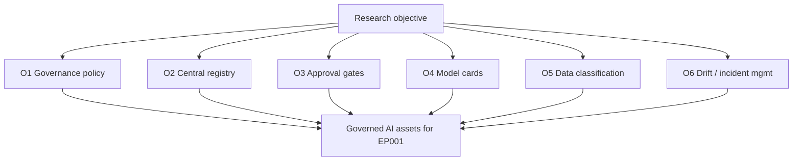
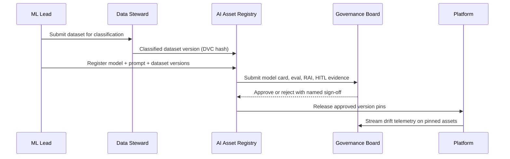
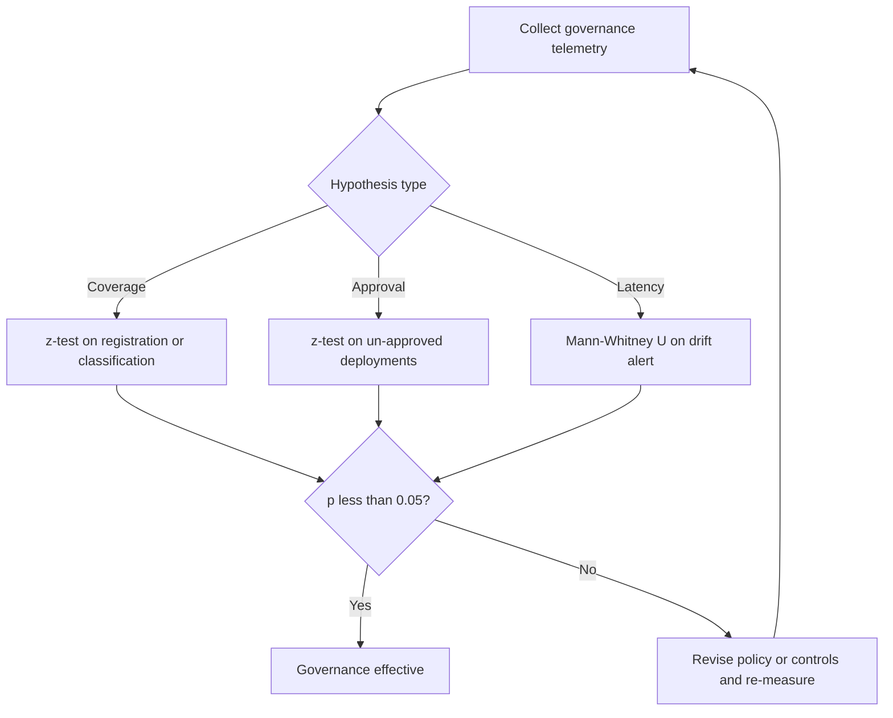
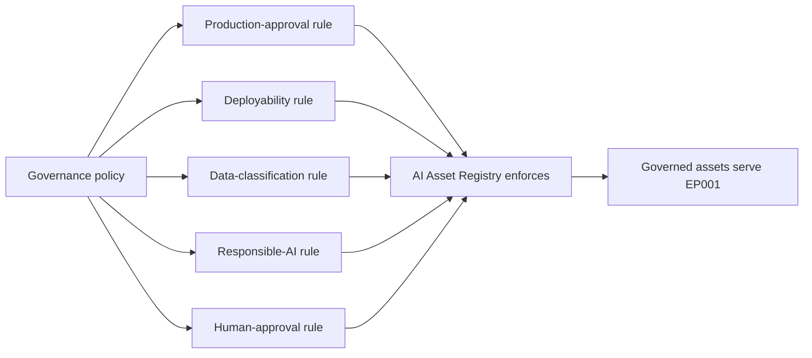
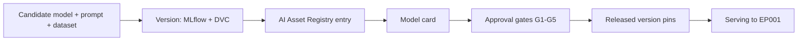
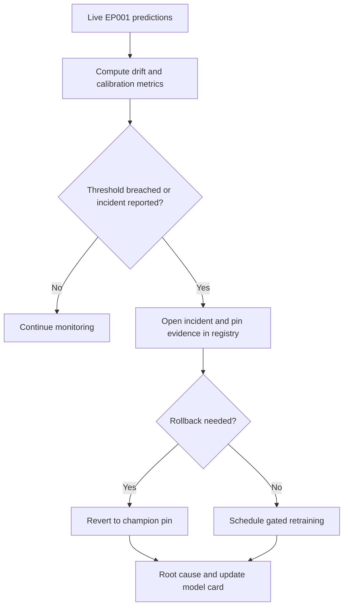
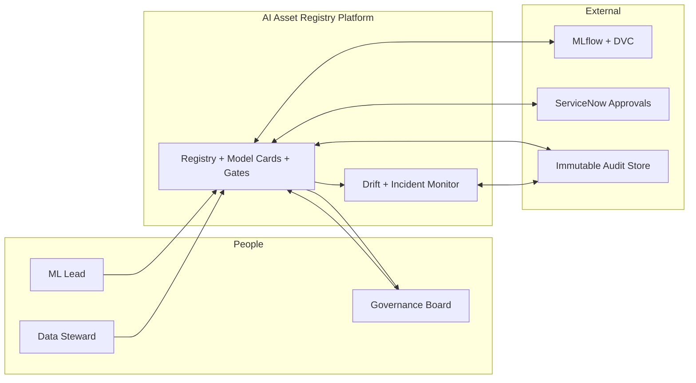
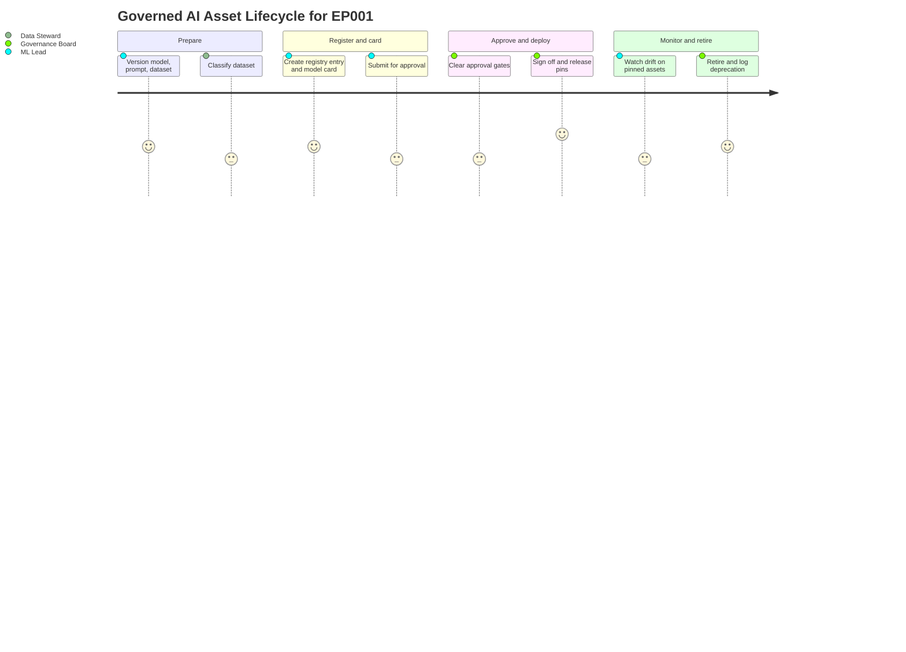

# Governance & AI Asset Registry — Policy, Registry, Approval Gates (Epilepsy, EP001)

> **Why (this doc):** The [implementation index](index.md) maps governance to MLflow Model Registry, DVC, model cards,
> and ServiceNow; this doc specifies *how* those tools realise a central AI Asset Registry and a governance policy that
> decides which models may be deployed and which are approved for production. Without a single authoritative registry and
> an explicit policy, no one can say which model, prompt, and dataset version produced EP001's decision support, or
> whether it was ever approved. This document encodes that governance layer for the epilepsy platform, anchored on
> patient EP001 (left temporal, F7/T7/P7, 92%).
> **How:** By following the mandatory research spine (Problem → Sub-problems → Research Problem → Research Objective → Flow
> → Hypotheses → Statistical Analysis), then specifying the governance policy, the central asset registry, approval
> gates, model cards, and drift/incident management, with all four Mermaid diagram types plus a C4 model, a defense Q&A,
> and APA-7 references — every table captioned, every heading carrying a **Why**/**How**. This doc **extends and
> cross-links** [`../../pipeline-a/phase-16-governance-compliance.md`](../../pipeline-a/phase-16-governance-compliance.md)
> and [`../06-governance-ai.md`](../06-governance-ai.md) rather than duplicating them.

**Governing question.** *Can an enterprise epilepsy AI platform define one governance policy and one central AI Asset
Registry — recording every model, prompt, and dataset version behind approval gates, model cards, and drift/incident
management — so that only approved, registered assets ever produce decision support for a patient such as EP001?*

---

## 1. Problem

> **Why:** A governance/registry layer must anchor to a concrete failure mode before controls are proposed. **How:**
> State the gap between scattered, unregistered AI assets and a governed, single-source-of-truth registry for EP001's
> care.

Behind EP001's decision-support summary sit at least three versioned assets: a **model** (the localizer that produced
92%), a **prompt template** (that framed the RAG query), and a **dataset** (the corpus and preprocessing the model was
trained on). Without a governance policy and a central registry these assets drift apart: an unapproved model may reach
production, a prompt may change silently, a dataset version may be unrecorded, data classification may be undefined, and
no gate may have required human approval before clinical exposure. The problem is not any single asset's quality; it is
the **absence of governance and a central registry**: no rule for which models are approved for production, no rule for
which may even be deployed, no data-classification policy, no responsible-AI or human-approval requirement, and no
single place where every asset's model/prompt/dataset version is registered, carded, and gated.

*Caption — The table below decomposes the abstract governance gap into concrete asset-management failure modes and the
control that answers each, so every later section maps to a named failure.*

| Failure mode | Manifestation for EP001 | Governance answer (Section) |
|---|---|---|
| No production-approval rule | Unapproved model localizes EP001's focus | Governance policy (S8) |
| No deployability rule | An experimental model is deployed to clinic | Governance policy (S8) |
| Undefined data classification | EEG + medication data handled without a class | Governance policy (S8) |
| No central registry | Cannot name the model/prompt/dataset behind 92% | AI Asset Registry (S9) |
| No approval gate | Model reaches production without sign-off | Approval gates (S9) |
| No drift/incident policy | Silent miscalibration or error has no route | Drift/incident management (S10) |

**Reason:** The problem must be shown as a fork between ungoverned and governed AI assets. **Why:** A single flowchart
contrasts scattered unapproved assets against a policy-plus-registry regime, making the value of governance non-verbal.
**What is happening:** A decision node splits EP001's assets into an ungoverned branch (unapproved, unclassified,
unregistered) and a governed branch that ends in approved, carded, monitored assets. **How it is happening:** The
governed branch inserts a governance policy, a central registry, and approval gates before any asset reaches EP001.
**Reference:** NIST (2023) AI RMF Govern function; extends `pipeline-a/phase-16-governance-compliance.md`.

---

## 2. Sub-Problems

> **Why:** One governance problem must split into individually ownable units. **How:** Enumerate the discrete governance
> questions the platform must answer, with an owner.

*Caption — This table lists each governance sub-problem with its owning role, ensuring no aspect of asset governance is
orphaned.*

| # | Sub-problem | Primary owner |
|---|---|---|
| SP1 | Which models are approved for production, and which may be deployed at all? | Governance Board |
| SP2 | How is data classified and handled? | Data Steward |
| SP3 | What responsible-AI requirements must every asset meet? | AI Ethics Lead |
| SP4 | When is human approval mandatory before an asset serves EP001? | Neurologist Lead |
| SP5 | Where is the central registry and what versions does it hold? | ML Lead + Data Steward |
| SP6 | How are drift and incidents detected, and models carded and retired? | ML Lead + Board |

**Reason:** The sub-problems must be seen to converge on one governance system. **Why:** The flowchart shows six
independent governance questions rolling up into a single governed asset base, proving coverage. **What is happening:**
Each sub-problem is a node feeding the governed-assets node that serves EP001. **How it is happening:** Each has a named
owner (table) and a control section downstream. **Reference:** NIST (2023) AI RMF Map function.

---

## 3. Research Problem

> **Why:** The examiner needs one crisp, testable statement unifying the sub-problems. **How:** Frame governance and the
> registry as a single answerable research problem bound to EP001.

**Research problem:** *How can an enterprise epilepsy AI platform enforce one governance policy — defining which models
are approved for production, which may be deployed, how data is classified, and which responsible-AI and human-approval
requirements apply — through a central AI Asset Registry that records every model, prompt, and dataset version behind
approval gates, model cards, and drift/incident management, so that only approved, registered assets ever produce
decision support for a patient such as EP001, with every deployment fully auditable?*

*Caption — This table sharpens the research problem into independent, dependent, and constraint variables so governance
stays measurable and bounded.*

| Element | Definition in this study |
|---|---|
| Independent variables | Presence of policy, registry entry, approval gate, model card, drift monitor |
| Dependent variables | Registered-asset rate, un-approved-deployment count, data-classification coverage, drift-alert latency |
| Constraint | No asset serves EP001 without a registry entry, a model card, and a named approval |
| Population anchor | EP001 focal impaired-awareness epilepsy, left temporal, F7/T7/P7, 92% |

---

## 4. Research Objective

> **Why:** The problem must convert into build-and-measure goals. **How:** State one overarching objective decomposed
> into governance-specific objectives, each traceable to a sub-problem and yielding an auditable artifact.

**Overarching objective.** Design and evaluate a governance policy and a central AI Asset Registry for the epilepsy
platform that classifies data, sets responsible-AI and human-approval requirements, registers every model/prompt/dataset
version, and gates production behind approval, model cards, and drift/incident management; then quantify governance
against registration, approval, classification, and drift metrics.

*Caption — Each objective yields a concrete, auditable artifact, making governance verifiable rather than aspirational.*

| # | Objective | Deliverable artifact | Success metric |
|---|---|---|---|
| O1 | Define the governance policy | Policy doc (approval, deployability, classification, RAI, HITL) | Policy ratified and enforced |
| O2 | Register every AI asset centrally | AI Asset Registry entries (model/prompt/dataset versions) | 100% serving assets registered |
| O3 | Gate production behind approval | Approval-gate checklist + sign-off log | 0 un-approved production deployments |
| O4 | Card every model | Model card per registered model | Every serving model has a current card |
| O5 | Classify all data | Data-classification labels on datasets | 100% datasets classified |
| O6 | Manage drift and incidents | Drift dashboard + incident register | Alert within 24h; every incident root-caused |

**Reason:** Objectives must form an ordered, closed governance system to prove coherence. **Why:** The flowchart shows
the six objectives as parts of one governance regime rather than a scatter of controls. **What is happening:** Each
objective feeds the governed-assets node that serves EP001. **How it is happening:** Each objective maps to an artifact
and metric in the table above. **Reference:** NIST (2023) AI RMF; Mitchell et al. (2019) model cards.

---

## 5. Flow (End-to-End Asset Governance Runtime)

> **Why:** A defense requires an auditable picture of how an asset moves from proposal to a governed, registered,
> production state for EP001. **How:** Present the governance path as a stage table and a `sequenceDiagram` across ML
> Lead, registry, board, and platform.

*Caption — This table traces one asset through each governance stage so the reviewer can audit where governance enters.*

| Stage | Actor / component | Input | Governance gate |
|---|---|---|---|
| 1 Propose | ML Lead | Candidate model + prompt + dataset | Assets versioned (MLflow + DVC) |
| 2 Classify | Data Steward | Dataset | Data-classification label applied |
| 3 Register | AI Asset Registry | Versioned assets | Registry entry + model card |
| 4 Approve | Governance Board | Eval + RAI + HITL evidence | Named production sign-off |
| 5 Deploy | Platform | Approved version pins | Deployability rule enforced |
| 6 Monitor | Drift monitor | Live EP001 predictions | Drift/incident thresholds + alerts |

**Reason:** The governance path must show ordered interaction over time between roles, registry, and platform. **Why:** A
sequence diagram makes explicit that no asset serves EP001 before classification, registration, carding, and a named
board approval, and that drift telemetry flows back. **What is happening:** The ML Lead and Data Steward version and
classify assets; the registry cards and submits them; the board approves; the platform serves pinned versions and streams
drift telemetry. **How it is happening:** Every message is logged; the version pins are what the platform enforces so the
served asset set is always identifiable. **Reference:** Mitchell et al. (2019) model cards; extends
`pipeline-a/phase-16-governance-compliance.md` S12.

---

## 6. Hypotheses

> **Why:** Falsifiable hypotheses make the governance programme scientific. **How:** State four hypotheses, each paired
> with the statistic that tests it.

*Caption — The hypothesis table pairs each null with its alternative and the measured variable, so governance
effectiveness is independently falsifiable.*

| ID | Null (H0) | Alternative (H1) | Measured variable |
|---|---|---|---|
| H1 | Central registry does not change registration coverage | Registry raises coverage to 100% | % serving assets registered |
| H2 | Approval gates do not change un-approved deployments | Gates reduce un-approved deployments to zero | Count of un-approved deployments |
| H3 | Classification policy does not change coverage | Policy raises classification coverage | % datasets classified |
| H4 | Drift monitoring does not shorten detection time | Monitoring shortens time-to-detect drift | Hours to drift alert |

---

## 7. Statistical Analysis

> **Why:** The examiner will probe how each governance claim becomes a number. **How:** Bind every hypothesis to a test,
> threshold, and EP001 read, then show the validation loop as a flowchart.

*Caption — This table binds each hypothesis to a statistical method and decision rule, so governance is judged
objectively.*

| Hypothesis | Test | Threshold / decision rule | EP001 read |
|---|---|---|---|
| H1 | One-proportion z-test vs baseline | Reject H0 if coverage = 100%, p < 0.05 | Model/prompt/dataset behind 92% all registered |
| H2 | One-proportion z-test vs 0 | Reject H0 if un-approved deployments = 0, p < 0.05 | No unapproved model served EP001 |
| H3 | One-proportion z-test vs baseline | Reject H0 if classification = 100%, p < 0.05 | EP001's EEG dataset carries a data class |
| H4 | Mann-Whitney U on detection latency | Reject H0 if monitored < unmonitored, p < 0.05 | Confidence drift on F7/T7/P7 flagged early |

**Reason:** The analysis plan must be a gated loop, not a single pass. **Why:** The flowchart proves governance is only
declared effective after registration, approval, classification, and drift gates clear statistically. **What is
happening:** Telemetry is routed by hypothesis type to the right test; failing any gate returns to control revision.
**How it is happening:** Each test has an explicit decision rule (table) tied to EP001. **Reference:** APA (2020) on
transparent analysis reporting.

---

## 8. Governance Policy

> **Why:** Governance must be a written, enforced policy before a registry can implement it. **How:** A policy table
> naming each rule, its statement, and its owner.

*Caption — This table is the governance policy: the rules that decide which models are approved for production, which may
be deployed, how data is classified, and which responsible-AI and human-approval requirements apply — fixing the rules
the registry then enforces for EP001.*

| Policy area | Rule statement | Owner |
|---|---|---|
| Production approval | Only models passing all approval gates and carded may serve production | Governance Board |
| Deployability | Only registered, versioned assets may be deployed to any environment | ML Lead |
| Data classification | Every dataset is labelled (e.g. Restricted for EEG + medication) before use | Data Steward |
| Responsible-AI requirement | Every model meets evaluation, fairness, and explainability thresholds | AI Ethics Lead |
| Human-approval requirement | No AI output reaches EP001's chart without a named neurologist sign-off | Neurologist Lead |
| Deprecation | Superseded/unsafe models are retired and logged | Governance Board |

**Reason:** The policy-to-registry link must be shown as one legible network. **Why:** The `graph LR` shows five policy
rules all enforced by the single central registry, proving policy is operational rather than aspirational. **What is
happening:** Each policy rule flows into the AI Asset Registry, which enforces it before any asset serves EP001. **How it
is happening:** The registry is the single choke point where the rules become machine-checked entries and gates.
**Reference:** NIST (2023) AI RMF Govern function; extends `pipeline-a/phase-16-governance-compliance.md`.

---

## 9. Central AI Asset Registry & Approval Gates

> **Why:** The policy is realised by one authoritative registry that records every asset version and gates promotion.
> **How:** A registry-contents table, an approval-gate table, and the tool mapping.

### 9.1 Registry contents

*Caption — This table names what the central AI Asset Registry records per asset, converting "we register assets" into an
auditable practice for EP001.*

| Asset | Recorded version | Tool | EP001 example |
|---|---|---|---|
| Model | Semantic version + seed manifest | MLflow Model Registry | Localizer that produced 92% |
| Prompt | Prompt-template version | Registry entry (Langfuse-linked) | RAG query that framed the summary |
| Dataset | Data version + hash | DVC | TUH/Siena corpus + preprocessing commit |
| Model card | Intended use, metrics, limits, subgroup performance | Model card | Card for EP001's localizer |
| Approval | Named sign-off + gate results | ServiceNow | Board approval record |

### 9.2 Approval gates

*Caption — This table lists the mandatory gates between a candidate asset and production, preventing ungoverned
deployment for EP001's care.*

| Gate | Owner | Pass criterion |
|---|---|---|
| G1 Evaluation | ML Lead | Localization accuracy ≥ 90%, ECE ≤ 0.05 |
| G2 Responsible AI | AI Ethics Lead | Fairness + explainability thresholds met |
| G3 Data classification | Data Steward | Dataset labelled and handling verified |
| G4 Clinical validity | Neurologist Lead | Intended-use scope confirmed |
| G5 Board sign-off | Governance Board | Named production approval recorded |

### 9.3 Tools

*Caption — This table maps each registry function to its adopted tool, matching the [implementation index](index.md)
governance row.*

| Function | Tool |
|---|---|
| Model registry + versioning | MLflow Model Registry |
| Dataset versioning | DVC |
| Model documentation | Model cards |
| Approval workflow | ServiceNow |

**Reason:** The path from candidate asset to served asset must be a single legible network. **Why:** The `graph LR` shows
versioning and registration sitting *before* carding, gating, and serving, proving governance is inline, not bolted on.
**What is happening:** A candidate becomes a versioned, carded registry entry, clears five gates, and only then is
released as pins serving EP001. **How it is happening:** Each node is an artifact in the registry (MLflow/DVC); the pins
are what the platform enforces. **Reference:** Mitchell et al. (2019) model cards; NIST (2023) AI RMF Manage function.

---

## 10. Drift & Incident Management

> **Why:** A model approved at launch can drift or fail; both must be managed with owners and metrics. **How:** A
> drift/incident controls table and a governed response loop.

*Caption — This table names each post-deployment monitor and incident control, its metric, threshold, and response,
making "we manage drift" auditable for EP001.*

| Control | Metric | Threshold | Response |
|---|---|---|---|
| Data drift monitor | PSI on EEG feature distribution | PSI > 0.2 | Investigate EEG pipeline |
| Concept drift monitor | Rolling localization AUROC | Drop > 5% vs baseline | Trigger retraining review |
| Calibration drift | ECE on confidence | ECE > 0.05 | Recalibrate + shadow test |
| Incident intake | Clinician-reported error | Any confirmed error | Open incident, pin evidence |
| Rollback | Revert to prior approved pin | On confirmed incident | Restore champion version |

**Reason:** Drift and incidents must be shown as a governed response loop. **Why:** The flowchart proves any breach or
reported error routes to a defined incident, rollback, and root-cause path rather than ad-hoc firefighting. **What is
happening:** Live EP001 predictions are measured; a breach opens a registry-pinned incident that either rolls back to the
champion or schedules gated retraining, always ending in root cause and a model-card update. **How it is happening:**
Thresholds and responses are those in the controls table; the champion pin is the last approved registry version.
**Reference:** NIST (2023) AI RMF Manage function; extends `../06-governance-ai.md` S9.

---

## 11. C4-Style Model (Governance Registry Context)

> **Why:** Governance requires an explicit map of who and what touches the asset registry. **How:** A C4 Level-1 context
> model naming the actors, the registry platform, and external systems.

*Caption — The C4 context model situates the central AI Asset Registry among its human actors and external systems,
clarifying approval and classification boundaries.*

**Reason:** Governance needs a single map of the registry's trust boundary. **Why:** A C4 Level-1 model names every actor
and system that can register, classify, approve, monitor, or audit an asset, fixing where approval authority sits.
**What is happening:** The ML Lead and Data Steward feed the registry, backed by MLflow/DVC; the board approves via
ServiceNow; the monitor watches serving; the audit store records everything. **How it is happening:** The registry with
cards and gates plus the monitor form the system-in-focus; bidirectional edges to the audit store make it tamper-evident.
**Reference:** Brown (2018) C4 model for software architecture; NIST (2023) AI RMF Govern function.

---

## 12. Journey (Asset Governance Experience)

> **Why:** The governance lifecycle must be felt from the governing roles' point of view, not only measured. **How:** A
> journey map across ML Lead, Data Steward, and board over one asset's life.

*Caption — This journey maps the recurring asset-governance experience from proposal to retirement, exposing where
confidence and friction arise.*

**Reason:** Asset governance must surface human confidence and friction. **Why:** A journey map complements the metrics
by showing where classification, carding, and approval feel heavy or reassuring across roles. **What is happening:** An
asset is versioned, classified, registered, carded, approved, monitored, and retired, with satisfaction scored per step.
**How it is happening:** Each lifecycle phase is a journey section owned by the responsible role. **Reference:** Topol
(2019) on human-plus-AI clinical workflow.

---

## 13. Where Implemented in This Repo

> **Why:** Governance is credible only if it maps to concrete, authored implementation. **How:** Tabulate each governance
> mechanism against the repository artifact that realises or extends it, cross-linking without duplicating.

*Caption — This crosswalk ties each governance/registry mechanism to where it lives in the repository, proving the doc is
realised, not aspirational, and cross-links its companions.*

| Governance mechanism | Where implemented / extended in this repo | Anchor |
|---|---|---|
| Governance board + RAI principles | [`../../pipeline-a/phase-16-governance-compliance.md`](../../pipeline-a/phase-16-governance-compliance.md) | Board + principles |
| Lifecycle governance (versioning, drift, incident) | [`../06-governance-ai.md`](../06-governance-ai.md) | Lifecycle mechanics |
| Central registry + model cards + gates | This doc S9 | Registry design |
| Model/prompt/dataset versioning | MLflow + DVC ([index.md](index.md) governance row) | Version pins |
| Approval workflow | ServiceNow approval tasks | Named sign-off |
| Runtime request accountability | [accountable-ai-architecture.md](accountable-ai-architecture.md) | Five-layer flow |
| Bias/drift monitoring | `../../pipeline-a/phase-16-governance-compliance.md` S10 | PSI/AUROC/ECE monitors |

---

## 14. Professor Readiness (Defense Q&A)

> **Why:** Anticipating examiner challenges demonstrates command of governance and the registry. **How:** Pre-answer the
> likely questions with concise reasoning, tables, or logic.

### Q1. Which exact model, prompt, and dataset produced EP001's 92%, and can you prove it?

> **Why:** Traceability is the crux of asset governance. **How:** Point to the central registry.

The central AI Asset Registry records the model version (MLflow + seed manifest), the prompt-template version, and the
dataset version (DVC hash) behind every serving output. EP001's recommendation records those pins, so all three assets
are identifiable and reproducible (H1, one-proportion z-test on registration coverage vs a 100% target). The model card
in the registry documents intended use and subgroup performance.

### Q2. How do you guarantee no un-approved model reaches production for EP001?

> **Why:** Un-approved deployment is a direct safety risk. **How:** Policy plus gates plus a hard metric.

The governance policy forbids deploying any asset that is not registered and gate-passed, and forbids production without a
named board sign-off. Five gates (evaluation, responsible-AI, data classification, clinical validity, board sign-off)
must pass. The KPI "un-approved deployments" has a hard target of 0, tested by z-test (H2).

### Q3. How does this doc avoid duplicating Phase 16 and the Governance-AI pillar?

> **Why:** The committee will check for duplication. **How:** Position the three docs.

*Caption — This table separates the three governance docs by focus.*

| Doc | Focus |
|---|---|
| `pipeline-a/phase-16` | Governance board, RAI principles, security posture |
| `../06-governance-ai.md` | Model *lifecycle* mechanics (versioning, drift, deprecation) |
| This doc | Governance *policy* + central *AI Asset Registry* + approval gates + model cards |

This doc concentrates on the policy and the single asset registry that enforces it, cross-linking (S13) rather than
restating the board, principles, and lifecycle mechanics.

### Q4. Why version prompts and datasets, not just models?

> **Why:** Governance often stops at models. **How:** Show the full asset set.

EP001's output depends on all three: a changed prompt template or an unrecorded dataset version changes the result as
surely as a changed model. The registry versions model, prompt, and dataset together (MLflow, Langfuse-linked prompt
version, DVC) so the whole producing context is reproducible and classifiable.

---

## 15. References

> **Why:** Defensible claims require real, citable sources. **How:** APA 7th edition entries spanning AI risk management,
> software architecture, model documentation, human-AI interaction, clinical AI, and reporting standards.

American Psychological Association. (2020). *Publication manual of the American Psychological Association* (7th ed.).
https://doi.org/10.1037/0000165-000

Amershi, S., Weld, D., Vorvoreanu, M., Fourney, A., Nushi, B., Collisson, P., Suh, J., Iqbal, S., Bennett, P. N., Inkpen,
K., Teevan, J., Kikin-Gil, R., & Horvitz, E. (2019). Guidelines for human-AI interaction. *Proceedings of the 2019 CHI
Conference on Human Factors in Computing Systems*, 1–13. https://doi.org/10.1145/3290605.3300233

Brown, S. (2018). *The C4 model for visualising software architecture*. C4model.com. https://c4model.com

Mitchell, M., Wu, S., Zaldivar, A., Barnes, P., Vasserman, L., Hutchinson, B., Spitzer, E., Raji, I. D., & Gebru, T.
(2019). Model cards for model reporting. *Proceedings of the Conference on Fairness, Accountability, and Transparency*,
220–229. https://doi.org/10.1145/3287560.3287596

National Institute of Standards and Technology. (2023). *Artificial intelligence risk management framework (AI RMF 1.0)*
(NIST AI 100-1). U.S. Department of Commerce. https://doi.org/10.6028/NIST.AI.100-1

Topol, E. J. (2019). High-performance medicine: The convergence of human and artificial intelligence. *Nature Medicine,
25*(1), 44–56. https://doi.org/10.1038/s41591-018-0300-7
