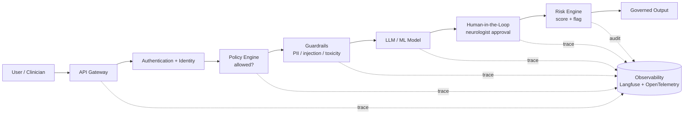

# Responsible AI — Implementation & Tooling Landscape

> **Why (this section):** The [Responsible AI pillars](../index.md) define *what* the platform
> must guarantee; this implementation layer defines *how* — the concrete open-source and
> commercial tools, the reference-architecture flows, and the observability spine that
> operationalise accountability, fairness, bias detection, explainability, guardrails,
> red-teaming, risk and governance for the epilepsy platform. **How:** a capability→tool
> matrix, a master Accountable-AI request flow, and per-capability architecture docs, all
> anchored on patient EP001 and mapped to real repo artefacts.

## Tooling landscape (open-source first)

*Caption - Maps each Responsible-AI capability to the open-source and commercial tools the platform adopts; open-source is the default, commercial is optional for managed scale.*

| Capability | Open-source | Commercial / managed | Platform role |
|---|---|---|---|
| **Accountability / Observability** | Langfuse, OpenTelemetry, OpenLLMetry | LangSmith, WhyLabs, Fiddler AI, Arize | Trace every request, prompt, model version, decision |
| **Fairness** | Fairlearn, IBM AI Fairness 360 (AIF360) | Fiddler, Arize | Group-fairness metrics + mitigation |
| **Bias detection** | Fairlearn, AIF360, Evidently AI | WhyLabs | Detect demographic-parity / equalised-odds gaps |
| **Explainable AI** | SHAP, LIME, InterpretML | Fiddler | Feature attribution + local explanations |
| **Guardrails** | NVIDIA NeMo Guardrails, Llama Guard, Guardrails AI | Azure AI Content Safety | Block prompt-injection, PII, jailbreak, toxicity |
| **AI Red Team** | Microsoft Counterfit, PyRIT, Garak | — | Adversarial / robustness testing |
| **Compliance** | NIST AI RMF toolkit, EU AI Act checklists | Credo AI, Holistic AI | Regulatory mapping + evidence |
| **Risk** | Risk-scoring engine (custom), NIST AI RMF | ServiceNow (workflow) | Likelihood × impact scoring + escalation |
| **Governance** | MLflow Model Registry, DVC, model cards | ServiceNow, Credo AI | Model / prompt / dataset registry + approval gates |
| **Human-in-the-loop** | Custom approval service | ServiceNow approval tasks | Neurologist sign-off before action |

## Master reference architecture — Accountable AI request flow

*Caption - The end-to-end request path every AI action traverses; each hop is a governed, observable control point.*

**Reason:** To show the governed path of every AI request. **Why:** Accountability requires each hop (identity, policy, guardrail, model, human, risk) to be a controllable, observable checkpoint. **What is happening:** A clinician request is authenticated, policy-checked, guardrailed, model-served, human-approved, risk-scored, and emitted — with a trace at every hop. **How it is happening:** Langfuse + OpenTelemetry capture a distributed trace linking prompt, model version, RAG context, confidence, and decision. **Reference:** NIST (2023); Brown (2018).

## Implementation docs

| Doc | Covers |
|---|---|
| [Accountable AI Architecture](accountable-ai-architecture.md) | Identity → policy → guardrail → HITL → risk layers; audit + traceability (Langfuse, OpenTelemetry, ServiceNow) |
| [Fairness & Bias Pipeline](fairness-bias-pipeline.md) | Collect → validate → detect (Fairlearn/AIF360) → mitigate (pre/in/post) → deploy |
| [Explainability — SHAP & LIME](explainability-shap-lime.md) | SHAP + LIME service flows applied to the epilepsy models |
| [Guardrails & Red Team](guardrails-redteam.md) | NeMo Guardrails / Llama Guard; Counterfit / PyRIT adversarial testing |
| [Governance & AI Registry](governance-registry.md) | Governance policy, model/prompt/dataset registry, approval gates, risk scoring |

## Where it maps in this repo

| Capability | Already implemented |
|---|---|
| Fairness / bias detection | `analysis/primary_analysis.py` → `bias_check()` (demographic-parity + equal-opportunity gaps) |
| Explainability | ordinal odds ratios + feature ranking in `analysis/`; [pillar 05](../05-explainable-ai.md) |
| Human-in-the-loop | fusion CDSS neurologist sign-off ([fusion-analysis](../../analysis/fusion-analysis.md)) |
| Governance / audit | reproducible seeds + cleaning audit trail; [pipeline-a/phase-16](../../pipeline-a/phase-16-governance-compliance.md) |
