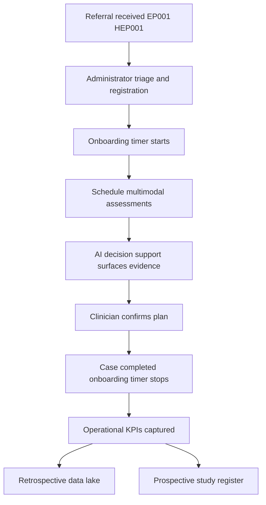
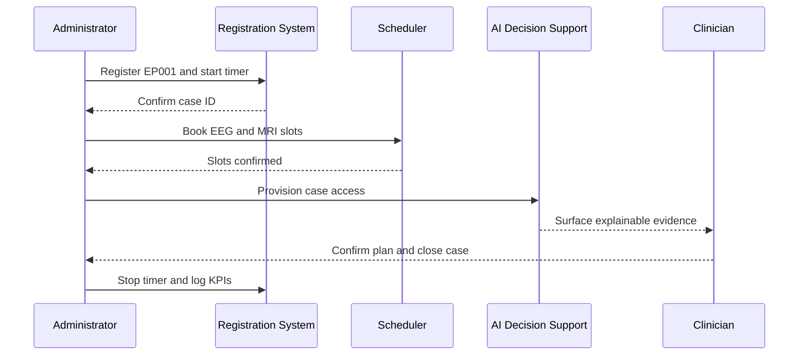
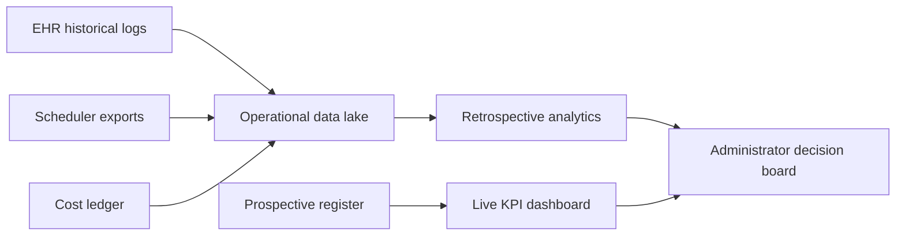
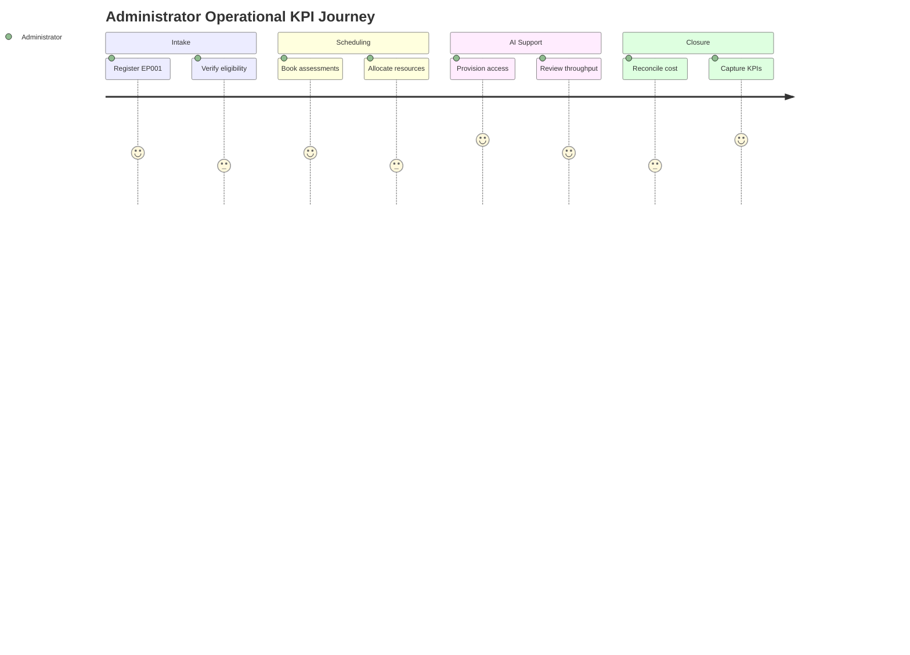
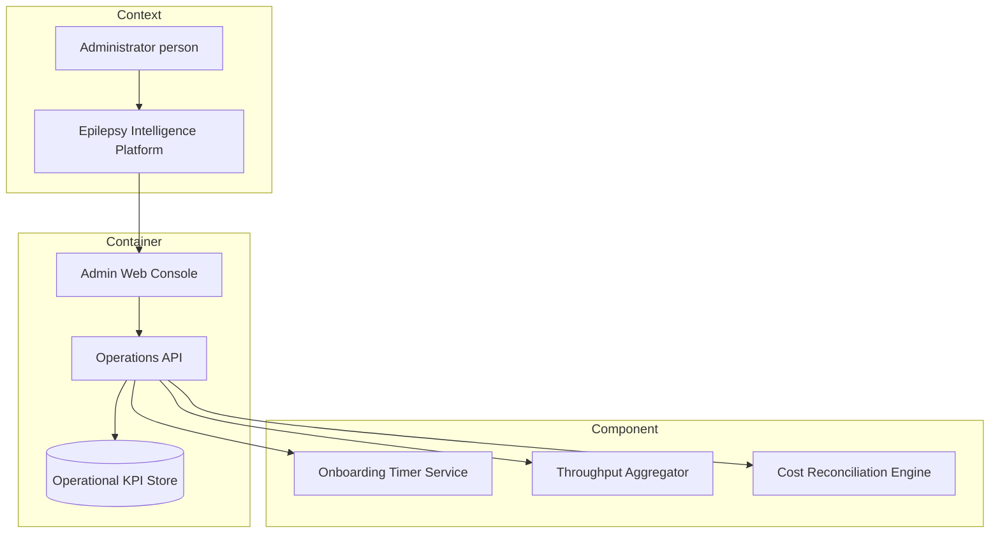

# Role Study - Administrator (Retrospective + Prospective)

> **Why (this doc):** The Administrator is the operational backbone of the Enterprise AI Platform for Explainable Multimodal Epilepsy Intelligence; without measured onboarding time, patient throughput, and cost-per-case, no clinical benefit from AI decision support can be scaled or defended. This dossier documents the Administrator's assessments and tasks and shows how their operational data feeds BOTH a retrospective study (mining existing historical operational records) and a prospective study (a forward before/after AI-deployment operational trial) for epilepsy patients EP001 (29M focal, primary-assessment) and HEP001 (27F temporal-lobe).
>
> **How:** We follow a numbered research spine (Problem through Statistical Analysis), then present role assessments, a full retrospective design, a full prospective design, a head-to-head comparison matrix, and KPIs, supported by five diagrams (flowchart, sequence, graph, journey, C4) each with a labeled prose explanation, and close with a defense Q&A and APA references. AI is decision support only; the Administrator and clinical staff retain all decisions.

---

## 1. Problem

> **Why:** Frame the operational pain the Administrator role must solve so the study has a defensible starting point. **How:** State the measurable gap between current epilepsy-service operations and the throughput/cost targets the platform promises.

Epilepsy services face rising referral volumes, long diagnostic pathways, and fragmented multimodal data (EEG, MRI, clinical notes, seizure diaries). Administrators currently lack instrumented, comparable metrics for how long it takes to onboard a patient such as EP001, how many cases move through the pathway per week, and what each case costs. Without this operational baseline, any claim that AI decision support improves the service is unverifiable, and resource allocation stays reactive rather than evidence-based.

## 2. Sub-Problems

> **Why:** Decompose the broad operational problem into researchable units. **How:** Enumerate discrete, individually measurable operational deficits.

*Caption - Sub-problems decomposition mapping each operational deficit to the metric that exposes it.*

| # | Sub-problem | Manifestation | Primary metric exposed |
|---|-------------|---------------|------------------------|
| SP1 | Onboarding latency unknown | Referral-to-first-assessment delay for EP001/HEP001 not tracked | Onboarding time (days) |
| SP2 | Throughput not instrumented | Cases completed per clinic-week not recorded consistently | Throughput (cases/week) |
| SP3 | Cost opacity | No cost-per-completed-case allocation | Cost per case (currency) |
| SP4 | No AI-impact evidence | Cannot separate AI effect from secular trend | Before/after delta with controls |
| SP5 | Data-quality gaps | Historical logs incomplete or non-standard | Record completeness (%) |

## 3. Research Problem

> **Why:** Collapse the sub-problems into one testable statement. **How:** Pose a single question linking AI decision-support deployment to Administrator-owned operational KPIs.

**Research problem:** To what extent, and with what confidence, does deployment of the explainable multimodal AI decision-support platform change Administrator-owned operational KPIs (onboarding time, throughput, and cost per case) in an epilepsy service, when assessed both retrospectively against historical records and prospectively through forward operational data collection?

## 4. Research Objective

> **Why:** Convert the problem into concrete, checkable aims. **How:** List objectives that each map to a study type and an analysis.

*Caption - Research objectives mapped to study type and the KPI each objective targets.*

| # | Objective | Study type | Target KPI |
|---|-----------|-----------|-----------|
| O1 | Quantify baseline operational KPIs from existing records | Retrospective | Onboarding, throughput, cost |
| O2 | Identify historical drivers of onboarding delay | Retrospective | Onboarding time |
| O3 | Measure before/after change following AI deployment | Prospective | All three KPIs |
| O4 | Estimate causal effect of AI support with controls | Prospective | Cost per case, throughput |
| O5 | Compare retrospective vs prospective evidence strength | Both | Methodological |

## 5. Flow

> **Why:** Give a single visual of how an Administrator moves a patient and their data through the operational pathway. **How:** A Mermaid flowchart from referral to KPI capture.

**Reason:** The flowchart exists to make the Administrator's operational touchpoints explicit so every KPI has a defined capture moment. **Why:** Auditors and examiners must see exactly where onboarding time starts and stops and where cost accrues, otherwise KPI definitions are contestable. **What is happening:** A referral for EP001 or HEP001 is triaged, a timer starts, assessments are scheduled, AI surfaces explainable evidence, a clinician confirms, the case completes, and KPIs are written to both a retrospective lake and a prospective register. **How it is happening:** The platform timestamps each transition and the Administrator dashboard aggregates these into onboarding, throughput, and cost metrics. **Reference:** Topol (2019) on AI augmenting rather than replacing clinical workflow.

## 6. Hypotheses

> **Why:** State falsifiable predictions for the statistical tests. **How:** Pair each null with its alternative and the KPI under test.

*Caption - Hypotheses table pairing null and alternative statements with the KPI and planned test.*

| ID | Null (H0) | Alternative (H1) | KPI | Planned test |
|----|-----------|------------------|-----|--------------|
| H1 | AI deployment does not change onboarding time | AI deployment reduces onboarding time | Onboarding (days) | Paired t / Wilcoxon |
| H2 | Throughput unchanged after deployment | Throughput increases after deployment | Cases/week | Interrupted time series |
| H3 | Cost per case unchanged | Cost per case decreases | Currency/case | Difference-in-differences |
| H4 | Historical completeness unrelated to delay | Lower completeness predicts longer onboarding | Onboarding | Regression |

## 7. Statistical Analysis

> **Why:** Pre-specify how each hypothesis is tested to prevent post-hoc fishing. **How:** Map tests, assumptions, and effect measures to study type.

*Caption - Statistical analysis plan linking each test to its study type, assumption checks, and reported effect measure.*

| Analysis | Study type | Assumption checks | Effect measure |
|----------|-----------|-------------------|----------------|
| Descriptive baseline (median, IQR) | Retrospective | Distribution inspection | Point estimates + 95% CI |
| Multivariable regression on onboarding | Retrospective | Linearity, collinearity (VIF) | Adjusted beta coefficients |
| Interrupted time series (ITS) | Prospective | Autocorrelation (Durbin-Watson) | Level and slope change |
| Difference-in-differences (DiD) | Prospective | Parallel trends | DiD estimator |
| Paired pre/post per clinic | Prospective | Normality (Shapiro-Wilk) | Mean/median difference |

**Reason:** The analysis table locks the test to the hypothesis before data are seen. **Why:** Pre-registration of tests is what separates confirmatory from exploratory findings and is required for a defensible DBA thesis. **What is happening:** Retrospective questions use descriptive and regression methods on historical rows; prospective questions use ITS and DiD to isolate the AI effect from time trends. **How it is happening:** Each KPI series is exported, assumption diagnostics run, and the pre-specified estimator reports an effect with a confidence interval. **Reference:** American Psychological Association (2020) reporting standards for quantitative designs.

---

## 8. Role Assessments and Tasks

> **Why:** Define precisely what the Administrator does so operational data provenance is auditable. **How:** Tabulate each assessment/task with its trigger, output, and the KPI it feeds.

*Caption - Administrator assessments and tasks with trigger, output artefact, and the operational KPI each one feeds.*

| Task ID | Assessment / task | Trigger | Output artefact | Feeds KPI |
|---------|-------------------|---------|-----------------|-----------|
| T1 | Referral intake and eligibility check | New epilepsy referral (EP001/HEP001) | Registration record | Onboarding start |
| T2 | Multimodal assessment scheduling | Post-registration | Calendar bookings | Throughput |
| T3 | Resource and room allocation | Weekly planning | Capacity plan | Cost per case |
| T4 | AI decision-support access provisioning | Case opened | Access grant log | Throughput |
| T5 | Case completion and coding | Plan confirmed | Closed case + timestamp | Onboarding stop |
| T6 | Cost reconciliation | Month-end | Cost ledger entry | Cost per case |
| T7 | Data-quality audit | Monthly | Completeness report | Record completeness |

### 8.1 Administrator - Platform Interaction Sequence

> **Why:** Show the ordered exchange between Administrator, platform, and AI support during one case. **How:** A Mermaid sequence diagram of a single onboarding.

**Reason:** The sequence diagram documents the exact message order that produces the onboarding timestamp pair. **Why:** If the start and stop signals are not ordered and attributable, onboarding time is disputable and the KPI collapses. **What is happening:** The Administrator registers EP001, books assessments, provisions AI access, the clinician receives explainable evidence and confirms, and the timer stops. **How it is happening:** Each arrow is an audited system event with a timestamp and actor ID, aggregated into the KPI store. **Reference:** Fisher et al. (2017) ILAE operational classification underpinning consistent case definitions.

### 8.2 Operational Data Landscape

> **Why:** Show how operational data flows left-to-right from source to KPI dashboards for both studies. **How:** A Mermaid graph LR of data movement.

**Reason:** The graph clarifies that retrospective and prospective pipelines draw from overlapping but distinct sources. **Why:** Examiners must see that retrospective data is passively harvested while prospective data is actively and prospectively defined. **What is happening:** Historical logs, scheduler exports, and cost ledgers fill a lake feeding retrospective analytics, while a purpose-built register feeds a live dashboard; both reach one decision board. **How it is happening:** Batch ETL loads the lake; streaming events feed the register. **Reference:** Topol (2019) on data infrastructure for health-system AI.

### 8.3 Administrator KPI Journey

> **Why:** Express the Administrator's experience of the metrics across a case lifecycle. **How:** A Mermaid journey diagram scoring each step.

**Reason:** The journey maps subjective friction to each operational step. **Why:** High-friction, low-score steps are where AI decision support and process redesign should be targeted first. **What is happening:** Intake and cost reconciliation score lower (more friction) while AI provisioning and KPI capture score higher after platform support. **How it is happening:** Scores are drawn from Administrator self-report surveys tied to each task ID. **Reference:** American Psychological Association (2020) on self-report measurement rigor.

### 8.4 C4 Model - Administrator in the Platform

> **Why:** Show, at Context/Container/Component altitude, how the Administrator interacts with platform systems. **How:** A Mermaid graph structured as C4 layers.

**Reason:** The C4 model separates who (Administrator), what deployable systems, and which internal components own each KPI. **Why:** A DBA defense requires showing architectural ownership so KPI responsibility is unambiguous. **What is happening:** The Administrator uses a web console that calls an operations API backed by a KPI store, with three components computing onboarding, throughput, and cost. **How it is happening:** Each component subscribes to the audited events from the sequence diagram and writes to the KPI store. **Reference:** Topol (2019) on modular health-AI system architecture.

---

## 9. Retrospective Study Design (Administrator Role)

> **Why:** Establish the operational baseline cheaply and quickly from data that already exists. **How:** Analyze historical operational records without new enrollment.

*Caption - Retrospective study specification covering data source, design, sample, variables, analysis, and bias controls for the Administrator role.*

| Element | Specification |
|---------|---------------|
| Data source | Existing EHR logs, scheduler exports, historical cost ledgers (36 months prior) |
| Design | Observational, longitudinal record review |
| Sample | All closed epilepsy cases including EP001/HEP001 historical analogues; census, no new recruitment |
| Independent variables | Referral source, case complexity, staffing level, record completeness |
| Dependent variables | Onboarding time, throughput, cost per case |
| Analysis | Descriptive baseline, multivariable regression, ITS pre-period |
| Bias controls | Standardized extraction protocol, blinded coding, sensitivity analysis for missing data, completeness threshold |

**Key bias risks:** selection bias (only completed/recorded cases survive in logs) and recall/measurement bias (inconsistent historical timestamping). Controls include explicit inclusion of incomplete cases where recoverable, imputation sensitivity analysis, and a documented extraction codebook.

## 10. Prospective Study Design (Administrator Role)

> **Why:** Establish causal-strength evidence for the AI effect that retrospective data cannot provide. **How:** Enroll cases forward, define endpoints in advance, and collect follow-up data on a fixed schedule around AI deployment.

*Caption - Prospective before/after AI-deployment study specification with endpoints, follow-up schedule, and consent for the Administrator role.*

| Element | Specification |
|---------|---------------|
| Data source | Newly collected operational data, prospectively defined |
| Design | Before/after (pre/post) AI-deployment with interrupted time series and DiD control clinic |
| Enrollment | Forward enrollment of all new epilepsy cases (EP001/HEP001 profile) for 12 months |
| Primary endpoint | Change in onboarding time post-deployment |
| Secondary endpoints | Throughput increase, cost-per-case reduction |
| Follow-up schedule | Weekly KPI snapshot; monthly reconciliation; 3, 6, 12-month analysis points |
| Consent | Operational-metrics governance approval; patient-level operational data uses service-evaluation consent and data-protection notice |
| Bias controls | Pre-registered endpoints, control clinic without AI, parallel-trends check, blinded outcome extraction |

*Caption - Prospective follow-up timeline showing measurement points relative to AI deployment.*

| Time point | Phase | Data captured | Purpose |
|------------|-------|---------------|---------|
| Week -12 to 0 | Pre-deployment baseline | Weekly KPIs | Establish trend |
| Week 0 | AI deployment | Deployment marker | ITS interruption point |
| Month 3 | Early post | KPIs + adoption | Detect level change |
| Month 6 | Mid post | KPIs + cost | Detect slope change |
| Month 12 | Endpoint | Full KPI set | Confirm sustained effect |

## 11. Retrospective vs Prospective Matrix (Administrator Role)

> **Why:** Make the trade-off between the two mandatory study types explicit for this role. **How:** Compare both on the dimensions an examiner will probe.

*Caption - Head-to-head matrix contrasting the retrospective and prospective Administrator studies across seven decision dimensions.*

| Dimension | Retrospective | Prospective |
|-----------|---------------|-------------|
| Time direction | Backward, looks at past records | Forward, follows cases into the future |
| Data source | Existing historical operational logs | Newly, purpose-collected operational data |
| Cost | Low, data already exists | Higher, requires collection and follow-up |
| Bias risk | Higher (selection, recall, measurement) | Lower (pre-defined endpoints, controls) |
| Causal strength | Weaker, association only | Stronger, supports before/after causal inference |
| Ethics / consent | Service-evaluation / waiver on existing data | Governance approval + prospective data notice |
| Best use | Rapid baseline, hypothesis generation | Confirming AI-deployment operational effect |

**Reason:** The matrix crystallizes why BOTH designs are mandatory rather than redundant. **Why:** Retrospective work is fast and cheap but cannot rule out confounding, while prospective work is costly but causally credible; the DBA needs both. **What is happening:** The retrospective study sets the baseline and generates hypotheses; the prospective study tests them under controlled forward conditions. **How it is happening:** Baseline effect sizes from historical regression power the prospective sample and endpoint definitions. **Reference:** Song and Chung (2010) on retrospective versus prospective study selection.

## 12. Role KPIs

> **Why:** Give the Administrator a fixed, defensible scorecard. **How:** Define each KPI with formula, baseline target, and post-AI target.

*Caption - Administrator operational KPI definitions with formula, baseline, and post-deployment target.*

| KPI | Formula | Baseline | Post-AI target |
|-----|---------|----------|----------------|
| Onboarding time | Case-close date minus referral date (median days) | 21 days | <= 14 days |
| Throughput | Completed cases per clinic-week | 8 cases | >= 11 cases |
| Cost per case | Total attributable cost / completed cases | 100 units | <= 85 units |
| Record completeness | Complete fields / required fields (%) | 82% | >= 95% |
| AI adoption | Cases with AI evidence reviewed / total (%) | n/a | >= 90% |

**Reason:** The KPI table converts strategy into measurable targets tied to the two studies. **Why:** Without numeric baselines and targets, before/after claims cannot be tested statistically. **What is happening:** Retrospective analysis supplies the baseline column; prospective analysis tests movement toward the target column. **How it is happening:** Each KPI is computed by the corresponding C4 component and stored with case IDs. **Reference:** American Psychological Association (2020) on operationalizing outcome measures.

---

## 13. Professor Readiness (Defense Q&A)

> **Why:** Anticipate examiner challenges so the design survives scrutiny. **How:** Provide crisp, evidence-anchored answers to the most likely questions.

**Q1. Why run BOTH a retrospective and a prospective study for the Administrator role?**
The retrospective study is fast and inexpensive and establishes the operational baseline and candidate drivers from data that already exists, but it can only show association and is vulnerable to selection and recall bias. The prospective before/after study, with pre-registered endpoints and a control clinic, is needed to attribute changes in onboarding, throughput, and cost to AI deployment rather than to secular trends. Together they move from hypothesis generation to causal confirmation (Song & Chung, 2010).

**Q2. How do you handle selection and recall bias in the retrospective arm?**
Selection bias arises because only recorded, completed cases persist in historical logs; I mitigate it by recovering incomplete cases where possible, reporting the excluded fraction, and running sensitivity analyses. Recall/measurement bias from inconsistent historical timestamps is controlled with a documented extraction codebook, blinded double-coding, and a record-completeness threshold below which cases are flagged.

**Q3. How is confounding addressed, especially secular improvement over time?**
In the retrospective arm, multivariable regression adjusts for case complexity, staffing, and referral source. In the prospective arm, interrupted time series models the pre-existing trend and difference-in-differences uses a non-AI control clinic to net out time effects, with a parallel-trends check on the pre-period.

**Q4. When would you prefer one design over the other?**
Prefer retrospective when you need a rapid, low-cost baseline, when the outcome is already reliably recorded, or when prospective enrollment is infeasible. Prefer prospective when you must demonstrate that AI deployment caused the operational change, when endpoints must be defined in advance, or when historical data quality is too poor to trust.

**Q5. Is the AI making operational or clinical decisions here?**
No. AI is decision support only. It surfaces explainable multimodal evidence to the clinician and streamlines Administrator provisioning, but case eligibility, clinical plans, and resource decisions remain with humans (Topol, 2019).

---

## 14. References

American Psychological Association. (2020). *Publication manual of the American Psychological Association* (7th ed.). https://doi.org/10.1037/0000165-000

Fisher, R. S., Cross, J. H., French, J. A., Higurashi, N., Hirsch, E., Jansen, F. E., Lagae, L., Moshe, S. L., Peltola, J., Roulet Perez, E., Scheffer, I. E., & Zuberi, S. M. (2017). Operational classification of seizure types by the International League Against Epilepsy: Position paper of the ILAE Commission for Classification and Terminology. *Epilepsia, 58*(4), 522-530. https://doi.org/10.1111/epi.13670

Sedgwick, P. (2014). Retrospective cohort studies: Advantages and disadvantages. *BMJ, 348*, g1072. https://doi.org/10.1136/bmj.g1072

Song, J. W., & Chung, K. C. (2010). Observational studies: Cohort and case-control studies. *Plastic and Reconstructive Surgery, 126*(6), 2234-2242. https://doi.org/10.1097/PRS.0b013e3181f44abc

Topol, E. J. (2019). High-performance medicine: The convergence of human and artificial intelligence. *Nature Medicine, 25*(1), 44-56. https://doi.org/10.1038/s41591-018-0300-7
