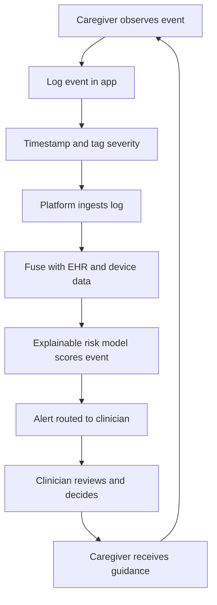
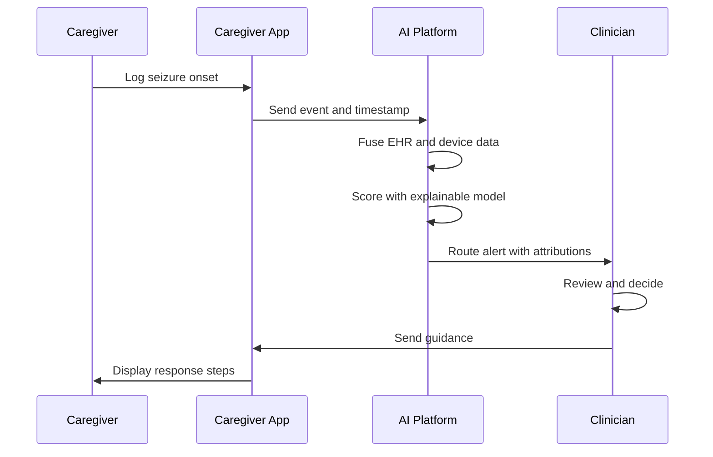
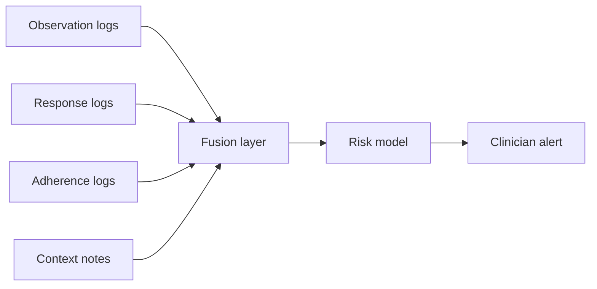
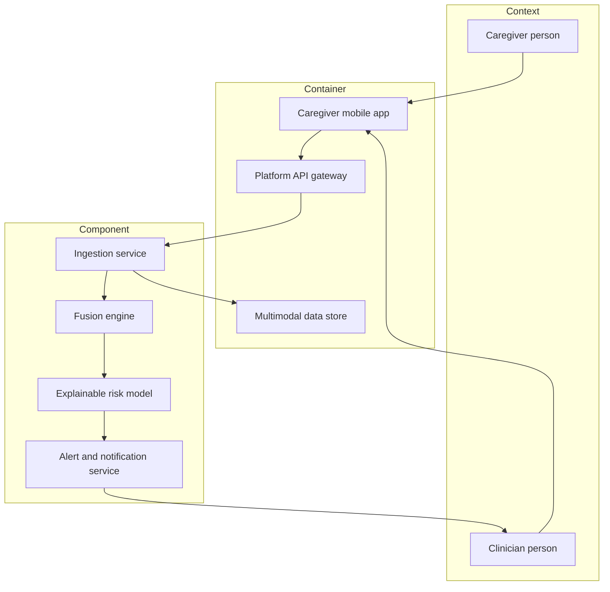
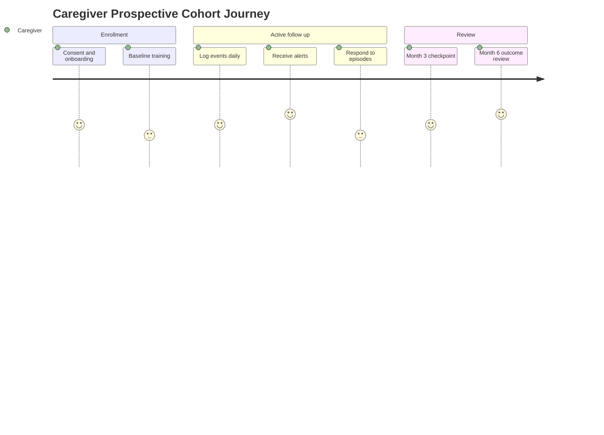

# Role Study - Caregiver (Retrospective + Prospective)

> **Why (this doc):** The caregiver is the primary human sensor and first responder in epilepsy care, generating the seizure observation, emergency-response, and adherence-support data that the Enterprise AI Platform for Explainable Multimodal Epilepsy Intelligence must fuse, explain, and act on. This dossier documents the caregiver role and shows how their data participates in BOTH a retrospective study (mining existing caregiver-reported event logs) and a prospective study (a forward caregiver-alerting cohort), so the DBA committee can see the full evidence chain for EP001 (29M focal, primary-assessment) and HEP001 (27F temporal-lobe).
>
> **How:** We follow a numbered research spine (Problem to Statistical Analysis), then detail role assessments, the two mandatory study designs, a retrospective-versus-prospective matrix, and role KPIs. Every heading carries a Why/How note, every table a caption, and all five diagrams (flowchart, sequence, graph, journey, C4) are followed by labeled prose. AI is decision support only; caregivers and clinicians retain all decision authority.

---

## 1. Problem

> **Why:** Frame the clinical and data gap the caregiver role exposes. **How:** State the observed failure and its cost in one tight paragraph.

Most epilepsy events occur outside the clinic, so the medical record captures only a fraction of true seizure burden. Caregivers witness the events clinicians never see, yet their observations are recorded inconsistently, arrive late, and are rarely time-aligned with medication and device data. The result is under-counted seizures, delayed emergency response, and adherence gaps that go undetected until the next scheduled visit. For EP001 and HEP001 alike, the caregiver is the missing structured data stream that determines whether the platform can detect deterioration early.

## 2. Sub-Problems

> **Why:** Decompose the problem into researchable pieces. **How:** List discrete, testable sub-questions tied to caregiver data.

*Caption - The four sub-problems that together constitute the caregiver evidence gap, each mapped to the data artifact it produces.*

| # | Sub-Problem | Caregiver Data Artifact | Affected Patient |
|---|-------------|------------------------|------------------|
| SP1 | Seizure events are under-observed and under-logged | Caregiver event log | EP001, HEP001 |
| SP2 | Emergency response is delayed or inconsistent | Response timestamp + action log | EP001 |
| SP3 | Medication adherence is invisible between visits | Adherence support log | HEP001 |
| SP4 | Caregiver reports are not time-aligned with device/EHR data | Merged multimodal timeline | EP001, HEP001 |

## 3. Research Problem

> **Why:** Converge the sub-problems into one statement. **How:** Name the single decision the research must inform.

Can caregiver-generated observation, response, and adherence data - when structured, time-stamped, and surfaced through an explainable AI platform - measurably improve seizure detection completeness, emergency-response latency, and adherence, relative to unstructured usual care?

## 4. Research Objective

> **Why:** Turn the problem into measurable aims. **How:** Bind each objective to a metric and a study type.

*Caption - Objectives paired with their primary metric and the study type that tests them.*

| Objective | Primary Metric | Study Type |
|-----------|---------------|------------|
| O1 Improve seizure capture completeness | Events logged per month vs EHR baseline | Retrospective |
| O2 Reduce emergency-response latency | Minutes from onset to response action | Prospective |
| O3 Improve adherence | Percent doses taken on schedule | Both |
| O4 Validate caregiver-alert value | Alert-to-clinician-action rate | Prospective |

## 5. Flow

> **Why:** Show how caregiver data moves end to end. **How:** A flowchart TD from observation to explainable decision support.

**Reason:** The flow exists to make caregiver observation a first-class, auditable input rather than an anecdote recalled at the next visit. **Why:** Without an explicit pipeline, caregiver knowledge decays and never reaches the fusion layer where it gains diagnostic value. **What is happening:** An observed event is logged, timestamped, ingested, fused with EHR and device streams, scored by an explainable model, and routed to a clinician who decides and closes the loop back to the caregiver. **How it is happening:** The mobile log writes to the platform ingestion service, which aligns timestamps and calls the risk model; the model emits a score plus feature attributions so the clinician sees why, preserving human decision authority. **Reference:** Topol (2019) on human-in-the-loop clinical AI; Fisher et al. (2017) ILAE operational seizure classification for the tagging vocabulary.

## 6. Hypotheses

> **Why:** State falsifiable predictions. **How:** Pair null and alternative for each objective.

*Caption - Null and alternative hypotheses for the caregiver studies, with the test that adjudicates each.*

| ID | Null (H0) | Alternative (H1) | Test |
|----|-----------|------------------|------|
| H1 | Structured caregiver logs capture no more events than EHR | Structured logs capture more events | Paired t-test / Wilcoxon |
| H2 | Caregiver alerting does not change response latency | Alerting reduces latency | Mixed-effects model |
| H3 | Adherence support has no effect on doses taken | Support improves adherence | Logistic regression |
| H4 | Caregiver alerts do not predict clinician action | Alerts predict action | ROC / AUC |

## 7. Statistical Analysis

> **Why:** Pre-specify how evidence is judged. **How:** Map each hypothesis to a model, effect size, and control.

*Caption - Analysis plan linking hypotheses to statistical methods, effect measures, and confounding controls.*

| Hypothesis | Method | Effect Measure | Confounder Control |
|-----------|--------|---------------|-------------------|
| H1 | Wilcoxon signed-rank | Median event delta | Within-subject design |
| H2 | Linear mixed-effects | Beta on latency (min) | Random patient intercept |
| H3 | Multivariable logistic | Odds ratio | Age, seizure type, baseline adherence |
| H4 | ROC/AUC + DeLong | AUC | Threshold calibration |

**Reason:** Pre-specifying analysis prevents post-hoc fishing and makes the caregiver evidence defensible. **Why:** Committees weight pre-registered, effect-size-reporting analyses far above p-value-only claims. **What is happening:** Each hypothesis is bound to a method matched to its data type (paired, longitudinal, binary, discriminative). **How it is happening:** Mixed-effects models absorb repeated measures per patient; logistic models adjust for confounders; DeLong tests compare AUCs. **Reference:** American Psychological Association (2020) reporting standards; Rothman, Greenland and Lash study-design conventions.

---

## 8. Role Assessments and Tasks

> **Why:** Define what the caregiver actually does and measures. **How:** Enumerate assessments, cadence, and the data each yields.

*Caption - Caregiver assessments and tasks mapped to cadence, output artifact, and the canonical patient exemplar.*

| Assessment / Task | Cadence | Data Output | Exemplar |
|-------------------|---------|-------------|----------|
| Seizure observation logging | Per event | Structured event record | EP001 focal aura + motor |
| Semiology tagging (ILAE terms) | Per event | Coded seizure descriptors | HEP001 temporal automatisms |
| Emergency response action | Per event | Response + timing log | EP001 status-risk episodes |
| Rescue-medication administration | As needed | Drug, dose, time log | EP001 |
| Daily adherence support | Daily | Dose-taken checklist | HEP001 |
| Trigger/context notes | Per event | Sleep, stress, missed-dose tags | HEP001 |

### 8.1 Caregiver-Platform Interaction (Sequence)

> **Why:** Show the real-time exchange during an event. **How:** A sequenceDiagram across caregiver, app, platform, clinician.

**Reason:** The sequence documents who acts when, proving the caregiver is inside a closed decision loop. **Why:** Emergency value depends on ordering and latency, not just data presence. **What is happening:** The caregiver logs onset; the platform fuses and scores; the clinician receives an attributed alert and returns guidance the caregiver executes. **How it is happening:** Asynchronous messaging with server-side fusion; the model returns feature attributions so the clinician can trust and override. **Reference:** Topol (2019); Fisher et al. (2017).

### 8.2 Data Domains (Graph LR)

> **Why:** Show how caregiver domains relate. **How:** A graph LR linking observation, response, adherence, context.

**Reason:** The graph shows caregiver data is multimodal and converges before scoring. **Why:** Isolated logs under-inform; fused logs let the model reason across domains. **What is happening:** Four caregiver domains feed one fusion layer that drives the risk model and alert. **How it is happening:** Each domain is a typed stream keyed by patient and timestamp, joined at fusion. **Reference:** Topol (2019) on multimodal clinical AI.

### 8.3 Platform Architecture for the Caregiver Role (C4 Model)

> **Why:** Situate the caregiver within Context/Container/Component layers. **How:** A Mermaid graph showing system boundaries.

**Reason:** The C4 view separates people, deployable containers, and internal components so scope and trust boundaries are explicit. **Why:** A DBA committee needs to see the caregiver is a Context actor, not a system, and where explainability lives. **What is happening:** The caregiver interacts only with the app; the app talks to the API, which drives ingestion, fusion, the explainable model, and notification back to the clinician. **How it is happening:** Layered containers enforce that raw logs are validated at ingestion before fusion, and the XAI component attaches attributions before any alert leaves the boundary. **Reference:** Topol (2019); C4 model conventions (Brown).

---

## 9. Retrospective Study Design (Caregiver)

> **Why:** Extract evidence from records that already exist. **How:** Mine historical caregiver-reported event logs with a within-subject frame.

**Data source:** Existing caregiver-reported event logs and diaries already in the EHR and app archive for EP001, HEP001, and the historical epilepsy cohort. No new data collection.

*Caption - Retrospective design specification for the caregiver role, covering frame, sample, variables, and bias controls.*

| Element | Specification |
|---------|--------------|
| Time direction | Backward, existing records |
| Design | Within-subject records review |
| Sample | All patients with >=6 months of caregiver logs |
| Exposure variable | Structured vs unstructured caregiver logging |
| Outcome variables | Events captured, response latency, adherence rate |
| Covariates | Age, seizure type, comorbidity, log completeness |
| Analysis | Wilcoxon, logistic regression, sensitivity analysis |
| Bias controls | Completeness threshold, blinded abstraction, recall-bias flagging |

**Reason:** The retrospective arm answers whether structured caregiver logging already correlates with better capture, cheaply and fast. **Why:** It uses data that exists, so it is low cost and ideal for hypothesis generation before committing to prospective enrollment. **What is happening:** Historical logs are abstracted, cleaned, and compared within patients across logging styles. **How it is happening:** A blinded abstractor codes events to ILAE terms; a completeness threshold excludes sparse records; recall-bias flags mark reconstructed entries. **Reference:** Fisher et al. (2017); study-design texts on records review (Rothman et al.).

## 10. Prospective Study Design (Caregiver)

> **Why:** Test cause forward in time. **How:** Enroll a caregiver-alerting cohort with defined endpoints and follow-up.

**Data source:** Forward enrollment of caregiver-patient dyads into a caregiver-alerting cohort; data collected on a fixed schedule after consent.

*Caption - Prospective design specification for the caregiver-alerting cohort, including endpoints, follow-up, and consent.*

| Element | Specification |
|---------|--------------|
| Time direction | Forward, new data |
| Design | Prospective cohort with alerting intervention |
| Enrollment | Consecutive eligible caregiver-patient dyads |
| Primary endpoint | Onset-to-response latency (minutes) |
| Secondary endpoints | Adherence rate, alert-to-action rate, capture completeness |
| Follow-up schedule | Baseline, week 2, month 1, month 3, month 6 |
| Consent | Written informed consent, dyad-level, revocable |
| Bias controls | Prospective protocol, standardized prompts, pre-registered endpoints |

### 10.1 Caregiver Prospective Journey

> **Why:** Show the caregiver experience across follow-up. **How:** A Mermaid journey from consent to month-6 review.

**Reason:** The journey exposes caregiver burden and satisfaction across the study, which predicts retention. **Why:** Prospective validity collapses if caregivers drop out, so experience is a study variable. **What is happening:** The caregiver moves from consent and training through daily logging and alerting to milestone reviews. **How it is happening:** Standardized prompts and light-touch alerting keep burden manageable while endpoints are captured on schedule. **Reference:** APA (2020) on longitudinal reporting; Topol (2019).

## 11. Retrospective vs Prospective Matrix (Caregiver)

> **Why:** Force an explicit side-by-side so the committee sees trade-offs. **How:** One row per decision dimension.

*Caption - Head-to-head comparison of the two mandatory study types for the caregiver role across seven decision dimensions.*

| Dimension | Retrospective | Prospective |
|-----------|--------------|-------------|
| Time direction | Backward from existing logs | Forward from enrollment |
| Data source | Archived caregiver event logs | Newly collected cohort data |
| Cost | Low, data exists | Higher, active collection |
| Bias risk | Recall and selection bias high | Lower, protocol-controlled |
| Causal strength | Association only | Stronger temporal/causal |
| Ethics/consent | Waiver or broad consent | Explicit informed consent |
| Best use | Hypothesis generation | Hypothesis confirmation |

**Reason:** The matrix makes the complementary roles of the two designs unavoidable. **Why:** Neither design alone is sufficient - retrospective is cheap but confounded, prospective is rigorous but costly. **What is happening:** Each dimension shows where one design dominates the other. **How it is happening:** Retrospective mines existing logs for signals; prospective tests those signals under a controlled forward protocol with consent. **Reference:** Rothman, Greenland and Lash on design trade-offs; APA (2020).

## 12. Role KPIs

> **Why:** Define how caregiver-role success is measured. **How:** Target metrics with sources and cadence.

*Caption - Key performance indicators for the caregiver role with targets, data source, and measurement cadence.*

| KPI | Target | Source | Cadence |
|-----|--------|--------|---------|
| Event capture completeness | >=90% vs reference | Log vs device | Monthly |
| Onset-to-response latency | <=5 min median | Response log | Per event |
| Adherence rate | >=85% doses on time | Adherence log | Weekly |
| Alert-to-action rate | >=70% actioned | Alert audit | Monthly |
| Log timeliness | >=80% within 1 hour | Timestamp delta | Monthly |

**Reason:** KPIs convert the role into an accountable, monitorable function. **Why:** Without targets, caregiver data quality drifts and the studies lose power. **What is happening:** Five KPIs cover completeness, speed, adherence, alert value, and timeliness. **How it is happening:** Each KPI is computed from an auditable log stream on a fixed cadence and reviewed against target. **Reference:** APA (2020); Topol (2019).

---

## 13. Professor Readiness (Defense Q&A)

> **Why:** Anticipate examiner challenges. **How:** Five sharp questions with defensible answers.

**Q1. Why run both a retrospective and a prospective study for the caregiver role?**
Because they answer different questions. The retrospective study mines existing caregiver logs cheaply to generate hypotheses and estimate effect sizes; the prospective caregiver-alerting cohort then confirms causality under a controlled forward protocol. Retrospective evidence alone is confounded; prospective alone is costly to run blind without prior signal. Together they form a complete, efficient evidence chain.

**Q2. How do you handle selection and recall bias in the retrospective arm?**
Selection bias is controlled by a completeness threshold and by including all patients meeting it, not a convenience subset. Recall bias is addressed by flagging reconstructed versus real-time entries, using blinded abstraction to ILAE terms, and running sensitivity analyses that exclude recall-flagged records. Any residual bias is disclosed as a limitation.

**Q3. What confounders threaten the caregiver findings and how are they adjusted?**
Age, seizure type, comorbidity, baseline adherence, and log completeness. In the retrospective arm they enter as covariates in multivariable models; in the prospective arm the within-dyad design and random patient intercepts absorb stable confounders, and pre-registered endpoints prevent selective reporting.

**Q4. When would you prefer the retrospective design over the prospective one?**
When the goal is fast, low-cost hypothesis generation, when the exposure is rare and prospective enrollment would take years, or when ethics preclude withholding an intervention. Retrospective mining of existing caregiver logs is the right first step before investing in a cohort.

**Q5. How do you keep AI as decision support only in an emergency-response setting?**
The explainable model scores and attributes but never acts autonomously. Every alert routes to a clinician who reviews attributions and decides; the caregiver executes clinician guidance. The platform records the human decision, preserving accountability. This is enforced at the C4 component boundary, where no notification leaves without a human-review step.

---

## 14. References

> **Why:** Ground the design in authoritative sources. **How:** APA 7th edition entries covering study design, epilepsy classification, and clinical AI.

American Psychological Association. (2020). *Publication manual of the American Psychological Association* (7th ed.). American Psychological Association.

Fisher, R. S., Cross, J. H., French, J. A., Higurashi, N., Hirsch, E., Jansen, F. E., Lagae, L., Moshe, S. L., Peltola, J., Roulet Perez, E., Scheffer, I. E., & Zuberi, S. M. (2017). Operational classification of seizure types by the International League Against Epilepsy: Position paper of the ILAE Commission for Classification and Terminology. *Epilepsia, 58*(4), 522-530. https://doi.org/10.1111/epi.13670

Rothman, K. J., Greenland, S., & Lash, T. L. (2008). *Modern epidemiology* (3rd ed.). Lippincott Williams & Wilkins.

Topol, E. J. (2019). High-performance medicine: The convergence of human and artificial intelligence. *Nature Medicine, 25*(1), 44-56. https://doi.org/10.1038/s41591-018-0300-7
