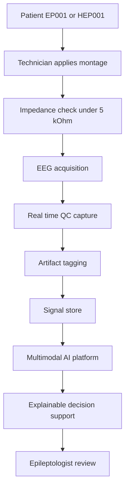
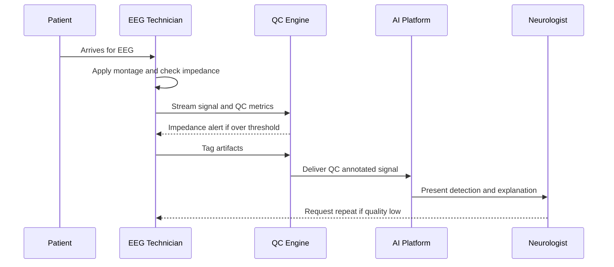
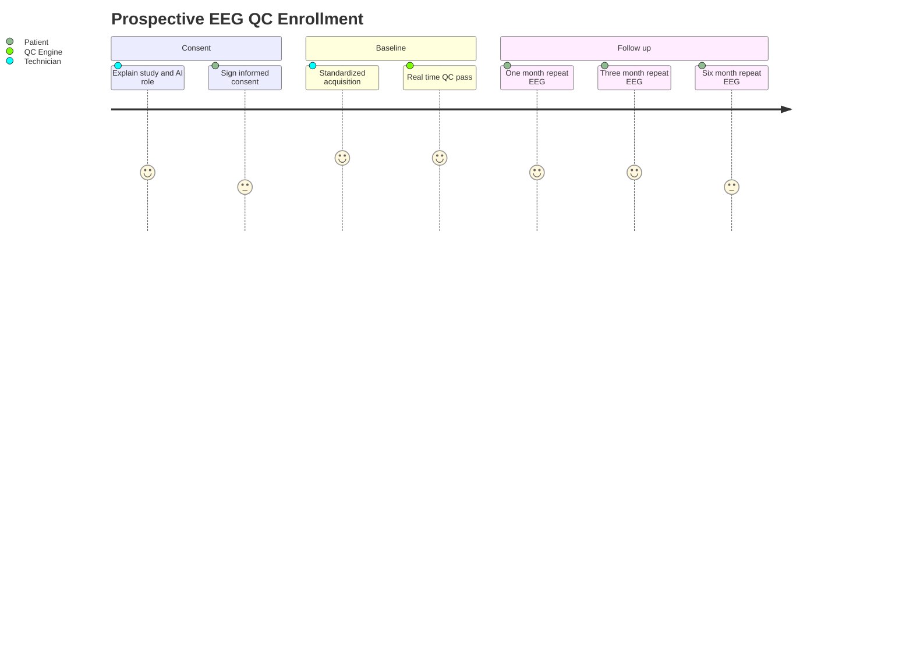
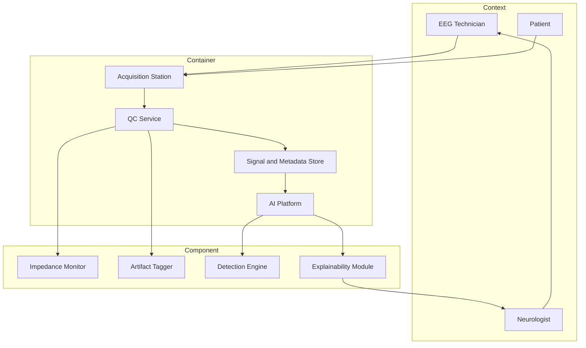

# Role Study - EEG Technician (Retrospective + Prospective)

> **Why (this doc):** The EEG Technician produces the raw electrophysiological signal that every downstream epilepsy model, clinician, and explainability layer depends on; if acquisition quality is uncontrolled, all inference is confounded. This dossier documents the technician's assessments and tasks and shows how their data participates in BOTH a retrospective study (mining archived QC metadata) and a prospective study (standardized acquisition with real-time QC capture) within the Enterprise AI Platform for Explainable Multimodal Epilepsy Intelligence.
> **How:** We follow a numbered research spine (Problem to Statistical Analysis), then role-specific content, then four Mermaid diagrams plus a C4 model, a retrospective-vs-prospective matrix, KPIs, a defense Q&A, and APA 7 references. AI is decision support only; the technician and supervising neurologist retain all clinical authority. Canonical patients are EP001 (29M focal, primary-assessment) and HEP001 (27F temporal-lobe).

---

## 1. Problem

> **Why:** Naming the core failure sharpens every subsequent design choice. **How:** State the acquisition-quality gap that undermines multimodal epilepsy AI.

Scalp EEG remains the diagnostic backbone of epilepsy, yet signal quality varies widely across technicians, montages, and sessions. Poor electrode impedance, unmanaged artifacts (muscle, movement, 50/60 Hz line noise), and inconsistent acquisition protocols inject non-biological variance into recordings. When these recordings feed an AI platform, the model may learn acquisition artifacts rather than epileptogenic physiology, degrading both accuracy and the trustworthiness of explanations shown to clinicians.

*Caption - The problem statement decomposed into an observable symptom, its root technical cause, and the platform-level consequence for epilepsy intelligence.*

| Element | Statement |
|---|---|
| Symptom | Inter-session and inter-technician variability in EEG quality for EP001 and HEP001 cohorts |
| Root cause | No enforced impedance/QC standard; artifacts documented inconsistently or not at all |
| Consequence | AI models confound artifact with seizure signal; explanations become unreliable |
| Stakeholders | EEG technician, epileptologist, data engineer, ML/XAI team, patient |

---

## 2. Sub-Problems

> **Why:** A large problem is only tractable when split into measurable parts. **How:** Enumerate the acquisition sub-questions each study arm can answer.

*Caption - Four sub-problems that jointly determine whether EEG acquisition quality can be measured, standardized, and made AI-ready.*

| # | Sub-problem | Measurable question |
|---|---|---|
| SP1 | Impedance control | What fraction of channels breach the 5 kOhm impedance ceiling per session? |
| SP2 | Artifact burden | What percentage of recording time is contaminated per artifact class? |
| SP3 | Protocol adherence | How consistently is the standardized montage and calibration applied? |
| SP4 | QC-to-outcome link | Does higher acquisition quality improve downstream model AUROC and clinician trust? |

---

## 3. Research Problem

> **Why:** The spine needs one crisp, testable central problem. **How:** Fuse the sub-problems into a single statement bridging acquisition and AI.

**Research Problem:** To what extent does standardized, QC-instrumented EEG acquisition by technicians reduce non-biological signal variance and improve the accuracy and explainability of the epilepsy AI platform, compared with historically archived, non-standardized acquisition?

---

## 4. Research Objective

> **Why:** Objectives convert the problem into deliverables. **How:** Pair each objective with the study arm that satisfies it.

*Caption - Primary and secondary objectives mapped to the retrospective or prospective arm that delivers evidence for each.*

| # | Objective | Served by |
|---|---|---|
| O1 | Quantify baseline QC distribution from archived recordings | Retrospective |
| O2 | Establish and enforce a standardized acquisition + real-time QC protocol | Prospective |
| O3 | Estimate the causal effect of QC on model AUROC and clinician trust | Prospective |
| O4 | Compare cost, bias, and causal strength of both designs | Both / Matrix |

---

## 5. Flow

> **Why:** A visual pipeline orients readers before detail. **How:** Show the end-to-end path from electrode to explainable decision support.

**Reason:** A single acquisition defect propagates silently through every later stage, so the pipeline must be made explicit. **Why:** Placing QC (E) and artifact tagging (F) upstream of the AI (H) shows that quality is gated before inference, not repaired after. **What is happening:** The technician's manual and instrumented steps convert a patient into a QC-annotated signal that the platform consumes and the clinician ultimately owns. **How it is happening:** Impedance gating (C) and real-time QC (E) enforce a standard at capture time, and artifact tags travel with the signal into the store (G). **Reference:** Sinha et al. (2016) ACNS acquisition guideline; Fisher et al. (2017).

---

## 6. Hypotheses

> **Why:** Falsifiable hypotheses make the study scientific. **How:** State null and alternative for the QC-to-outcome link.

*Caption - Primary and secondary hypotheses with their associated statistical test.*

| ID | Null H0 | Alternative H1 | Test |
|---|---|---|---|
| H-A | Standardized QC does not change mean channel-artifact time | QC reduces mean artifact time | Two-sample t / Mann-Whitney |
| H-B | QC has no effect on model AUROC | QC improves AUROC | DeLong test on paired ROC |
| H-C | Impedance breach rate is unrelated to false-detection rate | Higher breach rate raises false detections | Poisson / logistic regression |
| H-D | Acquisition arm (retro vs pro) does not shift clinician trust score | Prospective QC raises trust | Ordinal regression |

---

## 7. Statistical Analysis

> **Why:** Pre-specifying analysis prevents fishing. **How:** Bind each hypothesis to an estimator, effect size, and control.

*Caption - Analysis plan linking hypotheses to models, effect measures, and confounding controls.*

| Hypothesis | Primary model | Effect measure | Confounder control |
|---|---|---|---|
| H-A | Mixed-effects linear model | Mean difference, 95% CI | Random effect per technician and patient |
| H-B | DeLong paired ROC | Delta AUROC | Same test set, matched epochs |
| H-C | Logistic regression | Odds ratio | Adjust for montage, sedation, age |
| H-D | Cumulative-link ordinal model | Proportional odds ratio | Adjust for reviewer, case difficulty |

Significance at alpha = 0.05 with Benjamini-Hochberg control across the family of tests. Power computed for a target delta AUROC of 0.03 at 80% power.

---

## 8. Role Assessments and Tasks

> **Why:** The dossier must define exactly what this role does before studying it. **How:** Tabulate each assessment, its trigger, output, and QC linkage.

*Caption - Core EEG-technician assessments and tasks spanning acquisition, impedance/QC, and artifact management, with the metadata each emits into the platform.*

| Task | Trigger | Standard | Output metadata |
|---|---|---|---|
| Montage setup | Order placed | 10-20 system, standardized labels | Montage ID, electrode count |
| Impedance check | Before and during acquisition | All channels under 5 kOhm | Per-channel kOhm, breach flags |
| Calibration | Session start | Known square-wave, gain check | Calibration pass or fail |
| Acquisition | Patient ready | Minimum duration, activation procedures | Duration, sampling rate |
| Artifact management | Continuous | Tag muscle, movement, line, sweat | Artifact class, timestamps, coverage |
| Real-time QC capture | Continuous (prospective) | Live impedance and SNR dashboard | QC time series, alerts |
| Handoff | Session end | Signed QC summary | QC summary record, technician ID |

---

### 8a. Retrospective Study Design (EEG Technician)

> **Why:** Historical QC metadata is a cheap, fast baseline. **How:** Mine archived records to characterize pre-standardization quality.

*Caption - Retrospective design mining archived EEG QC metadata for the EP001 and HEP001 historical cohorts.*

| Element | Specification |
|---|---|
| Data source | Existing archived EEG QC metadata and signal headers (2019-2025) |
| Design | Observational, cross-sectional with nested longitudinal repeats |
| Sample | All archived sessions for focal (EP001-type) and temporal-lobe (HEP001-type) patients, n approx 1,200 sessions |
| Exposure | Historical acquisition quality (impedance breach rate, artifact coverage) |
| Outcome | Archived model detection accuracy, re-read discordance |
| Variables | Impedance, artifact class/time, montage, sedation, technician ID, age, sex |
| Analysis | Mixed-effects and logistic regression (Section 7) |
| Bias controls | Adjust for confounders; sensitivity analysis for missing QC fields; blind outcome adjudication to exposure |

Key limitation: QC metadata was recorded inconsistently, so **selection and information bias** are the dominant threats; missingness is characterized and handled by multiple imputation with a missing-indicator sensitivity check.

---

### 8b. Prospective Study Design (EEG Technician)

> **Why:** Only forward enrollment with a fixed protocol can support causal claims. **How:** Enroll new patients under a standardized acquisition protocol with real-time QC capture.

*Caption - Prospective design enrolling new epilepsy patients under a standardized acquisition protocol with instrumented real-time QC.*

| Element | Specification |
|---|---|
| Data source | Newly collected sessions under fixed SOP with live QC telemetry |
| Design | Prospective cohort; optional stepped-wedge rollout of the QC dashboard |
| Enrollment | Consecutive consenting focal and temporal-lobe patients, target n = 300 |
| Intervention | Standardized montage + impedance gating + real-time QC alerts |
| Primary endpoint | Delta AUROC of platform vs retrospective baseline |
| Secondary endpoints | Artifact-time reduction, impedance breach rate, clinician trust score |
| Follow-up schedule | Baseline session, 1-month, 3-month, 6-month repeat EEG per patient |
| Consent | Written informed consent; data-use and AI decision-support disclosure |
| Bias controls | Standardized SOP reduces measurement bias; pre-registration; blinded outcome adjudication |

---

### 8c. Retrospective vs Prospective Matrix (EEG Technician)

> **Why:** The two designs trade cost against causal strength; leaders must see the trade explicitly. **How:** Contrast them row by row for this role.

*Caption - Head-to-head comparison of the two study arms for the EEG-technician role across seven decision dimensions.*

| Dimension | Retrospective | Prospective |
|---|---|---|
| Time direction | Backward, uses past records | Forward, follows new patients |
| Data source | Archived QC metadata | Newly captured standardized QC |
| Cost | Low, data already exists | High, staffing and follow-up |
| Bias risk | High (selection, recall, missingness) | Lower (SOP, pre-registration) |
| Causal strength | Weak, association only | Strong, temporal precedence |
| Ethics / consent | Waiver or de-identified use | Explicit informed consent |
| Best use | Hypothesis generation, baseline | Hypothesis testing, causal effect |

**Reason:** Choosing an arm without weighing these dimensions risks either an underpowered causal claim or a costly study that a cheaper baseline could have scoped. **Why:** The retrospective arm exists to generate hypotheses and a baseline cheaply, while the prospective arm exists to test them under control. **What is happening:** The matrix exposes the classic cost-versus-bias-versus-causality trade for exactly this role's data. **How it is happening:** Time direction and data source drive every other row, cascading into cost, bias, causal strength, and consent obligations. **Reference:** Song and Chung (2010); Euser et al. (2009).

---

### 8d. Role Interaction Sequence

> **Why:** Timing of technician-platform messages reveals where QC gates act. **How:** Sequence the acquisition-to-review exchange.

**Reason:** Decision support fails if a low-quality signal reaches the model unflagged, so the interaction order matters. **Why:** The QC engine sits between technician and AI to enforce a gate before inference. **What is happening:** The technician and QC engine iterate until quality passes, then the AI presents an explained result the neurologist can act on or reject. **How it is happening:** Live alerts create a feedback loop at capture time rather than post hoc. **Reference:** Sinha et al. (2016); Topol (2019).

---

### 8e. Data Lineage

> **Why:** Explainability requires knowing where each feature originates. **How:** Trace QC fields from electrode to model input.

**Reason:** An explanation is only trustworthy if its inputs are traceable to a physical measurement. **Why:** The lineage shows QC metadata (M) is a first-class input, not an afterthought. **What is happening:** Physical measurements become structured metadata that conditions both features and explanations. **How it is happening:** Each node persists its output so provenance is queryable end to end. **Reference:** Topol (2019); Fisher et al. (2017).

---

### 8f. Prospective Enrollment Journey

> **Why:** The patient and technician experience shapes consent quality and retention. **How:** Map the emotional and procedural journey across follow-up.

**Reason:** Drop-off in follow-up biases the prospective estimate, so the journey must be designed for retention. **Why:** Mapping sentiment flags the six-month visit as the retention risk point. **What is happening:** Consent, baseline, and three follow-ups form the exposure-to-outcome timeline. **How it is happening:** Each visit repeats the standardized acquisition so QC is measured identically over time. **Reference:** APA (2020) ethics; Euser et al. (2009).

---

### 8g. C4 Model - Role in the Platform

> **Why:** Architecture context shows how the role touches every system tier. **How:** Render Context, Container, and Component tiers as one Mermaid graph.

**Reason:** Without an architectural view, the role's influence on downstream systems is invisible to platform owners. **Why:** The C4 tiers show the technician is the sole human writing into the Acquisition Station and therefore the earliest quality gate. **What is happening:** People (Context) operate containers that host components producing explainable output for the neurologist. **How it is happening:** The QC Service fans out to impedance and artifact components before persistence, so quality is componentized and testable. **Reference:** Topol (2019); Sinha et al. (2016).

---

### 8h. Role KPIs

> **Why:** KPIs turn quality into a managed metric. **How:** Define target thresholds the technician is accountable for.

*Caption - Key performance indicators for the EEG-technician role with targets and the study arm that measures each.*

| KPI | Definition | Target | Measured in |
|---|---|---|---|
| Impedance pass rate | Channels under 5 kOhm at start | >= 95% | Both |
| Artifact coverage | Percent recording time flagged | <= 10% | Both |
| Protocol adherence | Sessions meeting full SOP | >= 98% | Prospective |
| Real-time QC uptime | Sessions with live QC captured | >= 99% | Prospective |
| Repeat rate | Sessions needing re-acquisition | <= 5% | Both |
| Downstream AUROC gain | Delta vs retrospective baseline | >= 0.03 | Prospective |

**Reason:** Unmeasured quality regresses, so each acquisition dimension gets a numeric target. **Why:** Tying KPIs to study arms clarifies which are baselines and which are causal endpoints. **What is happening:** The technician's daily actions are scored against thresholds that also serve as study outcomes. **Reason and How it is happening:** Both arms feed the same KPI ledger so improvement is visible over time. **Reference:** Sinha et al. (2016); Topol (2019).

---

## 9. Professor Readiness (Defense Q&A)

> **Why:** Anticipating examiner questions hardens the design. **How:** Provide crisp, defensible answers on design choice and bias.

**Q1. Why run BOTH a retrospective and a prospective study?**
The retrospective arm cheaply characterizes the baseline QC distribution and generates hypotheses from 1,200 archived sessions; the prospective arm then tests those hypotheses under a standardized protocol with temporal precedence, enabling causal claims the retrospective arm cannot support. Together they move from association to causation efficiently.

**Q2. How does selection and recall bias threaten the retrospective arm, and how is it controlled?**
Archived sessions with QC metadata may over-represent well-run cases (selection), and inconsistently logged artifacts approximate recall bias. Controls: characterize missingness, multiple imputation with a missing-indicator sensitivity analysis, and outcome adjudication blinded to exposure.

**Q3. How is confounding handled?**
Sedation, montage, patient age, and technician skill can confound the QC-to-outcome link. We adjust via mixed-effects and logistic models with random effects for technician and patient, and in the prospective arm the fixed SOP removes much measurement-level confounding by design.

**Q4. When would you prefer each design?**
Prefer retrospective when speed and cost dominate and the question is exploratory or a baseline is needed. Prefer prospective when the goal is a causal effect estimate, endpoints must be measured identically, or a new intervention (the QC dashboard) must be evaluated.

**Q5. Where does AI sit in clinical authority?**
AI is decision support only. The detection and explainability outputs inform the neurologist, who retains diagnostic authority; the technician retains acquisition authority and can trigger re-acquisition regardless of model output.

---

## 10. References

Euser, A. M., Zoccali, C., Jager, K. J., & Dekker, F. W. (2009). Cohort studies: Prospective versus retrospective. *Nephron Clinical Practice, 113*(3), c214-c217. https://doi.org/10.1159/000235241

Fisher, R. S., Cross, J. H., French, J. A., Higurashi, N., Hirsch, E., Jansen, F. E., Lagae, L., Moshe, S. L., Peltola, J., Roulet Perez, E., Scheffer, I. E., & Zuberi, S. M. (2017). Operational classification of seizure types by the International League Against Epilepsy. *Epilepsia, 58*(4), 522-530. https://doi.org/10.1111/epi.13670

American Psychological Association. (2020). *Publication manual of the American Psychological Association* (7th ed.). https://doi.org/10.1037/0000165-000

Sinha, S. R., Sullivan, L., Sabau, D., San-Juan, D., Dombrowski, K. E., Halford, J. J., Hani, A. J., Drislane, F. W., & Stecker, M. M. (2016). American Clinical Neurophysiology Society guideline 1: Minimum technical requirements for performing clinical electroencephalography. *Journal of Clinical Neurophysiology, 33*(4), 303-307. https://doi.org/10.1097/WNP.0000000000000308

Song, J. W., & Chung, K. C. (2010). Observational studies: Cohort and case-control studies. *Plastic and Reconstructive Surgery, 126*(6), 2234-2242. https://doi.org/10.1097/PRS.0b013e3181f44abc

Topol, E. J. (2019). High-performance medicine: The convergence of human and artificial intelligence. *Nature Medicine, 25*(1), 44-56. https://doi.org/10.1038/s41591-018-0300-7
