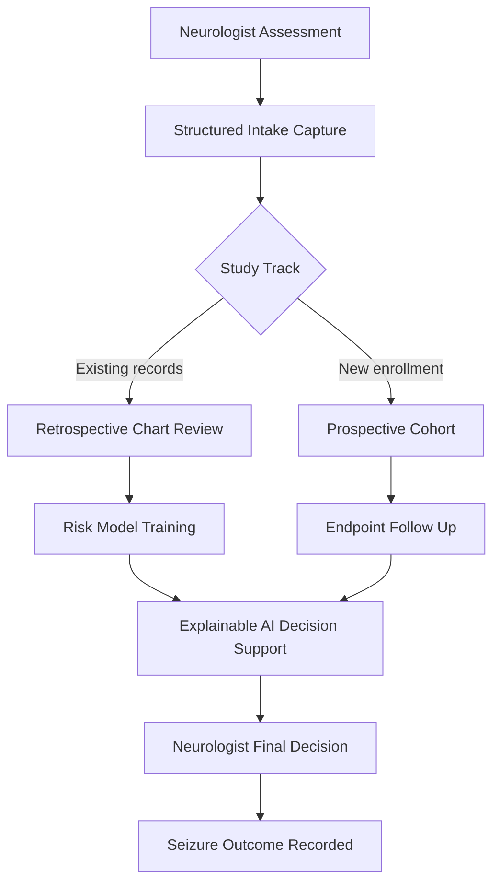
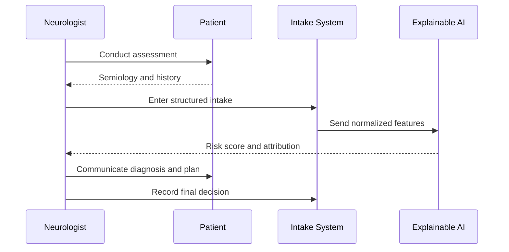
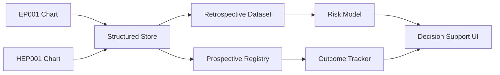
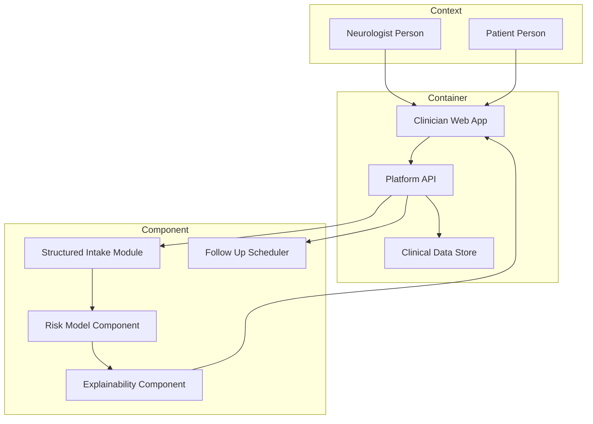
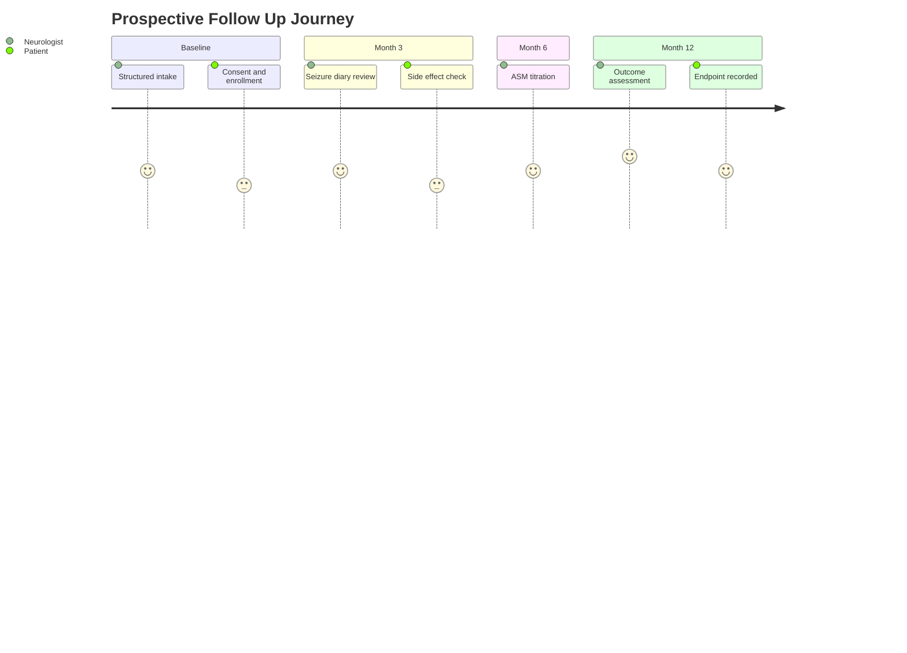

# Role Study - Neurologist (Retrospective + Prospective)

> **Why (this doc):** The neurologist is the primary clinical decision-maker in the epilepsy pathway (assessment, diagnosis, medication, follow-up), so their data anchors both a retrospective risk model built from historical charts and a prospective enrollment study that measures forward seizure outcomes. Documenting both study types for this single role makes the DBA thesis defensible on causal-inference and evidence-hierarchy grounds.
> **How:** We follow a numbered research spine (Problem to Statistical Analysis), then role-specific content (assessments, retrospective design, prospective design, comparison matrix, KPIs), then a defense Q&A and APA references. Canonical patients EP001 (29M focal, primary-assessment) and HEP001 (27F temporal-lobe) illustrate every artifact. All AI output is decision support only; the neurologist retains authority.

---

## 1. Problem

> **Why:** Naming the clinical and evidentiary problem prevents scope drift and grounds every downstream design choice. **How:** State the epilepsy-specific gap the neurologist role faces in one paragraph plus a framing table.

Epilepsy affects roughly 50 million people worldwide, yet initial diagnosis is misclassified in a meaningful fraction of cases, and antiseizure medication (ASM) selection remains substantially trial-and-error. The neurologist synthesizes semiology, EEG, MRI, and history into a diagnosis and a treatment plan, but this synthesis is (a) hard to audit retrospectively because notes are unstructured, and (b) rarely validated prospectively against standardized seizure-outcome endpoints. An explainable AI platform can support the neurologist only if it is trained and validated on evidence from BOTH historical charts (retrospective) and forward-enrolled cohorts (prospective).

*Caption - The core problem framed across clinical, data, and evidentiary dimensions for the neurologist role.*

| Dimension | Current state | Consequence |
|---|---|---|
| Diagnosis | Unstructured narrative notes | Hard to audit, non-reproducible |
| ASM selection | Trial-and-error, experience-driven | Delayed seizure control |
| Evidence base | Mostly single-study, one direction | Weak causal claims |
| Explainability | Implicit clinical reasoning | Low trust in AI support |

## 2. Sub-Problems

> **Why:** Decomposing the problem yields testable, bounded work packages. **How:** Enumerate the sub-problems that each map to a study component.

*Caption - Sub-problems decomposed from the main problem, each linked to a study type that addresses it.*

| # | Sub-problem | Addressed by |
|---|---|---|
| SP1 | Historical assessments are unstructured and unaudited | Retrospective chart review |
| SP2 | Risk factors for poor seizure control are unquantified | Retrospective risk model |
| SP3 | No standardized forward intake exists | Prospective structured intake |
| SP4 | Seizure outcomes are not tracked to fixed endpoints | Prospective follow-up |
| SP5 | AI support lacks explainability the neurologist trusts | Both studies + SHAP-style attribution |

## 3. Research Problem

> **Why:** A single sentence keeps the thesis answerable. **How:** Fuse the sub-problems into one research problem statement.

Can a neurologist-centered, explainable AI platform, trained on retrospective epilepsy chart data and validated on a prospectively enrolled cohort, improve the accuracy of seizure-risk stratification and the timeliness of ASM decisions while keeping the neurologist as the accountable decision-maker?

## 4. Research Objective

> **Why:** Objectives convert the problem into measurable aims. **How:** List primary and secondary objectives in a table.

*Caption - Research objectives for the neurologist role, split by study type and measurability.*

| ID | Objective | Study type | Measure |
|---|---|---|---|
| O1 | Model 12-month seizure-freedom risk from historical charts | Retrospective | AUC, calibration |
| O2 | Identify predictors of ASM failure | Retrospective | Adjusted OR |
| O3 | Validate risk model on new enrollees | Prospective | AUC, Brier score |
| O4 | Measure time-to-decision with AI support | Prospective | Median days |
| O5 | Confirm explainability is clinically actionable | Both | Neurologist trust score |

## 5. Flow

> **Why:** A visual flow shows how the role's data moves through both studies. **How:** A Mermaid flowchart TD with plain ASCII labels.

**Reason:** The flow exists to show that a single role feeds two evidentiary pipelines that converge on decision support. **Why:** Because the thesis must prove both directions of evidence inform the same neurologist decision. **What is happening:** Assessment data is captured once, then routed to retrospective training or prospective follow-up, and both feed the AI that advises the neurologist who makes the final call. **How it is happening:** A structured intake layer normalizes notes so the same schema serves chart review and forward enrollment. **Reference:** Topol (2019) on human-in-the-loop clinical AI; ILAE operational classification (Fisher et al., 2017).

## 6. Hypotheses

> **Why:** Formal hypotheses make the study falsifiable. **How:** State null and alternative pairs in a table.

*Caption - Null and alternative hypotheses for the neurologist role across both study designs.*

| ID | Null H0 | Alternative H1 | Study |
|---|---|---|---|
| H1 | Historical predictors do not associate with seizure freedom | At least one predictor associates (OR != 1) | Retrospective |
| H2 | Risk model AUC = 0.5 on new cohort | AUC > 0.5 | Prospective |
| H3 | AI support does not change time-to-decision | AI support reduces median time-to-decision | Prospective |
| H4 | Explainability score equals control | Explainability score higher with attribution | Both |

## 7. Statistical Analysis

> **Why:** Pre-specifying tests prevents p-hacking. **How:** Map each hypothesis to a test and model.

*Caption - Statistical methods mapped to hypotheses, with covariates and thresholds.*

| Hypothesis | Method | Covariates adjusted | Threshold |
|---|---|---|---|
| H1 | Multivariable logistic regression | Age, sex, focal vs temporal, EEG, MRI | p < 0.05 |
| H2 | ROC / AUC with DeLong CI | n/a (external validation) | 95% CI excludes 0.5 |
| H3 | Cox proportional hazards / median test | Baseline severity | HR, p < 0.05 |
| H4 | Mixed-effects model | Clinician, patient | p < 0.05 |

**Reason:** Different endpoints (binary outcome, discrimination, time-to-event) require different models. **Why:** Because using one test for all would misestimate error. **What is happening:** Logistic regression handles the binary retrospective outcome; ROC/AUC quantifies prospective discrimination; Cox handles time-to-decision. **How it is happening:** Covariate adjustment controls confounding; DeLong CIs quantify AUC uncertainty. **Reference:** APA (2020) reporting standards; standard epidemiologic design texts on regression adjustment.

---

## 8. Role Assessments and Tasks

> **Why:** The neurologist's concrete tasks define what data each study can use. **How:** Enumerate assessments, cadence, and the data element they generate.

*Caption - Neurologist assessments and tasks with the data element and AI support role each generates.*

| Task | Assessment instrument | Cadence | Data element | AI support role |
|---|---|---|---|---|
| Clinical assessment | History, semiology, exam | Intake + follow-up | Seizure type, frequency | Suggests differential (advisory) |
| Diagnosis | ILAE classification | Intake | Focal / generalized / unknown | Flags inconsistencies |
| Investigations review | EEG, MRI | As indicated | Epileptiform findings | Highlights regions of interest |
| Medication decision | ASM selection / titration | Each visit | Drug, dose, response | Ranks options, shows attribution |
| Follow-up | Seizure diary review | 3-monthly | Seizure count, side effects | Predicts relapse risk |

### 8.1 Role Interaction Sequence

> **Why:** Show the temporal handshake between neurologist, platform, and patient. **How:** A Mermaid sequenceDiagram.

**Reason:** To make explicit that the AI responds to the neurologist, never the reverse. **Why:** Because decision-support governance requires the clinician to initiate and confirm. **What is happening:** The neurologist assesses, enters structured data, receives an explained risk score, and records the final decision. **How it is happening:** The intake system normalizes features before the AI scores them, keeping a clean audit trail. **Reference:** Topol (2019); APA (2020).

### 8.2 Data Lineage

> **Why:** Show where role data flows across systems. **How:** A Mermaid graph LR.

**Reason:** To trace individual patient records into both study datasets. **Why:** Because provenance is required for auditability and consent scoping. **What is happening:** Charts for EP001 and HEP001 enter a structured store that splits into retrospective and prospective datasets, both feeding the decision UI. **How it is happening:** A common schema tags each record with study eligibility and consent status. **Reference:** Fisher et al. (2017); APA (2020).

### 8.3 C4 Model - Role and Platform

> **Why:** A C4-style view situates the neurologist among systems and components. **How:** Mermaid graph showing Context, Container, and Component layers.

**Reason:** To specify the architecture boundary the neurologist touches. **Why:** Because a DBA defense needs a clear system context, not just clinical narrative. **What is happening:** The neurologist uses a web app that calls a platform API backed by a data store, with intake, risk, explainability, and scheduling components. **How it is happening:** Components are separated so retrospective training and prospective follow-up reuse the same intake and risk modules. **Reference:** Topol (2019) on platform-based clinical AI.

---

## 9. Retrospective Study Design (Neurologist Role)

> **Why:** Historical charts are the cheapest, fastest evidence to build an initial risk model. **How:** Specify source, design, sample, variables, analysis, and bias controls.

This study reviews prior neurologist assessments (existing records only, no new contact) to model who fails to reach seizure freedom.

*Caption - Retrospective chart-review design parameters for the neurologist role.*

| Element | Specification |
|---|---|
| Data source | Existing EHR charts and EEG/MRI reports |
| Design | Retrospective cohort with charts reviewed backward from outcome |
| Sample | Consecutive epilepsy patients over 5 prior years, incl. EP001, HEP001 |
| Exposure/predictors | Age, sex, seizure type, EEG, MRI, first ASM |
| Outcome | 12-month seizure freedom (yes/no) |
| Analysis | Multivariable logistic regression, AUC |
| Bias controls | Consecutive sampling, blinded abstraction, missing-data flags |

**Reason:** A retrospective cohort quickly quantifies predictor-outcome associations. **Why:** Because outcomes already exist in the record, cutting time and cost. **What is happening:** Abstractors code historical charts into structured predictors and a known outcome, then fit a risk model. **How it is happening:** Blinded, standardized abstraction and consecutive sampling limit selection and information bias. **Reference:** Standard epidemiologic texts on retrospective cohort design; APA (2020).

### 9.1 Retrospective Bias Controls

> **Why:** Retrospective data is prone to selection and recall/recording bias. **How:** List each bias and its mitigation.

*Caption - Bias types in the retrospective study and the control applied to each.*

| Bias | Mechanism | Control |
|---|---|---|
| Selection | Non-random chart availability | Consecutive sampling frame |
| Recording | Incomplete notes | Missing-data indicators, sensitivity analysis |
| Misclassification | Ambiguous seizure type | Two-reviewer adjudication |
| Confounding | Severity drives both ASM and outcome | Multivariable adjustment |

## 10. Prospective Study Design (Neurologist Role)

> **Why:** Forward enrollment with standardized intake yields stronger causal evidence and validates the retrospective model. **How:** Specify enrollment, endpoints, follow-up schedule, and consent.

New patients are enrolled at first neurologist visit, given a standardized structured intake, and followed for seizure outcomes.

*Caption - Prospective cohort design parameters for the neurologist role.*

| Element | Specification |
|---|---|
| Data source | Newly collected structured intake + follow-up |
| Design | Prospective cohort, forward enrollment |
| Enrollment | New epilepsy patients at first visit; EP001 primary-assessment archetype |
| Primary endpoint | 12-month seizure freedom |
| Secondary endpoints | Time-to-decision, ASM change count, side effects |
| Follow-up schedule | Baseline, 3, 6, 9, 12 months |
| Consent | Written informed consent, IRB approved |
| Analysis | AUC/Brier on new data, Cox for time-to-decision |

**Reason:** Prospective design fixes exposure and outcome measurement in advance. **Why:** Because pre-specified, uniform data collection reduces bias and supports temporality. **What is happening:** Enrollees complete standardized intake and are followed on a fixed schedule to observe seizure outcomes. **How it is happening:** Consent, standardized instruments, and scheduled visits ensure comparable, complete data. **Reference:** Topol (2019); APA (2020); ILAE classification (Fisher et al., 2017).

### 10.1 Follow-Up Journey

> **Why:** Show the patient/neurologist experience across the follow-up window. **How:** A Mermaid journey diagram.

**Reason:** To visualize engagement and effort at each follow-up point. **Why:** Because retention drives prospective validity. **What is happening:** Neurologist and patient interact at fixed intervals from baseline to 12-month endpoint. **How it is happening:** Scheduled visits with defined tasks keep data complete and comparable. **Reference:** APA (2020) reporting standards.

## 11. Retrospective vs Prospective Matrix (Neurologist Role)

> **Why:** A side-by-side matrix justifies why BOTH designs are mandatory. **How:** One row per comparison dimension.

*Caption - Head-to-head comparison of the two study designs for the neurologist role across seven decision dimensions.*

| Dimension | Retrospective | Prospective |
|---|---|---|
| Time direction | Backward from existing outcomes | Forward from enrollment |
| Data source | Existing charts | Newly collected structured data |
| Cost | Low, fast | High, slow |
| Bias risk | Higher (selection, recording) | Lower (pre-specified) |
| Causal strength | Weaker (association) | Stronger (temporality) |
| Ethics/consent | Waiver often possible | Written informed consent required |
| Best use | Hypothesis generation, model training | Hypothesis testing, model validation |

**Reason:** To make the trade-offs explicit and defensible. **Why:** Because the thesis claims both designs are complementary, not redundant. **What is happening:** Retrospective builds cheaply from history; prospective validates rigorously going forward. **Reason and What differ by column so the reader sees why one cannot replace the other. How it is happening:** The retrospective model becomes the prior that the prospective cohort tests, chaining weak-to-strong evidence. **Reference:** Standard study-design hierarchy literature; Topol (2019).

## 12. Role KPIs

> **Why:** KPIs make the role's contribution measurable. **How:** Define metric, target, and source.

*Caption - Key performance indicators for the neurologist role and their data source.*

| KPI | Target | Source |
|---|---|---|
| Diagnostic accuracy vs adjudicated reference | >= 90% | Both studies |
| Risk model AUC (validation) | >= 0.80 | Prospective |
| Median time-to-ASM-decision | <= 7 days | Prospective |
| 12-month seizure freedom rate | Track and improve | Prospective |
| Chart abstraction completeness | >= 95% | Retrospective |
| Neurologist trust in explanation | >= 4/5 | Both |

**Reason:** These KPIs tie clinical value to the two studies. **Why:** Because a DBA must show measurable business/clinical impact. **What is happening:** Accuracy, discrimination, timeliness, and trust are tracked from the respective study data. **How it is happening:** Each KPI draws from a named study source with a defined target. **Reference:** APA (2020); Topol (2019).

---

## 13. Professor Readiness (Defense Q&A)

> **Why:** Anticipating examiner questions hardens the thesis. **How:** Provide 5 likely questions with defensible answers.

**Q1. Why run BOTH a retrospective and a prospective study for one role?**
The retrospective chart review is fast and cheap and generates the risk model and hypotheses, but its evidence is associational and prone to selection and recording bias. The prospective cohort validates that model with pre-specified, uniform data collection and establishes temporality, giving stronger causal support. Together they form a weak-to-strong evidence chain; neither alone is sufficient for a decision-support claim.

**Q2. How do you handle selection and recall bias?**
Retrospectively, I use a consecutive sampling frame (not convenience) to limit selection bias and blinded two-reviewer abstraction with missing-data indicators to limit recording/recall bias. Prospectively, standardized intake and fixed follow-up schedules collect data before the outcome is known, largely removing recall bias.

**Q3. How is confounding controlled?**
Severity confounds both ASM choice and outcome. I adjust for it with multivariable logistic regression retrospectively and by capturing baseline severity as a covariate in the Cox and AUC models prospectively. I also run sensitivity analyses on missing data.

**Q4. When would you prefer retrospective over prospective, and vice versa?**
Prefer retrospective when you need a fast, low-cost model, the outcome already exists in records, or you are generating hypotheses. Prefer prospective when you need causal strength, standardized exposure measurement, rare-exposure temporality, or regulatory-grade validation. Cost and time favor retrospective; validity favors prospective.

**Q5. Is the AI making clinical decisions?**
No. The AI is decision support only. It returns a risk score with explainable attribution; the neurologist initiates the assessment, interprets the explanation, and records the final diagnosis and medication decision. The audit trail records the human as the accountable decision-maker.

---

## 14. References

> **Why:** Credible sources anchor the design and clinical claims. **How:** APA 7th edition entries covering study design, epilepsy classification, and clinical AI.

American Psychological Association. (2020). *Publication manual of the American Psychological Association* (7th ed.). American Psychological Association.

Fisher, R. S., Cross, J. H., French, J. A., Higurashi, N., Hirsch, E., Jansen, F. E., Lagae, L., Moshe, S. L., Peltola, J., Roulet Perez, E., Scheffer, I. E., & Zuberi, S. M. (2017). Operational classification of seizure types by the International League Against Epilepsy: Position paper of the ILAE Commission for Classification and Terminology. *Epilepsia, 58*(4), 522-530. https://doi.org/10.1111/epi.13670

Topol, E. J. (2019). High-performance medicine: The convergence of human and artificial intelligence. *Nature Medicine, 25*(1), 44-56. https://doi.org/10.1038/s41591-018-0300-7

Euser, A. M., Zoccali, C., Jager, K. J., & Dekker, F. W. (2009). Cohort studies: Prospective versus retrospective. *Nephron Clinical Practice, 113*(3), c214-c217. https://doi.org/10.1159/000235241

Song, J. W., & Chung, K. C. (2010). Observational studies: Cohort and case-control studies. *Plastic and Reconstructive Surgery, 126*(6), 2234-2242. https://doi.org/10.1097/PRS.0b013e3181f44abc
