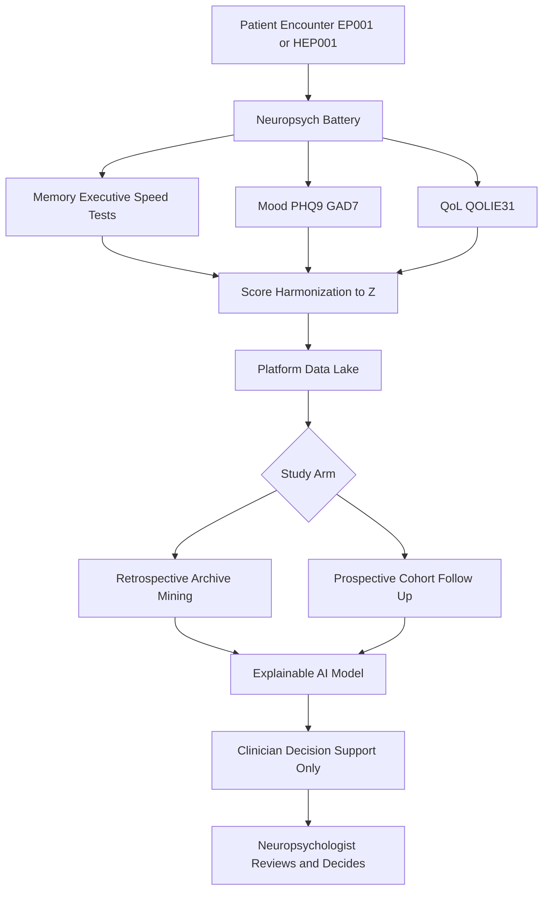
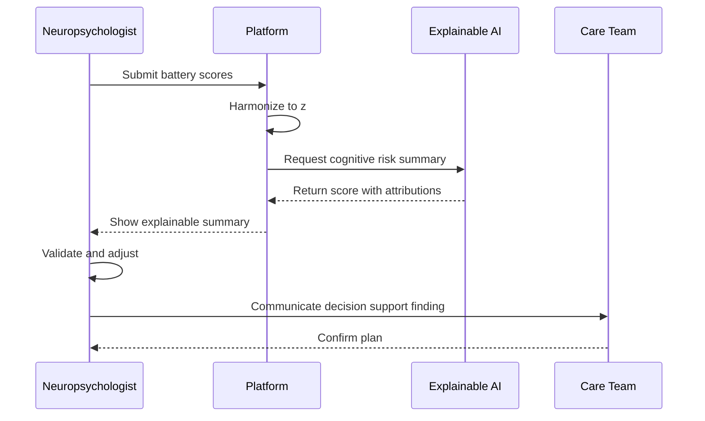
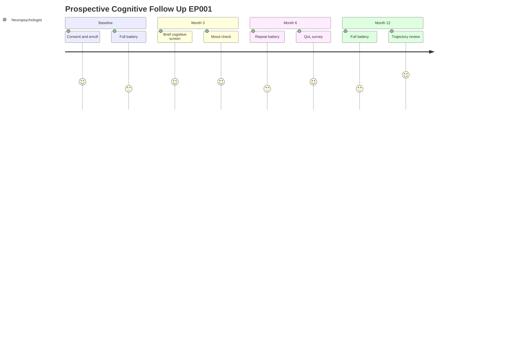
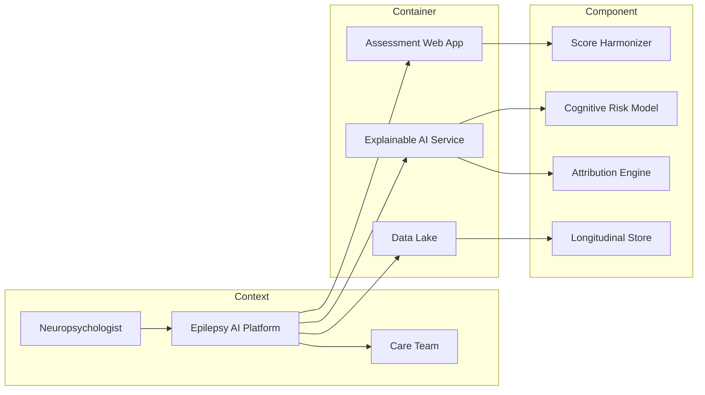

# Role Study - Neuropsychologist (Retrospective + Prospective)

> **Why (this doc):** The neuropsychologist quantifies cognition, memory, mood, and quality of life (QoL) in epilepsy, producing the explainable cognitive endpoints that the Enterprise AI Platform fuses with EEG, imaging, and clinical data to support (never replace) clinical judgment for canonical patients EP001 (29M focal) and HEP001 (27F temporal-lobe).
> **How:** We document this role's assessments and tasks, then design BOTH a retrospective study (archived neuropsych scores) and a prospective study (longitudinal cognitive follow-up cohort), compare them in a matrix, and specify KPIs, defense Q&A, and APA-7 references. AI is decision support only.

---

## 1. Problem

> **Why:** Establish the core clinical-scientific gap this role addresses so every downstream design traces to it.
> **How:** State the epilepsy cognition/mood/QoL problem in one scoped paragraph anchored to the two canonical patients.

Cognitive and psychiatric comorbidity is under-detected and under-quantified in epilepsy care. Focal epilepsy (EP001) and temporal-lobe epilepsy (HEP001) frequently erode verbal memory, executive function, processing speed, mood, and QoL, yet these deficits are captured inconsistently, scored on heterogeneous instruments, and rarely tracked longitudinally. Without standardized, explainable cognitive endpoints, neither retrospective signal-mining nor forward causal inference about treatment effects on cognition is reliable.

## 2. Sub-Problems

> **Why:** Decompose the problem into tractable, individually testable pieces.
> **How:** Enumerate the specific measurement and inference gaps the neuropsychologist must close.

*Caption - Sub-problems that jointly define the neuropsychology scope for both study arms.*

| # | Sub-Problem | Canonical Anchor | Study Arm Most Affected |
|---|-------------|------------------|-------------------------|
| SP1 | Heterogeneous archived scoring norms across eras/instruments | EP001, HEP001 | Retrospective |
| SP2 | Missing baseline for longitudinal cognitive trajectory | EP001 | Prospective |
| SP3 | Mood (depression/anxiety) confounds memory performance | HEP001 | Both |
| SP4 | QoL not linked to objective cognitive decline | EP001, HEP001 | Both |
| SP5 | Recall bias in historical self-reported symptom logs | HEP001 | Retrospective |
| SP6 | Practice effects contaminate repeat testing | EP001 | Prospective |

## 3. Research Problem

> **Why:** Collapse the sub-problems into one answerable research statement.
> **How:** Frame a single question spanning retrospective description and prospective causal follow-up.

How can standardized, explainable neuropsychological endpoints (cognition, memory, mood, QoL) be reliably derived from archived records AND prospectively collected follow-up data to characterize and predict cognitive trajectory in focal and temporal-lobe epilepsy, while controlling selection, recall, practice, and confounding biases?

## 4. Research Objective

> **Why:** Convert the research problem into measurable objectives.
> **How:** List paired retrospective and prospective objectives with explicit endpoints.

*Caption - Objectives mapped to study arm and primary endpoint.*

| Obj | Statement | Arm | Primary Endpoint |
|-----|-----------|-----|------------------|
| O1 | Harmonize archived neuropsych scores to z-scores vs normative data | Retrospective | Standardized composite cognitive z |
| O2 | Describe cross-sectional memory/mood/QoL profile at index | Retrospective | Domain z-scores, PHQ-9, QOLIE-31 |
| O3 | Enroll a follow-up cohort and measure cognitive change | Prospective | Delta verbal memory over 12 months |
| O4 | Model predictors of decline (seizure burden, mood) | Prospective | Slope of composite z per predictor |
| O5 | Deliver explainable AI decision-support summaries to clinicians | Both | Clinician-facing SHAP-style attribution |

## 5. Flow

> **Why:** Show how the neuropsychologist's data moves through the platform end to end.
> **How:** Present a Mermaid flowchart TD from assessment to AI decision support.

**Reason:** The flowchart exists to make the neuropsychologist's contribution auditable from raw testing to a clinician-reviewed recommendation.
**Why:** A DBA defense requires a traceable data lineage that shows AI never acts autonomously.
**What is happening:** Battery results (memory, mood, QoL) are harmonized to z-scores, pooled in the data lake, split by study arm, scored by an explainable model, and returned to the clinician.
**How it is happening:** Each node is a discrete pipeline stage; the diamond branches the same harmonized data into retrospective and prospective processing without duplicating raw capture.
**Reference:** Fisher et al. (2017); Topol (2019).

## 6. Hypotheses

> **Why:** State falsifiable predictions for both arms.
> **How:** Pair null and alternative hypotheses per objective.

*Caption - Hypotheses with directionality and target arm.*

| ID | Null H0 | Alternative H1 | Arm |
|----|---------|----------------|-----|
| H1 | Archived composite z does not differ by epilepsy focus | Temporal-lobe (HEP001-type) shows lower verbal memory z | Retrospective |
| H2 | Mood score is unrelated to memory z | Higher PHQ-9 associates with lower memory z | Both |
| H3 | Cognitive composite is stable over 12 months | Composite z declines with higher seizure burden | Prospective |
| H4 | QoL is independent of objective cognition | Lower QOLIE-31 tracks lower composite z | Both |

## 7. Statistical Analysis

> **Why:** Predefine analysis to prevent p-hacking and support the causal claims.
> **How:** Specify tests, models, and bias adjustments per hypothesis.

*Caption - Statistical plan linking each hypothesis to a method and covariates.*

| Hypothesis | Method | Key Covariates | Bias Control |
|------------|--------|----------------|--------------|
| H1 | Independent-samples comparison, effect size d | Age, education | Norm harmonization |
| H2 | Multiple linear regression | Age, education, AED load | Adjust for mood as covariate |
| H3 | Linear mixed-effects (random slope) | Seizure freq, mood, time | Practice-effect term |
| H4 | Correlation + mediation | Cognition as mediator | Bootstrap CI |

**Reason:** Mixed-effects modeling is used because prospective repeated measures are nested within patients.
**Why:** It separates within-patient trajectory from between-patient differences and models practice effects explicitly.
**What is happening:** Fixed effects estimate predictor influence while random slopes capture individual decline rates.
**How it is happening:** Each visit's composite z is a repeated observation with a time term and a practice-adjustment covariate.
**Reference:** Topol (2019); APA (2020).

---

## 8. Role Assessments and Tasks

> **Why:** Define exactly what the neuropsychologist measures and does on the platform.
> **How:** Tabulate assessments, instruments, cadence, and platform tasks.

*Caption - Core neuropsychology assessments mapped to instruments and platform responsibilities.*

| Domain | Instrument (example) | Cadence | Platform Task |
|--------|----------------------|---------|---------------|
| Verbal memory | List-learning / story recall | Baseline + follow-up | Enter, harmonize, review AI attribution |
| Executive function | Trail Making, verbal fluency | Baseline + follow-up | Score, flag decline |
| Processing speed | Digit-symbol coding | Baseline + follow-up | Score, trend |
| Mood | PHQ-9, GAD-7 | Each visit | Screen, escalate to psychiatry |
| QoL | QOLIE-31 | Baseline + 12 mo | Capture, correlate |
| Global cognition | Composite z-score | Derived | Validate AI summary |

**Reason:** This table anchors the role's data footprint so both study arms draw from the same instrument set.
**Why:** Consistent instruments make retrospective harmonization and prospective comparison valid.
**What is happening:** Each domain feeds one composite and one clinician-reviewed decision-support output.
**How it is happening:** Instruments are scored to z, mood and QoL attach as covariates/outcomes, and the neuropsychologist validates every AI summary.
**Reference:** Fisher et al. (2017).

### 8.1 Role Sequence Interaction

> **Why:** Show the ordered message exchange between role, platform, and AI.
> **How:** Mermaid sequenceDiagram of an assessment-to-support cycle.

**Reason:** The sequence clarifies that AI output is a request-response artifact the neuropsychologist validates.
**Why:** Defense requires proof the human is the final decision-maker.
**What is happening:** Scores go in, an attributed summary comes back, and the clinician validates before communicating.
**How it is happening:** Synchronous calls between role, platform, and model with a human validation step before care-team handoff.
**Reference:** Topol (2019).

## 9. Retrospective Study Design (This Role)

> **Why:** Mine existing archived neuropsych scores for signal at low cost.
> **How:** Specify source, design, sample, variables, analysis, and bias controls.

*Caption - Retrospective design parameters using archived records only.*

| Element | Specification |
|---------|---------------|
| Data source | Existing archived neuropsych score sheets and EHR |
| Design | Retrospective cross-sectional + historical cohort |
| Sample | All EP001/HEP001-type charts with a completed battery |
| Time direction | Backward from index date |
| Independent variables | Epilepsy focus, age, education, AED load, mood |
| Dependent variables | Composite cognitive z, memory z, QOLIE-31 |
| Analysis | Regression, effect sizes (H1, H2, H4) |
| Bias controls | Norm harmonization, complete-case + sensitivity analysis, blinded re-scoring |

**Reason:** Archived data enables fast, inexpensive hypothesis generation.
**Why:** It establishes prevalence and associations before committing to costly follow-up.
**What is happening:** Historical batteries are harmonized and modeled cross-sectionally.
**How it is happening:** Charts are extracted, scored to z, and regressed with bias adjustments.
**Reference:** APA (2020).

## 10. Prospective Study Design (This Role)

> **Why:** Establish temporal precedence to support causal claims about cognitive decline.
> **How:** Specify enrollment, endpoints, follow-up schedule, and consent.

*Caption - Prospective longitudinal cognitive follow-up cohort parameters.*

| Element | Specification |
|---------|---------------|
| Data source | Forward-collected follow-up visits |
| Design | Prospective longitudinal cohort |
| Enrollment | Consecutive new focal/temporal-lobe patients (EP001/HEP001 profile) |
| Primary endpoint | Delta verbal-memory z at 12 months |
| Secondary endpoints | Executive/speed slope, PHQ-9 change, QOLIE-31 change |
| Follow-up schedule | Baseline, 3, 6, 12 months |
| Consent | Written informed consent + IRB approval, re-consent on protocol change |
| Analysis | Linear mixed-effects with practice-effect term (H3) |

**Reason:** Forward enrollment fixes exposure before outcome, enabling trajectory modeling.
**Why:** Only prospective timing cleanly separates cause from effect for cognitive decline.
**What is happening:** Enrolled patients are tested at fixed intervals with consent.
**How it is happening:** A visit schedule feeds repeated z-scores into a mixed-effects model.
**Reference:** Topol (2019); APA (2020).

### 10.1 Follow-Up Journey

> **Why:** Visualize the patient/role experience across the follow-up window.
> **How:** Mermaid journey of the prospective cohort touchpoints.

**Reason:** The journey maps engagement and burden across the 12-month window.
**Why:** Attrition and burden threaten longitudinal validity, so touchpoints must be explicit.
**What is happening:** Effort and satisfaction vary by visit intensity from baseline to trajectory review.
**How it is happening:** Each section is a scheduled visit with defined tasks and a role owner.
**Reference:** APA (2020).

## 11. Retrospective vs Prospective Matrix (This Role)

> **Why:** Force an explicit trade-off comparison for the neuropsychology role.
> **How:** One matrix with the mandated comparison rows.

*Caption - Head-to-head comparison of the two study arms for the neuropsychologist.*

| Dimension | Retrospective | Prospective |
|-----------|---------------|-------------|
| Time direction | Backward from index | Forward from enrollment |
| Data source | Archived neuropsych scores | Newly collected follow-up |
| Cost | Low | High |
| Bias risk | Selection + recall bias high | Attrition + practice-effect risk |
| Causal strength | Weak (association) | Strong (temporal precedence) |
| Ethics / consent | Waiver or de-identified use | Written informed consent + IRB |
| Best use | Hypothesis generation, prevalence | Trajectory, causal inference |

**Reason:** The matrix operationalizes why BOTH arms are mandatory rather than interchangeable.
**Why:** Retrospective is cheap but confounded; prospective is rigorous but costly, so they are complementary.
**What is happening:** Each dimension shows a deliberate trade-off between speed and inferential strength.
**How it is happening:** Retrospective seeds hypotheses that the prospective cohort then tests causally.
**Reference:** Topol (2019); APA (2020).

## 12. Platform Interaction (C4 Model)

> **Why:** Show how the neuropsychologist role sits within the platform architecture.
> **How:** Mermaid graph combining Context, Container, and Component layers.

**Reason:** The C4 view proves the role integrates through defined interfaces, not ad hoc access.
**Why:** Architectural clarity supports auditability and data governance in the defense.
**What is happening:** The neuropsychologist uses the web app, which feeds the lake and AI service, whose attribution engine returns explainable output.
**How it is happening:** Context names the actors, Container names deployable systems, Component names the internal modules doing harmonization, modeling, and attribution.
**Reference:** Topol (2019).

## 13. Role KPIs

> **Why:** Make the role's performance measurable.
> **How:** Table of KPIs with targets and study relevance.

*Caption - Key performance indicators for the neuropsychology role across both arms.*

| KPI | Definition | Target | Arm |
|-----|-----------|--------|-----|
| Battery completion rate | Completed batteries / scheduled | >= 90% | Both |
| Harmonization coverage | Archived scores mapped to z | >= 95% | Retrospective |
| Follow-up retention | Patients retained at 12 mo | >= 80% | Prospective |
| Mood screen escalation | Positive screens referred | 100% | Both |
| AI summary validation | Summaries reviewed by clinician | 100% | Both |
| Time to report | Assessment to decision-support | <= 48 h | Both |

**Reason:** KPIs convert role activity into defensible metrics.
**Why:** Retention and validation KPIs directly guard against attrition bias and autonomous-AI risk.
**What is happening:** Each KPI targets a specific quality or bias threat.
**How it is happening:** Metrics are computed from platform logs and audited periodically.
**Reference:** APA (2020).

---

## 14. Professor Readiness (Defense Q&A)

> **Why:** Anticipate examiner scrutiny of design choices.
> **How:** Provide 4-5 questions with concise, defensible answers.

**Q1. Why run BOTH a retrospective and a prospective study for this role?**
Retrospective archived scores are fast and cheap for generating hypotheses and estimating prevalence/associations, but they cannot establish temporal precedence. The prospective cohort fixes exposure before outcome, enabling causal inference about cognitive trajectory. They are complementary: retrospective seeds, prospective confirms.

**Q2. How do you handle selection and recall bias?**
Selection bias in the retrospective arm is limited by including all eligible charts and running sensitivity/complete-case comparisons. Recall bias in historical self-reports is mitigated by preferring objectively scored batteries over self-recall and blinded re-scoring. The prospective arm avoids recall bias by collecting data contemporaneously.

**Q3. How is confounding controlled?**
Mood is a major confounder of memory performance, so it enters models as a covariate (H2) and mediator (H4). Age, education, and AED load are adjusted in regression and mixed-effects models. The prospective random-slope model also includes a practice-effect term.

**Q4. When would you prefer each design?**
Prefer retrospective when the question is descriptive, resources are limited, or a rapid signal is needed before committing to follow-up. Prefer prospective when the question is causal, requires trajectory, or when temporal ordering and standardized measurement are essential.

**Q5. How do you keep AI as decision support only?**
Every AI cognitive-risk summary carries attributions (SHAP-style) and is validated by the neuropsychologist before any communication to the care team; the human makes the final decision, enforced by the 100% AI-summary-validation KPI.

---

## 15. References

> **Why:** Ground the design in authoritative, citable sources.
> **How:** APA 7th edition entries covering study design, epilepsy classification, and AI/ethics.

American Psychological Association. (2020). *Publication manual of the American Psychological Association* (7th ed.). American Psychological Association.

Fisher, R. S., Cross, J. H., French, J. A., Higurashi, N., Hirsch, E., Jansen, F. E., Lagae, L., Moshe, S. L., Peltola, J., Roulet Perez, E., Scheffer, I. E., & Zuberi, S. M. (2017). Operational classification of seizure types by the International League Against Epilepsy: Position paper of the ILAE Commission for Classification and Terminology. *Epilepsia, 58*(4), 522-530. https://doi.org/10.1111/epi.13670

Topol, E. J. (2019). High-performance medicine: The convergence of human and artificial intelligence. *Nature Medicine, 25*(1), 44-56. https://doi.org/10.1038/s41591-018-0300-7
