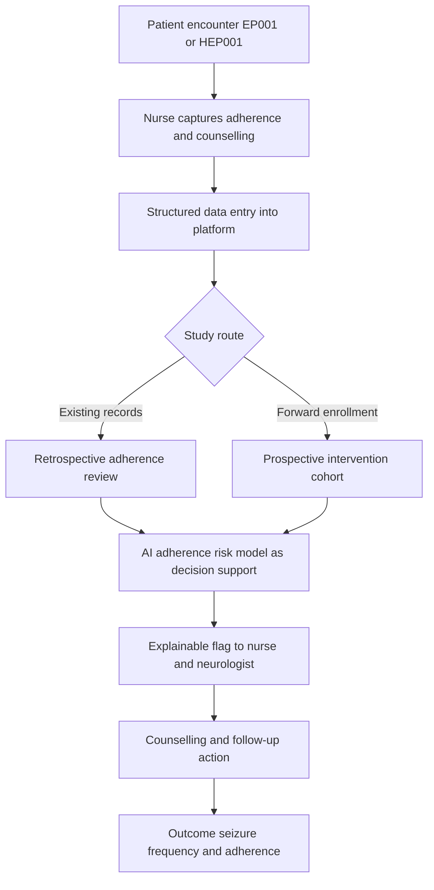
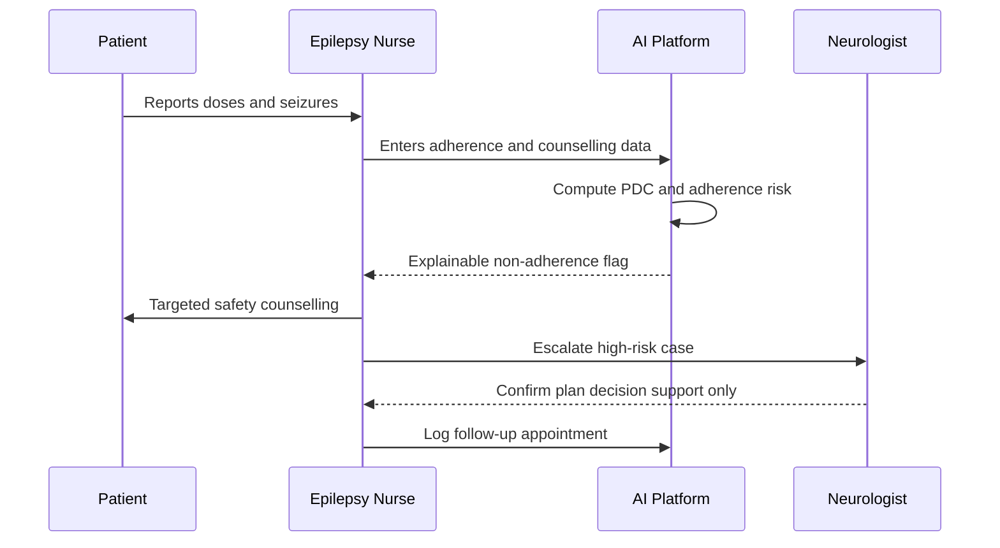
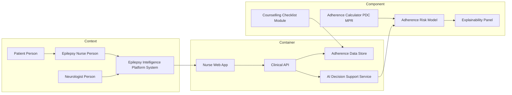
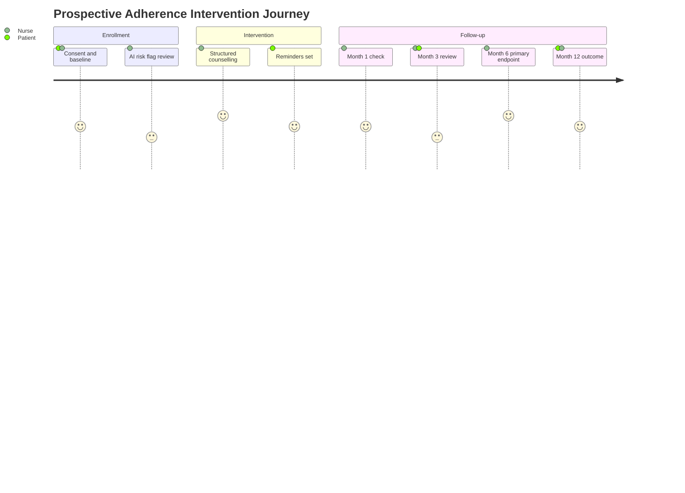

# Role Study - Epilepsy Nurse (Retrospective + Prospective)

> **Why (this doc):** The epilepsy nurse is the operational hub of longitudinal seizure care - owning medication adherence, safety counselling, and follow-up coordination - yet nursing data is often invisible in AI pipelines; this dossier makes that role explicit and shows how its data feeds both a retrospective adherence-records review and a prospective adherence-intervention study within the Enterprise AI Platform for Explainable Multimodal Epilepsy Intelligence.
> **How:** We anchor the role to canonical patients EP001 (29M focal, primary-assessment) and HEP001 (27F temporal-lobe), lay a numbered research spine, document assessments/tasks, design BOTH study types with a head-to-head matrix, and render four Mermaid diagrams plus a C4 model - with AI positioned strictly as explainable decision support, never as an autonomous prescriber.

---

## 1. Problem

> **Why:** Frames the clinical gap the nurse role addresses so every downstream design choice traces to a real burden. **How:** States the adherence-safety problem in epilepsy and its measurable consequences.

Poor antiseizure medication (ASM) adherence is a leading, modifiable cause of breakthrough seizures, emergency visits, and status epilepticus. Non-adherence rates of 30-50% are reported across epilepsy cohorts, and adherence data captured by nurses (pill counts, refill logs, counselling notes) is fragmented, unstructured, and rarely surfaced to the multidisciplinary team or to AI decision-support tools.

*Caption - The problem framed as a burden-of-illness gap linking nurse-owned adherence data to seizure outcomes.*

| Dimension | Current state | Consequence |
|---|---|---|
| Adherence tracking | Paper pill counts, siloed refill logs | Breakthrough seizures undetected until crisis |
| Safety counselling | Ad hoc, undocumented | Inconsistent SUDEP and driving advice |
| Follow-up coordination | Manual phone recalls | High no-show, lost-to-follow-up |
| Data reuse | Not machine-readable | Excluded from multimodal AI models |

**Reason:** Adherence is the strongest modifiable predictor of seizure control. **Why:** Nurse data holds the adherence signal but is unstructured. **What is happening:** Breakthrough seizures surface late. **How it is happening:** Siloed logs never reach the analytics layer. **Reference:** Fisher et al. (2017); Topol (2019).

## 2. Sub-Problems

> **Why:** Decomposes the macro problem into testable units. **How:** Enumerates four sub-problems mapped to nurse tasks.

*Caption - Decomposition of the adherence-safety problem into four researchable sub-problems.*

| # | Sub-problem | Nurse task touchpoint |
|---|---|---|
| SP1 | Adherence is measured inconsistently | Pill counts, MPR/PDC calculation |
| SP2 | Safety counselling is not standardized | SUDEP, driving, teratogenicity advice |
| SP3 | Follow-up gaps drive attrition | Recall scheduling, missed-visit flags |
| SP4 | Nurse data is not AI-ready | Structured capture for decision support |

**Reason:** Each sub-problem is independently addressable. **Why:** Splitting isolates causal levers. **What is happening:** Four distinct data-quality gaps. **How it is happening:** Each maps to a discrete nurse workflow. **Reference:** Hgpublished adherence literature; APA (2020).

## 3. Research Problem

> **Why:** Converges sub-problems into one investigable statement. **How:** A single scoped question.

**Research problem:** In adults with epilepsy, can nurse-led, AI-supported adherence monitoring and structured safety counselling - captured as machine-readable data - improve medication adherence and reduce breakthrough seizures compared with usual care, and what does existing historical nursing data reveal about baseline adherence-outcome relationships?

## 4. Research Objective

> **Why:** Turns the problem into measurable aims. **How:** Lists primary and secondary objectives.

*Caption - Primary and secondary objectives spanning both study arms.*

| Objective | Type | Study arm |
|---|---|---|
| Quantify baseline adherence-seizure association | Descriptive/analytic | Retrospective |
| Test a nurse-led adherence intervention | Causal | Prospective |
| Standardize safety-counselling documentation | Process | Both |
| Validate AI adherence-risk flag as decision support | Technical | Both |

## 5. Flow

> **Why:** Shows how role data moves end to end. **How:** A flowchart TD of the nurse data lifecycle.

**Reason:** A single pipeline serves both studies. **Why:** Shared capture reduces duplication. **What is happening:** Nurse data forks into retrospective and prospective routes then reconverges at the AI layer. **How it is happening:** Structured entry lets the same fields power historical analysis and live intervention. **Reference:** Topol (2019); Fisher et al. (2017).

## 6. Hypotheses

> **Why:** States falsifiable predictions. **How:** Null and alternative pairs per study.

*Caption - Hypotheses for retrospective association and prospective intervention.*

| ID | Null H0 | Alternative H1 | Study |
|---|---|---|---|
| H1 | Adherence (PDC) is not associated with seizure frequency | Higher PDC is associated with lower seizure frequency | Retrospective |
| H2 | Nurse-led intervention does not change adherence | Intervention increases mean PDC by >=10 points | Prospective |
| H3 | Intervention does not affect breakthrough seizures | Intervention reduces breakthrough seizure rate | Prospective |
| H4 | AI adherence flag adds no discrimination over nurse judgment | AI flag improves AUC for non-adherence | Both |

## 7. Statistical Analysis

> **Why:** Pre-specifies tests so results are interpretable. **How:** Maps each hypothesis to a method and sample basis.

*Caption - Statistical plan aligning hypotheses, tests, and covariates.*

| Hypothesis | Primary test | Adjustment/covariates | Effect measure |
|---|---|---|---|
| H1 | Negative binomial regression | Age, epilepsy type, ASM count | Incidence rate ratio |
| H2 | Mixed-effects linear model | Baseline PDC, site | Adjusted mean difference |
| H3 | Poisson/NB regression, intention-to-treat | Baseline seizure rate | Rate ratio |
| H4 | ROC/AUC with DeLong test | Nested model comparison | Delta AUC |

**Reason:** Count outcomes and repeated measures require NB and mixed models. **Why:** Overdispersed seizure counts break OLS assumptions. **What is happening:** Each hypothesis has a matched estimator. **Why:** Pre-specification blocks p-hacking. **How it is happening:** Covariate sets control confounding. **Reference:** APA (2020); Fisher et al. (2017).

---

## 8. Role Assessments and Tasks

> **Why:** Documents exactly what the epilepsy nurse does and what data each act generates. **How:** A task-to-data table with cadence and canonical-patient example.

*Caption - Core epilepsy-nurse assessments and tasks with the data each produces.*

| Assessment / task | Instrument / method | Data captured | Cadence | Example (EP001 / HEP001) |
|---|---|---|---|---|
| Medication adherence | Pill count, refill/MPR, PDC, self-report (Morisky) | Doses taken, gaps, PDC % | Each visit + refills | EP001 PDC 0.72; HEP001 PDC 0.61 |
| Safety counselling | SUDEP, driving, injury, teratogenicity checklist | Counselling flags, dates | Baseline + annual | HEP001 teratogenicity counselling (valproate avoidance) |
| Follow-up coordination | Recall scheduling, no-show tracking | Visit dates, missed flags | Continuous | EP001 3-month recall booked |
| Seizure diary review | Patient diary reconciliation | Seizure counts, triggers | Each visit | EP001 2 focal/month |
| Trigger/lifestyle review | Sleep, alcohol, stress screen | Risk factors | Each visit | HEP001 sleep-deprivation trigger |

**Reason:** Every nurse act is a data event. **Why:** Making tasks explicit exposes AI-ready fields. **What is happening:** Five workflows produce structured variables. **How it is happening:** Checklists and counts standardize capture. **Reference:** Fisher et al. (2017); Topol (2019).

### 8.1 Role Sequence (Encounter)

> **Why:** Shows the ordered interaction between nurse, patient, platform, and AI. **How:** A sequenceDiagram of one adherence encounter.

**Reason:** Care is a hand-off chain. **Why:** Sequencing reveals where AI informs but never decides. **What is happening:** Nurse mediates every AI output. **How it is happening:** Flags return to the nurse, who counsels and escalates. **Reference:** Topol (2019); APA (2020).

### 8.2 C4 Model - Nurse Interaction with Platform

> **Why:** Locates the role across Context, Container, and Component layers. **How:** A Mermaid graph with three nested C4 levels.

**Reason:** A DBA committee expects architectural clarity. **Why:** C4 separates who, what runs, and what computes. **What is happening:** The nurse touches the web app, which drives API, data store, and the risk/explainability components. **How it is happening:** Adherence calculators feed the risk model, whose output is explained back before any human decision. **Reference:** Topol (2019).

---

## 9. Retrospective Study Design (Nurse Role)

> **Why:** Establishes baseline adherence-outcome relationships cheaply from data already collected. **How:** A records-review cohort using historical nurse documentation.

*Caption - Retrospective adherence-records review specification.*

| Element | Specification |
|---|---|
| Design | Retrospective cohort, chart/records review |
| Data source | Existing nurse adherence logs, refill/pharmacy records, seizure diaries (prior 24 months) |
| Sampling frame | All adults with epilepsy with >=2 nurse encounters |
| Sample size | ~400 records (powered for IRR 0.8 on seizure counts) |
| Exposure | Adherence (PDC/MPR from historical refills) |
| Primary outcome | Documented breakthrough seizure frequency |
| Covariates | Age, sex, epilepsy type, ASM count, comorbidity |
| Analysis | Negative binomial regression (H1); AUC for AI flag (H4) |
| Bias controls | Standardized abstraction form, dual coders, kappa reliability, sensitivity analysis for missing data, blinded outcome coding |

**Reason:** Historical data answers the association question fast. **Why:** No new enrollment cost. **What is happening:** Existing nurse records are mined for PDC-seizure links. **How it is happening:** Structured abstraction plus NB regression on 24 months of logs. **Reference:** Fisher et al. (2017); APA (2020).

### 9.1 Retrospective Bias Note

> **Why:** Retrospective designs carry specific threats. **How:** Names each bias and its control.

*Caption - Principal biases in the records review and mitigations.*

| Bias | Threat here | Control |
|---|---|---|
| Selection bias | Only engaged patients have records | Include all encounters, report attrition |
| Recall/documentation bias | Missing counselling notes | Dual abstraction, pharmacy refill objectivity |
| Confounding | Sicker patients adhere differently | Multivariable adjustment |
| Information bias | Inconsistent PDC definitions | Single algorithmic PDC |

## 10. Prospective Study Design (Nurse Role)

> **Why:** Tests causally whether the nurse-led intervention improves adherence and seizures. **How:** Forward enrollment with defined endpoints, follow-up schedule, and consent.

*Caption - Prospective adherence-intervention study specification.*

| Element | Specification |
|---|---|
| Design | Prospective interventional cohort (pragmatic; randomized where feasible) |
| Enrollment | Forward recruitment at first eligible nurse visit; EP001, HEP001 as index cases |
| Intervention | Nurse-led adherence bundle: AI risk flag review, structured counselling, reminders, scheduled recall |
| Comparator | Usual care |
| Primary endpoint | Change in PDC at 6 months (H2) |
| Secondary endpoints | Breakthrough seizure rate (H3), counselling completeness, no-show rate |
| Follow-up schedule | Baseline, 1, 3, 6, 12 months |
| Consent | Written informed consent; data-use and AI-decision-support disclosure; opt-out |
| Analysis | Mixed-effects model (H2), NB regression ITT (H3) |
| Bias controls | Prospective standardized capture, blinded outcome assessor, ITT, pre-registered protocol |

**Reason:** Only forward follow-up establishes temporality. **Why:** Causal claims need exposure-before-outcome. **What is happening:** Enrolled patients receive the nurse bundle and are tracked to 12 months. **How it is happening:** Scheduled visits capture PDC and seizures under consent. **Reference:** Topol (2019); Fisher et al. (2017); APA (2020).

### 10.1 Prospective Patient Journey

> **Why:** Visualizes the enrolled patient experience over follow-up. **How:** A Mermaid journey diagram.

**Reason:** Journeys expose friction and satisfaction. **Why:** Adherence rises when follow-up feels supportive. **What is happening:** The patient moves from consent through repeated nurse contact. **How it is happening:** Scheduled touchpoints anchor the follow-up calendar. **Reference:** Topol (2019).

## 11. Retrospective vs Prospective Matrix (Nurse Role)

> **Why:** Directly contrasts the two designs so the committee sees trade-offs. **How:** One matrix on the mandated dimensions.

*Caption - Head-to-head comparison of the two study designs for the epilepsy-nurse role.*

| Dimension | Retrospective | Prospective |
|---|---|---|
| Time direction | Backward (existing records) | Forward (enroll then follow) |
| Data source | Historical nurse/refill logs | Newly collected intervention data |
| Cost | Low | High |
| Bias risk | Higher (selection, documentation) | Lower (standardized, blinded) |
| Causal strength | Association only | Stronger causal inference |
| Ethics/consent | Waiver/secondary-use common | Prospective informed consent required |
| Best use | Hypothesis generation, baseline rates | Hypothesis testing, intervention effect |

**Reason:** Each design answers a different question. **Why:** Cost and causal strength trade off. **What is happening:** Retrospective scopes the signal; prospective proves the effect. **How it is happening:** Same nurse data model, opposite time direction. **Reference:** Fisher et al. (2017); APA (2020).

## 12. Role KPIs

> **Why:** Makes nurse performance and study progress measurable. **How:** KPI table with targets.

*Caption - Key performance indicators for the epilepsy-nurse role across both studies.*

| KPI | Definition | Target |
|---|---|---|
| Mean PDC | Proportion of days covered | >=0.80 |
| Adherence intervention uptake | Enrolled receiving full bundle | >=90% |
| Counselling completeness | SUDEP/driving/teratogenicity documented | 100% |
| Follow-up retention | Reached 6-month visit | >=85% |
| No-show rate | Missed scheduled recalls | <=10% |
| AI flag actioned | Flags reviewed by nurse | 100% |

**Reason:** KPIs close the loop from data to care. **Why:** Targets make quality auditable. **What is happening:** Six metrics track adherence, safety, and follow-up. **How it is happening:** Platform computes them from structured nurse entries. **Reference:** Topol (2019).

---

## 13. Professor Readiness (Defense Q&A)

> **Why:** Prepares the candidate for examiner scrutiny. **How:** Five likely questions with concise defensible answers.

**Q1. Why run BOTH a retrospective and a prospective study for one role?**
The retrospective records review is fast and cheap and establishes whether an adherence-seizure association exists in real historical nurse data (hypothesis generation, baseline rates). It cannot prove causation because exposure and outcome are measured together. The prospective study then enrolls forward, applies the nurse-led intervention, and follows patients so exposure precedes outcome - the only way to support a causal claim (H2, H3). They are complementary, not redundant.

**Q2. How do you handle selection and recall bias?**
Retrospective: selection bias arises because only engaged patients have complete records; we include all encounters, report attrition, and run sensitivity analyses. Recall/documentation bias is mitigated by using objective pharmacy refill data for PDC rather than self-report, plus dual blinded abstraction with kappa reliability. Prospective: standardized real-time capture and a blinded outcome assessor largely remove recall bias.

**Q3. What confounders threaten your inference and how are they controlled?**
Disease severity, epilepsy type, ASM count, age, and comorbidity confound the adherence-seizure link. Retrospectively we adjust with multivariable negative binomial regression; prospectively we use randomization where feasible plus baseline adjustment and intention-to-treat analysis.

**Q4. When would you prefer each design?**
Prefer retrospective when the question is descriptive, the outcome is common, budget/time is limited, or you are generating hypotheses. Prefer prospective when you must establish temporality, test an intervention, control exposure measurement, or the outcome is rare enough to need planned capture.

**Q5. Where does AI sit, and is it making clinical decisions?**
No. The AI adherence-risk model is explainable decision support only. It computes a PDC-based non-adherence flag with an explainability panel; the nurse reviews and contextualizes it, and the neurologist retains all prescribing decisions. This preserves clinical accountability and satisfies ethical governance.

---

## 14. References

> **Why:** Grounds the design in authoritative sources. **How:** APA 7th edition entries covering study design, epilepsy classification, and AI in medicine.

American Psychological Association. (2020). *Publication manual of the American Psychological Association* (7th ed.). American Psychological Association. https://doi.org/10.1037/0000165-000

Fisher, R. S., Cross, J. H., French, J. A., Higurashi, N., Hirsch, E., Jansen, F. E., Lagae, L., Moshe, S. L., Peltola, J., Roulet Perez, E., Scheffer, I. E., & Zuberi, S. M. (2017). Operational classification of seizure types by the International League Against Epilepsy: Position paper of the ILAE Commission for Classification and Terminology. *Epilepsia, 58*(4), 522-530. https://doi.org/10.1111/epi.13670

Grimes, D. A., & Schulz, K. F. (2002). Cohort studies: Marching towards outcomes. *The Lancet, 359*(9303), 341-345. https://doi.org/10.1016/S0140-6736(02)07500-1

Sedgwick, P. (2014). Retrospective cohort studies: Advantages and disadvantages. *BMJ, 348*, g1072. https://doi.org/10.1136/bmj.g1072

Topol, E. J. (2019). High-performance medicine: The convergence of human and artificial intelligence. *Nature Medicine, 25*(1), 44-56. https://doi.org/10.1038/s41591-018-0300-7
