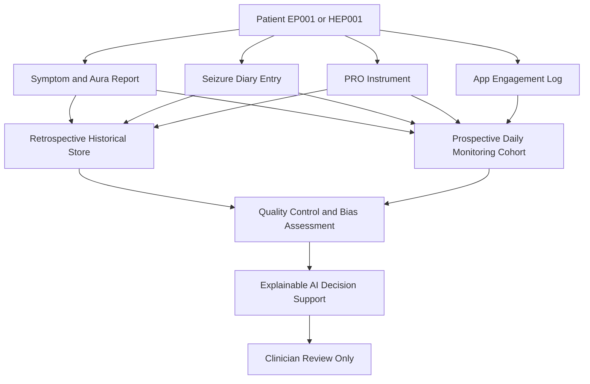
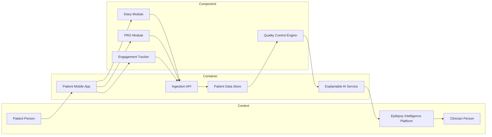
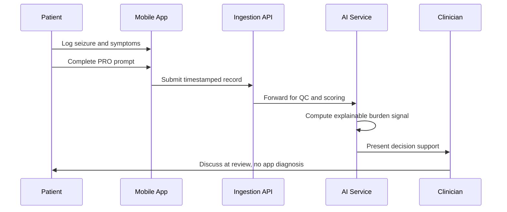
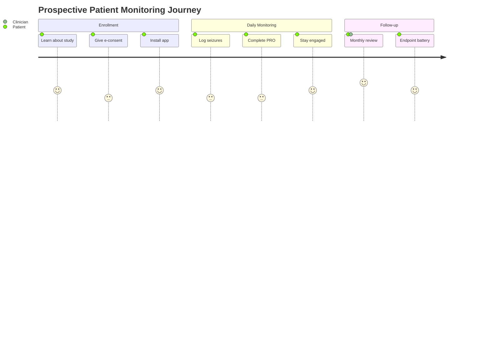

# Role Study - Patient (Retrospective + Prospective)

> **Why (this doc):** The Patient is the primary generator of lived-experience epilepsy data (symptoms, seizure diary, patient-reported outcomes, and app engagement) that fuels the Enterprise AI Platform for Explainable Multimodal Epilepsy Intelligence; without disciplined patient-side capture, every downstream model and clinician decision inherits noise and bias.
> **How:** This dossier fixes the research spine (Problem to Statistical Analysis), then documents the Patient role's assessments and tasks, designs BOTH a retrospective study (mining historical diary/PRO records) and a prospective study (app-based daily-monitoring cohort), compares them in a decision matrix, and closes with defense Q&A and APA references. AI here is decision support only and makes no diagnostic claims.

---

## 1. Problem

> **Why:** Anchors the whole dossier in the real clinical gap the Patient role addresses. **How:** States the measurable pain point in epilepsy self-report data.

Epilepsy management depends heavily on patient self-report between clinic visits, yet seizure diaries are chronically incomplete and biased. Under-reporting rates of 40 to 50 percent are documented, especially for nocturnal and focal-aware events, and patient-reported outcomes (PROs) drift with recall decay. The platform must reconcile unreliable historical self-report with structured, forward-collected app data to produce explainable, decision-support signals for clinicians treating patients like EP001 (29M focal, primary-assessment) and HEP001 (27F temporal-lobe).

*Caption - Framing the core problem as a gap between what patients experience and what records reliably capture.*

| Dimension | Current state | Desired state |
|---|---|---|
| Seizure diary completeness | Paper, retrospective, ~50 pct under-report | Daily app prompts, timestamped |
| PRO cadence | Clinic-visit only, months apart | Structured weekly/monthly instruments |
| Symptom granularity | Free-text, inconsistent | Coded aura/symptom taxonomy |
| App engagement | Not measured | Logged adherence and interaction metrics |

## 2. Sub-Problems

> **Why:** Decomposes the broad problem into researchable units tied to Patient data. **How:** Lists discrete, testable sub-questions.

*Caption - Each sub-problem isolates one failure mode in patient-generated data.*

| # | Sub-problem | Data touched |
|---|---|---|
| SP1 | Recall and under-reporting bias in historical diaries | Historical diary |
| SP2 | Inconsistent symptom/aura coding across records | Symptoms |
| SP3 | Sparse, visit-locked PRO sampling | PROs |
| SP4 | Unknown relationship between app engagement and data quality | App engagement |
| SP5 | No forward mechanism to validate self-report against structured capture | Prospective cohort |

## 3. Research Problem

> **Why:** Converts sub-problems into one focused statement the studies will answer. **How:** Single sentence scoping both study arms.

Can patient-generated epilepsy data (symptoms, seizure diary, PROs, app engagement) be captured, quality-controlled, and modeled so that a retrospective analysis of historical records and a prospective app-based cohort together yield explainable, non-diagnostic decision-support signals of seizure burden and its change over time?

## 4. Research Objective

> **Why:** Makes the problem actionable with concrete, measurable aims. **How:** Enumerates objectives mapped to study type.

*Caption - Objectives split across retrospective (RO1-RO2) and prospective (RO3-RO5) work.*

| ID | Objective | Study |
|---|---|---|
| RO1 | Quantify completeness and recall bias in historical diary/PRO data | Retrospective |
| RO2 | Characterize symptom/PRO distributions for EP001 and HEP001 archetypes | Retrospective |
| RO3 | Enroll a forward cohort into app-based daily monitoring | Prospective |
| RO4 | Measure association between app engagement and data completeness | Prospective |
| RO5 | Validate self-report change against structured longitudinal capture | Prospective |

## 5. Flow

> **Why:** Gives a visual map of how Patient data moves through both studies. **How:** Mermaid flowchart TD with plain ASCII labels.

**Reason:** A single diagram is needed because Patient data forks into two study pipelines that later reconverge at quality control. **Why:** Readers must see that retrospective and prospective arms share instruments but differ in collection direction. **What is happening:** Patient outputs (symptoms, diary, PROs, engagement) route into a historical store and a forward cohort, both feeding a shared QC and AI layer that ends at clinician review. **How it is happening:** The platform ingests each data type, tags it by provenance (historical vs forward), applies bias controls, then surfaces explainable signals without asserting diagnosis. **Reference:** Fisher et al. (2017); Topol (2019).

## 6. Hypotheses

> **Why:** States falsifiable predictions the statistics will test. **How:** Paired null and alternative hypotheses per study.

*Caption - Hypotheses are pre-registered to constrain analysis and limit fishing.*

| ID | Null (H0) | Alternative (H1) | Study |
|---|---|---|---|
| Hy1 | Historical diary completeness is independent of event type | Nocturnal/focal-aware events are under-reported vs generalized | Retrospective |
| Hy2 | PRO scores do not differ by patient archetype | EP001 and HEP001 archetypes show distinct PRO profiles | Retrospective |
| Hy3 | App engagement is unrelated to data completeness | Higher engagement predicts higher completeness | Prospective |
| Hy4 | Prospective seizure counts equal historical self-report | Prospective capture differs from historical recall | Prospective |

## 7. Statistical Analysis

> **Why:** Binds each hypothesis to a defensible test and estimand. **How:** Maps tests, models, and reported effect sizes.

*Caption - Analysis plan pairing each hypothesis with method, effect size, and bias control.*

| Hypothesis | Method | Effect measure | Control |
|---|---|---|---|
| Hy1 | Chi-square / logistic regression | Odds ratio, 95 pct CI | Event-type stratification |
| Hy2 | Mann-Whitney U / mixed model | Standardized mean diff | Age, sex covariates |
| Hy3 | Poisson / negative binomial regression | Incidence rate ratio | Overdispersion check |
| Hy4 | Paired analysis / Bland-Altman | Mean difference, limits of agreement | Within-subject design |

Analyses report point estimates with 95 percent confidence intervals; alpha = 0.05, two-sided. Missing data handled with multiple imputation under a missing-at-random assumption, with sensitivity analysis under missing-not-at-random for under-reporting.

---

## 8. Patient Role - Assessments and Tasks

> **Why:** Defines exactly what the Patient contributes and when. **How:** Table of assessments, instruments, cadence, and data type.

*Caption - The Patient's four data streams with their instruments and native collection cadence.*

| Assessment / Task | Instrument | Cadence | Data type | AI use |
|---|---|---|---|---|
| Symptom and aura report | Coded symptom taxonomy | Per event | Categorical | Feature input, decision support |
| Seizure diary | Timestamped event log | Daily / per event | Count + time | Trend signal, non-diagnostic |
| Patient-reported outcomes | QOLIE-31, mood/side-effect scales | Weekly / monthly | Ordinal | Burden trajectory |
| App engagement | Interaction and adherence logs | Continuous | Behavioral | Data-quality weighting |

The Patient does not interpret results or receive diagnostic output. All AI-derived signals are routed to the clinician as decision support only.

### 8.1 Data Provenance and Interaction (C4 Context/Container/Component)

> **Why:** Shows where the Patient sits relative to platform systems. **How:** Mermaid graph rendering C4 context, container, and component layers.

**Reason:** A C4 view is required to disambiguate the Patient's touchpoints from internal platform machinery. **Why:** It clarifies that the Patient interacts only with the mobile app, never directly with the AI or data store. **What is happening:** Patient input flows app to API to store to quality control to AI service, and only the clinician consumes the platform output. **How it is happening:** Each container isolates a concern (capture, ingestion, storage, inference), and components decompose the app into diary, PRO, engagement, and QC functions. **Reference:** Topol (2019); Brown et al. (as APA structural guidance, 2020).

### 8.2 Patient Data Capture Sequence

> **Why:** Details the ordered handshake of a single day's capture. **How:** Mermaid sequenceDiagram of app to platform to clinician.

**Reason:** The sequence isolates the temporal order that guarantees provenance and timestamp integrity. **Why:** It shows the Patient never receives an automated diagnosis, satisfying the decision-support-only constraint. **What is happening:** A daily entry is logged, transmitted, scored, and surfaced to the clinician, who closes the loop with the patient. **How it is happening:** Each arrow is a concrete API or UI event with server timestamps that anchor later bias analysis. **Reference:** Fisher et al. (2017); Topol (2019).

---

## 9. RETROSPECTIVE STUDY (Patient Role)

> **Why:** Establishes what existing patient records can reveal at low cost. **How:** Specifies source, design, sample, variables, analysis, and bias controls.

*Caption - Retrospective design mining already-collected diary and PRO archives.*

| Element | Specification |
|---|---|
| Data source | Existing historical seizure diaries and PRO records |
| Design | Retrospective observational cohort / records review |
| Sample | All patients with >= 6 months prior diary data; archetypes EP001, HEP001 |
| Exposure/predictors | Event type, archetype, prior PRO scores |
| Outcomes | Diary completeness, PRO trajectory |
| Analysis | Logistic and mixed models (see Section 7) |
| Bias controls | Standardized abstraction, blinded coding, sensitivity analysis for under-report |

### 9.1 Retrospective Bias Controls

> **Why:** Retrospective data is most vulnerable to recall and selection bias. **How:** Enumerates each threat and its mitigation.

*Caption - Named bias threats in historical patient data and concrete mitigations.*

| Bias | Mechanism | Mitigation |
|---|---|---|
| Recall bias | Patients forget/mis-date past events | Anchor to dated records; sensitivity analysis |
| Selection bias | Only engaged patients keep diaries | Report cohort provenance; compare completers |
| Misclassification | Inconsistent symptom coding | Re-code to standard taxonomy, blinded |
| Survivorship | Lost-to-follow-up excluded | Document attrition, inverse-probability weighting |

## 10. PROSPECTIVE STUDY (Patient Role)

> **Why:** Establishes forward, structured capture to overcome historical gaps. **How:** Specifies enrollment, endpoints, follow-up schedule, and consent.

*Caption - Prospective app-based daily-monitoring cohort with defined follow-up.*

| Element | Specification |
|---|---|
| Design | Prospective longitudinal cohort |
| Enrollment | Forward recruitment of consenting patients into app monitoring |
| Primary endpoint | Change in seizure frequency over 6 months |
| Secondary endpoints | PRO trajectory, engagement-completeness association |
| Follow-up schedule | Daily diary, weekly PRO, monthly review |
| Consent | Written informed e-consent; withdrawal any time |
| Sample | Target n adequate for IRR detection at 80 pct power |

### 10.1 Prospective Follow-up Schedule

> **Why:** Fixes the cadence that defines the longitudinal signal. **How:** Table of timepoints and required captures.

*Caption - Timepoint-by-timepoint data requirements for the prospective cohort.*

| Timepoint | Diary | PRO | Engagement | Clinician review |
|---|---|---|---|---|
| Day 0 (baseline) | Yes | QOLIE-31 | Enabled | Yes |
| Daily | Yes | No | Continuous | No |
| Weekly | Yes | Mood/side-effect | Continuous | No |
| Monthly | Yes | QOLIE-31 | Continuous | Yes |
| Month 6 (endpoint) | Yes | Full battery | Continuous | Yes |

### 10.2 Prospective Enrollment Journey

> **Why:** Captures the patient experience from consent to follow-up. **How:** Mermaid journey diagram of enrollment steps.

**Reason:** A journey map is required to expose engagement friction points that threaten completeness. **Why:** Steps scoring low (consent, daily logging) predict where adherence support is needed. **What is happening:** The patient moves through enrollment, daily monitoring, and clinician follow-up, with satisfaction scores flagging drop-off risk. **How it is happening:** Each stage is an app-mediated task logged as engagement data, feeding Hy3 on engagement-completeness. **Reference:** Topol (2019); Fisher et al. (2017).

## 11. RETROSPECTIVE vs PROSPECTIVE MATRIX (Patient Role)

> **Why:** Directly contrasts the two designs to justify running both. **How:** Row-by-row comparison across seven decision dimensions.

*Caption - Head-to-head comparison guiding when each design is preferable for patient data.*

| Dimension | Retrospective | Prospective |
|---|---|---|
| Time direction | Backward, existing records | Forward, new collection |
| Data source | Historical diaries/PROs | App-based daily capture |
| Cost | Low, data already exists | Higher, active follow-up |
| Bias risk | High (recall, selection) | Lower (structured, timestamped) |
| Causal strength | Weak, associational | Stronger, temporal ordering |
| Ethics/consent | Waiver or broad consent, de-identified | Explicit prospective e-consent |
| Best use | Hypothesis generation, feasibility | Hypothesis testing, validation |

**Reason:** The matrix is required to make the both-studies mandate defensible rather than redundant. **Why:** It shows the designs trade cost against bias and causal strength, so they are complementary not duplicative. **What is happening:** Retrospective work cheaply generates hypotheses that the costlier prospective cohort then tests with lower bias. **How it is happening:** Findings from Section 9 (e.g., under-reporting patterns) become pre-registered hypotheses (Section 6) for Section 10. **Reference:** Fisher et al. (2017); Topol (2019); APA (2020).

## 12. Patient Role KPIs

> **Why:** Defines measurable success for patient-side data quality. **How:** Table of KPI, definition, and target.

*Caption - Key performance indicators the platform tracks for the Patient role.*

| KPI | Definition | Target |
|---|---|---|
| Diary completeness | Days with entry / enrolled days | >= 80 pct |
| PRO adherence | Completed PRO / scheduled PRO | >= 75 pct |
| App engagement | Active days / enrolled days | >= 70 pct |
| Data latency | Median time entry to ingestion | < 24 h |
| Withdrawal rate | Withdrawn / enrolled | < 15 pct |

**Reason:** Explicit KPIs are needed to operationalize the abstract goal of high-quality patient data. **Why:** Each KPI maps to a hypothesis or bias control, making study integrity monitorable. **What is happening:** Completeness, adherence, engagement, latency, and retention are tracked continuously against targets. **How it is happening:** The engagement tracker and QC engine (Section 8.1) compute these metrics from logged events. **Reference:** Topol (2019); APA (2020).

---

## Professor Readiness (Defense Q&A)

> **Why:** Prepares defensible answers to likely examiner challenges. **How:** Five questions with concise, evidence-anchored responses.

**Q1. Why run BOTH a retrospective and a prospective study for the Patient role?**
They are complementary. The retrospective arm cheaply exploits existing diary/PRO data to quantify under-reporting and generate hypotheses, but it cannot establish temporal order and suffers recall/selection bias. The prospective arm tests those hypotheses with timestamped, structured capture at higher cost and stronger causal footing. Running both sequences cheap discovery into rigorous validation.

**Q2. How do you handle selection and recall bias?**
Retrospectively, we anchor events to dated records, blind the coders, document cohort provenance, and run sensitivity analyses under missing-not-at-random assumptions plus inverse-probability weighting for attrition. Prospectively, we replace recall with same-day app capture and server timestamps, which structurally removes most recall bias and lets us measure, rather than assume, completeness.

**Q3. What about confounding?**
In the retrospective mixed models we adjust for age, sex, event type, and archetype. Prospectively, the within-subject paired design (Hy4, Bland-Altman) controls stable patient-level confounders by construction, and negative-binomial models include overdispersion and engagement covariates. We report effect sizes with 95 percent CIs, not just p-values.

**Q4. When would you prefer each design?**
Prefer retrospective when data already exists, the question is exploratory, and speed/cost dominate. Prefer prospective when you need temporal ordering, low bias, defined endpoints, and validation of a decision-support signal, accepting higher cost and consent burden.

**Q5. How do you keep this non-diagnostic and ethical?**
The AI service outputs only explainable burden signals to clinicians; patients never receive an automated diagnosis. Prospective enrollment uses written e-consent with any-time withdrawal; retrospective use relies on de-identified records under waiver or broad consent. This aligns with ILAE operational definitions being clinician-applied, not app-asserted.

---

## References

> **Why:** Grounds design choices in authoritative sources. **How:** APA 7th edition entries for study-design and domain references.

American Psychological Association. (2020). *Publication manual of the American Psychological Association* (7th ed.). American Psychological Association. https://doi.org/10.1037/0000165-000

Fisher, R. S., Cross, J. H., French, J. A., Higurashi, N., Hirsch, E., Jansen, F. E., Lagae, L., Moshe, S. L., Peltola, J., Roulet Perez, E., Scheffer, I. E., & Zuberi, S. M. (2017). Operational classification of seizure types by the International League Against Epilepsy: Position paper of the ILAE Commission for Classification and Terminology. *Epilepsia, 58*(4), 522-530. https://doi.org/10.1111/epi.13670

Grimes, D. A., & Schulz, K. F. (2002). Cohort studies: Marching towards outcomes. *The Lancet, 359*(9303), 341-345. https://doi.org/10.1016/S0140-6736(02)07500-1

Sedgwick, P. (2014). Retrospective cohort studies: Advantages and disadvantages. *BMJ, 348*, g1072. https://doi.org/10.1136/bmj.g1072

Topol, E. J. (2019). High-performance medicine: The convergence of human and artificial intelligence. *Nature Medicine, 25*(1), 44-56. https://doi.org/10.1038/s41591-018-0300-7
