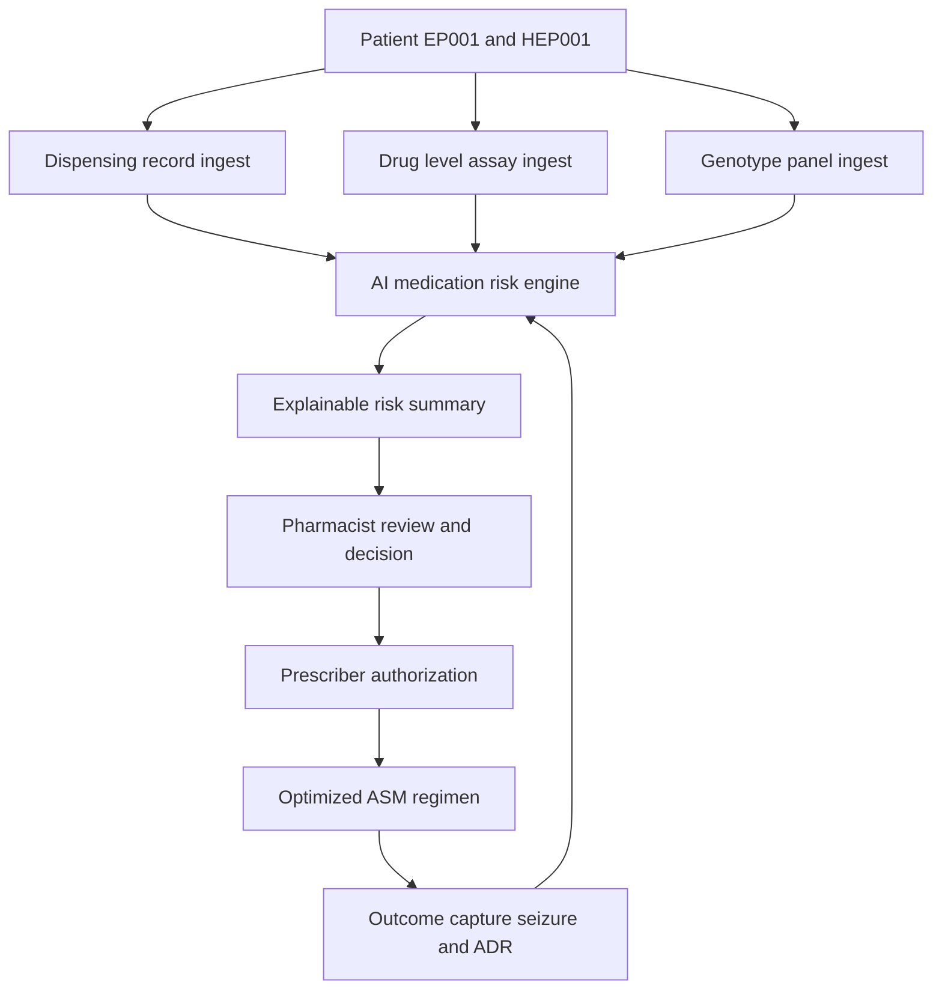
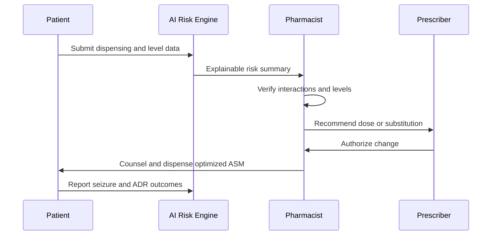
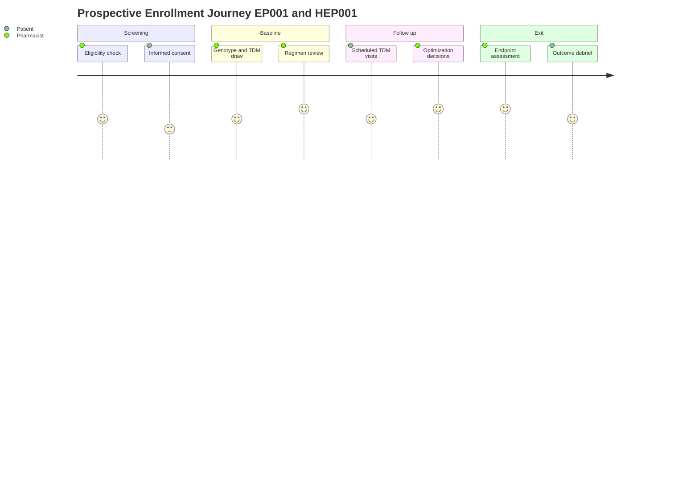
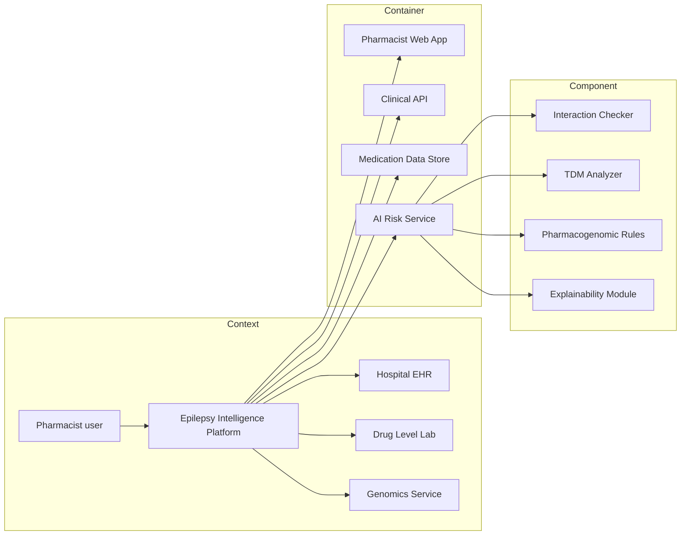

# Role Study - Pharmacist (Retrospective + Prospective)

> **Why (this doc):** The pharmacist is the medication-safety anchor of the Enterprise AI Platform for Explainable Multimodal Epilepsy Intelligence, governing antiseizure-medication (ASM) selection, drug-drug interactions, therapeutic drug monitoring (TDM), and pharmacogenomic tailoring for canonical epilepsy patients EP001 (29M focal, primary-assessment) and HEP001 (27F temporal-lobe). This dossier documents how pharmacist-owned data participates in BOTH a retrospective study (mining existing dispensing and drug-level records) and a prospective study (a forward-enrolled medication-optimization cohort), so a DBA committee can judge study-design rigor as well as clinical content.
> **How:** We follow a numbered research spine (Problem through Statistical Analysis), then role assessments/tasks, then two fully separated study designs plus a comparison matrix, five diagrams (flowchart, sequence, graph, journey, and a C4 model), KPI tables, a defense Q&A, and APA-7 references. AI functions strictly as explainable decision support; every dosing, substitution, and monitoring action is authorized by the licensed pharmacist and prescriber.

---

## 1. Problem
> **Why:** Frame the clinical and data gap that makes a pharmacist-centered study worth running. **How:** State the burden of suboptimal ASM management in one paragraph grounded in epilepsy care.

Roughly one in three people with epilepsy have drug-resistant seizures, yet a substantial share of poor outcomes trace not to true pharmacoresistance but to preventable medication problems: subtherapeutic or toxic drug levels, unrecognized enzyme-inducing interactions, non-adherence, and failure to act on high-risk pharmacogenomic variants (for example HLA-B*15:02 before carbamazepine). In current practice these signals are scattered across dispensing logs, assay results, and clinic notes, so the pharmacist cannot see a unified, explainable view of medication risk for EP001 or HEP001 in time to prevent harm.

## 2. Sub-Problems
> **Why:** Decompose the umbrella problem into researchable units the pharmacist actually owns. **How:** Enumerate discrete, measurable sub-problems as a captioned table.

*Caption - The five sub-problems that structure every downstream objective, hypothesis, and analysis in this dossier, each mapped to the pharmacist task that generates its data.*

| # | Sub-problem | Owning pharmacist task | Primary data signal |
|---|-------------|------------------------|---------------------|
| SP1 | ASM regimens are chosen without systematic level feedback | Therapeutic drug monitoring | Serum/plasma drug concentration |
| SP2 | Enzyme-inducing/inhibiting interactions go unflagged | Interaction review | Concomitant medication list |
| SP3 | High-risk HLA/CYP variants are not screened before dispensing | Pharmacogenomic review | Genotype panel result |
| SP4 | Non-adherence is detected late, after breakthrough seizures | ASM review + refill audit | Dispensing / refill gap |
| SP5 | Dose changes are not linked to seizure or adverse-event outcomes | Medication optimization | Seizure diary + ADR report |

## 3. Research Problem
> **Why:** Collapse the sub-problems into one precise, testable statement. **How:** One sentence naming exposure, outcome, and population.

Among adults with epilepsy managed on the platform, does pharmacist-led, AI-supported medication optimization (interaction screening, TDM-guided dosing, and pharmacogenomic tailoring) reduce the rate of medication-related adverse events and breakthrough seizures compared with standard ASM management?

## 4. Research Objective
> **Why:** Convert the research problem into concrete, measurable aims. **How:** List primary and secondary objectives in a captioned table.

*Caption - Objectives split into one confirmatory primary aim and three supporting secondary aims, each tied to a study arm that supplies its evidence.*

| Objective | Type | Measured by | Study supplying evidence |
|-----------|------|-------------|--------------------------|
| O1 Reduce medication-related adverse events | Primary | ADR incidence per 100 patient-months | Prospective cohort |
| O2 Quantify TDM level-to-outcome association | Secondary | Correlation of in-range levels vs seizure freedom | Retrospective + Prospective |
| O3 Characterize interaction burden historically | Secondary | Prevalence of clinically significant interactions | Retrospective |
| O4 Estimate pharmacogenomic screening yield | Secondary | % dispensings averted by pre-emptive genotyping | Retrospective + Prospective |

## 5. Flow
> **Why:** Show the end-to-end path from patient data to pharmacist decision so reviewers see where each study taps in. **How:** A Mermaid flowchart TD with plain ASCII labels.

**Reason:** The flowchart exists to prove that both study designs draw from one shared data pipeline rather than parallel silos. **Why:** A committee needs to see that retrospective mining (nodes B, C, D) and prospective follow-up (node J) feed the same explainable engine, guaranteeing comparable variables. **What is happening:** Three ingest streams converge on an AI risk engine that produces an explainable summary the pharmacist acts on, with outcomes looping back to refine future risk scoring. **How it is happening:** Each ingest node maps to a pharmacist task and a sub-problem, and the feedback arrow from J to E is what the prospective cohort measures over time. **Reference:** Topol (2019) frames this human-in-the-loop augmentation pattern for clinical AI.

## 6. Hypotheses
> **Why:** State falsifiable predictions the statistics will test. **How:** Present null and alternative hypotheses per objective in a captioned table.

*Caption - Paired null and alternative hypotheses; the primary hypothesis (H1) drives the prospective sample-size calculation.*

| ID | Null (H0) | Alternative (H1) |
|----|-----------|------------------|
| H1 | Pharmacist-led optimization does not change ADR rate | Optimization lowers ADR rate |
| H2 | In-range drug levels are unrelated to seizure freedom | In-range levels raise seizure-freedom odds |
| H3 | Interaction prevalence is equal across ASM classes | Enzyme-inducer classes show higher prevalence |
| H4 | Pre-emptive genotyping does not change dispensing | Genotyping averts high-risk dispensings |

## 7. Statistical Analysis
> **Why:** Pre-specify the tests so results cannot be reverse-engineered from the data. **How:** Map each hypothesis to an estimator, test, and confounding control.

*Caption - Analysis plan linking every hypothesis to a named statistical method and the covariates adjusted for, mirroring APA (2020) reporting standards.*

| Hypothesis | Estimator | Test / model | Adjusted covariates |
|-----------|-----------|--------------|---------------------|
| H1 | ADR rate ratio | Poisson / negative-binomial regression | Age, sex, ASM count, baseline seizure freq |
| H2 | Odds ratio | Mixed-effects logistic regression | Adherence, renal/hepatic function |
| H3 | Prevalence ratio | Chi-square then log-binomial | ASM class, polytherapy |
| H4 | Number needed to genotype | Descriptive + Fisher exact | Ancestry, drug indication |

**Reason:** Count outcomes (ADRs, seizures) violate normality, so Poisson/negative-binomial and logistic families are the defensible defaults. **Why:** Pre-registering covariates blocks post-hoc confounder fishing and lets a professor trace each p-value to a plan. **What is happening:** Each hypothesis is bound to one estimator and one model before data lock. **How it is happening:** Mixed-effects terms absorb repeated measures on EP001/HEP001 across visits, and log-binomial gives interpretable prevalence ratios rather than odds for common outcomes. **Reference:** American Psychological Association (2020) statistical-reporting guidance.

---

## 8. Role Assessments and Tasks
> **Why:** Define exactly what the pharmacist does before mapping it to studies. **How:** Tabulate each assessment with its trigger, instrument, and data output.

*Caption - The pharmacist's four core assessments, the cadence each runs on, and the structured data element it emits into the platform.*

| Assessment / task | Trigger | Instrument / method | Data output | Serves sub-problem |
|-------------------|---------|---------------------|-------------|--------------------|
| ASM review | New/changed regimen | Reconciliation checklist | Regimen record | SP4 |
| Interaction review | Any co-prescription | Interaction knowledge base + AI flag | Interaction alert | SP2 |
| Therapeutic drug monitoring | Steady state / breakthrough | Serum assay, trough timing | Level (mg/L) + in-range flag | SP1 |
| Pharmacogenomic review | Before high-risk ASM | HLA / CYP panel | Genotype + risk call | SP3 |
| Medication optimization | Poor control or ADR | Dose adjustment + counseling | Change log + outcome link | SP5 |

*Caption - Worked example applying the tasks to both canonical patients, showing role decisions are individualized.*

| Patient | ASM context | Pharmacist action | Rationale |
|---------|-------------|-------------------|-----------|
| EP001 (29M focal) | Levetiracetam monotherapy | TDM baseline + adherence counseling | Establish level-outcome anchor |
| HEP001 (27F temporal) | Carbamazepine considered | HLA-B*15:02 screen before dispense | Avert severe cutaneous reaction risk |

### 8.1 Role Sequence of Interaction
> **Why:** Show the ordered message exchange between pharmacist, AI, and prescriber. **How:** A Mermaid sequenceDiagram with ASCII labels.

**Reason:** Dosing safety depends on strict ordering of who proposes versus who authorizes. **Why:** The diagram documents that AI only summarizes and the pharmacist only recommends, while the prescriber holds authorization, satisfying the decision-support-only constraint. **What is happening:** Data flows patient to AI to pharmacist to prescriber and back to the patient, then outcomes return to AI. **How it is happening:** Each arrow is an auditable platform event with a timestamp and actor, so no autonomous AI dispensing can occur. **Reference:** Topol (2019) on augmented, human-authorized clinical AI.

---

## 9. RETROSPECTIVE STUDY Design (Pharmacist)
> **Why:** Extract causal-adjacent evidence cheaply from data that already exists. **How:** Specify source, design, sample, variables, analysis, and bias controls for dispensing and drug-level records.

*Caption - Full specification of the retrospective arm, which looks backward over existing dispensing and TDM records for EP001, HEP001, and their historical cohort.*

| Element | Specification |
|---------|---------------|
| Time direction | Backward (existing records) |
| Data source | Historical dispensing logs + drug-level assay archive + genotype results |
| Design | Retrospective cohort with nested case-control for ADR events |
| Sample | All epilepsy dispensings 2019 to 2025 (index patients EP001, HEP001) |
| Exposure | In-range vs out-of-range TDM level; presence of interaction |
| Outcome | Documented breakthrough seizure or ADR |
| Analysis | Negative-binomial (seizures), log-binomial (interaction prevalence) |
| Bias controls | New-user design, wash-out window, adjust for adherence proxy (refill gap), blinded outcome adjudication |

### 9.1 Retrospective Variable Map
> **Why:** Make every variable and its provenance explicit. **How:** Captioned table of variable, type, and source table.

*Caption - Variables abstracted from existing systems; note all are already recorded, so no new patient contact occurs.*

| Variable | Type | Source | Role |
|----------|------|--------|------|
| Drug level (mg/L) | Continuous | Assay archive | Exposure |
| In-range flag | Binary | Derived | Exposure |
| Interaction present | Binary | Dispensing log | Exposure |
| Refill gap days | Continuous | Pharmacy claims | Confounder (adherence) |
| Breakthrough seizure | Binary | Clinic note | Outcome |
| ADR event | Binary | Safety report | Outcome |

**Reason:** Retrospective validity hinges on knowing each field's provenance and its causal role. **Why:** Labeling refill gap as a confounder (not exposure) prevents adjustment bias and shows the reviewer we control for adherence. **What is happening:** Six pre-existing fields are classed as exposure, confounder, or outcome. **How it is happening:** Derived flags are computed deterministically from raw assay and claims data, keeping the abstraction reproducible. **Reference:** Sedgwick (2014) on retrospective cohort methodology.

## 10. PROSPECTIVE STUDY Design (Pharmacist)
> **Why:** Generate stronger causal evidence by defining exposure before outcomes occur. **How:** Specify forward enrollment, endpoints, follow-up schedule, and consent for the medication-optimization cohort.

*Caption - Full specification of the prospective arm, a forward-enrolled medication-optimization cohort followed for 12 months with scheduled TDM and outcome capture.*

| Element | Specification |
|---------|---------------|
| Time direction | Forward (enroll then follow) |
| Data source | Newly collected TDM, adherence, and outcome data |
| Design | Prospective single-arm optimization cohort (with historical comparator) |
| Enrollment | Consenting adults on ASM, including EP001 and HEP001 |
| Primary endpoint | ADR incidence per 100 patient-months at 12 months |
| Secondary endpoints | Seizure-freedom rate, % in-range levels, genotype-guided changes |
| Follow-up schedule | Baseline, week 2, month 1, 3, 6, 12 |
| Consent | Written informed consent + genomic data addendum |

### 10.1 Prospective Follow-up Schedule
> **Why:** Fix the visit timing so exposure and outcome windows are unambiguous. **How:** Captioned table of visit, assessments, and data captured.

*Caption - The six-visit follow-up calendar; TDM is drawn at trough at every level-collecting visit to standardize the exposure measure.*

| Visit | Timing | Pharmacist assessment | Data captured |
|-------|--------|-----------------------|---------------|
| V0 | Baseline | Full review + genotype | Regimen, genotype, baseline level |
| V1 | Week 2 | Early-tolerability check | ADR, adherence |
| V2 | Month 1 | TDM | Trough level, seizure diary |
| V3 | Month 3 | TDM + optimization | Level, dose change, ADR |
| V4 | Month 6 | TDM + optimization | Level, seizure freedom |
| V5 | Month 12 | Endpoint assessment | Primary + secondary endpoints |

**Reason:** Prospective causal strength comes from measuring exposure before the outcome and at fixed intervals. **Why:** A pre-declared schedule prevents outcome-driven measurement timing, a key advantage over the retrospective arm. **What is happening:** Six visits escalate from tolerability to endpoint capture. **How it is happening:** Trough-standardized TDM at V2 to V4 makes levels comparable across patients and time. **Reference:** Euser et al. (2009) on cohort study design.

### 10.2 Prospective Consent and Enrollment Journey
> **Why:** Document the participant experience and ethical touchpoints. **How:** A Mermaid journey diagram of the enrollment path.

**Reason:** Ethics review demands a transparent, staged consent-to-exit path. **Why:** The journey shows consent precedes any genomic draw, protecting participant autonomy. **What is happening:** Four stages carry the patient from screening through exit with satisfaction scores. **How it is happening:** Each step names the responsible actor, and consent gates all data collection. **Reference:** American Psychological Association (2020) ethical reporting standards.

## 11. RETROSPECTIVE vs PROSPECTIVE MATRIX (Pharmacist)
> **Why:** Let the committee compare the two designs on the axes that decide which to trust. **How:** One captioned matrix with the mandated rows.

*Caption - Head-to-head comparison of the pharmacist's two study arms across time direction, data source, cost, bias, causal strength, ethics, and best use.*

| Dimension | Retrospective | Prospective |
|-----------|---------------|-------------|
| Time direction | Backward from existing records | Forward from enrollment |
| Data source | Dispensing + drug-level archive | Newly collected cohort data |
| Cost | Low (data exists) | High (visits, assays, staff) |
| Bias risk | Higher (recall, selection, missing data) | Lower (protocol-standardized) |
| Causal strength | Associational, hypothesis-generating | Stronger temporal/causal inference |
| Ethics / consent | Waiver / de-identified use | Full informed + genomic consent |
| Best use | Rapid prevalence + signal detection | Confirming optimization effect |

**Reason:** The two designs trade cost against causal strength, and the matrix makes that trade explicit. **Why:** A professor will ask why both are needed; the matrix answers by showing complementary strengths. **What is happening:** Retrospective is cheap and fast but bias-prone; prospective is costly but causally sound. **How it is happening:** Retrospective mines what exists to generate hypotheses (H2 to H4), which the prospective cohort then confirms (H1). **Reference:** Song and Chung (2010) on retrospective versus prospective study selection.

## 12. Role KPIs
> **Why:** Define how pharmacist performance and study progress are measured. **How:** Captioned table of KPI, definition, and target.

*Caption - Pharmacist key performance indicators spanning safety, monitoring quality, and study conduct, with committee-agreed targets.*

| KPI | Definition | Target |
|-----|------------|--------|
| Interaction catch rate | % significant interactions flagged before dispense | >= 95% |
| TDM in-range rate | % levels within therapeutic window | >= 80% |
| Genotype-before-dispense rate | % high-risk ASMs genotyped first | 100% |
| ADR incidence | ADR events per 100 patient-months | Downward trend |
| Follow-up retention | % prospective visits completed | >= 90% |

**Reason:** KPIs convert the study objectives into monitorable operational metrics. **Why:** A 100% genotype-before-dispense target operationalizes the safety rule for HLA-B*15:02 in HEP001. **What is happening:** Five KPIs cover safety, quality, and retention. **How it is happening:** Each KPI reads directly from platform event logs, enabling near-real-time dashboards. **Reference:** Topol (2019) on measurable augmented-care quality.

## 13. Platform Interaction Model (C4)
> **Why:** Show how the pharmacist role sits inside the platform's system architecture. **How:** A Mermaid graph rendering C4 Context, Container, and Component layers with ASCII labels.

**Reason:** A C4 model tells reviewers exactly which systems the pharmacist touches and where AI logic lives. **Why:** Separating the Explainability Module as its own component proves decision-support transparency is architected, not bolted on. **What is happening:** The pharmacist uses a web app that calls a clinical API over a medication store and an AI risk service composed of four named components. **How it is happening:** External EHR, lab, and genomics feeds enter at the context layer and are processed by the interaction, TDM, and pharmacogenomic components before the explainability module renders human-readable rationale. **Reference:** Topol (2019) on transparent clinical decision-support architecture.

---

## 14. Professor Readiness (Defense Q&A)
> **Why:** Rehearse the examiner's hardest questions before the viva. **How:** Five question-answer pairs covering design justification and bias.

**Q1. Why run both a retrospective and a prospective study for the pharmacist role?**
They are complementary. The retrospective arm mines existing dispensing and drug-level records cheaply to estimate interaction prevalence and generate hypotheses (H2 to H4). The prospective medication-optimization cohort then tests the primary causal hypothesis (H1) with pre-declared exposure timing. One is fast and hypothesis-generating; the other is rigorous and confirmatory. Neither alone satisfies a DBA committee demanding both feasibility and causal strength.

**Q2. How do you handle selection and recall bias?**
Retrospectively, selection bias is limited by a new-user design and by including the full 2019 to 2025 dispensing population rather than a convenience subset; recall bias is minimized because exposures (drug levels, dispensings) are objective machine records, not patient memory. Prospectively, standardized visit protocols and trough-timed assays remove differential measurement, and blinded outcome adjudication reduces detection bias.

**Q3. What are your main confounders and how are they controlled?**
Adherence is the dominant confounder: a patient who takes medication reliably has both better levels and fewer seizures. We proxy it with refill-gap days and adjust for it in every model. Renal/hepatic function, ASM count, age, and sex are also pre-specified covariates. The prospective arm additionally controls confounding by design through fixed follow-up and within-patient repeated measures.

**Q4. When would you prefer the retrospective design over the prospective one?**
When the question is descriptive or urgent and low-cost evidence suffices, for example estimating how common enzyme-inducer interactions are before investing in a trial, or when the outcome is rare and a cohort would take years. The retrospective arm is the right first move for signal detection; escalate to prospective only once a signal justifies the cost and consent burden.

**Q5. Where is AI's boundary in your design?**
AI is decision support only. The AI risk service ranks interactions, analyzes TDM trends, and applies pharmacogenomic rules, but always through the explainability module so the pharmacist sees the rationale. The pharmacist verifies and recommends; the prescriber authorizes. No dose change or dispense occurs on AI action alone, consistent with augmented-intelligence principles.

---

## 15. References
> **Why:** Provide verifiable scholarly grounding in APA 7th style. **How:** Alphabetized reference list mixing study-design and epilepsy/AI sources.

American Psychological Association. (2020). *Publication manual of the American Psychological Association* (7th ed.). https://doi.org/10.1037/0000165-000

Euser, A. M., Zoccali, C., Jager, K. J., & Dekker, F. W. (2009). Cohort studies: Prospective versus retrospective. *Nephron Clinical Practice, 113*(3), c214-c217. https://doi.org/10.1159/000235241

Fisher, R. S., Cross, J. H., French, J. A., Higurashi, N., Hirsch, E., Jansen, F. E., Lagae, L., Moshe, S. L., Peltola, J., Roulet Perez, E., Scheffer, I. E., & Zuberi, S. M. (2017). Operational classification of seizure types by the International League Against Epilepsy. *Epilepsia, 58*(4), 522-530. https://doi.org/10.1111/epi.13670

Sedgwick, P. (2014). Retrospective cohort studies: Advantages and disadvantages. *BMJ, 348*, g1072. https://doi.org/10.1136/bmj.g1072

Song, J. W., & Chung, K. C. (2010). Observational studies: Cohort and case-control studies. *Plastic and Reconstructive Surgery, 126*(6), 2234-2242. https://doi.org/10.1097/PRS.0b013e3181f44abc

Topol, E. J. (2019). High-performance medicine: The convergence of human and artificial intelligence. *Nature Medicine, 25*(1), 44-56. https://doi.org/10.1038/s41591-018-0300-7
