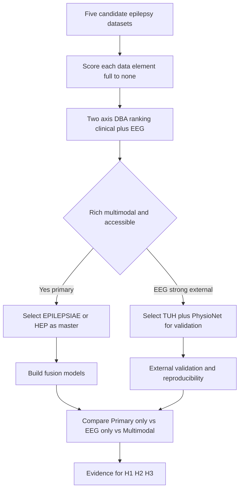
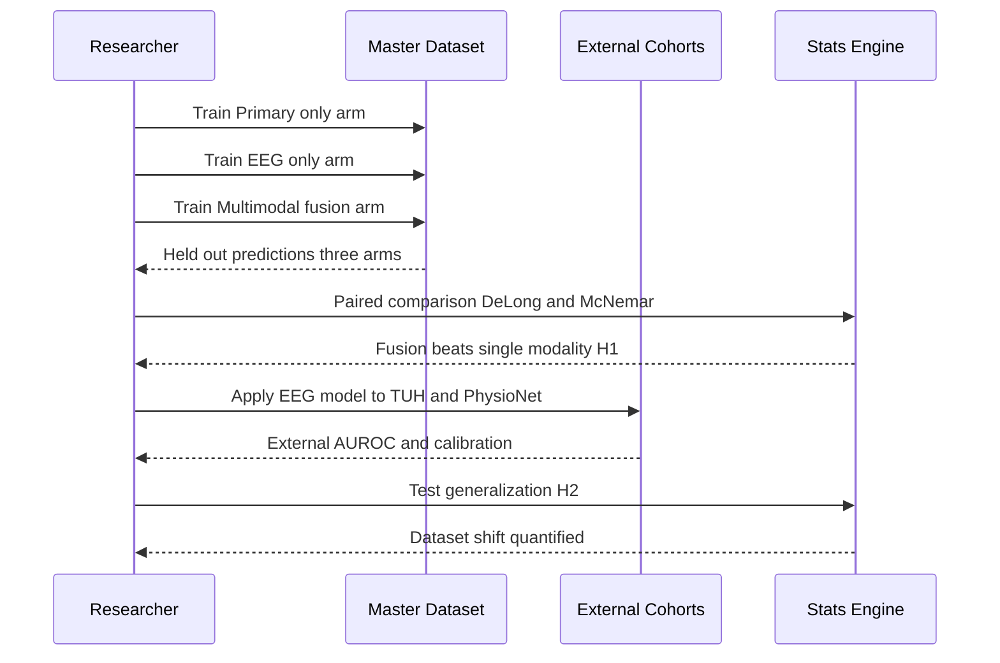
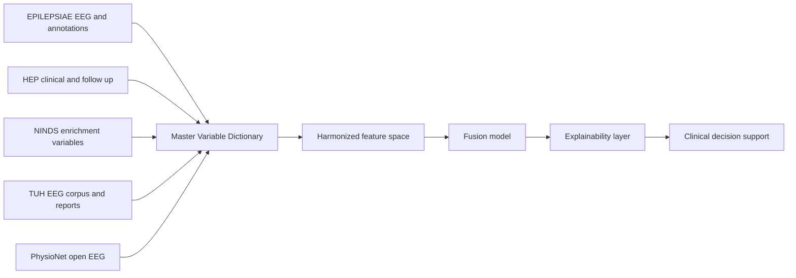
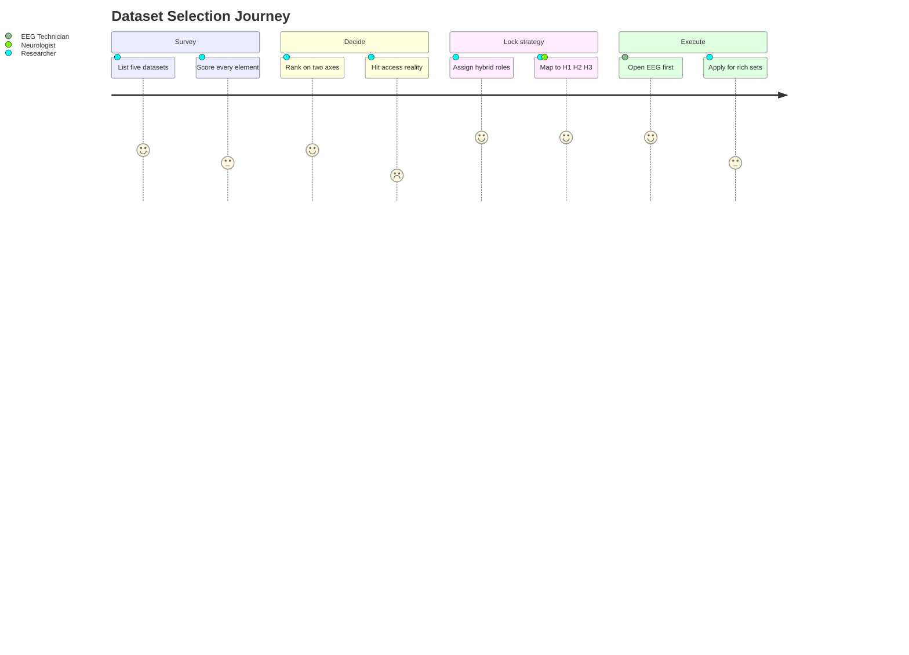

# Cross-Dataset Comparison Matrix & DBA Selection Strategy

> **Why (this doc):** Give the dissertation one defensible, side-by-side view of the five
> candidate epilepsy source datasets — EPILEPSIAE, HEP, NINDS, TUH, and PhysioNet — so the
> choice of a *primary multimodal* source plus *external EEG validation* sources is evidence-based,
> not arbitrary. AI is decision support only; every dataset selection remains a human
> (Neurologist / EEG Technician / doctoral researcher) decision.
> **How:** Score each dataset element-by-element (full / some / limited / rare / none), rank
> them on a two-axis DBA fitness scale, overlay real-world access feasibility, and lock the
> hybrid strategy that maps directly to hypotheses H1/H2/H3. Scale is described qualitatively;
> exact patient counts are flagged where uncertain.

---

## 1. Problem

> **Why:** Name the core research problem this matrix must serve. **How:** State it as a single
> sentence with the constraint that forces a multi-dataset design.

No single publicly documented epilepsy dataset simultaneously offers rich **primary clinical
assessment** (Neurologist history, questionnaires, medication, quality of life) *and*
large-scale **secondary EEG signal** data (EDF, annotations, video-EEG) *and* **open access** —
so an explainable multimodal platform cannot be built or validated on one source alone.

*Caption - The three-way tension (clinical depth vs signal scale vs access) that makes a single-dataset design impossible.*

| Constraint | What it demands | Why one dataset rarely satisfies it |
|---|---|---|
| Clinical depth | Longitudinal primary data, outcomes | EEG corpora are signal-first, clinically thin |
| Signal scale | Thousands of annotated EEG hours | Deep clinical cohorts are EEG-limited |
| Access | Reproducible, shareable | The richest sets are controlled or paid |

## 2. Sub-Problems

> **Why:** Decompose the problem into researchable parts. **How:** List each sub-problem with the
> dataset property it interrogates.

*Caption - Four sub-problems, each answered by a specific column of the comparison matrix.*

| # | Sub-problem | Matrix property that answers it |
|---|---|---|
| SP1 | Which dataset carries the richest *primary* clinical + multimodal record? | Clinical/multimodal element coverage |
| SP2 | Which datasets carry the strongest *secondary* EEG signal for model validation? | EEG / Video-EEG / EDF / annotation coverage |
| SP3 | Which datasets are *actually obtainable* within a doctoral timeline? | Access-feasibility overlay |
| SP4 | How do we prove *fusion adds value* over any single modality? | Primary-only vs EEG-only vs Multimodal design |

## 3. Research Problem

> **Why:** Convert the problem into a formal research statement. **How:** Frame as a selection-and-validation question.

Given no single-dataset solution exists, **which combination** of EPILEPSIAE, HEP, NINDS, TUH,
and PhysioNet — under honest access constraints — maximizes multimodal richness for model
*development* while preserving independent, reproducible EEG cohorts for external *validation*,
such that the explainability and fusion claims of the platform are defensible to an examiner?

## 4. Research Objective

> **Why:** State the measurable objective this chapter delivers. **How:** Tie the objective to a concrete artifact (the matrix + strategy).

*Caption - The objective decomposed into deliverables produced in this chapter.*

| Objective | Deliverable in this chapter |
|---|---|
| O1 Compare all five datasets per data element | Full comparison matrix (Section 8) |
| O2 Rank datasets for DBA fitness | Two-axis ranking table (Section 9) |
| O3 Fix a defensible hybrid design | Hybrid strategy + fusion design (Section 10) |
| O4 Be honest about obtainability | Access-feasibility overlay + Access & Ethics (Sections 11-12) |

## 5. Flow

> **Why:** Show the end-to-end selection logic before the tables. **How:** A flowchart TD from problem to locked strategy.

## 6. Hypotheses

> **Why:** State the falsifiable claims the dataset strategy must be able to test. **How:** Three hypotheses tied to the three-arm fusion comparison.

*Caption - The hypotheses; the hybrid design exists specifically to test H1-H3.*

| ID | Hypothesis | Tested by |
|---|---|---|
| H1 | A multimodal fusion model outperforms any single-modality model in diagnostic/prognostic accuracy | Primary-only vs EEG-only vs Multimodal on EPILEPSIAE/HEP |
| H2 | Fusion-model performance generalizes to independent EEG cohorts (limited dataset-shift degradation) | External validation on TUH + PhysioNet |
| H3 | Explanations (feature attributions) are clinically coherent and stable across datasets | XAI agreement across master vs external cohorts |

## 7. Statistical Analysis

> **Why:** Pre-commit the statistics so the fusion claim is not post-hoc. **How:** Map each hypothesis to a test and metric.

*Caption - Analysis plan; metrics reported with 95% confidence intervals and multiplicity control.*

| Hypothesis | Design | Primary test | Key metric |
|---|---|---|---|
| H1 | Paired 3-arm comparison, same patients | DeLong test on AUROC; McNemar on decisions | ΔAUROC, sensitivity/specificity |
| H2 | Train master → test external | External AUROC vs internal; calibration | AUROC drop, Brier, ECE |
| H3 | Cross-dataset attribution overlap | Rank correlation / Jaccard of top features | SHAP concordance, stability |

---

## 8. Full Cross-Dataset Comparison Matrix

> **Why:** This is the core evidence table — every data element the platform needs, scored across all five datasets. **How:** Rate coverage full / some / limited / rare / none from public documentation; qualitative where counts are uncertain.

*Caption - Element-by-element coverage. Legend: full = routinely and richly present; some = present but partial; limited = sparse/inconsistent; rare = occasional; none = not part of the dataset. EPILEPSIAE and HEP are the clinically rich master candidates; TUH and PhysioNet are EEG-signal-first.*

| Data element | EPILEPSIAE | HEP | NINDS | TUH | PhysioNet |
|---|---|---|---|---|---|
| Age | full | full | full | some | limited |
| Gender | full | full | full | some | limited |
| Symptoms / semiology | some | full | full | limited | rare |
| Neurologist assessment | some | full | full | limited (report text) | none |
| Medication | some | full | full | limited | none |
| Seizure history | full | full | full | some | limited |
| Family history | limited | full | some | rare | none |
| MRI / imaging | some | full | some | rare | none |
| Quality of life | rare | full | some | none | none |
| Depression / anxiety | rare | full | some | none | none |
| EEG (scalp/intracranial) | full | full | some | full | full |
| Video-EEG | full | some | limited | some | rare |
| EDF files | full | some | limited | full | full |
| EEG reports | some | full | some | full | rare |
| Seizure annotations | full | some | limited | full | full |
| Longitudinal follow-up | some | full | some | limited | none |

*Caption - Roll-up per dataset: where each is strong vs thin, for the Neurologist (primary/clinical) and EEG Technician (signal) roles.*

| Dataset | Clinical strength (Neurologist) | Signal strength (EEG Technician) | Thin areas |
|---|---|---|---|
| EPILEPSIAE | Seizure history, moderate clinical | EEG, video-EEG, EDF, annotations — all full | QoL, mood, family history |
| HEP | Full clinical, QoL, mood, follow-up | EEG present; annotation/EDF less signal-corpus-grade | Large-scale raw EEG corpus |
| NINDS | Broad clinical/multimodal, variable | Some EEG, imaging | Consistent EEG corpus, annotations |
| TUH | Report text only | Very large EEG corpus, EDF, annotations | Structured clinical, QoL, mood |
| PhysioNet | Minimal | Open EEG, EDF, annotations | Essentially all clinical modalities |

## 9. DBA Fitness Ranking

> **Why:** Turn the matrix into a single ranked decision. **How:** Score each on two 0-5 axes — Clinical/Multimodal richness and EEG signal value — sum, then rank; add the Best-Use verdict.

*Caption - The headline ranking. Axis A = clinical/multimodal richness (Neurologist primary data); Axis B = EEG signal value (EEG Technician secondary data). Sum drives rank; Best-Use fixes the role each plays in the hybrid design.*

| Rank | Dataset | Clinical/Multimodal (A, 0-5) | EEG Signal (B, 0-5) | Total | Best-Use |
|---|---|---|---|---|---|
| 1 | EPILEPSIAE | 5 | 5 | 10 | Primary multimodal + EEG master (secondary EEG backbone) |
| 2 | HEP | 5 | 5 | 10 | Primary clinical/longitudinal master (fusion development) |
| 3 | NINDS | 4 | 4 | 8 | Enrichment — extra clinical/multimodal variables |
| 4 | TUH | 2 | 5 | 7 | External validation of EEG models at scale |
| 5 | PhysioNet | 2 | 4 | 6 | Open reproducibility of EEG pipeline (Siena/CHB-MIT) |

*Caption - Why the two co-leaders (EPILEPSIAE, HEP) are complementary rather than redundant — one is EEG-signal-led, the other clinically-led.*

| Co-leader | Leads on | Complements the other by |
|---|---|---|
| EPILEPSIAE | EEG signal, annotations, video-EEG | Supplying the signal backbone HEP lacks at corpus scale |
| HEP | Clinical depth, QoL, mood, follow-up | Supplying the outcomes/questionnaires EPILEPSIAE lacks |

## 10. Hybrid Dataset Strategy

> **Why:** State the locked design that satisfies richness, validation, and reproducibility at once. **How:** Assign each dataset a role, then run the three-arm fusion comparison that tests H1-H3.

*Caption - Role assignment. One primary multimodal master for development; independent EEG cohorts for external validation and open reproducibility; NINDS as optional enrichment.*

| Role | Dataset(s) | Purpose | Maps to |
|---|---|---|---|
| Primary multimodal master | EPILEPSIAE **or** HEP | Develop and train fusion models on linked patient + EEG | H1 |
| External EEG validation | TUH + PhysioNet | Test EEG-model generalization on unseen cohorts | H2 |
| Open reproducibility | PhysioNet (Siena, CHB-MIT) | Anyone can rerun the EEG pipeline without a DUA | H2/H3 |
| Enrichment (optional) | NINDS | Add clinical/multimodal variables where gaps remain | H1 |

### 10.1 Three-Arm Fusion Comparison

> **Why:** This is the experiment that proves fusion value — the heart of the dissertation. **How:** Same patients, three model arms, paired statistics.

*Caption - The three arms; each uses the same patients on the master dataset so differences isolate the effect of modality fusion.*

| Arm | Inputs | Represents | Expected under H1 |
|---|---|---|---|
| Primary-only | Clinical/assessment features (Neurologist) | Traditional clinical model | Baseline |
| EEG-only | EEG signal features (EEG Technician) | Signal-only model | Baseline |
| Multimodal | Primary + EEG fused | Platform proposition | Best — beats both baselines |

### 10.2 Variable Mapping into the Master Dictionary

> **Why:** Show the hybrid only works because elements align to one unified dictionary. **How:** graph LR from each dataset's variables into the shared master schema.

*Caption - Integration view. Heterogeneous fields from all five datasets are harmonized into the unified variable dictionary that EPILEPSIAE and HEP already anchor.*

*Caption - One representative variable-mapping row, showing how a single conceptual variable is expressed across datasets and normalized into the master dictionary.*

| Master variable | EPILEPSIAE | HEP | NINDS | TUH | PhysioNet | Unified type |
|---|---|---|---|---|---|---|
| seizure_type | Annotation label | ILAE 2017 classified field | Diagnosis field | Report free-text | Event label | Categorical (ILAE 2017) |
| eeg_edf | Full EDF | Partial EDF | Limited | Full EDF | Full EDF | Signal blob + metadata |
| age_years | Present | Present | Present | Some | Limited | Integer years |
| medication | Some | Full list | Full | Report text | None | Coded drug list |

## 11. Access-Feasibility Overlay

> **Why:** A high score is useless if the data cannot be obtained in time — be honest. **How:** Overlay obtainability and effort onto the ranking; flag paid/controlled vs open.

*Caption - Honest access reality. This overlay is why the #4/#5 ranked EEG sets (TUH, PhysioNet) do real work early, while the #1/#2 rich sets require parallel applications.*

| Dataset | Access model | Cost | Effort / timeline | Feasibility |
|---|---|---|---|---|
| EPILEPSIAE | Controlled license (Univ. Freiburg consortium) | Paid / fee-based | Application + agreement, weeks-months | Low-moderate |
| HEP | Controlled / collaborative data-sharing request | Typically no fee, governed | Application + approval, weeks-months | Moderate |
| NINDS | Repository application (e.g., BioSEND) + DUA | Usually no fee | Application + DUA, weeks | Moderate |
| TUH EEG Corpus | Free registration + signed DUA | Free | Days | High |
| PhysioNet (Siena, CHB-MIT) | Open / light credentialing | Free | Immediate to days | Highest |

*Caption - Resulting sequencing decision — start where access is instant, apply for the rich sets in parallel.*

| Phase | Action | Datasets |
|---|---|---|
| Now | Build/validate EEG pipeline immediately | PhysioNet, then TUH |
| In parallel | Submit access applications | EPILEPSIAE, HEP, NINDS |
| On approval | Run full multimodal fusion (H1) | EPILEPSIAE or HEP |
| Throughout | External validation + reproducibility (H2/H3) | TUH, PhysioNet |

## 12. Access & Ethics

> **Why:** Doctoral and IRB scrutiny require explicit consent, de-identification, and obtain-path per dataset. **How:** Tabulate how to obtain, consent basis, and de-identification for each.

*Caption - Ethics and provenance per dataset; all are de-identified secondary use, but governance strength differs. AI outputs are decision support only and never override the Neurologist.*

| Dataset | How to obtain | Consent basis | De-identification |
|---|---|---|---|
| EPILEPSIAE | Licensed request to consortium | Original clinical-research consent | De-identified, controlled release |
| HEP | Data-sharing application to study group | Prospective research consent | De-identified, governed access |
| NINDS | Repository portal + DUA | Contributing-study consent | De-identified per NINDS standards |
| TUH | Register + sign DUA (Temple) | Clinical data, de-identified corpus | De-identified EEG + reports |
| PhysioNet | Download (open/credentialed) | PhysioNet-governed release | De-identified per PhysioNet policy |

---

## 13. Journey — From Candidate Datasets to Defensible Strategy

> **Why:** Show the researcher experience/confidence across the selection journey. **How:** A Mermaid journey diagram scoring each step.

*Caption - The doctoral researcher's journey; confidence dips at access barriers and rises once the hybrid design locks.*

---

## Professor Readiness (Defense Q&A)

> **Why:** Pre-empt the examiner's hardest questions on dataset choice and generalizability. **How:** Five likely questions with concise, defensible answers.

### Q1. Why not just use one dataset and avoid harmonization headaches?

> **Why:** Tests whether the multi-dataset design is necessary or convenient. **How:** Point to the matrix gaps.

No single dataset scores full on both clinical richness and EEG signal *and* is openly accessible
(Section 8). EPILEPSIAE and HEP lead but are controlled/paid; TUH and PhysioNet are EEG-strong
but clinically thin. The hybrid design is a necessity forced by the data, and harmonization is
handled by the unified master variable dictionary (Section 10.2).

### Q2. How do you defend external validity and dataset shift?

> **Why:** Core generalizability challenge. **How:** Cite the train-master / test-external design and shift metrics.

H2 is tested explicitly: EEG models trained on the master (EPILEPSIAE/HEP) are applied to
independent TUH and PhysioNet cohorts recorded on different hardware, populations, and montages.
We report the AUROC drop, recalibration (Brier, ECE), and treat any degradation as a measured
dataset-shift quantity — not a hidden assumption.

### Q3. Isn't the fusion advantage just from more features, not true multimodality?

> **Why:** Guards against a confounded H1. **How:** Explain the paired same-patient three-arm design.

The three arms (Primary-only, EEG-only, Multimodal) use the **same patients** on the same master
dataset (Section 10.1). Paired DeLong/McNemar tests isolate the effect of *combining* modalities;
a gain over both single-modality baselines cannot be explained by cohort differences.

### Q4. EPILEPSIAE is paid and HEP is controlled — what if you cannot get either in time?

> **Why:** Probes feasibility risk. **How:** Point to the sequencing and fallbacks.

The access overlay (Section 11) front-loads the freely obtainable EEG sets (PhysioNet, then TUH)
so the EEG pipeline, external validation (H2), and reproducibility (H3) proceed regardless. Rich
applications run in parallel; NINDS is an alternative multimodal source, and if neither co-leader
arrives, the fusion claim is scoped to the best obtainable multimodal set with that limitation
stated honestly.

### Q5. How do you keep this ethical and clinician-led?

> **Why:** IRB/role-integrity check. **How:** Cite de-identification, consent, and decision-support-only stance.

Every dataset is de-identified secondary data under its own consent and DUA (Section 12). The AI
is decision support only: the Neurologist owns diagnosis and the EEG Technician owns signal
quality; model outputs and explanations inform but never replace those human decisions.

---

## References

American Psychological Association. (2020). *Publication manual of the American Psychological
Association* (7th ed.). https://doi.org/10.1037/0000165-000

Fisher, R. S., Cross, J. H., French, J. A., Higurashi, N., Hirsch, E., Jansen, F. E., Lagae, L.,
Moshé, S. L., Peltola, J., Roulet Perez, E., Scheffer, I. E., & Zuberi, S. M. (2017). Operational
classification of seizure types by the International League Against Epilepsy. *Epilepsia, 58*(4),
522–530. https://doi.org/10.1111/epi.13670

Goldberger, A. L., Amaral, L. A. N., Glass, L., Hausdorff, J. M., Ivanov, P. C., Mark, R. G.,
Mietus, J. E., Moody, G. B., Peng, C.-K., & Stanley, H. E. (2000). PhysioBank, PhysioToolkit, and
PhysioNet: Components of a new research resource for complex physiologic signals. *Circulation,
101*(23), e215–e220. https://doi.org/10.1161/01.CIR.101.23.e215

Ihle, M., Feldwisch-Drentrup, H., Teixeira, C. A., Witon, A., Schelter, B., Timmer, J., &
Schulze-Bonhage, A. (2012). EPILEPSIAE — A European epilepsy database. *Computer Methods and
Programs in Biomedicine, 106*(3), 127–138. https://doi.org/10.1016/j.cmpb.2010.08.011

Obeid, I., & Picone, J. (2016). The Temple University Hospital EEG data corpus. *Frontiers in
Neuroscience, 10*, 196. https://doi.org/10.3389/fnins.2016.00196

The Human Epilepsy Project. (n.d.). *Human Epilepsy Project (HEP): A prospective study of newly
diagnosed focal epilepsy.* Retrieved from the study consortium data-sharing program.

Topol, E. J. (2019). High-performance medicine: The convergence of human and artificial
intelligence. *Nature Medicine, 25*(1), 44–56. https://doi.org/10.1038/s41591-018-0300-7
