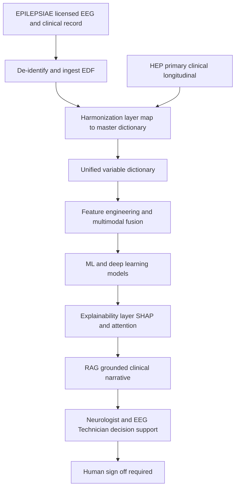
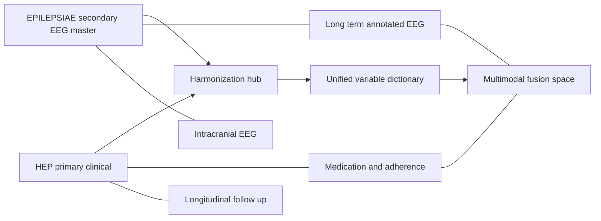
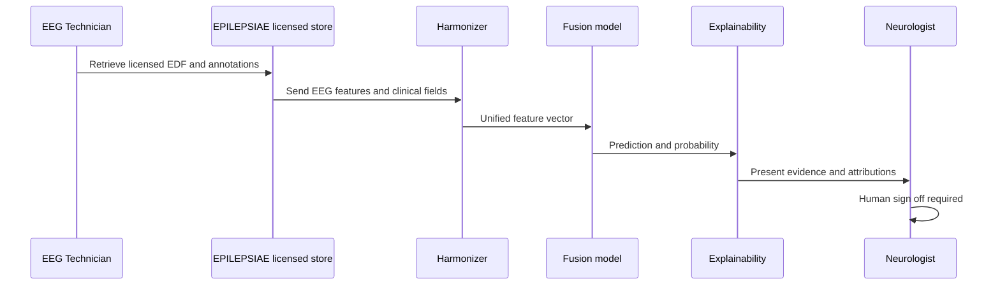
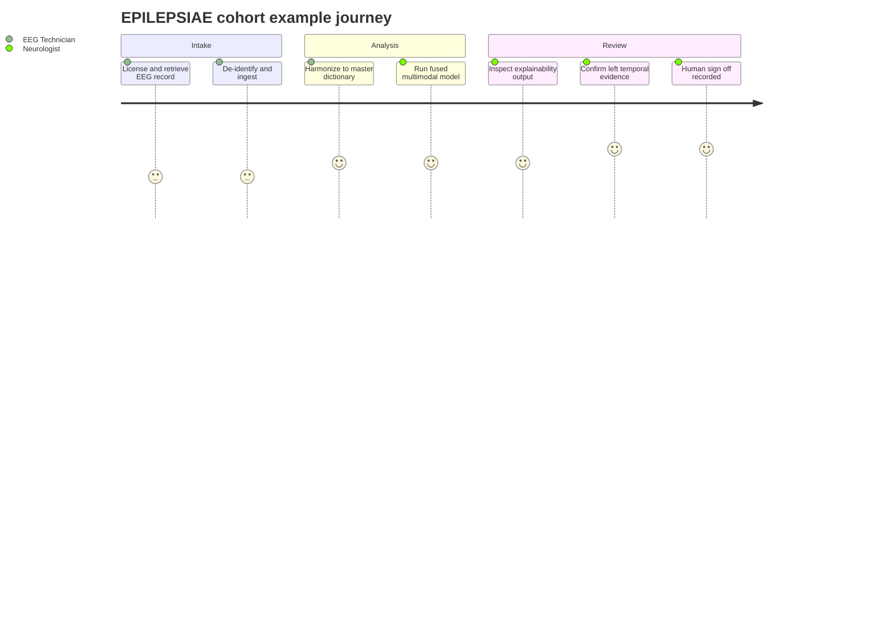

# Dataset 1 - EPILEPSIAE (Best Overall - Primary+Secondary Master)

> **Why (this doc):** EPILEPSIAE is the EEG-signal-rich master reference for the Enterprise AI Platform for Explainable Multimodal Epilepsy Intelligence. This dossier profiles the dataset honestly - what it truly contains, at what scale, and under what access terms - and shows exactly how its variables map into the master cross-dataset framework and unified variable dictionary alongside HEP (Dataset 2), so Neurologists and EEG Technicians can trust it as the secondary EEG master and best overall multimodal source.
> **How:** The document opens with the numbered research spine (Problem through Statistical Analysis), then presents the dataset profile, primary and secondary data inventories, a variable-mapping row into EPILEPSIAE/HEP/master, the dataset's role, and an access and ethics table - each as a captioned Markdown table with all four Mermaid diagrams. Everything is anchored to a clearly labelled EPILEPSIAE cohort example (28-year-old female, temporal lobe epilepsy) that is explicitly NOT the platform canonical patient EP001. Scale is described qualitatively where exact public counts are uncertain, and AI is framed strictly as decision support with human sign-off.

---

## 1. Problem

> **Why:** Frame the clinical and data gap that a secondary EEG master must fill. **How:** State the signal-scarcity and reproducibility problem in one grounded paragraph.

Epilepsy care and epilepsy AI both depend on high-quality, long-duration, annotated EEG, yet such data is scarce, fragmented, and rarely paired with structured clinical context. Most open corpora offer short routine EEG or lack expert seizure annotations, so models trained on them fail to generalize to the continuous, multi-day recordings that real seizure detection and forecasting require. Primary clinical datasets such as HEP capture deep longitudinal and medication trajectories but comparatively coarse continuous EEG. The platform therefore needs a secondary EEG master that supplies long-term, expertly annotated scalp and intracranial EEG with enough linked clinical detail to serve as the electrophysiological ground truth and to anchor cross-dataset harmonization.

## 2. Sub-Problems

> **Why:** Decompose the master-reference problem into tractable pieces. **How:** Enumerate discrete gaps EPILEPSIAE is asked to close.

- Signal depth: sourcing long-term (multi-day) continuous EEG with ictal and interictal coverage rather than short routine clips.
- Annotation quality: obtaining expert seizure onset/offset markers and event labels suitable as ground truth.
- Multimodality: pairing raw EEG with clinical variables (diagnosis, syndrome, medication, imaging) for fusion.
- Harmonization: aligning EPILEPSIAE fields, units, and montages to the master dictionary and to HEP.
- Access and ethics: honestly characterizing a controlled, licensed dataset so reproducibility and governance claims hold.

## 3. Research Problem

> **Why:** Compress the sub-problems into one falsifiable statement. **How:** Name the dataset, its role, and the decision-support constraint in one sentence.

Can EPILEPSIAE serve as the secondary EEG master and best-overall multimodal source - supplying long-term annotated EEG and linked clinical variables that harmonize with HEP into a unified dictionary - so that an explainable multimodal AI platform improves seizure and localization decision support for clinicians without ever acting autonomously?

## 4. Research Objective

> **Why:** Convert the problem into measurable deliverables. **How:** List objectives tied to acceptance criteria.

*Caption - This table binds each objective for the EPILEPSIAE dossier to a concrete, checkable acceptance criterion so examiners judge completion rather than intent.*

| Obj | Objective | Acceptance criterion |
|-----|-----------|----------------------|
| O1 | Profile EPILEPSIAE accurately | Patients, EEG type, sampling, montage, clinical variables, follow-up, and access all documented with uncertainty flagged |
| O2 | Inventory primary and secondary data | Every listed field placed in a captioned table with an EPILEPSIAE-cohort example |
| O3 | Map EPILEPSIAE into the master framework | Each core variable aligned to EPILEPSIAE, HEP, and the master dictionary or flagged as gap |
| O4 | Declare the dataset role | Master vs external validation vs reproducibility vs enrichment stated with justification |
| O5 | State access and ethics honestly | Obtain path, consent, and de-identification documented; access class named as controlled/paid |

## 5. Flow

> **Why:** Give a visual map of how EPILEPSIAE data reaches explainable decision support. **How:** A Mermaid flowchart with ASCII-only node labels.

*Caption - The flowchart traces one EPILEPSIAE record from licensed acquisition through harmonization and fusion to clinician-reviewed output, showing where the secondary EEG master joins the primary HEP stream.*

## 6. Hypotheses

> **Why:** State testable predictions with directionality. **How:** Null and alternative pairs for the key EPILEPSIAE claims.

*Caption - Formal hypotheses make the master-reference claims falsifiable; each pairs a null with a directional alternative tied to a metric evaluated in the Statistical Analysis section.*

| ID | Null (H0) | Alternative (H1) | Metric |
|----|-----------|------------------|--------|
| Hyp1 | EPILEPSIAE long-term EEG adds no detection value over routine EEG | Long-term annotated EEG improves seizure detection | AUROC delta, DeLong test |
| Hyp2 | EPILEPSIAE-trained models do not transfer to external cohorts | Models generalize within tolerance to TUH/PhysioNet | External AUROC gap |
| Hyp3 | Fusing EPILEPSIAE EEG with HEP clinical adds no value | Fusion improves discrimination and calibration | AUROC delta, Brier score |

## 7. Statistical Analysis

> **Why:** Specify the rigor that keeps long-term, annotated EEG inference valid. **How:** Name each method and the validity threat it controls.

*Caption - This table lists the statistical machinery required for EPILEPSIAE's long, correlated recordings, mapping each method to the specific threat it neutralizes, which is essential for defense.*

| Method | Purpose | Risk controlled |
|--------|---------|-----------------|
| Patient-level grouped splitting | Keep all of a patient's segments in one fold | Data leakage across long recordings |
| Mixed-effects models | Model repeated seizure events per patient | Within-patient correlation |
| DeLong test and bootstrap CIs | Compare AUROCs across EEG conditions | Type I error |
| Sensitivity, FPR per hour | Evaluate continuous seizure detection realistically | Class imbalance in long EEG |
| Calibration Brier and reliability curves | Trustworthy probabilities for clinicians | Overconfidence |
| Inter-rater agreement (kappa) | Validate annotation ground truth | Label noise |

---

## 8. Dataset Profile

> **Why:** Give the honest at-a-glance profile examiners will scrutinize first. **How:** One captioned table covering scale, EEG type, acquisition, clinical variables, follow-up, and access with uncertainty flagged.

*Caption - The profile summarizes EPILEPSIAE at the dataset level; where exact public counts are uncertain they are described qualitatively and flagged rather than fabricated.*

| Attribute | Value / Description |
| --- | --- |
| Dataset name | EPILEPSIAE - European Epilepsy Database |
| Overall rating | Primary 5/5, Secondary 5/5, Same-patient YES, Enterprise 5/5 |
| Patients | Roughly on the order of 250-300 long-term monitored epilepsy patients (exact public count uncertain, flagged) |
| EEG type | Long-term continuous scalp EEG and intracranial EEG, including video-EEG monitoring |
| Recording duration | Multi-day continuous recordings per patient; total on the order of thousands of hours (qualitative) |
| Sampling rate | Commonly 256 Hz and higher, up to and beyond 1024 Hz for some intracranial recordings; cohort example uses 512 Hz |
| Electrode system | International 10-20 scalp montage plus intracranial electrode configurations; example uses 21 channels |
| Clinical variables | Diagnosis, syndrome, seizure type, ILAE classification, medication, age of onset, imaging notes (some) |
| Annotations | Expert seizure onset/offset markers, event markers, EEG reports |
| Follow-up | Presurgical monitoring epoch oriented; limited long-term longitudinal follow-up versus HEP |
| Access | Controlled / paid research license via the EPILEPSIAE consortium; not open download |

## 9. Primary Data Inventory (Clinical)

> **Why:** Document the clinical variables that make EPILEPSIAE a genuine multimodal source, not EEG-only. **How:** One row per primary field with an EPILEPSIAE-cohort example.

*Caption - Primary clinical fields available in EPILEPSIAE, each illustrated with the EPILEPSIAE cohort example patient (see Section 11), which is explicitly NOT the platform canonical EP001.*

| Primary field | Description / EPILEPSIAE cohort example |
| --- | --- |
| Patient ID | De-identified subject key; EPI-SAMPLE-01 |
| Age | Age in years; 28 |
| Gender | Biological sex; Female |
| Epilepsy diagnosis | Confirmed epilepsy; Yes |
| Epilepsy syndrome | Syndrome classification; Temporal lobe epilepsy |
| Seizure type | ILAE seizure type; Focal impaired awareness |
| ILAE classification | Classification framework applied; ILAE 2017 |
| Medication history | Prior and current drugs; documented |
| Anti-seizure drugs | Current ASM; Levetiracetam |
| Age of onset | Age at first seizure; 19 |
| Disease duration | Years since onset; approximately 9 |
| MRI (some) | Structural MRI where available; left hippocampal sclerosis |
| CT (some) | CT where available; not contributory |
| Surgery history (some) | Prior epilepsy surgery where recorded; presurgical evaluation |
| Neurologist diagnosis | Clinician-confirmed diagnosis; left temporal lobe epilepsy |
| Seizure diary | Reported seizure frequency; 4 seizures per month |
| Clinical notes (limited) | Free-text notes where present; limited |
| Hospital admission | Admission for monitoring; epilepsy monitoring unit |
| Follow-up | Follow-up records; limited, monitoring-epoch oriented |

## 10. Secondary Data Inventory (EEG Signal)

> **Why:** Document the EEG-signal assets that make EPILEPSIAE the secondary EEG master. **How:** One row per secondary field with an EPILEPSIAE-cohort example.

*Caption - Secondary EEG-signal fields available in EPILEPSIAE, the electrophysiological ground truth of the platform, illustrated with the same EPILEPSIAE cohort example patient.*

| Secondary field | Description / EPILEPSIAE cohort example |
| --- | --- |
| Raw EEG | Continuous raw waveform data; available |
| Long-term EEG | Multi-day continuous recording; 72 hours |
| Video EEG | Synchronized video-EEG; 72 hour video-EEG |
| EDF files | European Data Format signal files; provided |
| EEG report | Expert-written report; sharp waves left temporal |
| Seizure annotations | Expert onset and offset markers; present |
| Electrode locations | Montage and electrode positions; 10-20 scalp |
| Sampling frequency | Digitization rate; 512 Hz |
| Event markers | Clinical and technical event flags; present |
| Artifact labels (some) | Artifact annotations where available; partial |
| Recording duration | Total recorded length; 72 hours |

## 11. EPILEPSIAE Sample Patient (Cohort Example)

> **Why:** Ground the abstract fields in one concrete record. **How:** A single labelled example that is explicitly the EPILEPSIAE cohort exemplar, distinct from the platform canonical EP001.

*Caption - This is the EPILEPSIAE cohort example patient used throughout this dossier. It illustrates EPILEPSIAE's data shape and is deliberately NOT the platform canonical reference patient EP001 used elsewhere in the master framework.*

| Attribute | EPILEPSIAE cohort example value |
| --- | --- |
| Label | EPILEPSIAE cohort example (NOT platform canonical EP001) |
| Age | 28 |
| Gender | Female |
| Diagnosis | Temporal lobe epilepsy |
| Anti-seizure drug | Levetiracetam |
| Seizure frequency | 4 seizures per month |
| Age of onset | 19 |
| MRI finding | Left hippocampal sclerosis |
| Secondary EEG | 72 hour video-EEG |
| Channels and rate | 21 channels at 512 Hz |
| EEG finding | Sharp waves left temporal |

## 12. Variable Mapping into the Master Framework

> **Why:** Show exactly how EPILEPSIAE aligns with HEP and the master dictionary. **How:** One canonical variable per row across EPILEPSIAE, HEP, and the master unified dictionary field.

*Caption - The variable-mapping table is the integration backbone: it shows, per canonical variable, EPILEPSIAE's contribution, HEP's contribution, and the master dictionary field it feeds, exposing where EPILEPSIAE is strong and where HEP compensates.*

| Canonical variable | EPILEPSIAE | HEP (Dataset 2) | Master dictionary field |
| --- | --- | --- | --- |
| Age | Present (example 28) | Present (example 27) | demo_age |
| Gender | Present (female) | Present (female) | demo_sex |
| Seizure type | Present (ILAE) | Strong (semiology detail) | clin_seizure_type |
| Epilepsy syndrome | Present (TLE) | Present | clin_syndrome |
| Anti-seizure drug | Present (name) | Strong (dose, adherence) | clin_aed_name |
| Medication adherence | Absent | Strong | clin_adherence |
| Age of onset | Present (19) | Present | clin_age_onset |
| MRI findings | Partial (some) | Strong (HS) | img_mri |
| PET findings | Absent | Present | img_pet |
| Raw long-term EEG | Strong (multi-day) | Moderate (routine) | eeg_raw_longterm |
| Intracranial EEG | Strong | Limited | eeg_intracranial |
| Seizure annotations | Strong (expert markers) | Moderate | eeg_seizure_annot |
| Sampling frequency | Present (512 Hz) | Present | eeg_sampling_rate |
| Electrode montage | Present (10-20, iEEG) | Present | eeg_montage |
| Follow-up / outcome | Limited | Strong (longitudinal) | outcome_followup |

*Caption - The graph below renders the same mapping as an entity map so EPILEPSIAE's central role as the EEG signal source into the harmonization hub is visible at a glance.*

## 13. Role in the Research

> **Why:** State unambiguously what job EPILEPSIAE does in the platform. **How:** A role table naming master vs external validation vs reproducibility vs enrichment with justification.

*Caption - The role table declares EPILEPSIAE's primary and secondary functions in the research so its contribution is not conflated with external validators such as TUH or PhysioNet.*

| Role dimension | Assignment | Justification |
| --- | --- | --- |
| Secondary EEG master reference | YES (primary role) | Supplies long-term expertly annotated scalp and intracranial EEG as electrophysiological ground truth |
| Best overall multimodal source | YES | Pairs rich EEG with clinical, syndrome, medication, and some imaging variables |
| Same-patient primary + secondary | YES | Clinical and EEG data belong to the same monitored patients, enabling true multimodal fusion |
| External validation cohort | NO | EPILEPSIAE is a development/master source; TUH and PhysioNet serve external validation |
| Reproducibility harness | Partial | Controlled access limits open reproduction; PhysioNet backstops open benchmarking |
| Enrichment source | YES | Enriches HEP's coarse continuous EEG with signal depth and annotations |

## 14. Roles and Systems Interaction

> **Why:** Clarify who touches EPILEPSIAE data and when. **How:** A sequence from licensed retrieval to signed clinician review.

*Caption - This sequence diagram shows the EEG Technician, harmonizer, fusion model, explainability, and Neurologist exchanging data for one EPILEPSIAE-anchored inference, ending at the mandatory human sign-off gate.*

## 15. Access and Ethics

> **Why:** Be honest and precise about how to obtain the data and under what governance. **How:** A table covering obtain path, access class, consent, and de-identification.

*Caption - The access and ethics table states plainly that EPILEPSIAE is a controlled, licensed resource - not an open download - and records the consent and de-identification basis that any reproducibility or governance claim must respect.*

| Aspect | Description |
| --- | --- |
| Access class | Controlled / paid research license (not open access) |
| How to obtain | Apply to the EPILEPSIAE consortium; execute a data use / license agreement; fees apply |
| Eligibility | Bona fide research use; institutional and ethics approval typically required |
| Consent | Data collected from monitored epilepsy patients under institutional ethics approval and consent |
| De-identification | Patient records pseudonymized; direct identifiers removed prior to release |
| Redistribution | Restricted; downstream sharing governed by the license terms |
| Platform handling | De-identified at ingest, role-based access, audit logged, human sign-off enforced |
| Honesty flag | Exact patient count and total hours are not precisely public here; described qualitatively |

## 16. Patient Data Journey

> **Why:** Show the experience behind the data. **How:** A journey from licensed intake to reviewed result.

*Caption - This journey diagram follows the EPILEPSIAE cohort example patient from licensed EEG intake through AI-assisted review, emphasizing that satisfaction rises only after a neurologist confirms the findings.*

---

## 17. Professor Readiness (Defense Q&A)

> **Why:** Prepare defensible answers to the hardest questions on EPILEPSIAE's rigor, access, and generalizability. **How:** Examiner questions as sub-headings with concise, technical answers.

### 17.1 Why is EPILEPSIAE your secondary EEG master rather than a public open dataset?

> **Why:** Justify the master choice against openness. **How:** Trade off signal quality versus access.

EPILEPSIAE uniquely combines long-term (multi-day) continuous scalp and intracranial EEG with expert seizure annotations and linked clinical variables on the same patients. Open corpora rarely offer that depth of annotated long-term signal. We accept its controlled/paid access as the cost of ground-truth quality, and we compensate for the reproducibility limitation by pairing it with open PhysioNet benchmarks and large-scale TUH data for external validation.

### 17.2 How do you handle external validity and dataset shift given EPILEPSIAE is European and monitoring-centric?

> **Why:** Examiners probe generalizability. **How:** Name the shift and the controls.

EPILEPSIAE reflects a European presurgical-monitoring population, so acquisition hardware, montages, and case mix differ from routine and community EEG. We treat this as explicit dataset shift: models developed on EPILEPSIAE and HEP are frozen and tested externally on TUH (scale and diversity) and PhysioNet (reproducibility), reporting the internal-to-external AUROC gap. Harmonization to the master dictionary, montage normalization, and calibration checks further mitigate shift before any clinical claim.

### 17.3 You gave a patient count and hours qualitatively - why not exact numbers?

> **Why:** Tests honesty about uncertainty. **How:** Explain the flagging discipline.

The exact public patient count and total recording hours are not something we can state with certainty from public sources, so we describe scale qualitatively (order of a few hundred long-term patients, thousands of hours) and flag the uncertainty rather than fabricate a precise figure. Any published analysis will cite the exact counts from the license documentation actually received.

### 17.4 EPILEPSIAE lacks medication adherence and long follow-up - how is fusion with HEP valid?

> **Why:** Address the missingness critique. **How:** Explain principled handling.

The variable-mapping table makes each field's provenance explicit. Where EPILEPSIAE structurally lacks a modality - adherence, QOL, long follow-up - the field is flagged missing-by-design and handled by multiple imputation with a missingness indicator, never silently zero-filled, while HEP supplies those strengths. Ablation studies quantify each modality's marginal contribution so no claim rests on fabricated values.

### 17.5 How does the platform stay decision-support only with EPILEPSIAE-driven predictions?

> **Why:** Confirm the safety mandate. **How:** Point to governance controls.

Every EPILEPSIAE-anchored output - seizure detection, localization likelihood - is surfaced with explainability (SHAP, attention over channels and time) and written with a mandatory human-signoff state. The AI never issues autonomous diagnosis, prescription, or surgical decisions; the neurologist confirms every action, as shown in the sequence and journey diagrams.

---

## 18. References

> **Why:** Ground the dossier in authoritative dataset, clinical, and AI sources. **How:** APA 7th edition entries covering EPILEPSIAE, epilepsy classification, medical AI, standards, and PhysioNet.

Ihle, M., Feldwisch-Drentrup, H., Teixeira, C. A., Witon, A., Schelter, B., Timmer, J., & Schulze-Bonhage, A. (2012). EPILEPSIAE - A European epilepsy database. *Computer Methods and Programs in Biomedicine, 106*(3), 127-138. https://doi.org/10.1016/j.cmpb.2010.08.011

Klatt, J., Feldwisch-Drentrup, H., Ihle, M., Navarro, V., Neufang, M., Teixeira, C., Adam, C., Valderrama, M., Alvarado-Rojas, C., Witon, A., Le Van Quyen, M., Sales, F., Dourado, A., Timmer, J., Schulze-Bonhage, A., & Schelter, B. (2012). The EPILEPSIAE database: An extensive electroencephalography database of epilepsy patients. *Epilepsia, 53*(9), 1669-1676. https://doi.org/10.1111/j.1528-1167.2012.03564.x

Fisher, R. S., Cross, J. H., French, J. A., Higurashi, N., Hirsch, E., Jansen, F. E., Lagae, L., Moshé, S. L., Peltola, J., Roulet Perez, E., Scheffer, I. E., & Zuberi, S. M. (2017). Operational classification of seizure types by the International League Against Epilepsy: Position paper of the ILAE Commission for Classification and Terminology. *Epilepsia, 58*(4), 522-530. https://doi.org/10.1111/epi.13670

Topol, E. J. (2019). High-performance medicine: The convergence of human and artificial intelligence. *Nature Medicine, 25*(1), 44-56. https://doi.org/10.1038/s41591-018-0300-7

American Psychological Association. (2020). *Publication manual of the American Psychological Association* (7th ed.). American Psychological Association.

Goldberger, A. L., Amaral, L. A. N., Glass, L., Hausdorff, J. M., Ivanov, P. C., Mark, R. G., Mietus, J. E., Moody, G. B., Peng, C.-K., & Stanley, H. E. (2000). PhysioBank, PhysioToolkit, and PhysioNet: Components of a new research resource for complex physiologic signals. *Circulation, 101*(23), e215-e220. https://doi.org/10.1161/01.CIR.101.23.e215

Obeid, I., & Picone, J. (2016). The Temple University Hospital EEG data corpus. *Frontiers in Neuroscience, 10*, 196. https://doi.org/10.3389/fnins.2016.00196

Scheffer, I. E., Berkovic, S., Capovilla, G., Connolly, M. B., French, J., Guilhoto, L., Hirsch, E., Jain, S., Mathern, G. W., Moshé, S. L., Nordli, D. R., Perucca, E., Tomson, T., Wiebe, S., Zhang, Y.-H., & Zuberi, S. M. (2017). ILAE classification of the epilepsies: Position paper of the ILAE Commission for Classification and Terminology. *Epilepsia, 58*(4), 512-521. https://doi.org/10.1111/epi.13709
