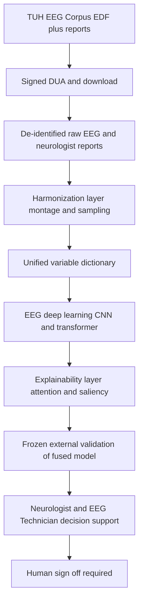
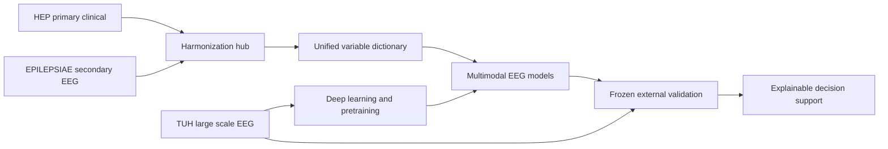
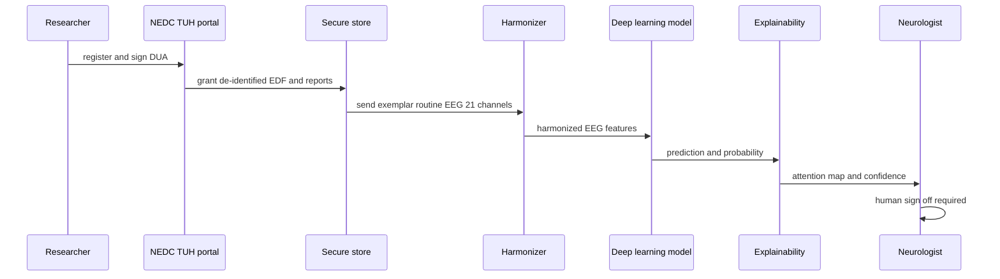
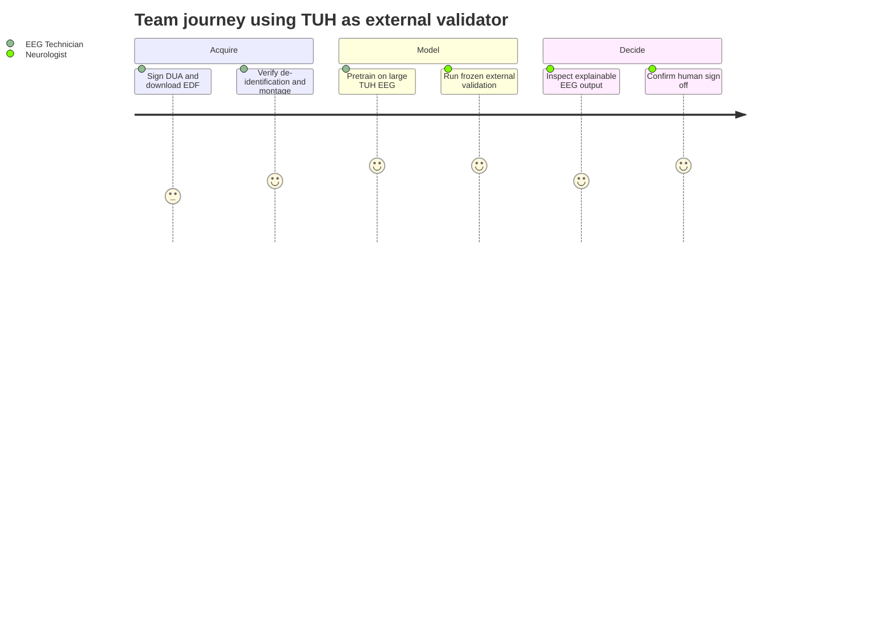

# Dataset 3 - Temple University Hospital (TUH) EEG Corpus (Best EEG Signal Repository)

> **Why (this doc):** This dossier profiles the Temple University Hospital (TUH) EEG Corpus as Source Dataset 3 within the master cross-dataset framework of the Enterprise AI Platform for Explainable Multimodal Epilepsy Intelligence, showing precisely how the world's largest publicly available clinical EEG archive maps into the unified variable dictionary alongside EPILEPSIAE (Dataset 1, secondary EEG master) and the Human Epilepsy Project (Dataset 2, primary clinical). TUH is rated Primary 2/5 and Secondary 5/5: it is a weak primary-clinical source but the strongest raw-EEG signal repository available, and its role is large-scale external validation, EEG deep learning, and explainable EEG for Neurologists and EEG Technicians. AI is decision support only.
> **How:** It follows the mandated research spine (Problem through Statistical Analysis), then presents the Dataset Profile, sub-corpora, variable-mapping row, research role, and Access & Ethics as captioned Markdown tables, includes all four Mermaid diagrams, and closes with a Defense Q&A and APA 7th references. Scale is described qualitatively where exact public counts are uncertain, with uncertainty flagged, and dataset-shift/generalizability is emphasized throughout. The exemplar TUH record is a 42-year-old male, EEG indication possible seizure, routine 21-channel scalp EEG, neurologist report normal.

---

## 1. Problem

> **Why:** Frame why a large external EEG repository is needed. **How:** State the generalization and signal-depth gap in one paragraph.

Models trained only on the platform's development cohorts (HEP clinical-longitudinal data and EPILEPSIAE long-term monitoring EEG) risk overfitting to a narrow set of hospitals, montages, machines, and patient populations. HEP is deep in clinical trajectory but comparatively shallow in continuous EEG; EPILEPSIAE is signal-rich but drawn from a small number of European epilepsy monitoring units. Neither, alone or together, proves that an explainable EEG model will hold up on the heterogeneous, routine, real-world scalp EEG seen in an ordinary hospital. Without a large, diverse, independent EEG archive to test against, any claim of clinical readiness is unsupported and vulnerable to dataset shift. The TUH EEG Corpus — a very large, decades-spanning archive of routine and long-term clinical EEGs with matched neurologist reports — is the external cohort that stresses this generalization claim.

## 2. Sub-Problems

> **Why:** Decompose the generalization problem into tractable questions TUH can answer. **How:** Enumerate discrete sub-problems, each tied to a later table or diagram.

*Caption - This table decomposes why TUH is needed into named sub-problems, so every downstream table (profile, mapping, access) traces to a concrete gap it resolves.*

| # | Sub-Problem | Why it matters | Resolved by |
|---|-------------|----------------|-------------|
| SP1 | Development cohorts may not generalize to routine hospital EEG | Clinical safety and external validity | Research role (§9) + External validation |
| SP2 | Deep learning on raw EEG needs very large signal volume | Data-hungry CNN/transformer models | Dataset Profile (§8) + sub-corpora (§10) |
| SP3 | EEG variables differ in montage, channels, sampling across sources | Blocks pooling and joint modelling | Variable-Mapping row (§11) |
| SP4 | Explainability must be tested on unseen distributions | Trustworthy clinician support | Q&A (§14) + XAI diagrams |
| SP5 | Access and privacy terms must be honored for a controlled archive | Legal and ethical use | Access & Ethics (§12) |
| SP6 | Dataset shift can silently degrade performance | Overoptimistic internal metrics | Statistical Analysis (§7) |

## 3. Research Problem

> **Why:** Compress the sub-problems into one falsifiable statement. **How:** One sentence naming the dataset, construct, and constraint.

Can an explainable multimodal epilepsy model developed on HEP and EPILEPSIAE demonstrate robust, externally valid EEG performance when frozen and tested on the large-scale, heterogeneous, routine clinical EEG of the TUH Corpus, without any degradation attributable to dataset shift and without the AI ever acting autonomously?

## 4. Research Objective

> **Why:** Convert the problem into measurable deliverables. **How:** List objectives bound to acceptance criteria.

*Caption - This table binds each TUH-specific objective to a concrete acceptance criterion, so examiners judge completion rather than intent.*

| Obj | Objective | Acceptance criterion |
|-----|-----------|----------------------|
| O1 | Use TUH as a frozen external EEG test set | No TUH patient present in any training fold |
| O2 | Quantify dataset shift vs development cohorts | External AUROC reported with delta and CI vs internal |
| O3 | Pretrain/deep-learn on large raw EEG volume | Self-supervised or supervised model trained on TUH signal |
| O4 | Validate EEG explainability on unseen data | Attention/saliency maps reviewed on TUH exemplar records |
| O5 | Map TUH into the unified variable dictionary | All shared EEG + demographic fields mapped or flagged missing |

## 5. Flow

> **Why:** Give a visual map of how TUH data moves into the master framework. **How:** A Mermaid flowchart with ASCII-only node labels.

*Caption - The flowchart traces TUH's route from the controlled download, through harmonization, into deep learning and frozen external validation of the fused model.*

## 6. Hypotheses

> **Why:** State testable predictions about generalization and signal value. **How:** Null and alternative pairs with a metric each.

*Caption - Formal hypotheses make TUH's external-validity and deep-learning claims falsifiable; each pairs a null with a directional alternative and a named metric.*

| ID | Null (H0) | Alternative (H1) | Metric |
|----|-----------|------------------|--------|
| Hyp1 | Model trained on HEP+EPILEPSIAE does not generalize to TUH | External AUROC within 0.05 of internal | External AUROC, DeLong |
| Hyp2 | Pretraining on large TUH EEG adds no downstream benefit | Pretraining improves target-task performance | AUROC delta, bootstrap CI |
| Hyp3 | TUH abnormal/normal labels do not align with model outputs | Model separates abnormal from normal on TUH | AUROC on TUAB subset |
| Hyp4 | Explanations are unstable under dataset shift | Attention maps remain clinically plausible on TUH | Saliency stability, expert rating |

## 7. Statistical Analysis

> **Why:** Specify the rigor that keeps external-validation inference valid. **How:** Name each method and the risk it controls.

*Caption - This table maps each statistical method to the specific validity threat it neutralizes when TUH is used for external validation and deep learning, which is essential for defense.*

| Method | Purpose | Risk controlled |
|--------|---------|-----------------|
| Patient-level (grouped) separation | Keep every TUH patient out of training | Data leakage |
| Frozen-model external evaluation | Test generalization without refitting | Optimistic re-tuning |
| DeLong test / bootstrap CIs | Compare internal vs external AUROC | Type I error |
| Domain-shift diagnostics (PSD, covariate drift) | Detect montage/population shift | Silent degradation |
| Calibration (Brier, reliability curves) | Trustworthy probabilities on new data | Overconfidence under shift |
| Subgroup analysis (age, sex, sub-corpus) | Fairness across TUH strata | Hidden subgroup failure |

---

## 8. Dataset Profile

> **Why:** State the concrete characteristics that define TUH's role. **How:** A single captioned profile table covering patients, EEG, and access.

*Caption - The profile summarizes TUH at a glance; counts are described qualitatively because exact public totals grow across releases and are flagged as approximate rather than invented.*

| Attribute | TUH EEG Corpus |
|-----------|----------------|
| Institution / provenance | Temple University Hospital, Philadelphia, USA (curated by the Neural Engineering Data Consortium) |
| Patients / scale | Very large; tens of thousands of patients and hundreds of thousands of EEG sessions (exact totals grow per release; treat as approximate) |
| Population | Routine clinical hospital EEG (mixed indications, not epilepsy-only), broad age range, real-world heterogeneity |
| EEG type | Scalp EEG; predominantly routine/short-term, with long-term and continuous recordings in some sessions |
| Sampling rate | Commonly 250-256 Hz; varies by acquisition device across the archive (flag: mixed) |
| Electrode system | International 10-20 system; typically ~19-21 channels plus reference/ground; multiple montages present |
| Clinical variables | De-identified patient ID, age, gender, EEG indication, and free-text neurologist EEG report; clinical diagnosis limited; medication rare; no questionnaires or seizure diaries |
| Annotations | Event/seizure annotations available in specific sub-corpora (e.g., TUSZ seizure corpus, TUAR artifact, TUEV events); most sessions unannotated at event level |
| Follow-up | Limited; the archive is session-oriented, not a longitudinal outcome cohort |
| Format | European Data Format (EDF/EDF+) signal files plus matched text reports |
| Access | Free registration plus a signed Data Use Agreement (DUA); controlled but no fee |
| Rating | Primary 2/5 (weak clinical depth) - Secondary 5/5 (best raw EEG signal repository) |

*Caption - The exemplar record grounds abstract fields in one concrete de-identified session used throughout the platform's EEG demonstrations.*

| Exemplar field | Value |
|----------------|-------|
| Patient ID | De-identified (TUH-format token) |
| Age | 42 years |
| Gender | Male |
| EEG indication | Possible seizure |
| Recording type | Routine scalp EEG |
| Channels | 21 (10-20 system) |
| Neurologist report | Normal |

## 9. Research Role in the Master Framework

> **Why:** Fix exactly what job TUH does versus HEP and EPILEPSIAE. **How:** A captioned role table separating primary vs secondary contributions.

*Caption - This table pins TUH's role to external validation, EEG deep learning, and explainable EEG, making explicit that it is not a primary-clinical source and never the master development cohort.*

| Dimension | TUH contribution | Not TUH's job |
|-----------|------------------|---------------|
| Master development cohort | No | HEP (primary) + EPILEPSIAE (secondary) hold this |
| Large-scale external validation | Yes, primary role | - |
| EEG deep learning / pretraining | Yes, large raw-signal volume | - |
| Explainable EEG stress test | Yes, unseen distribution | - |
| Reproducibility benchmark | Partial (public subsets like TUSZ) | PhysioNet leads reproducibility |
| Longitudinal / QOL / medication | No (rare or absent) | HEP supplies these |
| Enrichment of clinical context | Limited (indication + report only) | HEP/EPILEPSIAE enrich |

## 10. Sub-Corpora

> **Why:** Show TUH is a family of task-specific subsets, not one flat dataset. **How:** A captioned table naming each sub-corpus and its use.

*Caption - The sub-corpora table clarifies which annotated subset serves which modelling task, so the platform can target seizure, abnormality, artifact, or event tasks precisely.*

| Sub-corpus | Focus | Platform use |
|-----------|-------|--------------|
| TUSZ (Seizure) | Seizure event annotations | External validation of seizure detection |
| TUAB (Abnormal/Normal) | Session-level normal vs abnormal labels | Screening and abnormality classification |
| TUAR (Artifact) | Artifact event annotations | Artifact rejection and EEG quality models |
| TUEV (Events) | Multi-class EEG event labels (e.g., spike, GPED, PLED) | Explainable event detection |
| TUEG (base) | Full unannotated archive | Self-supervised deep-learning pretraining |

## 11. Variable-Mapping Row

> **Why:** Show how TUH aligns with the unified dictionary and the other datasets. **How:** A captioned mapping table plus a Mermaid graph LR of the integration.

*Caption - This mapping row places TUH beside EPILEPSIAE, HEP, and the master canonical variable, showing where TUH is strong, weak, or structurally missing so joins and imputation are principled (resolves SP3).*

| Canonical variable | Master field | EPILEPSIAE | HEP | TUH |
|--------------------|-------------|-----------|-----|-----|
| Patient ID | patient_id | Present (de-id) | Present (de-id) | Present (de-id) |
| Age | demo_age | Present | Present (exemplar 27) | Present (exemplar 42) |
| Gender | demo_sex | Present | Present | Present (exemplar male) |
| EEG indication | clin_indication | Partial | Present | Present (possible seizure) |
| Neurologist EEG report | clin_eeg_report | Partial | Present | Present (free text, exemplar normal) |
| Clinical diagnosis | clin_diagnosis | Present | Strong | Limited |
| Medication / AED | clin_aed | Sparse | Strong | Rare |
| Seizure diary | outcome_diary | Absent | Strong | Absent |
| Raw EEG signal | eeg_raw | Strong | Moderate | Strong (best repository) |
| EDF format | eeg_format | Yes | Partial | Yes |
| Event/seizure annotations | eeg_events | Present | Sparse | Sub-corpora only (TUSZ/TUEV/TUAR) |
| Channels | eeg_n_channels | Present | Present | Present (~19-21) |
| Sampling rate | eeg_sampling_rate | Present | Present | Present (250-256 Hz, mixed) |
| Long recordings | eeg_duration | Strong | Moderate | Yes (some sessions) |
| EEG quality flag | eeg_quality | Partial | Partial | Yes (TUAR artifact labels) |
| Follow-up / outcome | outcome_followup | Limited | Strong | Limited |

*Caption - The graph shows TUH connecting into the harmonization hub purely as an external EEG validator and deep-learning source, never feeding the primary development loop.*

## 12. Access and Ethics

> **Why:** Be honest and precise about how TUH is obtained and governed. **How:** A captioned table covering access, consent, and de-identification, plus the request sequence diagram.

*Caption - The access table states the real, controlled-but-free terms of TUH so the dissertation is transparent about legality, consent basis, and privacy protection.*

| Aspect | TUH EEG Corpus |
|--------|----------------|
| Access model | Free registration plus a signed Data Use Agreement (DUA); controlled access, no fee |
| How to obtain | Apply via the Neural Engineering Data Consortium (Temple University) online request, sign DUA, receive credentials to download EDF and reports |
| Cost | None (no purchase); institutional/academic use |
| Consent basis | Retrospective clinical EEGs collected under institutional/IRB authorization; secondary research use under DUA |
| De-identification | Records de-identified (HIPAA-aligned); direct identifiers removed from signals and reports before release |
| Redistribution | Not permitted; users may not re-share raw data; results/derived models only per DUA |
| Ethical constraints | Research-use restrictions, no re-identification attempts, secure storage required |
| Platform stance | AI is decision support only; TUH used for validation and modelling, never autonomous clinical action |

*Caption - The sequence diagram makes the controlled-access workflow concrete, from DUA signing to a frozen external-validation inference on the exemplar 42-year-old male record.*

*Caption - The journey diagram summarizes the EEG Technician and Neurologist experience when TUH is used as an external validator, highlighting where automation helps and where oversight stays mandatory.*

## 13. Professor Readiness (Defense Q&A)

> **Why:** Prepare defensible answers to the hardest external-validity questions. **How:** Examiner questions as sub-headings with concise, technical answers.

### 13.1 Why is TUH rated Secondary 5/5 but Primary only 2/5?

> **Why:** Justify the dual rating. **How:** Contrast signal depth with clinical depth.

TUH is the largest publicly available clinical EEG archive with matched neurologist reports in EDF, making it unmatched as a raw-signal repository (Secondary 5/5). But it is session-oriented routine hospital data: it carries de-identified ID, age, gender, indication, and a free-text report, while clinical diagnosis is limited, medication is rare, and there are no questionnaires, seizure diaries, or systematic follow-up. As a primary-clinical source it is therefore weak (2/5). This is exactly why it validates rather than develops the model.

### 13.2 How does TUH address dataset shift and generalizability?

> **Why:** External validity is the core reason TUH is included. **How:** Describe frozen testing and shift diagnostics.

The fused model is developed on HEP+EPILEPSIAE, then frozen and evaluated on TUH with no TUH patient ever in training (patient-level separation). Because TUH spans many machines, montages, sampling rates, and a non-epilepsy-enriched population, it embodies realistic covariate shift. We quantify shift with power-spectral-density and covariate-drift diagnostics, report external AUROC with DeLong tests and bootstrap CIs against internal performance (Hyp1), and check calibration under shift so degradation is measured, not assumed away.

### 13.3 The sampling rates and montages vary across TUH. Does that not corrupt pooling?

> **Why:** Address heterogeneity as a validity threat. **How:** Explain harmonization.

Heterogeneity is handled in the harmonization layer: signals are resampled to a common rate, mapped to a shared 10-20 channel set/montage, filtered and notch-corrected identically, and epoched consistently before feature extraction. Sessions that cannot be safely harmonized are flagged and excluded. This is also a strength: surviving heterogeneity is what makes the external validation credible rather than a same-distribution rerun.

### 13.4 How is explainability validated on unseen TUH data?

> **Why:** Explainability must survive distribution change. **How:** Tie to attention/saliency review.

For TUH exemplars such as the 42-year-old male routine EEG, the model's attention and saliency maps are reviewed for clinical plausibility against the neurologist report (Hyp4). We assess whether the model attends to physiologically meaningful channels/epochs rather than artifacts, using the TUAR artifact subset to confirm it is not driven by noise. Stability of explanations under shift is a reported outcome, not a claim.

### 13.5 Can TUH be shared or used to act autonomously on patients?

> **Why:** Confirm ethical and safety mandate. **How:** Point to DUA and governance.

No. TUH is controlled access under a signed DUA: raw data cannot be redistributed and re-identification is prohibited; only de-identified signals and reports are used, stored securely. Within the platform, TUH informs modelling and validation only. The governance layer enforces mandatory human sign-off and blocks autonomous diagnosis, prescription, or surgical decisions; the AI remains explainable decision support for the Neurologist and EEG Technician.

## 14. References

> **Why:** Ground the dossier in authoritative EEG, epilepsy, and AI sources. **How:** APA 7th edition entries covering TUH, epilepsy classification, medical AI, standards, and PhysioNet.

Obeid, I., & Picone, J. (2016). The Temple University Hospital EEG data corpus. *Frontiers in Neuroscience, 10*, 196. https://doi.org/10.3389/fnins.2016.00196

Shah, V., von Weltin, E., Lopez, S., McHugh, J. R., Veloso, L., Golmohammadi, M., Obeid, I., & Picone, J. (2018). The Temple University Hospital seizure detection corpus. *Frontiers in Neuroinformatics, 12*, 83. https://doi.org/10.3389/fninf.2018.00083

Harati, A., Lopez, S., Obeid, I., Picone, J., Jacobson, M. P., & Tobochnik, S. (2014). The TUH EEG CORPUS: A big data resource for automated EEG interpretation. In *2014 IEEE Signal Processing in Medicine and Biology Symposium (SPMB)* (pp. 1-5). IEEE. https://doi.org/10.1109/SPMB.2014.7002953

Fisher, R. S., Cross, J. H., French, J. A., Higurashi, N., Hirsch, E., Jansen, F. E., Lagae, L., Moshé, S. L., Peltola, J., Roulet Perez, E., Scheffer, I. E., & Zuberi, S. M. (2017). Operational classification of seizure types by the International League Against Epilepsy: Position paper of the ILAE Commission for Classification and Terminology. *Epilepsia, 58*(4), 522-530. https://doi.org/10.1111/epi.13670

Topol, E. J. (2019). High-performance medicine: The convergence of human and artificial intelligence. *Nature Medicine, 25*(1), 44-56. https://doi.org/10.1038/s41591-018-0300-7

Goldberger, A. L., Amaral, L. A. N., Glass, L., Hausdorff, J. M., Ivanov, P. C., Mark, R. G., Mietus, J. E., Moody, G. B., Peng, C.-K., & Stanley, H. E. (2000). PhysioBank, PhysioToolkit, and PhysioNet: Components of a new research resource for complex physiologic signals. *Circulation, 101*(23), e215-e220. https://doi.org/10.1161/01.CIR.101.23.e215

Ihle, M., Feldwisch-Drentrup, H., Teixeira, C. A., Witon, A., Schelter, B., Timmer, J., & Schulze-Bonhage, A. (2012). EPILEPSIAE - A European epilepsy database. *Computer Methods and Programs in Biomedicine, 106*(3), 127-138. https://doi.org/10.1016/j.cmpb.2010.08.011

American Psychological Association. (2020). *Publication manual of the American Psychological Association* (7th ed.). American Psychological Association.

DeLong, E. R., DeLong, D. M., & Clarke-Pearson, D. L. (1988). Comparing the areas under two or more correlated receiver operating characteristic curves: A nonparametric approach. *Biometrics, 44*(3), 837-845. https://doi.org/10.2307/2531595
