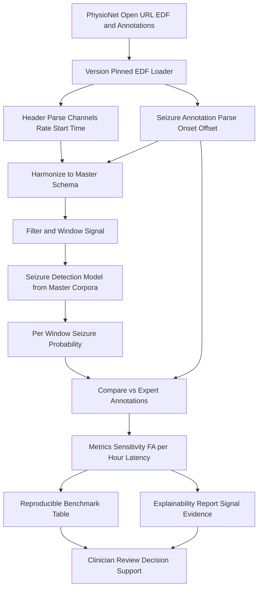
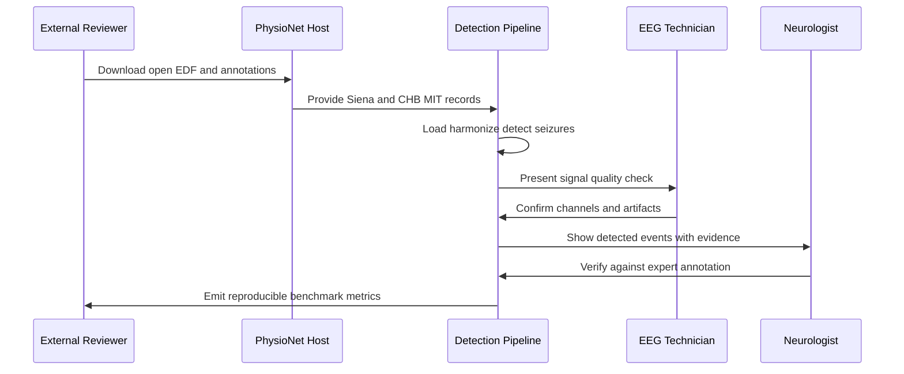
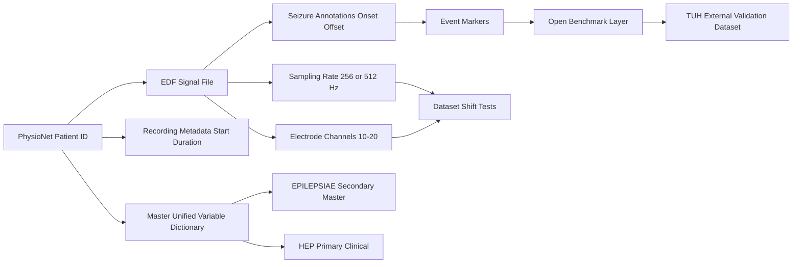
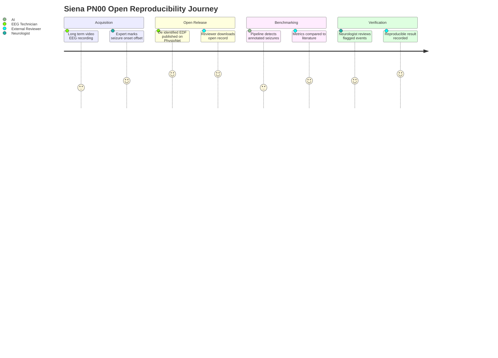

# Dataset 4 - PhysioNet (Siena Scalp EEG & CHB-MIT) (Open Reproducibility)

> **Why (this doc):** Every enterprise epilepsy-AI claim must be reproducible by an independent
> reader who cannot access the platform's registration- or DUA-gated corpora (EPILEPSIAE, HEP,
> TUH). PhysioNet supplies two fully open, permanently hosted scalp-EEG datasets — the **Siena
> Scalp EEG Database** (adults) and **CHB-MIT Scalp EEG Database** (pediatrics) — whose EDF
> signals and expert seizure annotations let anyone re-run the platform's seizure-detection and
> signal-processing pipelines end to end. This dossier profiles those datasets, states their
> access honestly as fully OPEN, and shows exactly how they map into the master cross-dataset
> framework and unified variable dictionary.
> **How:** It follows the mandatory research spine (Problem to Statistical Analysis), then
> profiles the dataset as Markdown tables (profile, variable mapping, role, access & ethics),
> renders four Mermaid views (flowchart TD, sequenceDiagram, graph LR integration, journey),
> and closes with examiner Q&A and APA-7 references. A **real Siena PN00 metadata sample** ships
> in `data/siena-sample/`. All AI functions are decision support only — never autonomous
> diagnosis, prescription, or surgical recommendation.

---

## 1. Problem

> **Why:** Frame the reproducibility and benchmarking gap this dataset closes. **How:** State why open data is a prerequisite for a defensible, auditable epilepsy-AI platform.

A DBA-grade epilepsy-AI platform is only credible if its results can be independently reproduced. The platform's richest sources — EPILEPSIAE (the secondary EEG master, registration + fee) and the Human Epilepsy Project (HEP, primary clinical, DUA-gated) — are **not** freely redistributable, so an external examiner, reviewer, or collaborating lab cannot re-execute a seizure-detection pipeline on them without lengthy access procedures. This blocks the two things a doctoral defense most needs: (1) *reproducibility* — a third party re-running the exact algorithm on the exact bytes and reproducing the metric; and (2) *benchmarking* — comparing the platform's detector against the published literature on a common, citable dataset. PhysioNet's Siena and CHB-MIT databases resolve both: they are open-access, permanently hosted, EDF-formatted, expert-annotated, and already the de-facto public benchmarks for scalp-EEG seizure detection.

*Caption - The table below decomposes the reproducibility problem into concrete pain points so each downstream objective maps to a deficiency this open dataset fixes.*

| Field | Description / Example |
|---|---|
| Access friction | EPILEPSIAE fee + registration and HEP DUA block independent re-execution |
| No public benchmark | Platform metrics not comparable to literature without a shared open dataset |
| Format fragmentation | Vendor EEG formats hinder portable pipelines; EDF is the open lingua franca |
| Pediatric coverage gap | Adult-heavy corpora under-represent childhood epilepsy (CHB-MIT fills this) |
| Sampling-rate variance | Detectors must prove robustness across 256 Hz and 512 Hz acquisitions |
| Example patient | Siena PN00, 55yo male, focal impaired awareness (IAS), right temporal, 5 annotated seizures, 512 Hz |

---

## 2. Sub-Problems

> **Why:** Break the reproducibility problem into tractable, testable pieces. **How:** Enumerate discrete gaps that the open dataset and its annotations let us resolve and audit.

*Caption - This table lists the sub-problems so reviewers can trace each to a dataset field, diagram, or model later in the dossier.*

| Field | Description / Example |
|---|---|
| SP1 Reproducible ingestion | Parse open EDF and annotation files with a portable, version-pinned loader |
| SP2 Seizure detection | Detect annotated seizures in continuous scalp EEG (Siena adult, CHB-MIT pediatric) |
| SP3 Cross-rate robustness | Prove detector stability across 256 Hz (CHB-MIT) and 512 Hz (Siena) |
| SP4 Cross-age generalization | Transfer adult-trained models to pediatric data and vice versa |
| SP5 Benchmark comparability | Report sensitivity, FA/h, latency on the same public data as prior work |
| SP6 Variable harmonization | Map open-dataset fields onto the master unified variable dictionary |
| SP7 Explainability audit | Attach signal-evidence attributions any external reviewer can inspect |
| SP8 Dataset-shift testing | Quantify performance drop from EPILEPSIAE/HEP to open external data |

---

## 3. Research Problem

> **Why:** Converge the sub-problems into one focused, researchable statement. **How:** Specify the open-reproducibility and dataset-shift question at this dataset's core.

**Research Problem:** *Can seizure-detection and signal-processing models developed on the platform's gated master corpora (EPILEPSIAE, HEP) be reproduced and independently benchmarked on the fully open PhysioNet Siena (adult, 512 Hz) and CHB-MIT (pediatric, 256 Hz) scalp-EEG databases, and does their performance hold under the age- and sampling-rate dataset shift these open datasets expose — all within a decision-support (non-autonomous) frame?*

---

## 4. Research Objective

> **Why:** Translate the problem into measurable objectives. **How:** Define what the open dataset must let the platform achieve and how success is measured.

*Caption - Objectives are tabulated with metrics so the statistical analysis section binds each to a test and each model to an accountable target.*

| Field | Description / Example |
|---|---|
| O1 | Re-execute the seizure-detection pipeline on open EDF end to end from a public URL |
| O2 | Reproduce published-comparable sensitivity and false-alarms-per-hour on CHB-MIT and Siena |
| O3 | Quantify performance under age shift (adult Siena vs pediatric CHB-MIT) |
| O4 | Quantify performance under sampling-rate shift (512 Hz vs 256 Hz) |
| O5 | Harmonize open-dataset variables into the master unified dictionary |
| O6 | Publish an explainable, re-runnable benchmark notebook for defense and audit |

---

## 5. Flow

> **Why:** Give a narrative of how a record moves through the dataset before the formal diagrams. **How:** Describe ingestion to benchmark reporting in one pass.

An open record begins at a PhysioNet URL: an EDF signal file plus its seizure-annotation text (Siena `Seizures-list-PNxx.txt`, CHB-MIT `chbxx-summary.txt`). A version-pinned loader reads the EDF header (channels, sampling rate, start time) and parses seizure onset/offset markers keyed to a patient (e.g., Siena PN00). Signals are harmonized to the master schema, band-pass filtered, and windowed. The platform's seizure-detection model — trained on the gated master corpora — is applied unchanged, producing per-window probabilities. Detected events are compared to the expert annotations to compute sensitivity, false-alarms-per-hour, and detection latency. Because everything is open, the entire path is re-runnable by any external reviewer; results feed the benchmark table and an explainability report. A Neurologist reviews flagged events and an EEG Technician confirms signal quality — the AI never decides autonomously.

### 5.1 Data Flow Diagram

> **Why:** Show the end-to-end path of open EEG through reproducible benchmarking. **How:** flowchart TD from PhysioNet URL to explainable benchmark.

### 5.2 Role and System Interaction

> **Why:** Clarify who touches the open data and when. **How:** sequenceDiagram across roles and systems.

### 5.3 Dataset Integration and Variable Mapping

> **Why:** Show how open-dataset entities map to the master dictionary and bridge to other platform datasets. **How:** graph LR of entities and integration edges.

### 5.4 Patient Data Journey

> **Why:** Convey the lived timeline of an open reference record. **How:** journey diagram of Siena PN00 from acquisition to open benchmark.

---

## 6. Hypotheses

> **Why:** State falsifiable claims the open dataset enables. **How:** Pair each null and alternative with the metric that adjudicates it.

*Caption - Hypotheses are tabulated so the statistical analysis section attaches an explicit test and effect measure to each.*

| Field | Description / Example |
|---|---|
| H1 (alt) | The master-trained detector reproduces published-comparable sensitivity on open CHB-MIT and Siena |
| H1 (null) | Reproduced sensitivity differs materially from the master-corpus result |
| H2 (alt) | Detector performance is robust across 512 Hz (Siena) and 256 Hz (CHB-MIT) |
| H2 (null) | Sampling-rate shift degrades performance beyond a tolerance bound |
| H3 (alt) | Adult-trained models transfer to pediatric CHB-MIT with acceptable degradation |
| H3 (null) | Age shift degrades performance beyond an acceptable bound |
| H4 (alt) | Open external validation confirms the gated-corpus result within stated intervals |
| H4 (null) | Open external metrics fall outside the gated-corpus confidence intervals |

---

## 7. Statistical Analysis

> **Why:** Specify how hypotheses are tested and reproducibility is proven. **How:** Map each analysis to metrics, tests, and the decision-support guardrail.

*Caption - This table binds objectives and hypotheses to concrete statistical methods so examiners can audit rigor and the non-autonomous boundary.*

| Field | Description / Example |
|---|---|
| Detection performance | Sensitivity, false-alarms-per-hour, detection latency vs expert annotations |
| Discrimination | AUROC and AUPRC per dataset (Siena, CHB-MIT) |
| Agreement | Cohen kappa between model events and expert seizure markers |
| Dataset-shift test | Paired comparison of metrics across age (adult/pediatric) and rate (512/256 Hz) |
| Reproducibility | Re-run variance across seeds and environments; report mean and interval |
| Cross-corpus delta | Difference in AUROC from EPILEPSIAE/HEP to open data with DeLong test |
| Calibration | Brier score and calibration curves for seizure probabilities |
| Uncertainty | Bootstrap confidence intervals on per-patient sensitivity |
| Guardrail | All outputs clinician-reviewed; no metric triggers autonomous action |

---

## 8. Dataset Profile

> **Why:** Give examiners the at-a-glance factual profile of the two open databases. **How:** Field/Value rows covering patients, EEG type, sampling, electrodes, clinical variables, follow-up, and access, with honest scale qualifiers.

*Caption - Profile of the two PhysioNet scalp-EEG databases combined into this dossier; counts are described qualitatively where exact figures are version-dependent, and both are fully open-access.*

| Field | Siena Scalp EEG | CHB-MIT Scalp EEG |
|---|---|---|
| Population | Adults | Pediatric (children and adolescents) |
| Patients (scale) | Small cohort, on the order of a dozen-plus subjects (e.g., real sample lists PN00-PN17); confirm exact count from the version release | Roughly two dozen pediatric subjects across case folders; confirm exact count from the release |
| EEG type | Long-term scalp video-EEG, continuous | Long-term scalp EEG, continuous |
| Sampling rate | 512 Hz | 256 Hz |
| Electrode system | International 10-20 (referential/bipolar montage, ~29 EEG channels plus EKG in sample) | International 10-20 (bipolar montage, ~23 channels) |
| Seizure annotations | Yes - expert onset/offset per seizure (Seizures-list-PNxx.txt) | Yes - expert onset/offset per seizure (chbxx-summary.txt) |
| Clinical variables | Limited - age, gender, seizure type (IAS/WIAS/FBTC), localization, lateralization | Limited - age (and gender for some), seizure timing metadata |
| Medication / questionnaires | Rare/none in the public release | None in the public release |
| Follow-up / longitudinal | None (single monitoring admission per subject) | None (single monitoring admission per subject) |
| File format | EDF / EDF+ | EDF |
| Access | OPEN - PhysioNet (open download, credentialing not required) | OPEN - PhysioNet (open download, credentialing not required) |
| Sample shipped | Real PN00 metadata in `data/siena-sample/` (512 Hz, 29 channels, 5 seizures) | Referenced; use public chbxx-summary annotations |

---

## 9. Primary vs Secondary Data Rating

> **Why:** Position this dataset in the master primary/secondary framework honestly. **How:** Rate each data element as yes / limited / rare / no, matching the platform's rating rubric.

*Caption - Primary rating 2/5, Secondary rating 4/5 - PhysioNet is signal-rich but clinically thin, the mirror image of HEP; ratings reflect what the public release actually contains.*

| Data Element | Type | Availability |
|---|---|---|
| Patient ID | Primary | Yes (PN00, chb01, ...) |
| Age | Primary | Limited (present in Siena subject_info; partial in CHB-MIT) |
| Gender | Primary | Limited (Siena yes; CHB-MIT partial) |
| Diagnosis | Primary | Limited (epilepsy implied; seizure type in Siena) |
| Clinical notes | Primary | Limited |
| Medication | Primary | Rare |
| Questionnaire / PRO | Primary | No |
| Neurologist assessment | Primary | Limited (expert annotations, not full assessment) |
| EEG signal | Secondary | Yes |
| EDF files | Secondary | Yes |
| Seizure annotations | Secondary | Yes |
| Recording metadata | Secondary | Yes (start time, duration, channels) |
| Event markers | Secondary | Yes (seizure onset/offset) |
| EEG reports | Secondary | Some (montage/channel notes; not full narrative reports) |
| Long recordings | Secondary | Yes (multi-hour continuous, hundreds to >1000 min per subject) |

---

## 10. Variable Mapping to Master Dictionary

> **Why:** Show precisely how open-dataset fields align with EPILEPSIAE, HEP, and the master unified dictionary. **How:** One row per master variable with the source field in each dataset.

*Caption - The variable-mapping matrix that lets a model trained on gated master data consume open PhysioNet records unchanged; blanks/limits are stated honestly, not fabricated.*

| Master Variable | Siena Field | CHB-MIT Field | EPILEPSIAE Equivalent | HEP Equivalent |
|---|---|---|---|---|
| patient_id | patient_id (PN00) | case id (chb01) | patient key | HEP subject id (HEP001) |
| age_years | age_years (55) | age (partial) | age at admission | age at enrollment |
| sex | gender (Male) | sex (partial) | sex | sex |
| diagnosis | epilepsy + seizure type (IAS) | epilepsy (implied) | epilepsy syndrome | ILAE classification |
| seizure_type | IAS / WIAS / FBTC | not typed | seizure type | Fisher 2017 type |
| focus_localization | localization (T) | not provided | lobe/localization | localization |
| lateralization | lateralization (R/L/Bilateral) | not provided | lateralization | lateralization |
| eeg_sampling_rate_hz | 512 | 256 | per-record header | per-record header |
| electrode_montage | 10-20 (~29 ch) | 10-20 (~23 ch) | 10-20 | 10-20 |
| seizure_onset_time | Seizure start time | summary onset | annotation onset | ictal onset |
| seizure_offset_time | Seizure end time | summary offset | annotation offset | ictal offset |
| recording_duration_min | rec_time_minutes (198) | derived from EDF | recording length | monitoring length |
| number_of_seizures | number_seizures (5) | per-summary count | seizure count | seizure count |
| medication | not available | not available | ASM regimen | ASM regimen |
| longitudinal_followup | not available | not available | limited | full (HEP strength) |

---

## 11. Role in the Research Program

> **Why:** State unambiguously what job this dataset does among the platform's five datasets. **How:** Classify its role and contrast it with the master and validation datasets.

*Caption - PhysioNet's role is open reproducibility and benchmarking - not the master (EPILEPSIAE) nor the clinical primary (HEP), but the public proving ground that makes both defensible.*

| Field | Description / Example |
|---|---|
| Primary role | Open reproducibility - anyone can re-run the pipeline from a public URL |
| Secondary role | Benchmarking seizure-detection and signal-processing algorithms vs literature |
| Not the master | EPILEPSIAE remains the secondary EEG master; PhysioNet does not replace it |
| Not the clinical primary | HEP remains the primary clinical/longitudinal source |
| Relative to TUH | TUH provides scale for external validation; PhysioNet provides open re-execution |
| Enrichment value | Adds pediatric coverage (CHB-MIT) and a second sampling rate (512 Hz Siena) |
| Dataset-shift probe | Exposes age and sampling-rate shift to stress-test generalization |
| Defense value | A reviewer can reproduce a headline metric without any access request |

---

## 12. Access & Ethics

> **Why:** Be accurate and honest about how the data is obtained, consented, and de-identified. **How:** Field/Description rows covering access tier, consent, de-identification, licensing, and citation duty.

*Caption - Access is fully OPEN via PhysioNet; the ethics burden sits mainly on correct attribution and respecting the source-hospital consent under which the data was originally collected and de-identified.*

| Field | Description / Example |
|---|---|
| Access tier | OPEN - direct download from PhysioNet; no fee, no DUA, credentialing not required |
| How to obtain | Download EDF + annotation files from the PhysioNet database landing pages |
| Original consent | Collected at source hospitals (Siena; Boston Children's for CHB-MIT) under local IRB/ethics approval |
| De-identification | Records are de-identified before public release; no direct identifiers in EDF headers |
| Re-identification risk | Low - EEG signal plus coarse demographics; treat as human-subjects data regardless |
| Licensing | Open PhysioNet terms; redistribution and reuse permitted with attribution |
| Citation duty | Must cite the dataset publications and PhysioNet (Goldberger et al., 2000) |
| Platform stance | Used strictly for reproducibility/benchmarking; AI outputs are decision support only |
| Governance parity | Handled under the same audit-logging and access-control policies as gated corpora |

---

## 13. Professor Readiness (Defense Q&A)

> **Why:** Anticipate examiner scrutiny on why an open dataset belongs in an enterprise platform. **How:** Provide crisp, defensible answers covering reproducibility, external validity, generalizability, dataset shift, and ethics.

### 13.1 Why include open PhysioNet data when you already have EPILEPSIAE and HEP?

> **Why:** Justify the dataset's necessity. **How:** Tie it to reproducibility and benchmarking that gated corpora cannot provide.

Because EPILEPSIAE is fee- and registration-gated and HEP is DUA-gated, neither can be re-executed by an independent examiner or reviewer on demand. Reproducibility is a core doctoral standard: a third party must be able to re-run the exact pipeline on the exact bytes and reproduce the metric. PhysioNet's Siena and CHB-MIT databases are fully open, permanently hosted, EDF-formatted, and expert-annotated, and they are the de-facto public benchmarks for scalp-EEG seizure detection. They let me publish a re-runnable benchmark notebook and compare against the literature on common ground.

### 13.2 How do Siena and CHB-MIT strengthen external validity and generalizability?

> **Why:** Address external validity directly. **How:** Point to age and sampling-rate diversity as generalization probes.

They add two independent axes of variation. Siena is adult, recorded at 512 Hz; CHB-MIT is pediatric, recorded at 256 Hz. Evaluating a master-trained detector on both tests whether performance holds across age (adult to pediatric) and acquisition rate (512 Hz to 256 Hz), which are exactly the shifts a deployed system faces. Reporting per-dataset sensitivity, false-alarms-per-hour, and calibration - not just an aggregate - demonstrates generalization rather than overfitting to one acquisition protocol.

### 13.3 How do you handle dataset shift between the gated master corpora and this open data?

> **Why:** Show shift is measured, not assumed away. **How:** Describe the explicit cross-corpus comparison and tolerance bounds.

Dataset shift is treated as a first-class experiment, not a nuisance. I quantify the change in AUROC/AUPRC and sensitivity when moving from EPILEPSIAE/HEP to the open datasets, using DeLong tests for AUROC differences and bootstrap intervals per patient. Shift is decomposed into age and sampling-rate components by comparing Siena versus CHB-MIT. A pre-registered tolerance bound defines acceptable degradation; results outside it flag the model as non-transferable and trigger recalibration rather than deployment.

### 13.4 The clinical metadata is thin - does that undermine the platform?

> **Why:** Address the primary-data limitation honestly. **How:** Reframe the thin metadata as fit-for-purpose given the dataset's role.

No, because PhysioNet's job here is signal-level reproducibility, not clinical modeling. Its primary-data rating is deliberately low (2/5) and secondary-data rating high (4/5): rich EEG, EDF, annotations, and long recordings, but limited demographics and no questionnaires, medication, or follow-up. Those clinical dimensions come from HEP (the primary source) and EPILEPSIAE. Each dataset is used for what it is strong at; I do not claim clinical inference from PhysioNet, only detector reproducibility and benchmarking.

### 13.5 What are the ethical and licensing obligations, and is the AI ever autonomous?

> **Why:** Close the ethics and safety loop. **How:** State consent provenance, attribution duty, and the decision-support guardrail.

The data was collected at source hospitals under local ethics approval and de-identified before open release; my obligation is correct attribution (dataset publications plus PhysioNet, Goldberger et al., 2000) and handling it under the same audit-logging and access-control governance as the gated corpora, since it remains human-subjects data. On safety: every AI output is decision support only. Detected seizures are explainable, evidence-backed suggestions that a Neurologist verifies against the expert annotations and an EEG Technician quality-checks; the system never diagnoses, prescribes, or recommends surgery autonomously.

---

## 14. References

> **Why:** Ground the dossier in authoritative and dataset-appropriate literature. **How:** APA 7th edition entries spanning the datasets, PhysioNet, epilepsy classification, AI in medicine, and ethics.

American Psychological Association. (2020). *Publication manual of the American Psychological Association* (7th ed.). American Psychological Association. https://doi.org/10.1037/0000165-000

Detti, P., Vatti, G., & Zabalo Manrique de Lara, G. (2020). EEG synchronization analysis for seizure prediction: A study on data of noninvasive recordings. *Processes, 8*(7), 846. https://doi.org/10.3390/pr8070846

Fisher, R. S., Cross, J. H., French, J. A., Higurashi, N., Hirsch, E., Jansen, F. E., Lagae, L., Moshé, S. L., Peltola, J., Roulet Perez, E., Scheffer, I. E., & Zuberi, S. M. (2017). Operational classification of seizure types by the International League Against Epilepsy. *Epilepsia, 58*(4), 522-530. https://doi.org/10.1111/epi.13670

Goldberger, A. L., Amaral, L. A. N., Glass, L., Hausdorff, J. M., Ivanov, P. C., Mark, R. G., Mietus, J. E., Moody, G. B., Peng, C.-K., & Stanley, H. E. (2000). PhysioBank, PhysioToolkit, and PhysioNet: Components of a new research resource for complex physiologic signals. *Circulation, 101*(23), e215-e220. https://doi.org/10.1161/01.CIR.101.23.e215

Shoeb, A. H. (2009). *Application of machine learning to epileptic seizure onset detection and treatment* [Doctoral dissertation, Massachusetts Institute of Technology]. MIT DSpace. https://dspace.mit.edu/handle/1721.1/54669

Topol, E. J. (2019). High-performance medicine: The convergence of human and artificial intelligence. *Nature Medicine, 25*(1), 44-56. https://doi.org/10.1038/s41591-018-0300-7

World Health Organization. (2019). *Epilepsy: A public health imperative*. World Health Organization. https://www.who.int/publications/i/item/epilepsy-a-public-health-imperative
