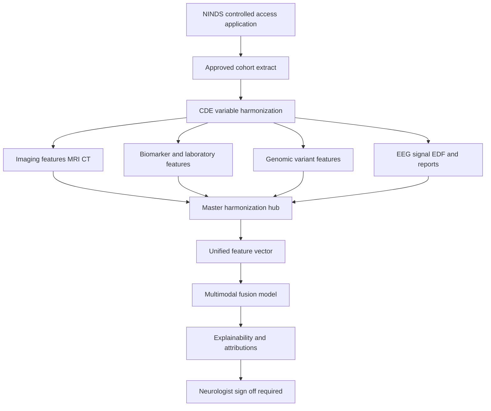
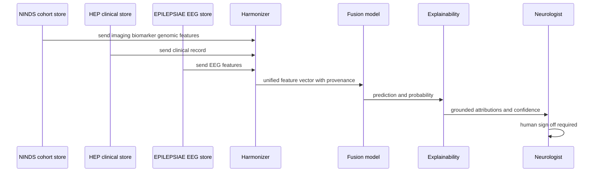
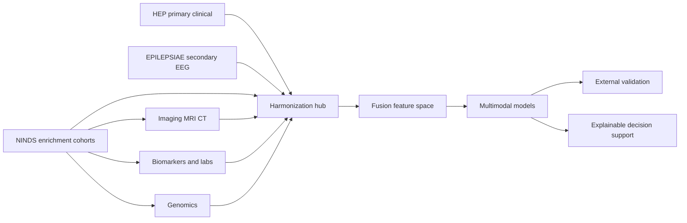
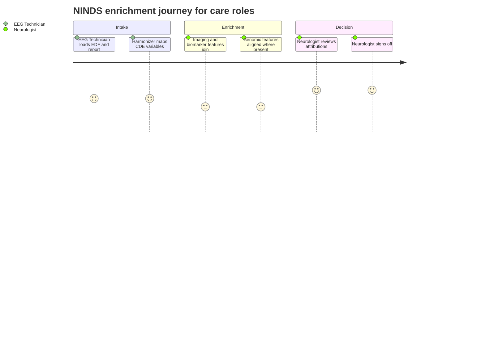

# Dataset 5 - NINDS Repositories & Epilepsy Cohorts (Clinical/Multimodal Enrichment)

> **Why (this doc):** Profile the NINDS (National Institute of Neurological Disorders and
> Stroke) data and biospecimen repositories as **Dataset 5** in the Enterprise AI Platform
> for Explainable Multimodal Epilepsy Intelligence, and show how a heterogeneous federation of
> NINDS-hosted epilepsy cohorts *enriches* the master cross-dataset framework (Dataset 1 =
> EPILEPSIAE secondary EEG master; Dataset 2 = HEP primary clinical) with additional imaging,
> biomarker, and genomic modalities.
> **How:** Follow the numbered research spine (Problem to Statistical Analysis), then give
> captioned dataset-profile, variable-mapping, role, and access/ethics tables, all four Mermaid
> diagrams, an examiner Q&A, and APA 7th references. AI here is **decision support only** — no
> autonomous diagnosis, prescription, or surgical decision. Exemplar record: **36-year-old on
> Carbamazepine, focal epilepsy, routine EEG + MRI, EDF signal + EEG report**.

---

## 1. Problem
> **Why:** Anchor why NINDS enrichment is needed. **How:** State the multimodal gap in one paragraph.

*Caption - The problem statement frames NINDS as the enrichment layer that supplies imaging, biomarker, and genomic breadth the EEG-centric and single-cohort clinical datasets structurally lack.*

| Element | Statement |
|---|---|
| Core problem | Epilepsy decision support trained on EEG-only (EPILEPSIAE) or a single clinical cohort (HEP) under-represents imaging, laboratory, biomarker, and genomic signal, limiting multimodal explainability |
| Consequence | Models may be accurate on-distribution but brittle across care settings, imaging protocols, and genetic subtypes |
| NINDS opportunity | A federation of NIH-curated epilepsy cohorts adds MRI/CT, biospecimen-derived biomarkers, and genomics under Common Data Elements (CDEs), enabling richer, more generalizable features |
| Honest caveat | NINDS is a **repository of many studies**, not one harmonized table — variable coverage is heterogeneous across cohorts and must be reconciled, not assumed |

## 2. Sub-Problems
> **Why:** Decompose the problem into tractable questions. **How:** One row per sub-problem tied to a later objective.

*Caption - Each sub-problem isolates one obstacle to using a multi-cohort NINDS federation for enrichment, from modality coverage to cross-cohort heterogeneity.*

| ID | Sub-problem | Why it matters |
|---|---|---|
| SP1 | Which NINDS cohorts carry epilepsy-relevant imaging, biomarker, and genomic fields | Determines enrichment yield |
| SP2 | How to map heterogeneous cohort variables onto the master unified dictionary | Enables fusion with HEP and EPILEPSIAE |
| SP3 | How to handle missing-by-design modalities across cohorts | Prevents silent zero-filling and bias |
| SP4 | How to quantify dataset shift between NINDS cohorts and the HEP/EPILEPSIAE core | Establishes external validity |
| SP5 | How to satisfy controlled-access consent and de-identification for each cohort | Keeps the platform compliant and decision-support only |

## 3. Research Problem
> **Why:** State the single researchable question. **How:** One precise sentence.

*Caption - The research problem collapses the sub-problems into the one testable question this dossier serves.*

| Field | Statement |
|---|---|
| Research problem | Can a heterogeneous NINDS cohort federation, harmonized to the master unified variable dictionary, add imaging, biomarker, and genomic features that measurably improve the explainability and cross-setting generalizability of the multimodal epilepsy decision-support platform without introducing uncontrolled dataset shift |

## 4. Research Objective
> **Why:** Convert the problem into measurable objectives. **How:** Objectives O1-O4 with success signals.

*Caption - Objectives translate the research problem into verifiable targets, each mapped back to a sub-problem.*

| ID | Objective | Maps SP | Success signal |
|---|---|---|---|
| O1 | Catalogue NINDS epilepsy cohorts and their modality coverage | SP1 | Coverage matrix built, uncertainty flagged |
| O2 | Harmonize NINDS variables to the master unified dictionary via CDEs | SP2 | Provenance-tagged rows for imaging/biomarker/genomic |
| O3 | Model missing-by-design modalities with imputation + missingness indicators | SP3 | No silent zero-fill; ablation-quantified contribution |
| O4 | Measure dataset shift and enrichment gain vs HEP/EPILEPSIAE core | SP4, SP5 | Shift metrics reported; access/ethics satisfied |

## 5. Flow
> **Why:** Show the end-to-end route of NINDS data into the pipeline. **How:** A Mermaid flowchart TD.

*Caption - The flowchart traces a NINDS cohort record from controlled-access intake through CDE harmonization and enrichment fusion into the master pipeline, ending at explainable, human-signed-off output.*

## 6. Hypotheses
> **Why:** Make the enrichment claim falsifiable. **How:** Null and alternative per objective.

*Caption - Hypotheses state the falsifiable enrichment and generalizability claims, keeping every gain empirically testable rather than assumed.*

| ID | Null H0 | Alternative H1 |
|---|---|---|
| Hyp1 | Adding NINDS imaging/biomarker/genomic features does not improve multimodal performance | NINDS enrichment yields a measurable, ablation-confirmed gain |
| Hyp2 | Each added modality contributes no marginal explanatory value | Modalities show non-zero marginal contribution in ablation |
| Hyp3 | NINDS cohorts share the HEP/EPILEPSIAE distribution | Detectable dataset shift exists and must be corrected |
| Hyp4 | Cross-cohort heterogeneity does not bias fused predictions | Heterogeneity-aware harmonization reduces measurable bias |

## 7. Statistical Analysis
> **Why:** Name the methods that test the hypotheses. **How:** Method-to-hypothesis table.

*Caption - The analysis plan binds each hypothesis to a concrete statistical or ML method, including dataset-shift diagnostics central to external validity.*

| Method | Purpose | Tests |
|---|---|---|
| Mixed-effects models with cohort random effects | Absorb cross-cohort heterogeneity | Hyp4 |
| Multiple imputation with missingness indicators | Handle missing-by-design modalities | Hyp2, Hyp4 |
| Ablation studies per modality | Quantify marginal contribution | Hyp1, Hyp2 |
| Domain-shift metrics MMD and PSI and covariate drift | Detect NINDS vs core distribution gap | Hyp3 |
| Bootstrapped AUROC AUPRC with 95 percent CIs | Enrichment gain with uncertainty | Hyp1 |
| SHAP attribution stability across cohorts | Explainability robustness | Hyp1, Hyp4 |

---

## 8. Dataset Profile
> **Why:** State what NINDS actually provides. **How:** Captioned profile table with honest access status.

*Caption - The profile summarizes NINDS epilepsy repositories at a qualitative scale, because NINDS aggregates many studies rather than one fixed-N cohort; exact counts vary by study and are not asserted here.*

| Attribute | NINDS repositories and epilepsy cohorts |
|---|---|
| Custodian | National Institute of Neurological Disorders and Stroke (NIH), including data archive and BioSEND biospecimen repository |
| Nature | Federation of many funded studies and clinical trials, not a single harmonized dataset |
| Patients / scale | Large in aggregate across cohorts; per-study sample sizes vary widely — described qualitatively, exact totals not asserted |
| EEG type | Routine and long-term EEG where a contributing study collected it; EDF and vendor formats |
| Sampling rate | Study-dependent; commonly 250-512 Hz for routine EEG, not uniform across cohorts |
| Electrode system | Typically international 10-20 for scalp EEG; intracranial montages in surgical cohorts |
| Clinical variables | Demographics, age, gender, medical and family history, medications, diagnosis, seizure classification, selected clinical scales |
| Imaging | MRI commonly; CT in some cohorts; modality and protocol heterogeneous |
| Biomarkers / labs | Biospecimen-derived biomarkers and laboratory panels in some cohorts (via BioSEND) |
| Genomics | Genotype / sequencing data in some genetic-epilepsy cohorts |
| Follow-up | Longitudinal in trial and cohort studies; interval and duration study-specific |
| Standardization | NINDS Common Data Elements (CDEs) for Epilepsy encourage but do not guarantee cross-study uniformity |
| Access | **Controlled — formal application + data use agreement** per repository/study; not open download |

*Caption - Exemplar de-identified record used throughout this dossier to make harmonization concrete.*

| Field | Value |
|---|---|
| Age | 36 |
| Gender | Recorded |
| Diagnosis | Focal epilepsy |
| Medication | Carbamazepine |
| EEG | Routine EEG, EDF |
| Imaging | MRI |
| Report | EEG report (text) |

### 8.1 Primary vs Secondary Data Coverage
> **Why:** Show which fields NINDS supplies directly. **How:** Coverage table with honest yes/some flags.

*Caption - Coverage flags follow the project rating (Primary 4/5, Secondary 4/5); "some" marks fields present only in a subset of cohorts, underscoring variable heterogeneity.*

| Category | Field | Coverage |
|---|---|---|
| Primary | Patient demographics | Yes |
| Primary | Age | Yes |
| Primary | Gender | Yes |
| Primary | Medical history | Yes |
| Primary | Family history | Some |
| Primary | Medication | Yes |
| Primary | Diagnosis | Yes |
| Primary | Neurologist assessment | Some |
| Primary | Clinical scales | Some |
| Primary | MRI | Some |
| Primary | Laboratory tests | Some |
| Secondary | EEG | Yes |
| Secondary | MRI | Yes |
| Secondary | CT | Some |
| Secondary | Genomics | Some |
| Secondary | Biomarkers | Some |
| Secondary | EEG reports | Some |

### 8.2 Role in the Research
> **Why:** Fix NINDS's function in the master framework. **How:** Role table contrasting it with other datasets.

*Caption - NINDS's role is multimodal clinical research enrichment plus additional external cohorts, complementing rather than replacing the EPILEPSIAE master and HEP primary.*

| Dataset | Role | Primary contribution |
|---|---|---|
| EPILEPSIAE (Dataset 1) | Secondary master | EEG signal and seizure annotation reference |
| HEP (Dataset 2) | Primary clinical | Longitudinal clinical assessment and outcomes |
| **NINDS (Dataset 5)** | **Multimodal enrichment + additional external cohorts** | Extra MRI/CT imaging, biomarker, genomic breadth; cross-setting generalizability |

### 8.3 Variable Mapping to Master Unified Dictionary
> **Why:** Prove NINDS fields align with the shared schema. **How:** Mapping rows to master unified variables with provenance.

*Caption - The mapping row set aligns NINDS CDE fields to the master unified variable dictionary already used by HEP and EPILEPSIAE, tagging provenance so fusion stays auditable and missing-by-design fields are explicit.*

| Master unified variable | Modality | NINDS source field (CDE-aligned) | Alignment | Notes |
|---|---|---|---|---|
| demo_age | Clinical | Age at enrollment | Direct | Confounder control |
| demo_sex | Clinical | Sex / gender | Direct | Confounder control |
| clin_seizure_type | Clinical | Seizure classification CDE | Direct | ILAE 2017 coded |
| clin_medication | Clinical | Antiseizure medication | Direct | e.g. Carbamazepine |
| clin_family_history | Clinical | Family history CDE | Partial | Present in some cohorts |
| img_mri_lesion | Imaging | MRI findings / DICOM | Partial | Protocol heterogeneous |
| img_ct_finding | Imaging | CT findings | Sparse | Some cohorts only |
| lab_biomarker | Biomarker | BioSEND biospecimen assays | Sparse | Some cohorts only |
| gen_variant | Genomic | Genotype / sequencing | Sparse | Genetic-epilepsy cohorts |
| eeg_signal | Signal | Routine/long-term EEG EDF | Partial | Where collected |
| eeg_report_text | Signal | EEG report narrative | Partial | Unstructured, RAG-parsed |
| consent_status | Governance | Study consent / DUA | Direct | Controlled access |
| deidentified | Governance | De-identification flag | Direct | Required true |

## 9. Access & Ethics
> **Why:** Be honest about how to obtain the data and its constraints. **How:** Captioned access/ethics table.

*Caption - Access is controlled: obtaining NINDS data requires a formal application and data use agreement per study, with de-identification and human oversight preserved end to end.*

| Dimension | Detail |
|---|---|
| Access model | **Controlled application** — request through NINDS data archive / BioSEND with study-specific approval |
| Requirement | Data Use Agreement (DUA), institutional/IRB approval, justified analysis plan |
| Cost | Generally no purchase fee; biospecimen requests may carry handling costs; effort/approval time is the real gate |
| Consent | Original study informed consent governs secondary use; secondary-use scope varies by cohort |
| De-identification | Records de-identified per NIH policy; no re-identification permitted |
| Data governance | Access logged; use restricted to approved protocol; redistribution prohibited |
| AI constraint | Decision support only — no autonomous diagnosis, prescription, or surgical decision; neurologist sign-off mandatory |
| Honest caveat | Consent scope, modality availability, and variable definitions differ across cohorts; each must be reviewed individually |

### 9.1 Integration Sequence
> **Why:** Make runtime integration concrete. **How:** A Mermaid sequenceDiagram of one enrichment inference.

*Caption - The sequence diagram traces one exemplar inference where NINDS enrichment features join the HEP/EPILEPSIAE core through the harmonizer before explainable, signed-off output.*

### 9.2 Integration and Variable-Mapping Network
> **Why:** Show topology of enrichment. **How:** A Mermaid graph LR.

*Caption - The graph shows NINDS feeding enrichment modalities into the harmonization hub alongside the HEP primary and EPILEPSIAE secondary datasets, then onward to fusion, external validation, and decision support.*

### 9.3 Roles Journey
> **Why:** Show the Neurologist and EEG Technician experience. **How:** A Mermaid journey diagram.

*Caption - The journey maps how the two platform roles experience NINDS enrichment, from controlled-access intake to signed-off explainable output.*

---

## 10. Professor Readiness (Defense Q&A)
> **Why:** Anticipate examiner scrutiny. **How:** Five questions as ### with concise, honest answers.

### 10.1 Why include NINDS if EPILEPSIAE and HEP already cover EEG and clinical data
> **Why:** Justify the enrichment role. **How:** Point to the modality gap.

NINDS adds modalities the core lacks at breadth — additional MRI/CT imaging, biospecimen-derived biomarkers, and genomics — plus additional external cohorts. Its value is multimodal enrichment and generalizability, not duplicating EEG or single-cohort clinical data.

### 10.2 NINDS is many studies with different variables — how is that not a fatal flaw
> **Why:** Address heterogeneity directly. **How:** Describe CDE harmonization and modeling.

It is a real limitation, handled honestly. We harmonize to the master unified dictionary via NINDS Common Data Elements, tag provenance, model cohort effects with mixed-effects random intercepts, and treat absent modalities as missing-by-design with imputation plus missingness indicators — never silent zero-fill. Ablation quantifies whether the added variance is worth including.

### 10.3 How do you establish external validity and detect dataset shift
> **Why:** Core generalizability question. **How:** Name shift diagnostics.

We compute domain-shift metrics (MMD, PSI, covariate drift) between NINDS cohorts and the HEP/EPILEPSIAE core, report bootstrapped AUROC/AUPRC with confidence intervals on held-out NINDS cohorts as external validation, and check SHAP attribution stability across cohorts. Detected shift is corrected, not ignored.

### 10.4 You did not assert exact patient counts — is that a weakness
> **Why:** Defend honesty about scale. **How:** Explain repository nature.

It is deliberate integrity. NINDS is a federation of many studies with study-specific and evolving sample sizes; asserting a single precise N would be fabricated. We describe scale qualitatively and flag uncertainty, which is the correct scholarly posture for a controlled multi-cohort repository.

### 10.5 Does adding genomic and biomarker data risk autonomous or unsafe AI decisions
> **Why:** Safety and governance. **How:** Restate decision-support constraint.

No. The platform is decision support only. Enrichment features feed explainable outputs that a neurologist must review and sign off; the system never issues autonomous diagnosis, prescription, or surgical decisions. Access is controlled, de-identified, and audit-logged throughout.

---

## References

American Psychological Association. (2020). *Publication manual of the American Psychological
Association* (7th ed.). https://doi.org/10.1037/0000165-000

Fisher, R. S., Cross, J. H., French, J. A., Higurashi, N., Hirsch, E., Jansen, F. E., Lagae, L.,
Moshé, S. L., Peltola, J., Roulet Perez, E., Scheffer, I. E., & Zuberi, S. M. (2017). Operational
classification of seizure types by the International League Against Epilepsy. *Epilepsia, 58*(4),
522–530. https://doi.org/10.1111/epi.13670

Goldberger, A. L., Amaral, L. A. N., Glass, L., Hausdorff, J. M., Ivanov, P. C., Mark, R. G.,
Mietus, J. E., Moody, G. B., Peng, C.-K., & Stanley, H. E. (2000). PhysioBank, PhysioToolkit, and
PhysioNet: Components of a new research resource for complex physiologic signals. *Circulation,
101*(23), e215–e220. https://doi.org/10.1161/01.CIR.101.23.e215

Grinnon, S. T., Miller, K., Marler, J. R., Lu, Y., Stout, A., Odenkirchen, J., & Kunitz, S. (2012).
National Institute of Neurological Disorders and Stroke Common Data Element Project — Approach and
methods. *Clinical Trials, 9*(3), 322–329. https://doi.org/10.1177/1740774512438980

National Institute of Neurological Disorders and Stroke. (n.d.). *NINDS Common Data Elements:
Epilepsy* [Data standards]. U.S. National Institutes of Health. Retrieved July 3, 2026, from
https://www.commondataelements.ninds.nih.gov/

National Institute of Neurological Disorders and Stroke. (n.d.). *BioSEND — NINDS Biospecimens and
data repository* [Data repository]. U.S. National Institutes of Health. Retrieved July 3, 2026,
from https://biosend.org/

Topol, E. J. (2019). High-performance medicine: The convergence of human and artificial
intelligence. *Nature Medicine, 25*(1), 44–56. https://doi.org/10.1038/s41591-018-0300-7
