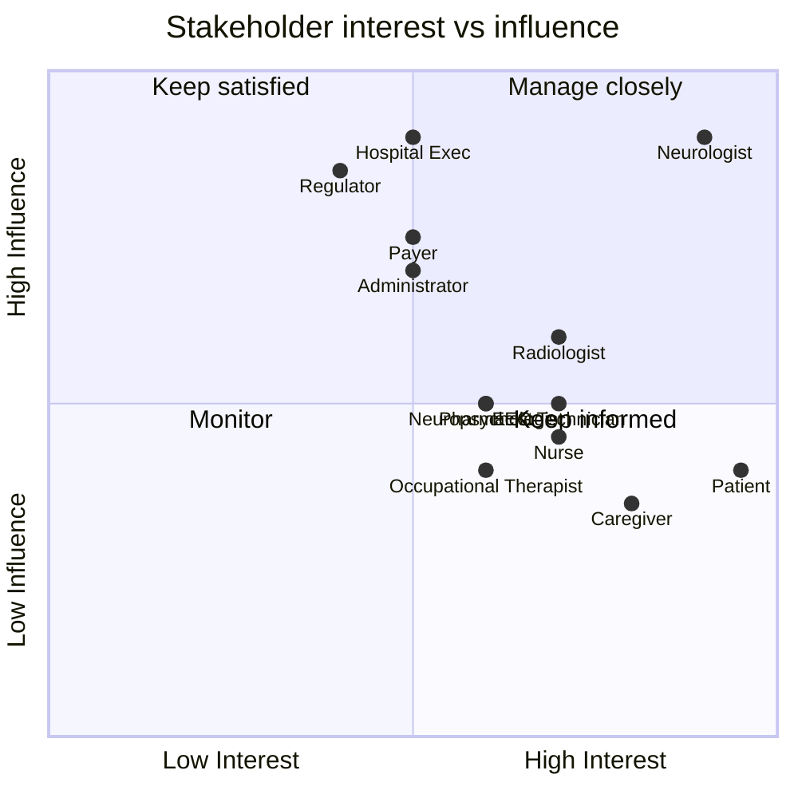

# Stakeholder Matrix (Epilepsy Intelligence Platform)

> **Why (this doc):** Identifies every stakeholder, their interest and influence, needs, pain
> points, and the platform's engagement strategy — the basis for adoption and change management.
> **How:** an interest/influence matrix plus a detail table; pain points link to the
> [pain-point register](primary-assessment/pain-points-register.md).

## Interest / influence grid

*Caption - Positions each stakeholder by influence over, and interest in, the platform (manage-closely / keep-satisfied / keep-informed / monitor).*

**Reason:** To prioritise stakeholder engagement effort. **Why:** Limited change-management capacity must target high-influence, high-interest actors. **What is happening:** Clinicians and execs sit in *manage closely*; patients/caregivers are high-interest, lower-influence (*keep informed*). **How it is happening:** Positions derive from role in the clinical + governance workflow. **Reference:** Freeman (2010).

## Stakeholder detail

*Caption - Interest, influence, needs, key pains, engagement strategy, and data owned per stakeholder.*

| Stakeholder | Category | Interest | Influence | Key needs | Key pain points | Engagement | Data owned |
|---|---|---|---|---|---|---|---|
| Neurologist | Clinical (primary) | High | High | Accurate classification, localisation, decision support | Fragmented data, breakthrough seizures, time pressure | Co-design, human-in-the-loop authority | Clinical vector, diagnosis |
| EEG Technician | Clinical (acquisition) | High | Medium | Clean signal, clear protocol | Impedance/artifact, non-protocol scans | Protocol + QC tooling | EEG acquisition/QC |
| Radiologist | Clinical (imaging) | High | Medium-High | Epilepsy-protocol MRI, concordance | Low-field MRI misses MTS, discordance, turnaround | Structured reporting, concordance view | Imaging findings |
| Nurse | Clinical (observation) | High | Medium | Safe monitoring, rescue meds | Injury risk, adherence gaps | Observation charts, alerts | Vitals, obs, safety |
| Neuropsychologist | Clinical (cognition) | Medium-High | Medium | Cognitive/mood profile | Test time, comorbidity load | Standardised batteries | Cognition, mood |
| Pharmacist | Clinical (medication) | Medium-High | Medium | Optimal ASM regimen | Drug resistance, interactions, levels | TDM + interaction screen | Regimen, levels |
| Patient | Recipient | Very High | Low-Medium | Fewer seizures, independence, QoL | Fear, driving loss, side-effects | Mobile app, PRO capture, education | PROs, diary |
| Caregiver | Support | High | Low-Medium | Confidence, support | Witnessed burden, distress | Home tools, rescue training | Observations, burden |
| Occupational Therapist | Clinical (function) | Medium-High | Low-Medium | Return-to-work, safety | Functional decline, home hazards | Participation map | Function, ADL |
| Administrator | Operational | Medium | High | Throughput, coding, compliance | Scheduling, authorisation, records | Workflow integration | Encounter/admin |
| Hospital Executive | Governance | Medium | High | ROI, safety, reputation | Cost, risk, adoption | Business case, KPIs | — |
| Regulator | Governance | Medium | High | Safety, compliance | Autonomous-diagnosis risk | Compliance evidence (SaMD/AI Act) | Audit access |
| Payer | Financial | Medium | High | Outcomes, cost-effectiveness | Unnecessary visits/admissions | Value evidence | Claims |

## Professor Readiness (Defense Q&A)

**Q1: Who are the highest-priority stakeholders?** Neurologists and hospital executives/regulators (high influence + interest) — they gate clinical adoption and approval.

**Q2: Why are patients "keep informed" not "manage closely"?** They have the highest interest but lower formal influence over deployment; they are engaged via the mobile app and PRO capture, and their outcomes are the ultimate KPI.

**Q3: How does this connect to the design?** Each stakeholder's pain points (see the register) map to a platform capability and a role assessment, ensuring the build is problem-driven.

## References

Freeman, R. E. (2010). *Strategic management: A stakeholder approach*. Cambridge University Press.

Topol, E. J. (2019). *Deep medicine*. Basic Books.
