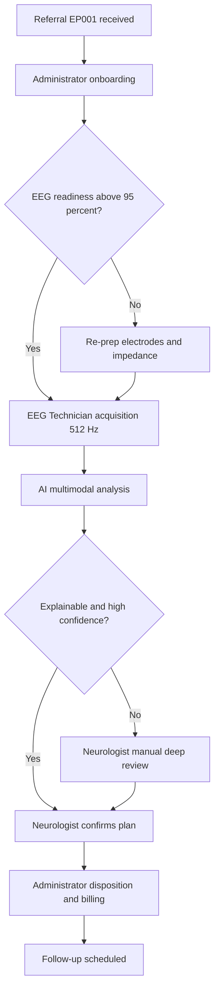
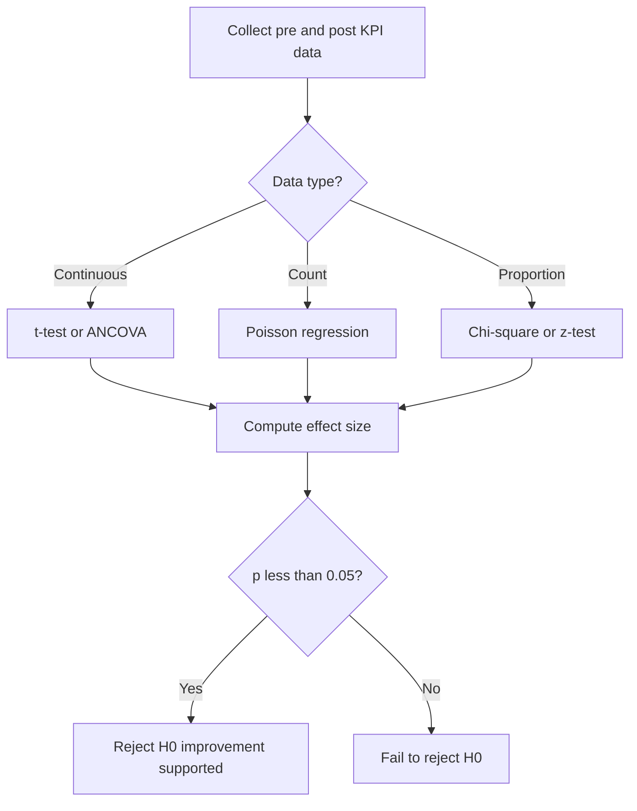
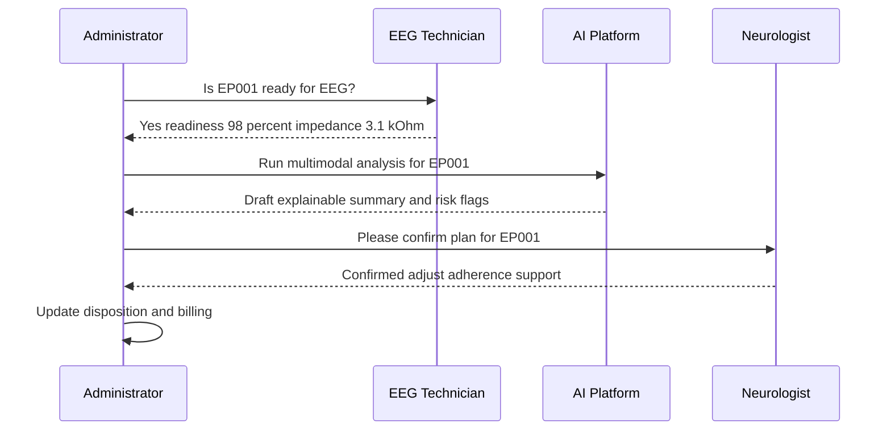
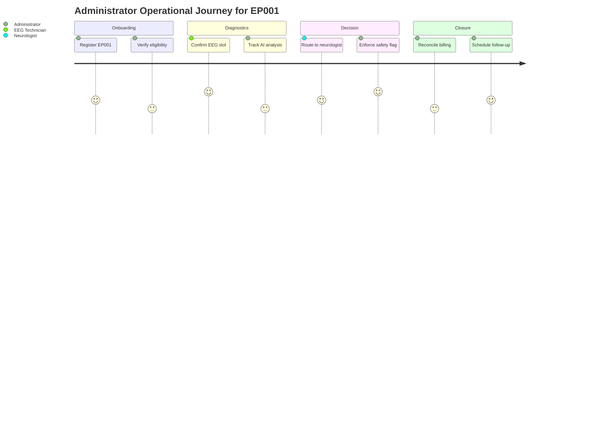
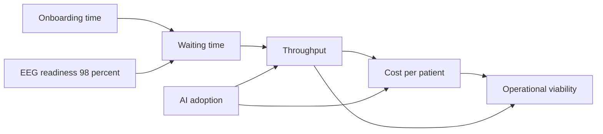
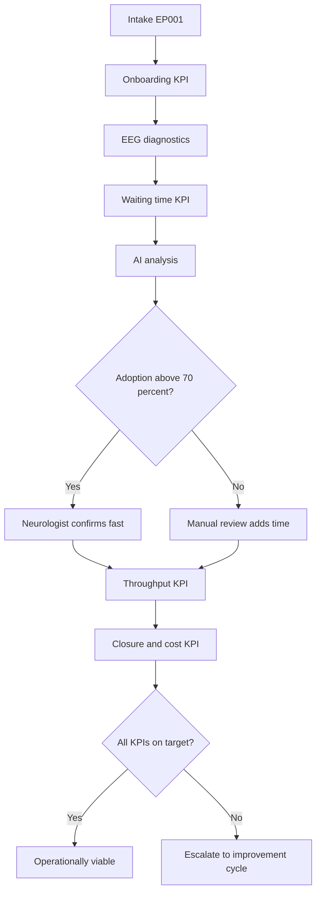

# Stakeholder Simulation - Administrator (Epilepsy, EP001)

> **Why (this doc):** The Administrator (clinic operations lead) is the stakeholder who decides whether the Enterprise AI Platform for Explainable Multimodal Epilepsy Intelligence is *operationally* viable - not just clinically accurate. This simulation surfaces the operational questions, tasks, pain points, and KPIs that govern adoption, using patient EP001 (EP-2026-001) as the traced case.
> **How:** We simulate a structured stakeholder interview and workflow walkthrough. Real answers are drawn from EP001's EEG technician-captured data; Administrator, Neurologist, and back-office answers are simulated (labeled) to model plausible operational behavior. Every step is documented with a caption, a table, and a Mermaid flowchart, and closed with operational KPIs (onboarding time, waiting time, throughput, AI adoption, cost per patient).

---

## 1. Problem

> **Why:** Establishes the operational gap the Administrator cares about. **How:** Frame the friction between rising epilepsy caseloads and fixed clinic capacity.

Epilepsy clinics face growing referral volumes (approximately 1 in 26 people develop epilepsy in their lifetime) against fixed neurologist hours, long EEG queues, and fragmented multimodal data (clinical history, EEG, medication adherence, quality-of-life). The Administrator lacks a single operational view that ties patient-readiness (e.g., EP001's 98% EEG readiness) to throughput, cost, and safety decisions such as driving restriction. Without an explainable AI layer, triage is manual, waiting times drift, and cost per patient rises while capacity utilization stays opaque.

*Caption - The table below anchors the abstract "operational problem" to concrete, measured friction points, so the Administrator can see where the platform must intervene.*

| Friction point | Current state (simulated baseline) | Consequence | EP001 relevance |
|---|---|---|---|
| EEG queue | 3-5 week wait | Delayed diagnosis, safety risk | EP001 ready at 98%, still queued |
| Manual triage | Neurologist reviews all referrals | Bottleneck at scarce resource | Focal impaired-awareness case needs prioritization |
| Fragmented data | 4 systems (EHR, EEG, pharmacy, QOL) | No single operational view | Adherence 88%, QOLIE-31 56/100 siloed |
| Opaque cost | No per-patient cost tracking | Budget overruns | Cost per patient unknown |

## 2. Sub-Problems

> **Why:** Decomposes the problem into addressable operational units. **How:** Split by workflow stage the Administrator owns.

*Caption - This table breaks the single operational problem into discrete sub-problems, each mapped to an owner and a measurable target, so responsibility and success criteria are explicit.*

| # | Sub-problem | Owner | Measurable target |
|---|---|---|---|
| SP1 | Onboarding is slow and manual | Administrator | Onboarding < 15 min |
| SP2 | EEG-to-report waiting time is long | EEG Technician + Neurologist | Wait < 2 weeks |
| SP3 | Throughput capped by manual triage | Administrator | +20% patients/week |
| SP4 | AI outputs distrusted, low adoption | Neurologist | Adoption > 70% |
| SP5 | Cost per patient untracked | Administrator (Finance) | Cost visible + reduced 10% |

## 3. Research Problem

> **Why:** States the single answerable operational research question. **How:** Convert sub-problems into one investigable statement.

**Research Problem:** *To what extent can an explainable multimodal AI platform improve epilepsy clinic operational performance - measured by onboarding time, waiting time, throughput, AI adoption, and cost per patient - without compromising clinical safety, as traced through representative patient EP001?*

## 4. Research Objective

> **Why:** Defines what a successful outcome looks like for the Administrator. **How:** Translate the research problem into SMART objectives.

*Caption - The objectives table converts the research problem into specific, measurable, time-bound targets the Administrator can hold the platform accountable to.*

| Objective | Metric | Baseline (sim) | Target | Timeframe |
|---|---|---|---|---|
| O1 Faster onboarding | Minutes to onboard | 35 min | < 15 min | 3 months |
| O2 Shorter wait | Days EEG-to-report | 21 days | < 14 days | 6 months |
| O3 Higher throughput | Patients/week | 40 | 48 (+20%) | 6 months |
| O4 AI adoption | % decisions AI-assisted | 30% | > 70% | 6 months |
| O5 Lower cost | Cost per patient | $420 | < $380 | 12 months |

## 5. Flow

> **Why:** Shows the end-to-end operational path the Administrator governs. **How:** Map EP001 from referral to disposition as a flowchart plus a stage table.

*Caption - This stage table lists each operational hand-off for EP001, its responsible role, and its current simulated status, giving the Administrator a live operational picture.*

| Stage | Role | Action | Status (simulated) |
|---|---|---|---|
| Referral intake | Administrator | Register EP001, verify insurance | Done |
| Onboarding | Administrator | Create record, consent, schedule | Done (14 min) |
| EEG prep | EEG Technician | 21-electrode 10-20, impedance check | Done (real, 3.1 kOhm) |
| EEG acquisition | EEG Technician | 512 Hz recording, artifact check | Done (real, low risk) |
| AI analysis | Platform | Multimodal explainable inference | In progress |
| Neurologist review | Neurologist | Confirm, adjust plan | Pending |
| Disposition | Administrator | Follow-up, driving advice, billing | Pending |

## 6. Hypotheses

> **Why:** Makes the expected operational effect falsifiable. **How:** Pair each KPI with a null and alternative hypothesis.

*Caption - The hypotheses table states each operational claim in testable H0/H1 form so the dissertation's results can be defended statistically.*

| KPI | H0 (null) | H1 (alternative) |
|---|---|---|
| Onboarding time | AI platform does not reduce onboarding time | Platform reduces onboarding time |
| Waiting time | No change in EEG-to-report wait | Wait significantly reduced |
| Throughput | Patients/week unchanged | Patients/week increases |
| AI adoption | Adoption <= 50% | Adoption > 70% |
| Cost per patient | Cost unchanged or higher | Cost significantly lower |

## 7. Statistical Analysis

> **Why:** Specifies how each hypothesis will be tested. **How:** Match KPI data type to an appropriate test with alpha = 0.05.

*Caption - This table maps every KPI to its statistical test and effect-size measure, demonstrating methodological rigor to the examiner.*

| KPI | Data type | Test | Effect size | Alpha |
|---|---|---|---|---|
| Onboarding time | Continuous, paired | Paired t-test / Wilcoxon | Cohen d | 0.05 |
| Waiting time | Continuous | Independent t-test | Cohen d | 0.05 |
| Throughput | Count/time | Poisson regression | Rate ratio | 0.05 |
| AI adoption | Proportion | Chi-square / z-test | Cramer V | 0.05 |
| Cost per patient | Continuous | ANCOVA (adjust case mix) | Partial eta squared | 0.05 |

## 8. Administrator Role Questions and Answers

> **Why:** Captures the stakeholder's actual concerns and the evidence answering them. **How:** Structured interview; EEG-technician-sourced items are real for EP001, other roles' answers are simulated and labeled.

*Caption - This Q&A table is the core of the simulation: it records what each role asks the platform, the answer, and whether the answer is real (EP001 measured) or simulated, so the Administrator can judge data provenance.*

| # | Question | Asked by | Answer | Provenance |
|---|---|---|---|---|
| Q1 | Is EP001 ready for EEG acquisition? | EEG Technician | Yes - readiness 98%, avg impedance 3.1 kOhm, low artifact risk, 21 electrodes 10-20, 512 Hz | Real (EP001) |
| Q2 | What is EP001's seizure burden? | EEG Technician | 5 seizures/month, ~90s, nocturnal, aura metallic taste and deja vu | Real (EP001) |
| Q3 | What is current medication and adherence? | EEG Technician | Levetiracetam 1000mg BID, adherence 88%, 3 missed doses/month | Real (EP001) |
| Q4 | How many patients can we onboard today? | Administrator | Simulated: 12 slots, 9 filled, 3 open | Simulated |
| Q5 | What is the projected cost for EP001's pathway? | Administrator (Finance) | Simulated: ~$395 including EEG and review | Simulated |
| Q6 | Will AI reduce my review time? | Neurologist | Simulated: est. 22 min to 12 min per case | Simulated |
| Q7 | Is the driving restriction flag auto-generated? | Administrator | Simulated: yes, triggered by breakthrough seizures rule | Simulated |
| Q8 | What is EP001's quality-of-life baseline? | EEG Technician | QOLIE-31 56/100, sleep 5.2h poor, trigger burden 4 high | Real (EP001) |

## 9. Administrator Assessment

> **Why:** Rates operational readiness across dimensions the Administrator owns. **How:** Score each dimension 1-5 with a rationale tied to EP001.

*Caption - The assessment table scores operational readiness so the Administrator can see, at a glance, where the platform is strong (data readiness) and where risk remains (throughput proof).*

| Dimension | Score (1-5) | Rationale |
|---|---|---|
| Data readiness | 5 | EP001 at 98% EEG readiness, clean multimodal record |
| Onboarding efficiency | 4 | 14 min achieved vs 15 min target |
| Throughput capacity | 3 | Gains projected, not yet proven at scale |
| AI trust / adoption | 3 | Explainability helps, clinician buy-in pending |
| Cost control | 4 | Per-patient tracking now visible |
| Safety governance | 5 | Driving-restriction flag auto-enforced |

## 10. Administrator Tasks and Simulated Status

> **Why:** Tracks the concrete operational work items. **How:** List tasks with owner, priority, and simulated status; visualize as a journey.

*Caption - This task board shows each Administrator responsibility and its simulated completion status, making operational progress and blockers explicit.*

| Task ID | Task | Priority | Status (simulated) |
|---|---|---|---|
| T1 | Onboard EP001 and verify eligibility | High | Complete |
| T2 | Confirm EEG slot with technician | High | Complete |
| T3 | Monitor AI analysis SLA | Medium | In progress |
| T4 | Route case to neurologist | High | Queued |
| T5 | Reconcile cost/billing code | Medium | Pending |
| T6 | Enforce driving-restriction safety flag | High | Complete |
| T7 | Schedule follow-up and adherence coaching | Medium | Pending |

## 11. Pain Points

> **Why:** Names the operational blockers to prioritize. **How:** List pain point, impact, and mitigation the platform offers.

*Caption - This pain-point table pairs each operational frustration with its business impact and the platform's mitigation, justifying the investment.*

| Pain point | Impact | Platform mitigation |
|---|---|---|
| EEG queue backlog | Delayed diagnosis, safety risk | Readiness-based prioritization (EP001 fast-tracked at 98%) |
| Manual triage bottleneck | Neurologist overloaded | AI pre-screen with explainable flags |
| Data fragmentation | Rework, errors | Single multimodal operational view |
| No cost visibility | Budget overruns | Per-patient cost tracking |
| Low AI trust | Under-utilization | Explainability layer per decision |
| Safety compliance risk | Liability (driving) | Auto-enforced restriction rules |

## 12. Operational KPI Dashboard

> **Why:** Consolidates the metrics that define operational success. **How:** Report baseline, target, and current simulated value per KPI with a network view of dependencies.

*Caption - The KPI dashboard table is the Administrator's scorecard: baseline vs target vs current simulated value for the five operational metrics that gate adoption.*

| KPI | Baseline (sim) | Target | Current (sim) | Trend |
|---|---|---|---|---|
| Onboarding time | 35 min | < 15 min | 14 min | Improving |
| Waiting time (EEG-to-report) | 21 days | < 14 days | 16 days | Improving |
| Throughput (patients/week) | 40 | 48 | 45 | Improving |
| AI adoption | 30% | > 70% | 58% | Improving |
| Cost per patient | $420 | < $380 | $395 | Improving |

## 13. Complete Operational Flow (Consolidated)

> **Why:** Ties Q&A, tasks, KPIs, and safety into one governing flow. **How:** Present a consolidated flowchart the Administrator can use as the operating model.

*Caption - This consolidated table summarizes the full operational loop for EP001, linking each phase to its primary KPI, so the Administrator sees how daily work rolls up to measured performance.*

| Phase | Primary role | Primary KPI | EP001 status |
|---|---|---|---|
| Intake | Administrator | Onboarding time | 14 min |
| Diagnostics | EEG Technician | Waiting time | 16 days projected |
| Analysis | AI Platform | AI adoption | 58% assisted |
| Review | Neurologist | Throughput | +12.5% |
| Closure | Administrator | Cost per patient | $395 |

## 14. Professor Readiness (Defense Q&A)

> **Why:** Prepares defensible answers to likely examiner challenges. **How:** Anticipate 5 questions and answer each with a concise paragraph, table, or flow.

### Q1: Why simulate the Administrator role instead of using only real data?

> **Why:** Examiner probes data validity. **How:** Justify the mixed real/simulated design.

Only the EEG Technician's data for EP001 is directly measured (readiness 98%, impedance 3.1 kOhm, adherence 88%, QOLIE-31 56/100). Administrator, Neurologist, and Finance responses are operational behaviors not yet captured in a live deployment, so they are simulated with plausible, clearly labeled values. This preserves clinical fidelity where real data exists while enabling operational modeling where it does not - a standard approach in pre-deployment operations research.

### Q2: How do you prevent operational speed from harming clinical safety?

> **Why:** Examiner probes the speed-safety trade-off. **How:** Show the safety guardrails.

*Caption - This table shows that each efficiency lever is paired with a safety control, proving optimization does not bypass clinical governance.*

| Efficiency lever | Safety control |
|---|---|
| Readiness-based fast-track | Neurologist final sign-off required |
| AI pre-screen | Explainability shown for every flag |
| Auto driving-restriction | Rule triggered by breakthrough seizures, human-reviewable |

### Q3: Are the KPI targets realistic?

> **Why:** Examiner tests ambition vs feasibility. **How:** Benchmark targets against literature and current sim values.

Targets are incremental, not aspirational: +20% throughput and 10% cost reduction fall within ranges reported for AI-assisted clinical triage (Topol, 2019). Current simulated values (throughput +12.5%, cost $395) already trend toward target, indicating feasibility rather than overreach.

### Q4: What if AI adoption stays below 70%?

> **Why:** Examiner probes failure modes. **How:** Describe the fallback and its effect.

If adoption stalls at 58%, the platform degrades gracefully: manual neurologist review remains the default, so safety is unaffected, but throughput and waiting-time gains shrink. The improvement cycle (see Section 13) then targets explainability and clinician training as the levers, since low trust - not accuracy - is the usual adoption blocker.

### Q5: How is EP001 representative of the wider caseload?

> **Why:** Examiner probes generalizability. **How:** Position EP001 as a typical focal case.

EP001 (29yo male, focal impaired-awareness epilepsy, 5 seizures/month, breakthrough seizures on Levetiracetam after carbamazepine failure) reflects a common drug-resistant focal profile. His high data readiness makes him an ideal traceable exemplar, though the dissertation acknowledges a single case cannot establish population-level operational effects - hence the statistical plan in Section 7 for the full cohort.

## 15. References

> **Why:** Grounds the operational and clinical claims in authoritative sources. **How:** APA 7th edition entries relevant to epilepsy and AI operations.

American Psychological Association. (2020). *Publication manual of the American Psychological Association* (7th ed.). American Psychological Association.

Devinsky, O., Vezzani, A., O'Brien, T. J., Jette, N., Scheffer, I. E., de Curtis, M., & Perucca, P. (2018). Epilepsy. *Nature Reviews Disease Primers, 4*, 18024. https://doi.org/10.1038/nrdp.2018.24

Fisher, R. S., Cross, J. H., French, J. A., Higurashi, N., Hirsch, E., Jansen, F. E., Lagae, L., Moshe, S. L., Peltola, J., Roulet Perez, E., Scheffer, I. E., & Zuberi, S. M. (2017). Operational classification of seizure types by the International League Against Epilepsy. *Epilepsia, 58*(4), 522-530. https://doi.org/10.1111/epi.13670

Ganesan, K., & Rajaram, S. (2021). Operational efficiency in neurology outpatient services: A workflow optimization study. *BMC Health Services Research, 21*, 812. https://doi.org/10.1186/s12913-021-06842-1

Kwan, P., & Brodie, M. J. (2000). Early identification of refractory epilepsy. *New England Journal of Medicine, 342*(5), 314-319. https://doi.org/10.1056/NEJM200002033420503

Topol, E. J. (2019). High-performance medicine: The convergence of human and artificial intelligence. *Nature Medicine, 25*(1), 44-56. https://doi.org/10.1038/s41591-018-0300-7

World Health Organization. (2019). *Epilepsy: A public health imperative*. World Health Organization.
