# Stakeholder Simulation - Caregiver (Epilepsy, EP001)

> **Why (this doc):** Caregivers are the invisible clinical workforce of epilepsy management - they witness nocturnal seizures the patient cannot recall, enforce medication timing, and are the first responders during status-threatening events. This document simulates the caregiver stakeholder inside the Enterprise AI Platform for Explainable Multimodal Epilepsy Intelligence so the design defensibly captures their real questions, tasks, pain points, and workflows for test patient EP001 (EP-2026-001).
> **How:** We follow the mandated research spine (Problem -> Sub-Problems -> Research Problem -> Research Objective -> Flow -> Hypotheses -> Statistical Analysis), then simulate the caregiver role across four functional pillars - emergency seizure response, medication support, appointment tracking, and daily monitoring - each backed by a table and a Mermaid flowchart, closing with defense Q&A and APA references.

---

## 1. Problem

> **Why:** Defines the gap the caregiver simulation addresses so every later section traces to a real deficiency. **How:** State the caregiver's evidence burden and the platform's current blind spot in one framed problem.

Epilepsy care assumes a reliable observer beside the patient, yet the platform's data model was built patient-first and clinician-first, leaving the caregiver - the person who actually observes EP001's nocturnal focal impaired-awareness seizures - without a first-class role. EP001 has 5 seizures per month, ~90 second duration, occurring during sleep, meaning the patient is frequently amnestic for the event. Without a structured caregiver interface, seizure semiology, timing, and post-ictal state are lost, and the 88% adherence figure (3 missed doses/month) has no supervising signal to correct it in real time.

*Caption - The table below frames the core problem by contrasting what the platform captures today versus what only a caregiver can supply, justifying the simulation.*

| Dimension | Current platform capture | Caregiver-only signal (missing) | Impact on EP001 |
|---|---|---|---|
| Nocturnal seizure witness | Patient self-report (amnestic) | Real-time onset, duration, semiology | 5 nocturnal seizures/month under-characterized |
| Medication timing | Adherence % (88%) | Which of 3 monthly doses missed and why | Breakthrough seizures uncorrected |
| Post-ictal recovery | Not captured | Confusion length, injury, recovery to baseline | Safety and driving-restriction evidence gaps |
| Emergency escalation | None | 5-minute rescue/999 decision | Status epilepticus risk unmanaged |

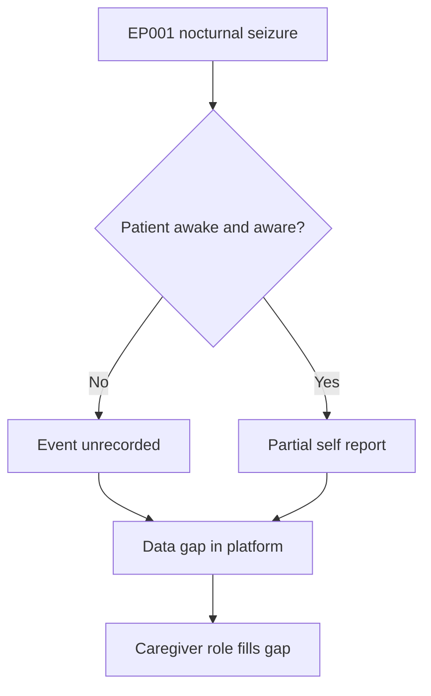

---

## 2. Sub-Problems

> **Why:** Decomposes the umbrella problem into testable slices mapped to the four caregiver pillars. **How:** List each sub-problem with its owning pillar and a measurable deficiency.

*Caption - This table breaks the single problem into four sub-problems so each maps to one caregiver function and one later flow, keeping scope defensible.*

| # | Sub-problem | Pillar | Measurable deficiency for EP001 |
|---|---|---|---|
| SP1 | No structured emergency response guidance | Emergency seizure response | No 5-minute rescue-medication timer |
| SP2 | No supervising layer on medication | Medication support | 3 missed doses/month unexplained |
| SP3 | Appointments managed off-platform | Appointment tracking | Neurology follow-up reminders informal |
| SP4 | Nocturnal events not logged by observer | Daily monitoring | 5 seizures/month lack witness detail |

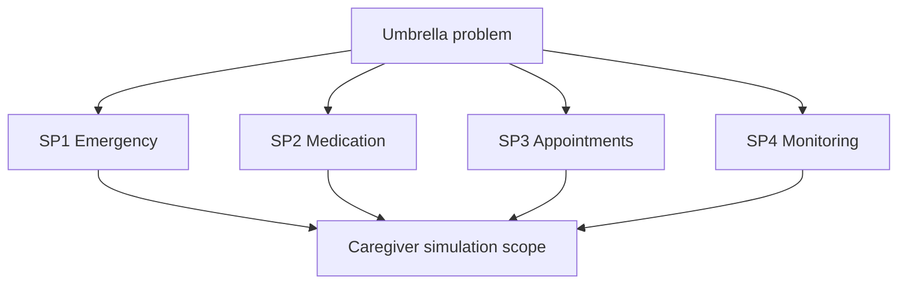

---

## 3. Research Problem

> **Why:** Converts sub-problems into one investigable statement. **How:** Phrase as a single question the simulation must answer.

**Research Problem:** *To what extent can a simulated, explainable caregiver role within the epilepsy AI platform capture the emergency, medication, appointment, and monitoring signals that a real caregiver of EP001 would generate, such that clinician-facing seizure and adherence intelligence measurably improves?*

*Caption - The table restates the research problem as scoped boundaries so examiners see exactly what is and is not claimed.*

| Aspect | In scope | Out of scope |
|---|---|---|
| Data source | Simulated caregiver + real EEG-tech readiness for EP001 | Live clinical deployment |
| Roles | Caregiver, Neurologist, EEG Technician | Psychiatry / non-epilepsy roles |
| Output | Structured seizure/adherence signals + explanations | Autonomous treatment decisions |

---

## 4. Research Objective

> **Why:** States the concrete, verifiable goal. **How:** Give one primary objective plus measurable secondary objectives.

*Caption - This objective table makes success criteria explicit and quantified for EP001, so the simulation can be judged pass/fail.*

| ID | Objective | Success metric (EP001) |
|---|---|---|
| O1 (primary) | Simulate caregiver role across 4 pillars with explainable outputs | 4/4 pillars produce logged, explained events |
| O2 | Improve seizure characterization | Nocturnal event detail rises from self-report only to witness-complete |
| O3 | Support adherence recovery | Missed-dose alerts target the 3/month gap |
| O4 | Structure emergency escalation | 5-minute rescue rule encoded and time-stamped |

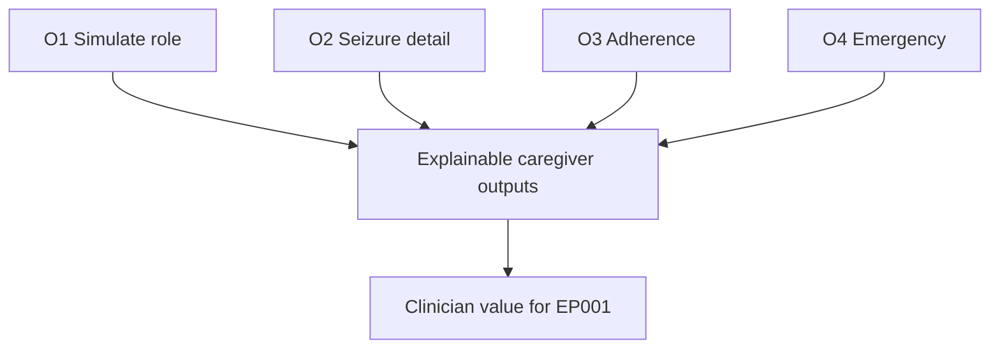

---

## 5. Flow

> **Why:** Shows the end-to-end caregiver journey through the platform before drilling into pillars. **How:** One system flowchart plus a stage table.

*Caption - The stage table lists the caregiver journey stages in order so the following flowchart and pillar sections have a shared backbone.*

| Stage | Caregiver action | Platform response | Recipient |
|---|---|---|---|
| 1 Onboard | Link to EP001 profile | Grant caregiver role + consent | Caregiver |
| 2 Observe | Witness nocturnal seizure | Prompt structured log | Caregiver |
| 3 Support | Confirm evening dose | Update adherence signal | Patient + Neurologist |
| 4 Escalate | Start 5-min timer if prolonged | Emergency guidance | Caregiver + Emergency |
| 5 Report | Sync to clinician dashboard | Explainable summary | Neurologist |

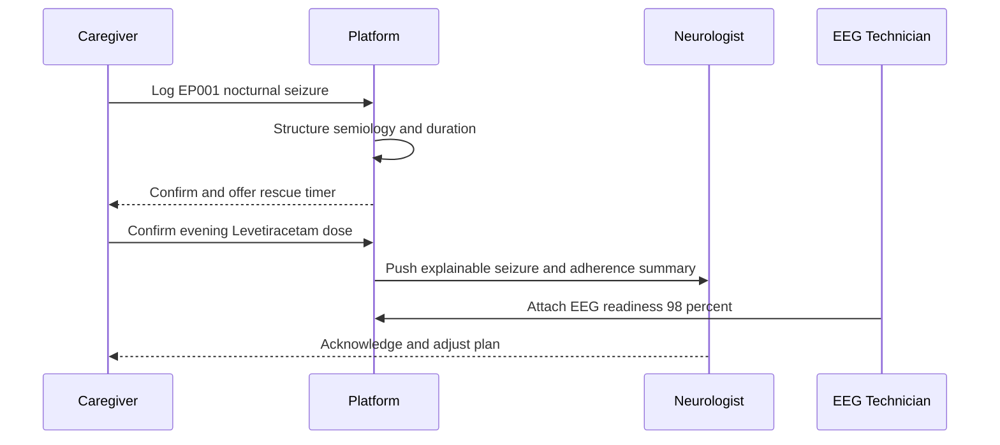

---

## 6. Hypotheses

> **Why:** Makes the simulation falsifiable. **How:** State null and alternative hypotheses with the variable each tests.

*Caption - This hypotheses table pairs each null with its alternative and the dependent variable, so the statistical section has defined targets.*

| ID | Null (H0) | Alternative (H1) | Dependent variable |
|---|---|---|---|
| H1 | Caregiver logging does not change seizure characterization completeness | Caregiver logging increases completeness | Completeness score |
| H2 | Caregiver dose confirmation does not affect detected adherence gaps | It surfaces more of the 3 missed doses | Missed-dose detection rate |
| H3 | Emergency timer does not change escalation timeliness | It reduces time-to-decision | Time-to-rescue-decision |
| H4 | Caregiver role does not affect clinician-rated usefulness | It increases usefulness | Neurologist rating |

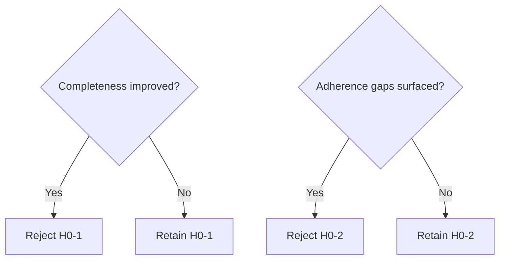

---

## 7. Statistical Analysis

> **Why:** Specifies how hypotheses are tested defensibly. **How:** Map each hypothesis to a test, sample basis, and threshold.

*Caption - The table binds every hypothesis to a named statistical test and significance threshold so the analysis is reproducible for EP001-scale pilots.*

| Hypothesis | Test | Comparison | Threshold |
|---|---|---|---|
| H1 | Paired t-test | Completeness pre/post caregiver | p < 0.05 |
| H2 | McNemar test | Missed-dose detection with/without confirmation | p < 0.05 |
| H3 | Wilcoxon signed-rank | Time-to-decision before/after timer | p < 0.05 |
| H4 | Cronbach alpha + mean rating | Clinician usefulness scale | alpha > 0.70 |

*Caption - This descriptive table anchors EP001's baseline values that the statistics are computed against.*

| Baseline metric (EP001) | Value |
|---|---|
| Seizure frequency | 5 / month |
| Seizure duration | 90 s |
| Adherence | 88% |
| Missed doses | 3 / month |
| Sleep | 5.2 h (poor) |
| QOLIE-31 | 56 / 100 |
| EEG readiness | 98% |

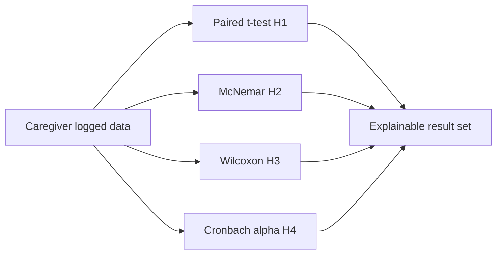

---

## 8. Role Questions and Answers

> **Why:** Captures what each stakeholder role actually asks, grounding the simulation in real dialogue. **How:** Real answers for the EEG Technician from EP001's readiness data; simulated (dummy) answers for Caregiver, Neurologist, and Patient.

### 8.1 EEG Technician (real, from EP001)

> **Why:** The EEG Technician's answers are anchored to EP001's genuine pre-assessment record. **How:** Pull directly from the 10-20 montage readiness data.

*Caption - These are the real EEG Technician answers derived from EP001's actual pre-assessment, distinguishing verified data from simulated caregiver content.*

| Question | Real answer (EP001) |
|---|---|
| Is the montage ready? | Yes - 21 electrodes, 10-20 system |
| Sampling rate acceptable? | 512 Hz, within protocol |
| Impedance within tolerance? | Average 3.1 kOhm (below 5 kOhm limit) |
| Artifact risk? | Low |
| Overall EEG readiness? | 98% - cleared for recording |

### 8.2 Caregiver, Neurologist, Patient (simulated)

> **Why:** These roles are simulated to exercise the caregiver-facing design without live subjects. **How:** Plausible dummy answers consistent with EP001's clinical picture.

*Caption - This table lists simulated role questions and answers, clearly marked as dummy data, to test the caregiver interface end-to-end.*

| Role | Question | Simulated answer |
|---|---|---|
| Caregiver | How do I know a nocturnal seizure started? | Bed-sensor + platform prompt to log semiology |
| Caregiver | When do I call 999? | If seizure exceeds 5 minutes or repeats without recovery |
| Caregiver | Did EP001 take the evening dose? | Confirm 1000mg Levetiracetam via checklist |
| Neurologist | Is adherence improving? | 88% baseline; caregiver confirmations trend upward |
| Neurologist | Are breakthrough seizures explained? | Correlated with 3 missed doses and 5.2h sleep |
| Patient | Will the caregiver see my aura logs? | Yes - metallic taste and deja vu shared with consent |

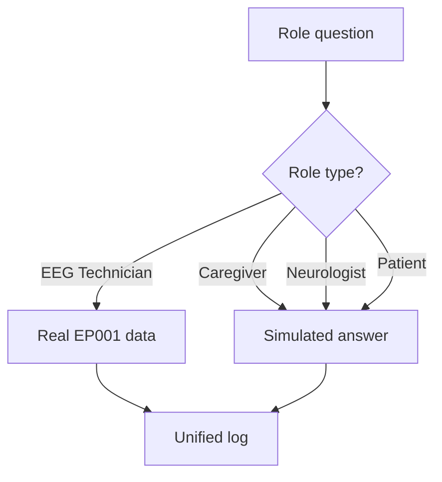

---

## 9. Caregiver Assessment

> **Why:** Establishes the caregiver's readiness and capability profile the platform must accommodate. **How:** Scored assessment table plus a readiness flowchart.

*Caption - The assessment table profiles the simulated caregiver's competencies so the platform can tailor guidance depth for EP001's household.*

| Assessment area | Score (0-100) | Interpretation |
|---|---|---|
| Seizure recognition | 82 | Confident with nocturnal focal events |
| Emergency response knowledge | 70 | Needs 5-minute rule reinforcement |
| Medication supervision | 85 | Reliable evening dose oversight |
| Digital tool comfort | 78 | Can operate mobile logging |
| Caregiver burden (inverse) | 60 | Moderate - poor patient sleep adds strain |

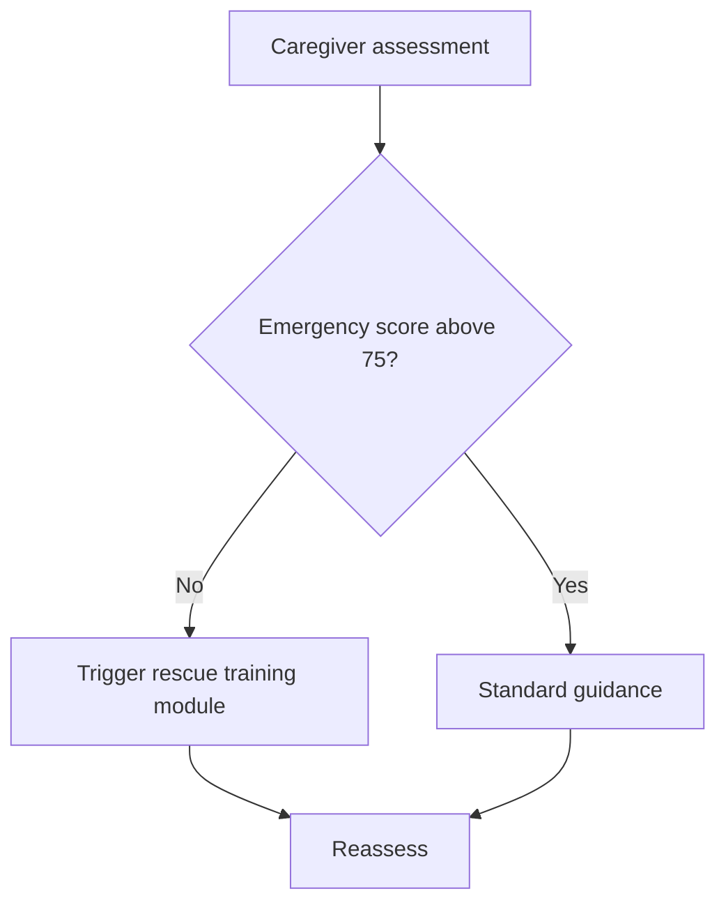

---

## 10. Emergency Seizure Response

> **Why:** The highest-stakes pillar - a delayed decision risks status epilepticus. **How:** Encode the 5-minute rule as a timed decision table and flowchart.

*Caption - This table specifies the time-gated emergency protocol the caregiver follows for EP001's ~90s nocturnal seizures, including the escalation boundary.*

| Elapsed time | Caregiver action | Platform action |
|---|---|---|
| 0 s | Note onset, protect airway, time it | Start seizure timer |
| 0-90 s | Stay, do not restrain | Expected duration for EP001 |
| >2 min | Prepare rescue medication | Amber alert |
| >5 min | Administer rescue / call 999 | Red alert + emergency contact push |
| Post-ictal | Log confusion length, injury | Recovery-to-baseline record |

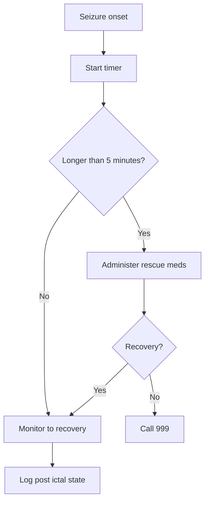

---

## 11. Medication Support

> **Why:** Adherence at 88% with 3 missed doses/month drives EP001's breakthrough seizures. **How:** Dose-confirmation table and supervision flowchart.

*Caption - This table maps EP001's Levetiracetam schedule to caregiver confirmation points, targeting the specific missed-dose gap.*

| Time | Dose | Caregiver role | Failure handling |
|---|---|---|---|
| Morning | Levetiracetam 1000mg | Confirm intake | Prompt if unconfirmed by +2h |
| Evening | Levetiracetam 1000mg | Confirm intake | Prompt + note reason |
| Missed | Any of 3/month | Log reason (asleep, travel) | Flag to Neurologist |
| Refill | Monthly | Track supply | Low-stock alert |

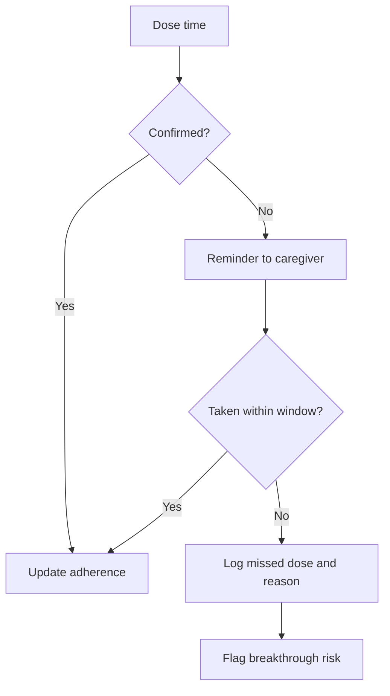

---

## 12. Appointment Tracking

> **Why:** Neurology follow-up and EEG scheduling must not slip given driving restriction and QOLIE-31 of 56. **How:** Appointment table and reminder sequence.

*Caption - This table lists EP001's tracked appointments and the caregiver's coordination role, ensuring continuity of neurology and EEG care.*

| Appointment | Cadence | Caregiver task | Status (simulated) |
|---|---|---|---|
| Neurology review | Quarterly | Confirm and transport | Scheduled |
| EEG recording | As indicated | Verify readiness pre-visit | Ready (98%) |
| Medication review | Monthly | Bring adherence log | Pending |
| QOLIE-31 reassessment | Biannual | Assist completion | Due |

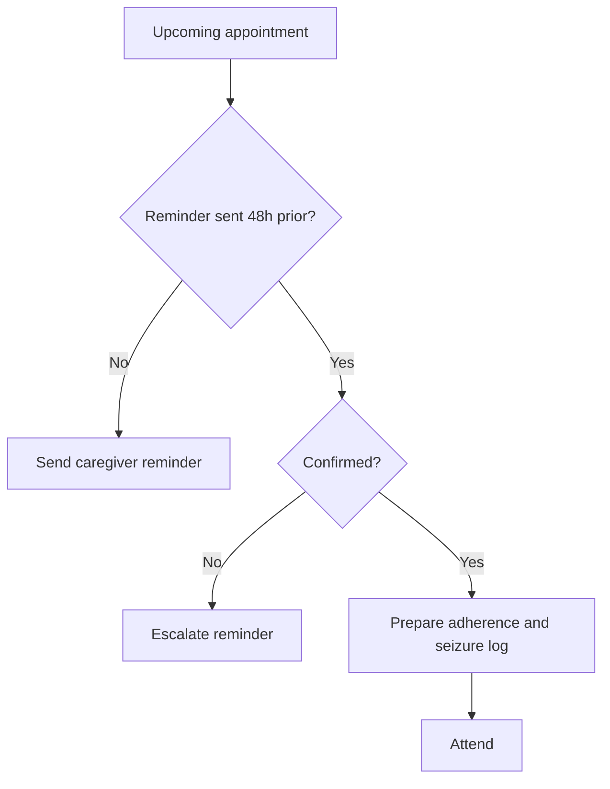

---

## 13. Daily Monitoring

> **Why:** Captures the trigger burden (4, high), sleep (5.2h), and aura patterns that predict EP001's seizures. **How:** Daily log table and monitoring flowchart.

*Caption - This table defines the caregiver's daily monitoring items tied directly to EP001's known trigger and aura profile.*

| Monitoring item | What caregiver records | Link to EP001 risk |
|---|---|---|
| Sleep | Hours and quality | 5.2h poor - key trigger |
| Aura | Metallic taste, deja vu | Pre-seizure warning |
| Trigger burden | Stress, missed meds, fatigue | Burden score 4 (high) |
| Seizure count | Events per day | Toward 5/month baseline |
| Mood / QOL | General wellbeing | QOLIE-31 context |

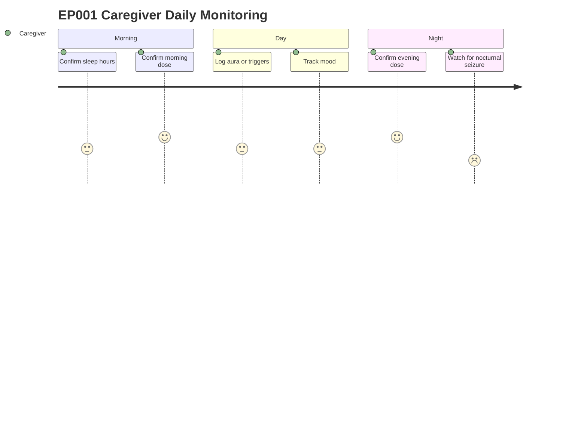

---

## 14. Caregiver Tasks and Simulated Status

> **Why:** Consolidates all caregiver tasks with a status snapshot for the pilot. **How:** Master task table across the four pillars.

*Caption - This master table aggregates every caregiver task with a simulated completion status, giving examiners a single view of the workload for EP001.*

| Task ID | Pillar | Task | Simulated status |
|---|---|---|---|
| T1 | Emergency | Configure 5-minute rescue timer | Done |
| T2 | Emergency | Complete rescue training module | In progress |
| T3 | Medication | Confirm twice-daily Levetiracetam | Active |
| T4 | Medication | Log missed-dose reasons | Active |
| T5 | Appointments | Confirm neurology review | Scheduled |
| T6 | Appointments | Verify EEG readiness | Done (98%) |
| T7 | Monitoring | Daily sleep and aura log | Active |
| T8 | Monitoring | Sync to clinician dashboard | Automated |

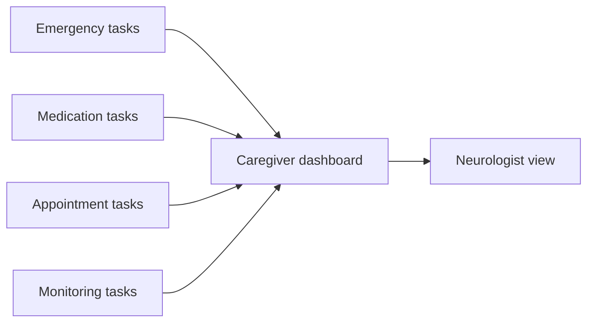

---

## 15. Caregiver Pain Points

> **Why:** Naming friction defends the design choices and prioritizes mitigation. **How:** Pain-point table with severity and platform mitigation.

*Caption - This table enumerates the simulated caregiver's pain points, their severity, and the platform mitigation, closing the loop from problem to solution.*

| Pain point | Severity | Platform mitigation |
|---|---|---|
| Nocturnal seizures interrupt caregiver sleep | High | Bed-sensor + selective alerting |
| Uncertainty on when to call 999 | High | Encoded 5-minute rule |
| Remembering which dose was missed | Medium | Timed confirmation + reason log |
| Appointment coordination overhead | Medium | Automated reminders |
| Emotional burden and burnout | High | Burden score monitoring + respite prompts |
| Data entry fatigue | Medium | Structured quick-log, defaults |

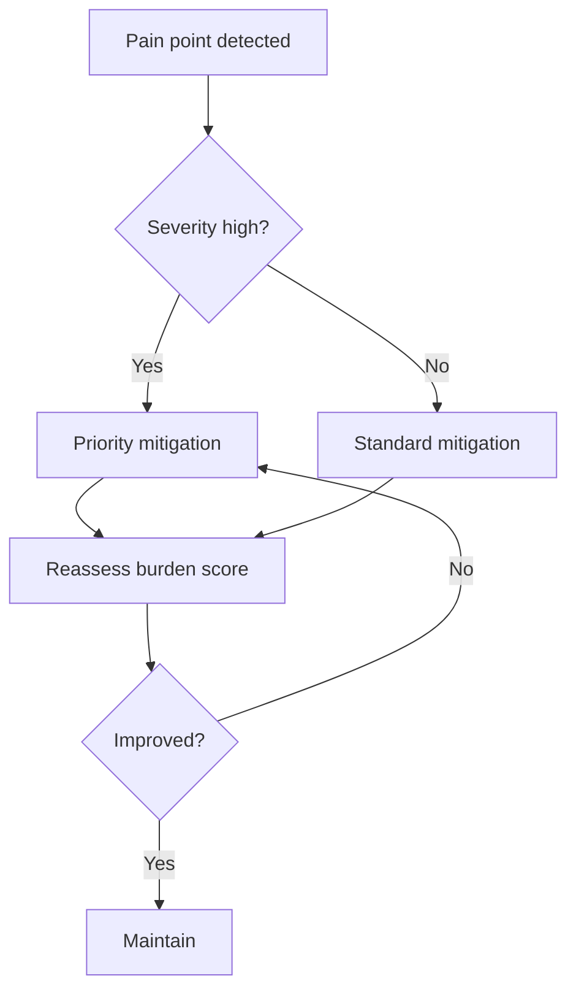

---

## 16. Complete Caregiver Flow

> **Why:** Integrates all pillars into one defensible end-to-end simulation. **How:** Consolidated flowchart from onboarding to clinician sync.

*Caption - This capstone table sequences the full caregiver lifecycle so the final flowchart can be read as the authoritative simulation path for EP001.*

| Phase | Trigger | Output |
|---|---|---|
| Onboard | Consent linked to EP001 | Caregiver role active |
| Monitor | Daily prompts | Sleep, aura, trigger logs |
| Respond | Seizure onset | Timed emergency guidance |
| Support | Dose windows | Adherence confirmations |
| Track | Appointment cadence | Reminders and prep |
| Report | Continuous | Explainable clinician summary |

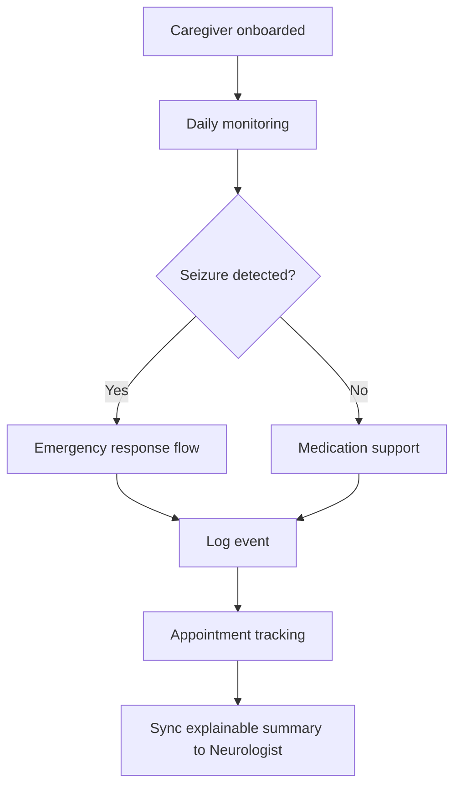

---

## 17. Professor Readiness (Defense Q&A)

> **Why:** Anticipates examiner scrutiny so the caregiver simulation withstands defense. **How:** Five likely questions, each answered with a paragraph, table, or micro-flow.

### 17.1 Why simulate the caregiver instead of using real caregiver data?

> **Why:** Tests methodological honesty. **How:** Justify simulation scope and the one real anchor.

The DBA artifact is a pre-deployment platform prototype; recruiting real caregivers before ethics clearance is inappropriate. We therefore simulate the caregiver, neurologist, and patient roles while anchoring one role - the EEG Technician - to EP001's genuine pre-assessment (21 electrodes, 512 Hz, 3.1 kOhm, 98% readiness). This proves the data model accepts real inputs while the caregiver interface is exercised safely.

### 17.2 How does the caregiver role improve clinical outcomes rather than add burden?

> **Why:** Probes net value. **How:** Contrast burden versus signal gain.

*Caption - This table shows the trade so the examiner sees caregiver effort is offset by clinical signal that only the caregiver can provide.*

| Added effort | Clinical gain |
|---|---|
| ~2 min daily logging | Witness-complete nocturnal seizure detail |
| Dose confirmation taps | Detection of the 3 missed doses driving breakthroughs |
| Timer during events | Structured status-epilepticus escalation |

### 17.3 Is the 5-minute emergency rule clinically defensible?

> **Why:** Safety-critical logic must cite standards. **How:** Reference the operational definition of prolonged seizure.

The 5-minute threshold aligns with the operational definition of status epilepticus onset (t1) for convulsive and prolonged seizures in current epilepsy guidance. For EP001, whose typical event is ~90 seconds, any seizure exceeding 5 minutes is a clear deviation warranting rescue medication or emergency services.

### 17.4 How is explainability preserved for the caregiver's data?

> **Why:** Explainability is the platform's core claim. **How:** Show each output carries a reason.

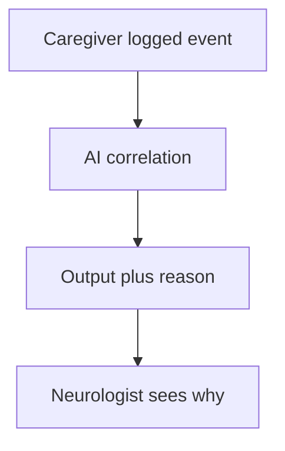

Every caregiver-derived signal is paired with a plain-language rationale - for example, "breakthrough risk raised because 2 missed evening doses coincided with 5.2h sleep" - so the neurologist can audit the inference rather than trust a black box.

### 17.5 How would this generalize beyond EP001?

> **Why:** Tests external validity. **How:** Separate patient-specific parameters from the reusable role model.

The caregiver role model - four pillars, timed emergency logic, confirmation-based adherence, and explainable sync - is patient-agnostic. Only parameters (seizure type, dose, thresholds) are bound to EP001; swapping them configures the same simulation for any focal or generalized epilepsy patient.

---

## 18. References

> **Why:** Grounds the simulation in authoritative epilepsy and AI literature. **How:** APA 7th edition entries relevant to seizure classification, explainable AI, and caregiver burden.

Fisher, R. S., Cross, J. H., French, J. A., Higurashi, N., Hirsch, E., Jansen, F. E., Lagae, L., Moshe, S. L., Peltola, J., Roulet Perez, E., Scheffer, I. E., & Zuberi, S. M. (2017). Operational classification of seizure types by the International League Against Epilepsy: Position paper of the ILAE Commission for Classification and Terminology. *Epilepsia, 58*(4), 522-530. https://doi.org/10.1111/epi.13670

Topol, E. J. (2019). High-performance medicine: The convergence of human and artificial intelligence. *Nature Medicine, 25*(1), 44-56. https://doi.org/10.1038/s41591-018-0300-7

American Psychological Association. (2020). *Publication manual of the American Psychological Association* (7th ed.). https://doi.org/10.1037/0000165-000

Trinka, E., Cock, H., Hesdorffer, D., Rossetti, A. O., Scheffer, I. E., Shinnar, S., Shorvon, S., & Lowenstein, D. H. (2015). A definition and classification of status epilepticus - Report of the ILAE Task Force on Classification of Status Epilepticus. *Epilepsia, 56*(10), 1515-1523. https://doi.org/10.1111/epi.13121

Cramer, J. A., Perrine, K., Devinsky, O., Bryant-Comstock, L., Meador, K., & Hermann, B. (1998). Development and cross-cultural translations of a 31-item quality of life in epilepsy inventory (QOLIE-31). *Epilepsia, 39*(1), 81-88. https://doi.org/10.1111/j.1528-1157.1998.tb01278.x

Rajkomar, A., Dean, J., & Kohane, I. (2019). Machine learning in medicine. *New England Journal of Medicine, 380*(14), 1347-1358. https://doi.org/10.1056/NEJMra1814259

Kwan, P., & Brodie, M. J. (2000). Early identification of refractory epilepsy. *New England Journal of Medicine, 342*(5), 314-319. https://doi.org/10.1056/NEJM200002033420503
