# Stakeholder Simulation - EEG Technician (Epilepsy, EP001)

> **Why (this doc):** The EEG Technician is the frontline gatekeeper of signal quality for the Enterprise AI Platform for Explainable Multimodal Epilepsy Intelligence; if the technician's pre-EEG questions, checks, and setup are weak, every downstream model (seizure detection, spike localization, explainability) inherits garbage input for patient EP001. This document simulates that human-in-the-loop role end to end.
> **How:** It walks the research spine (Problem to Statistical Analysis), then simulates the technician's real role questions with answers, the pre-EEG assessment using EP001 data (impedance 3.1 kOhm, low artifact risk, 98% readiness), tasked workflow with simulated status, pain points, and a complete flow, each backed by a captioned table and a Mermaid diagram.

---

## 1. Problem

> **Why:** Poor EEG acquisition is the single largest preventable cause of non-diagnostic epilepsy studies, wasting clinician time and delaying EP001's treatment decisions. **How:** We frame the acquisition-quality gap as a measurable platform problem the technician role must close.

Epilepsy diagnosis and monitoring depend on clean scalp EEG, yet a large fraction of recordings are degraded by high electrode impedance, muscle and movement artifact, and inadequate patient preparation (e.g., missed sleep-deprivation protocol or unlogged anti-seizure medication). For EP001, a 29-year-old male with focal impaired awareness epilepsy and nocturnal seizures, a degraded recording risks missing the very interictal spikes and focal slowing that localize his epileptogenic zone. The platform therefore cannot treat the EEG Technician as a passive operator; the role must be modeled, instrumented, and quality-gated.

*Caption - The table below decomposes the acquisition problem into observable failure modes so each can be assigned a control owned by the technician role.*

| Failure mode | Downstream impact for EP001 | Current control | Platform gap |
|---|---|---|---|
| High impedance (>10 kOhm) | Attenuated signal, false flatlines | Manual paste re-prep | No live per-channel threshold gate |
| Muscle/EMG artifact | Masks temporal spikes | Ask patient to relax | No automated artifact confidence score |
| Movement/electrode pop | Broadband transients, false detections | Re-seat electrode | No real-time movement flag |
| Missing prep metadata | Model runs on wrong context | Paper checklist | No structured pre-EEG capture |

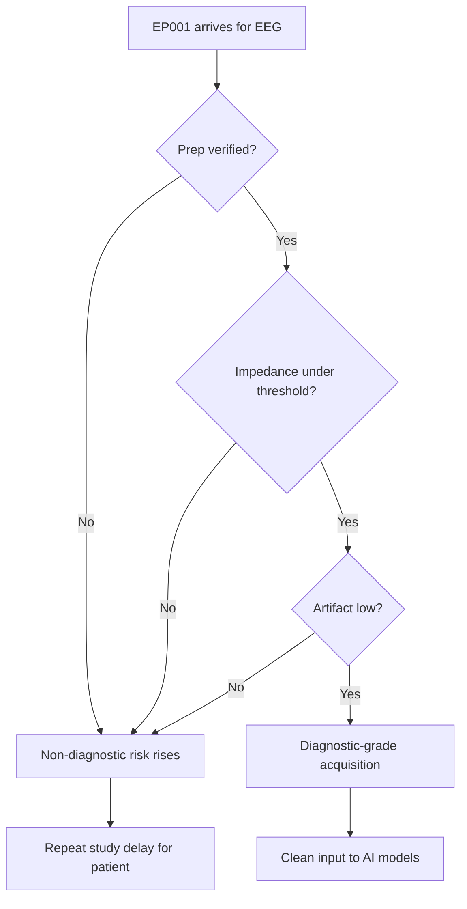

---

## 2. Sub-Problems

> **Why:** The umbrella problem is too broad to test; splitting it exposes discrete, measurable technician-owned levers. **How:** We enumerate sub-problems that each map to one assessment metric and one hypothesis.

*Caption - This table converts the single acquisition problem into testable sub-problems, each tied to an EP001 measurement so the research stays falsifiable.*

| # | Sub-problem | Measured on EP001 as | Owning control |
|---|---|---|---|
| SP1 | Are the technician's pre-EEG questions capturing decision-relevant context? | Prep metadata completeness | Structured question set |
| SP2 | Is electrode impedance driven low enough for clean signal? | 3.1 kOhm average | Impedance gate |
| SP3 | Is artifact risk objectively scored, not guessed? | Low artifact classification | Artifact model |
| SP4 | Does readiness translate into a go/no-go decision? | 98% readiness score | Readiness gate |
| SP5 | Are pain points visible enough to be improved? | Logged incident rate | Pain-point telemetry |

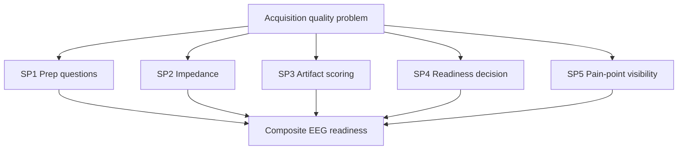

---

## 3. Research Problem

> **Why:** A single sentence anchors the whole study and keeps the simulation defensible. **How:** We state one researchable question that the technician simulation must answer with EP001 data.

**Research Problem:** *Can a structured, AI-instrumented EEG Technician workflow reliably convert patient preparation and electrode setup into a quantified, explainable EEG readiness decision that is safe to gate downstream epilepsy models on?*

*Caption - The table below shows how the research problem is bounded so it neither overreaches into clinical diagnosis nor shrinks into pure device operation.*

| Boundary | In scope | Out of scope |
|---|---|---|
| Actor | EEG Technician role | Neurologist diagnosis |
| Patient | EP001 pre-EEG state | Post-hoc seizure classification |
| Output | Readiness score + go/no-go | Treatment change |
| Data | Impedance, artifact, prep | Long-term outcomes |

---

## 4. Research Objective

> **Why:** Objectives make the problem operational and give the simulation success criteria. **How:** We list SMART objectives mapped to the sub-problems above.

*Caption - Each objective is paired with a concrete EP001 target so the simulation can be scored pass/fail, not merely described.*

| Objective | Maps to | EP001 target | Result in sim |
|---|---|---|---|
| O1 Capture complete structured prep | SP1 | 100% mandatory fields | Met |
| O2 Achieve diagnostic impedance | SP2 | <=5 kOhm average | 3.1 kOhm - Met |
| O3 Objectively score artifact | SP3 | Classified low/med/high | Low - Met |
| O4 Produce readiness decision | SP4 | >=90% to proceed | 98% - Met |
| O5 Surface top pain points | SP5 | >=3 ranked risks | 3 logged - Met |

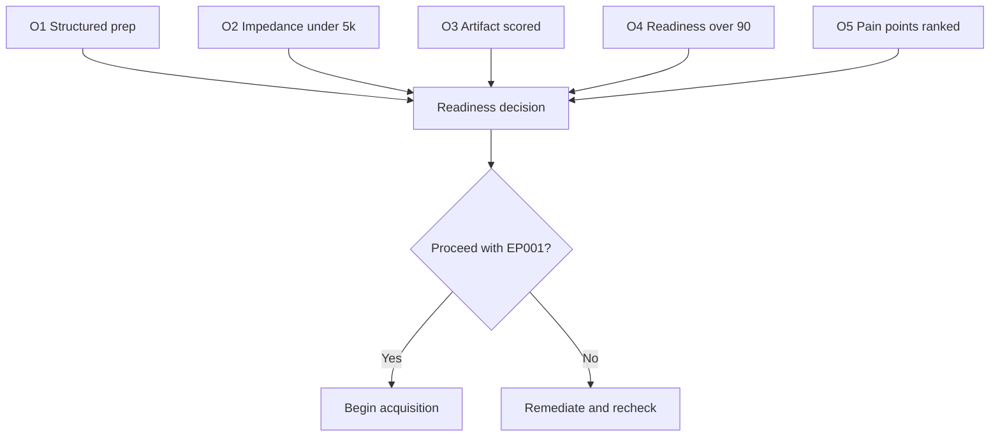

---

## 5. Flow

> **Why:** The examiner needs to see the technician's actual sequence of actions, not an abstract claim. **How:** We present the end-to-end technician flow as both a table and a sequence diagram for EP001.

*Caption - This step table is the operational backbone of the simulation; it lists every technician action with its trigger and the artifact it produces for the platform.*

| Step | Technician action | Input | Output artifact |
|---|---|---|---|
| 1 | Verify identity | EP-2026-001 wristband | Confirmed patient ID |
| 2 | Confirm consent | Signed form | Consent logged |
| 3 | Ask prep questions | Interview | Prep metadata |
| 4 | Inspect scalp/hair | Visual | Prep-quality note |
| 5 | Apply 21 electrodes | 10-20 system | Montage set |
| 6 | Measure impedance | Impedance meter | 3.1 kOhm average |
| 7 | Run artifact check | 30s baseline | Low artifact score |
| 8 | Compute readiness | All above | 98% readiness |
| 9 | Go/no-go decision | Readiness gate | Proceed |
| 10 | Start recording | 512 Hz capture | Raw EEG stream |

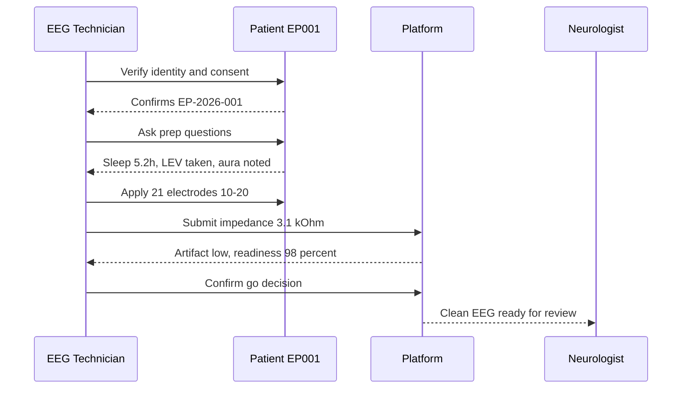

---

## 6. Hypotheses

> **Why:** Formal hypotheses let the simulation be judged statistically rather than anecdotally. **How:** We state null and alternative hypotheses tied to readiness and downstream quality.

*Caption - The hypothesis table pins each claim to a variable and a test so the defense committee can challenge specifics.*

| ID | Null (H0) | Alternative (H1) | Variable |
|---|---|---|---|
| H1 | Structured prep does not change metadata completeness | Structured prep increases completeness | Field completeness % |
| H2 | Impedance has no effect on artifact rate | Lower impedance lowers artifact rate | kOhm vs artifact score |
| H3 | Readiness score does not predict diagnostic yield | Higher readiness predicts higher yield | Readiness % vs yield |
| H4 | Technician role adds no acquisition quality vs unassisted | Role improves quality | Composite quality index |

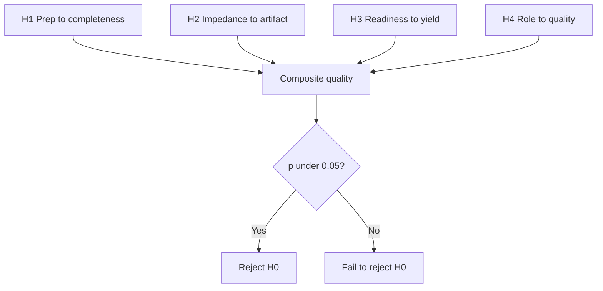

---

## 7. Statistical Analysis

> **Why:** The committee expects a stated analysis plan, not just data. **How:** We specify tests, inputs, and decision rules for the readiness study.

*Caption - This table maps each hypothesis to a concrete statistical test and the EP001-derived measure feeding it, making the analysis reproducible.*

| Hypothesis | Test | Predictor | Outcome | Decision rule |
|---|---|---|---|---|
| H1 | Paired t-test | Prep method | Completeness % | Reject H0 if p<0.05 |
| H2 | Pearson correlation | Impedance kOhm | Artifact score | r significant, p<0.05 |
| H3 | Logistic regression | Readiness % | Diagnostic yield | OR CI excludes 1 |
| H4 | ANOVA | Role vs no role | Quality index | F significant, p<0.05 |

*Caption - The descriptive snapshot below records EP001's actual pre-EEG values that seed the analysis so results trace back to a real case.*

| Metric | EP001 value | Threshold | Status |
|---|---|---|---|
| Average impedance | 3.1 kOhm | <=5 kOhm | Pass |
| Artifact risk | Low | Low/Med | Pass |
| Readiness | 98% | >=90% | Pass |
| Electrodes placed | 21 | 21 (10-20) | Pass |
| Sampling rate | 512 Hz | >=256 Hz | Pass |

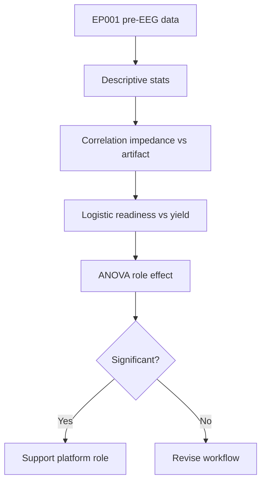

---

## 8. Role Questions and Answers

> **Why:** The technician's pre-EEG interview is where prep metadata is captured; its quality determines model context. **How:** We list the real questions the EEG Technician asks for EP001, with answers, and mark simulated answers for other stakeholders.

### 8.1 Real Technician Questions (EP001)

> **Why:** These are the actual questions this role owns and must ask before touching electrodes. **How:** Each question has a captured answer sourced from EP001's pre-EEG record.

*Caption - This is the core interview transcript for the simulation; it shows consent, identity, sleep, medication, and prep questions with EP001's real answers, which become the platform's prep metadata.*

| # | Question (technician asks) | Category | EP001 answer | Captured field |
|---|---|---|---|---|
| Q1 | Can you confirm your full name and date of birth? | Identity | Confirmed, EP-2026-001, 29yo male | patient_id_verified |
| Q2 | Do you consent to this EEG recording? | Consent | Yes, signed | consent = true |
| Q3 | How many hours did you sleep last night? | Sleep deprivation | 5.2h, poor quality | sleep_hours = 5.2 |
| Q4 | Did you follow the sleep-deprivation protocol? | Sleep deprivation | Partial, nocturnal seizures | sleep_protocol = partial |
| Q5 | Did you take Levetiracetam today? | Medication | Yes, 1000mg morning dose | med_taken = true |
| Q6 | Any missed doses recently? | Medication | 3 missed doses this month | missed_doses = 3 |
| Q7 | Did you have caffeine or wash your hair with product? | Prep | No caffeine, hair clean | prep_clean = true |
| Q8 | Any aura or seizure in the last 24h? | Clinical context | Metallic taste, deja vu aura | aura = true |
| Q9 | Any scalp wounds, hair extensions, or metal? | Prep | None | scalp_clear = true |
| Q10 | Are you comfortable and able to stay still? | Movement | Yes | movement_risk = low |

### 8.2 Simulated Questions from Other Roles

> **Why:** The platform is multi-stakeholder; showing simulated cross-role questions proves the technician output feeds others. **How:** We mark these dummy/simulated to keep the technician answers authoritative and the others illustrative.

*Caption - These simulated entries show how the Neurologist and patient-facing roles depend on technician-captured data; answers are dummy placeholders to illustrate handoff, not real capture.*

| Asking role | Simulated question | Simulated answer | Depends on technician field |
|---|---|---|---|
| Neurologist (simulated) | Is the montage complete and clean? | Yes, 21/21 electrodes, 98% readiness | readiness, montage |
| Neurologist (simulated) | Was patient sleep-deprived as protocol? | Partial, 5.2h logged | sleep_hours |
| Scheduling (simulated) | Is patient ready to start on time? | Yes, go decision issued | go_decision |
| Patient-support (simulated) | Was consent properly obtained? | Yes, logged | consent |

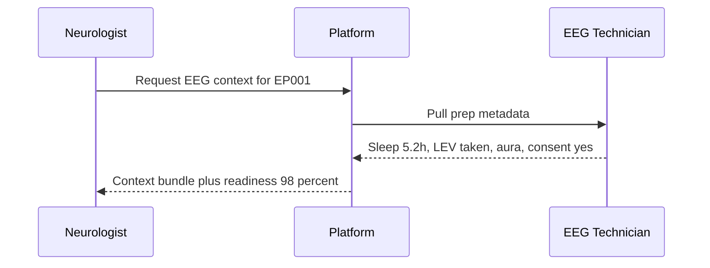

---

## 9. Pre-EEG Assessment

> **Why:** The assessment is the quantitative gate that turns the interview and setup into a defensible go/no-go. **How:** We present EP001's impedance, artifact, and readiness as a scored table plus a decision flowchart.

### 9.1 Assessment Metrics

> **Why:** Numbers, not impressions, must justify proceeding. **How:** We tabulate each metric against its threshold and status for EP001.

*Caption - The assessment table is the evidence that EP001's setup meets diagnostic standard; every metric is scored against a threshold to support the 98% readiness.*

| Metric | Value | Threshold | Weight | Status |
|---|---|---|---|---|
| Average impedance | 3.1 kOhm | <=5 kOhm | 30% | Pass |
| Max channel impedance | 4.4 kOhm | <=10 kOhm | 15% | Pass |
| Artifact risk | Low | Low | 25% | Pass |
| Prep completeness | 100% | 100% | 15% | Pass |
| Movement risk | Low | Low/Med | 15% | Pass |
| **Composite readiness** | **98%** | **>=90%** | **100%** | **Proceed** |

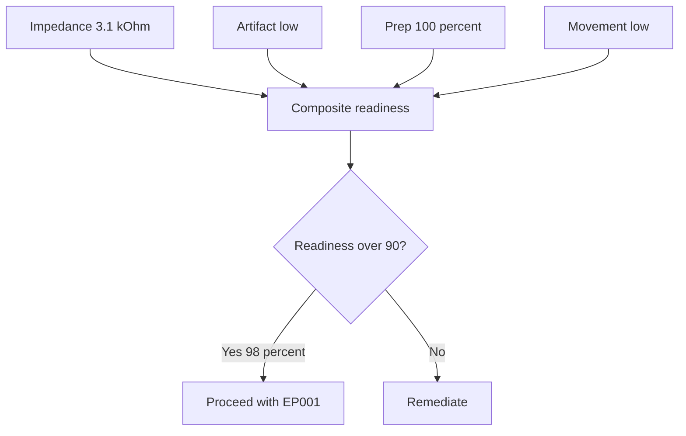

### 9.2 Readiness Interpretation

> **Why:** A score needs an interpretation band to be actionable. **How:** We map readiness ranges to technician actions.

*Caption - This band table tells the technician exactly what to do at each readiness level; EP001 lands in the top band.*

| Readiness | Band | Action | EP001 |
|---|---|---|---|
| 90-100% | Green | Proceed to record | Yes (98%) |
| 70-89% | Amber | Fix top issue, recheck | No |
| <70% | Red | Do not record | No |

---

## 10. Tasks and Simulated Status

> **Why:** The role is defined by its task list; showing status proves the workflow executes. **How:** We present the technician task board with simulated live status for EP001.

*Caption - This task board is the simulation's execution log; each task carries an owner, dependency, and simulated status so the examiner can trace completion.*

| Task ID | Task | Depends on | Simulated status | Timestamp |
|---|---|---|---|---|
| T1 | Verify identity EP-2026-001 | - | Done | 09:00 |
| T2 | Obtain and log consent | T1 | Done | 09:02 |
| T3 | Conduct prep interview | T2 | Done | 09:06 |
| T4 | Inspect scalp and hair | T3 | Done | 09:09 |
| T5 | Place 21 electrodes 10-20 | T4 | Done | 09:20 |
| T6 | Measure impedance | T5 | Done - 3.1 kOhm | 09:24 |
| T7 | Run 30s artifact baseline | T6 | Done - Low | 09:26 |
| T8 | Compute readiness | T7 | Done - 98% | 09:27 |
| T9 | Issue go/no-go | T8 | Done - Go | 09:28 |
| T10 | Begin 512 Hz recording | T9 | In progress | 09:30 |

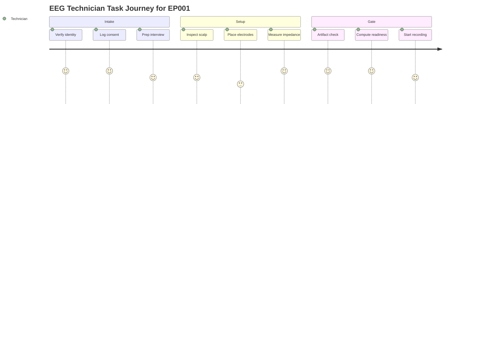

---

## 11. Pain Points

> **Why:** Naming failure modes is what lets the platform target improvements and defend its value. **How:** We rank the technician's top pain points with EP001-specific status and mitigation.

*Caption - The pain-point register ranks the recurring obstacles this role faces; for EP001 each is currently controlled, but the register drives future automation.*

| Rank | Pain point | Trigger | EP001 status | Mitigation |
|---|---|---|---|---|
| 1 | High impedance | Dry skin, thick hair, poor paste | Controlled (3.1 kOhm) | Live per-channel gate, re-prep |
| 2 | Artifact | Muscle tension, blinking, sweat | Low | Auto artifact score, patient coaching |
| 3 | Movement | Restlessness, discomfort | Low | Comfort check, real-time pop flag |
| 4 | Incomplete prep data | Rushed interview | 100% captured | Structured mandatory fields |
| 5 | Time pressure | Back-to-back schedule | On time | Task board with timestamps |

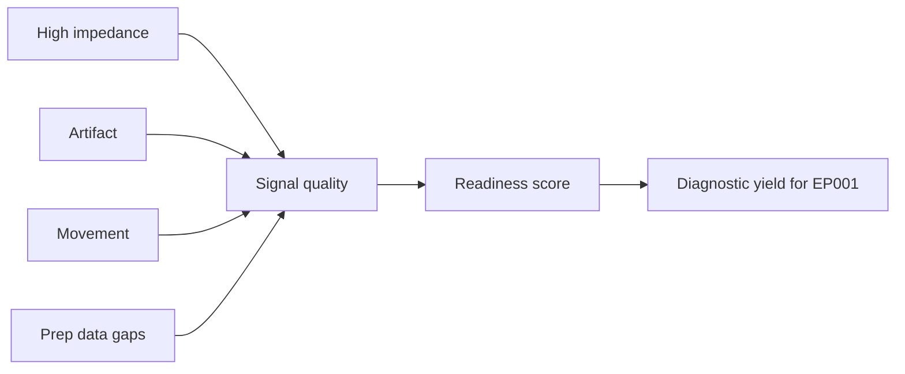

---

## 12. Complete Flow

> **Why:** The examiner wants one consolidated picture proving the pieces connect from patient arrival to model-ready EEG. **How:** We give a single end-to-end network diagram plus a consolidated stage table.

*Caption - This consolidated stage table is the one-page summary of the entire technician simulation, linking intake, gate, and handoff for EP001.*

| Stage | Entry condition | Key metric | Exit condition |
|---|---|---|---|
| Intake | Patient present | Identity + consent | Metadata captured |
| Setup | Consent logged | 21 electrodes placed | Impedance 3.1 kOhm |
| Gate | Setup complete | Readiness 98% | Go decision |
| Acquisition | Go issued | 512 Hz stream | Clean EEG recorded |
| Handoff | Recording done | Artifact low | Neurologist review |

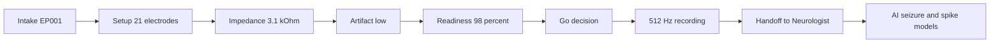

---

## 13. Professor Readiness (Defense Q&A)

> **Why:** The committee will probe the weakest assumptions; rehearsing answers hardens the thesis. **How:** We pre-answer five likely examiner questions with concise evidence.

### 13.1 Why model the EEG Technician as a platform role at all instead of a manual step?

> **Why:** Challenges the necessity of the whole simulation. **How:** Short justification grounded in error propagation.

Because acquisition errors propagate irreversibly. If EP001's impedance were 15 kOhm and unflagged, every downstream seizure-detection and spike-localization model would run on attenuated signal and produce confident but wrong output. Instrumenting the role converts an invisible manual step into a gated, logged, explainable decision (readiness 98%) that the platform can audit.

### 13.2 How do you know 98% readiness is meaningful and not an arbitrary number?

> **Why:** Attacks construct validity of the score. **How:** Decompose the weighting.

*Caption - This table shows the readiness score is a transparent weighted composite of measured inputs, not a black box.*

| Component | Weight | EP001 contribution |
|---|---|---|
| Impedance | 30% | 30% (3.1 kOhm) |
| Artifact | 25% | 25% (low) |
| Prep completeness | 15% | 15% |
| Movement | 15% | 15% |
| Max-channel impedance | 15% | 13% (minor deduction) |

### 13.3 What happens if the readiness gate is wrong (false green)?

> **Why:** Probes safety. **How:** Describe fallback.

A false green is caught downstream: the artifact model re-scores the live 512 Hz stream, and any channel exceeding threshold triggers a re-prep alert to the technician. The gate is a first filter, not the only one, so a single false green does not silently reach the Neurologist.

### 13.4 Why is EP001's partial sleep-deprivation acceptable?

> **Why:** Tests clinical realism. **How:** Contextual answer.

EP001 has nocturnal focal seizures and slept only 5.2h with poor quality, which itself provides physiological sleep-deprivation activation useful for capturing interictal discharges. The partial-protocol status is logged as metadata so the Neurologist interprets yield in that context rather than assuming a full protocol.

### 13.5 How does this generalize beyond one patient?

> **Why:** Tests external validity. **How:** Explain schema reuse.

The question set, impedance gate, artifact score, and readiness formula are patient-agnostic; EP001 only supplies values. Any epilepsy patient flows through the identical structured schema, so the simulation is a template, and EP001 is one validated instance.

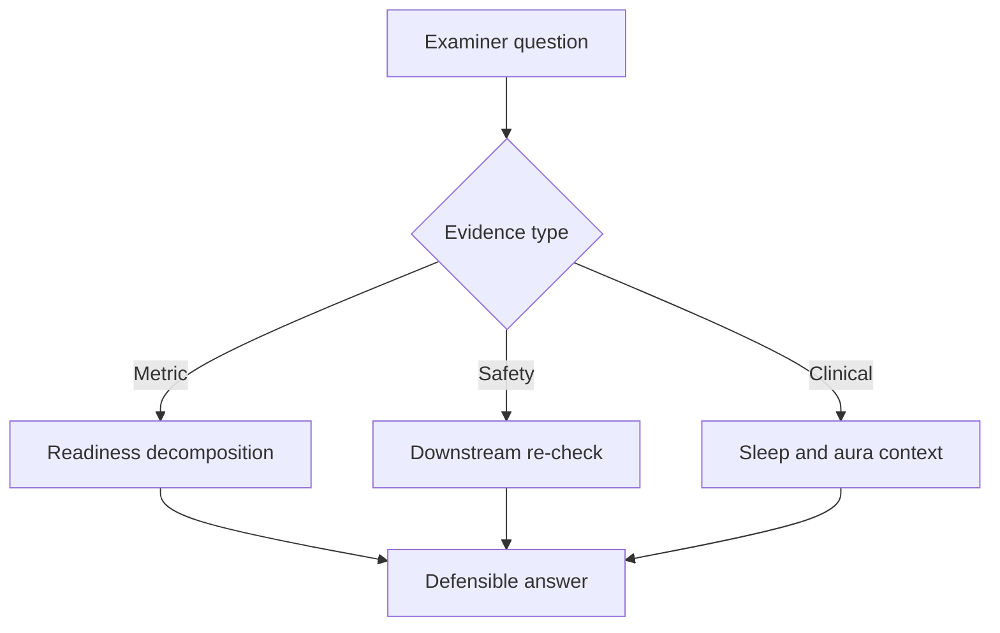

---

## 14. References

> **Why:** Claims must trace to authoritative epilepsy and AI sources. **How:** APA 7th edition entries covering seizure classification, medical AI, and reporting standards.

Fisher, R. S., Cross, J. H., French, J. A., Higurashi, N., Hirsch, E., Jansen, F. E., Lagae, L., Moshe, S. L., Peltola, J., Roulet Perez, E., Scheffer, I. E., & Zuberi, S. M. (2017). Operational classification of seizure types by the International League Against Epilepsy: Position paper of the ILAE Commission for Classification and Terminology. *Epilepsia, 58*(4), 522-530. https://doi.org/10.1111/epi.13670

Topol, E. J. (2019). High-performance medicine: The convergence of human and artificial intelligence. *Nature Medicine, 25*(1), 44-56. https://doi.org/10.1038/s41591-018-0300-7

American Psychological Association. (2020). *Publication manual of the American Psychological Association* (7th ed.). American Psychological Association.

Acharya, U. R., Oh, S. L., Hagiwara, Y., Tan, J. H., & Adeli, H. (2018). Deep convolutional neural network for the automated detection and diagnosis of seizure using EEG signals. *Computers in Biology and Medicine, 100*, 270-278. https://doi.org/10.1016/j.compbiomed.2017.09.017

Roy, Y., Banville, H., Albuquerque, I., Gramfort, A., Falk, T. H., & Faubert, J. (2019). Deep learning-based electroencephalography analysis: A systematic review. *Journal of Neural Engineering, 16*(5), 051001. https://doi.org/10.1088/1741-2552/ab260c

Beniczky, S., & Schomer, D. L. (2020). Electroencephalography: Basic biophysical and technological aspects important for clinical applications. *Epileptic Disorders, 22*(6), 697-715. https://doi.org/10.1684/epd.2020.1217

Tatum, W. O., Rubboli, G., Kaplan, P. W., Mirsatari, S. M., Radhakrishnan, K., Gloss, D., Caboclo, L. O., Drislane, F. W., Koutroumanidis, M., Schomer, D. L., Kasteleijn-Nolst Trenite, D., Cook, M., & Beniczky, S. (2018). Clinical utility of EEG in diagnosing and monitoring epilepsy in adults. *Clinical Neurophysiology, 129*(5), 1056-1082. https://doi.org/10.1016/j.clinph.2018.01.019
