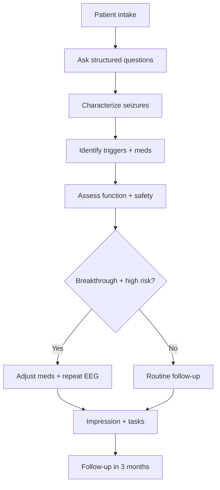
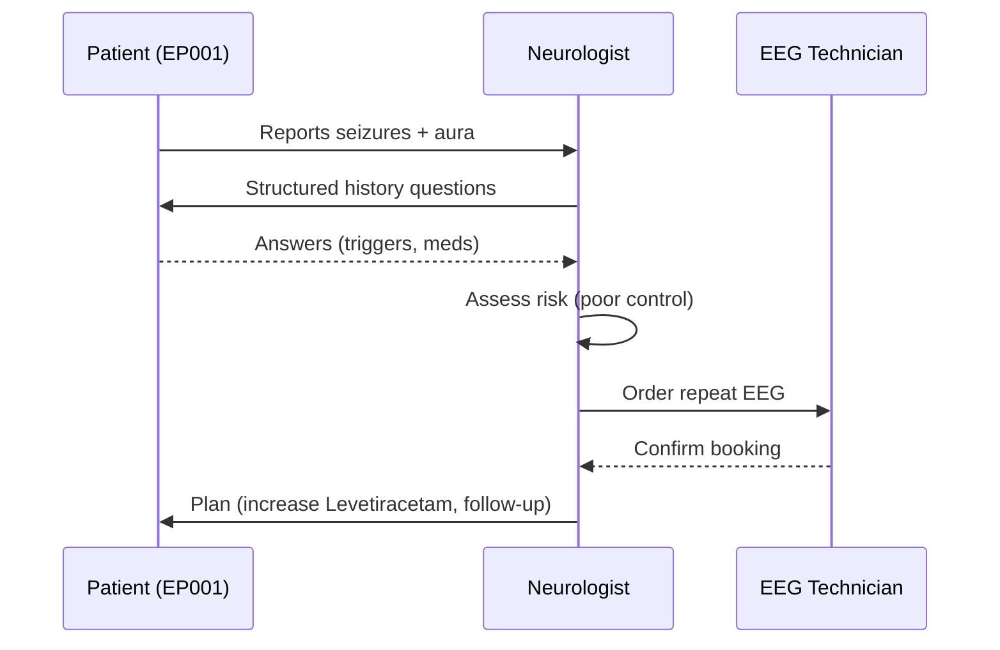
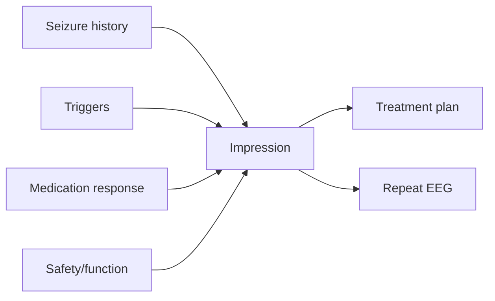
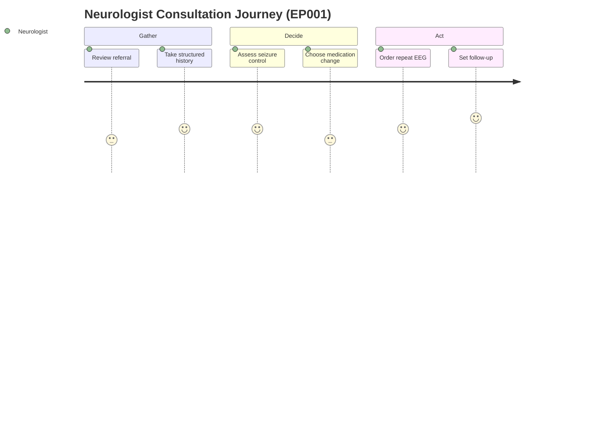
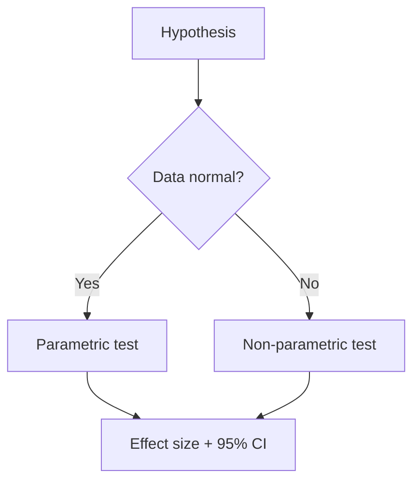

# Stakeholder Simulation — Neurologist (Epilepsy, EP001)

> **Why (this doc):** Show exactly what the neurologist asks, assesses, and does for a real
> patient, end-to-end, so the workflow is defensible and simulatable.
> **How:** Drive EP001's given primary data through the neurologist's questions → answers →
> assessment → tasks, with tables + diagrams (simulation point of view).

## 1. Problem

> **Why:** Name the neurologist's pain before the workflow.
> **How:** Problem paragraph + decomposition table.

The neurologist must reconstruct a complete seizure picture from many scattered questions
under time pressure, then decide investigations and medication — with high cost if a signal
is missed.

*Caption — decomposes the neurologist's pain into trackable items.*

| Pain point | Consequence |
|---|---|
| Long history to elicit | Slow consultation |
| Triggers easy to miss | Under-treated risk |
| Medication response unclear | Breakthrough seizures continue |
| Safety (driving/falls) overlooked | Patient harm + liability |

## 2. Sub-Problems

*Caption — each sub-problem maps to a question block the neurologist must cover.*

| # | Sub-problem | Question block |
|---|---|---|
| SP1 | Characterize seizures | Seizure history, aura, ictal, post-ictal |
| SP2 | Identify drivers | Triggers, lifestyle |
| SP3 | Assess treatment | Medication history |
| SP4 | Gauge impact | Functional, quality of life |
| SP5 | Decide next step | Impression + plan |

## 3. Research Problem

*Caption — frames the researchable question for this role.*

| Aspect | Current | Desired |
|---|---|---|
| History taking | Manual, variable | Structured, AI-supported |
| Risk detection | Late | Early, at intake |

**Research problem:** *Can a structured neurologist question set, captured digitally, produce
an early, complete risk picture that shortens time-to-decision without losing clinical depth?*

## 4. Research Objective

*Caption — measurable targets for the neurologist workflow.*

| Objective | Success criterion |
|---|---|
| Complete structured history | 100% mandatory sections captured |
| Surface risk early | Risk drivers flagged at intake |
| Produce actionable plan | Impression + tasks generated |

## 5. Detailed Role Questions & Simulated Answers (EP001)

> **Why:** The examiner and the simulator need the *exact* questions the neurologist asks and
> the patient's answers.
> **How:** One row per question, with EP001's given answer (real where provided).

*Caption — chief complaint: establishes reason and severity.*

| Question | EP001 Answer |
|---|---|
| Why are you here today? | Recurrent seizures over 18 months |
| Primary concern? | Increasing seizure frequency |
| Severity (0–10)? | 8 |
| Emergency visits? | 2 |

*Caption — seizure characterization: type, frequency, duration.*

| Question | EP001 Answer |
|---|---|
| Epilepsy type? | Focal Epilepsy |
| Seizure type? | Focal Impaired Awareness |
| Frequency? | 5 / month |
| Average duration? | 90 sec |
| Nocturnal seizures? | Yes |
| Aura present? | Yes (metallic taste, déjà vu) |

*Caption — triggers & lifestyle: modifiable risk drivers.*

| Question | EP001 Answer |
|---|---|
| Sleep deprivation trigger? | Yes |
| Stress trigger? | Yes |
| Missed medication trigger? | Yes |
| Sleep hours/day? | 5.2 (poor) |
| Trigger burden (derived)? | 4 (High) |

*Caption — medication: response and adherence.*

| Question | EP001 Answer |
|---|---|
| Current medication? | Levetiracetam 1000 mg BID |
| Adherence? | 88% |
| Missed doses/month? | 3 |
| Breakthrough seizures? | Yes |
| Previous drug failure? | Carbamazepine |

*Caption — function & safety: real-world impact.*

| Question | EP001 Answer |
|---|---|
| Driving status? | Restricted |
| Falls? | 1 |
| Injury risk? | Moderate |
| QOLIE-31? | 56/100 |

## 6. Assessment Summary

*Caption — the neurologist's clinical read of the answers above.*

| Domain | Assessment |
|---|---|
| Seizure control | Poor (breakthrough despite adherence) |
| Main drivers | Sleep deficit, high trigger burden |
| Safety | Driving restricted, fall risk |
| Diagnosis | Drug-responsive focal epilepsy w/ breakthrough seizures |

## 7. Task List with Simulated Status

> **Why:** Simulation must show tasks *and* their outcome.
> **How:** Task table with dummy completion status + note.

*Caption — simulated task execution for EP001.*

| # | Task | Status | Simulated note |
|---|---|---|---|
| 1 | Confirm seizure classification | ✅ Done | Focal impaired awareness confirmed |
| 2 | Review medication response | ✅ Done | Increase Levetiracetam |
| 3 | Assess sleep & triggers | ✅ Done | Sleep counselling ordered |
| 4 | Confirm driving restriction | ✅ Done | Restriction upheld |
| 5 | Order repeat EEG | 🟡 Pending | Booked, awaiting slot |
| 6 | Schedule follow-up | ✅ Done | 3 months |

## 8. Complete Flow (Flowchart)

> **Why:** Auditable end-to-end neurologist workflow.
> **How:** Mermaid `flowchart`.

## 9. Sequence Diagram — Consultation Interactions

> **Why:** Show turn-by-turn actor interaction.
> **How:** Mermaid `sequenceDiagram`.

## 10. Network Diagram — Neurologist Decision Inputs

> **Why:** Show which inputs feed the impression.
> **How:** Mermaid `graph`.

## 11. Journey Map — Neurologist Experience

> **Why:** UX/experience lens for the DBA.
> **How:** Mermaid `journey`.

## 12. Hypotheses

*Caption — hypotheses the neurologist workflow lets us test.*

| ID | H0 | H1 |
|---|---|---|
| H1 | Structured intake ≠ faster decision | Structured intake → faster decision |
| H2 | Trigger burden unrelated to control | Higher burden → poorer control |

## 13. Statistical Analysis

*Caption — tests for the hypotheses above.*

| Hypothesis | Test | Metric |
|---|---|---|
| H1 | Paired t-test (time-to-decision before/after) | Mean minutes ↓ |
| H2 | Spearman (burden vs frequency) | ρ, p-value |

## Professor Readiness (Defense Q&A)

### Q1. Why capture questions in a fixed structure?
Structure guarantees completeness and comparability across patients, enabling audit and ML
features (Field, 2018).

### Q2. Is the AI diagnosing?
No — decision support only; the neurologist owns every decision (Topol, 2019).

### Q3. How is EP001's risk justified?
| Driver | Evidence |
|---|---|
| Poor control | Breakthrough despite 88% adherence |
| Sleep deficit | 5.2 hrs, poor quality |
| High trigger burden | Score 4 |

### Q4. What if the patient can't answer some questions?
Missing fields are flagged (Phase 2 validation) and deferred, not silently imputed.

## References

American Psychological Association. (2020). *Publication manual of the American Psychological
Association* (7th ed.). https://doi.org/10.1037/0000165-000

Field, A. (2018). *Discovering statistics using IBM SPSS statistics* (5th ed.). SAGE.

Fisher, R. S., Cross, J. H., French, J. A., Higurashi, N., Hirsch, E., Jansen, F. E., …
Zuberi, S. M. (2017). Operational classification of seizure types by the International League
Against Epilepsy. *Epilepsia, 58*(4), 522–530. https://doi.org/10.1111/epi.13670

Topol, E. J. (2019). High-performance medicine: The convergence of human and artificial
intelligence. *Nature Medicine, 25*(1), 44–56. https://doi.org/10.1038/s41591-018-0300-7
