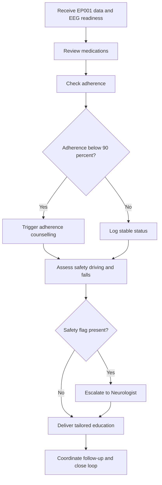
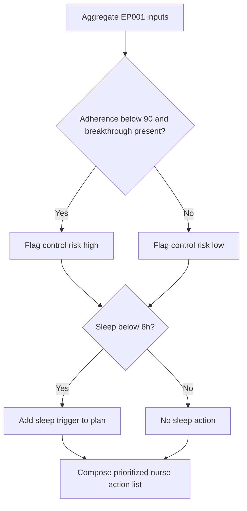
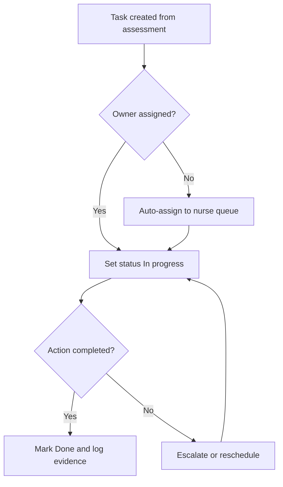
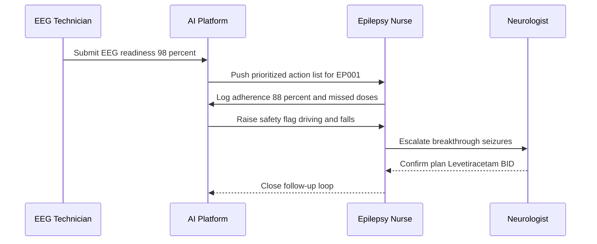
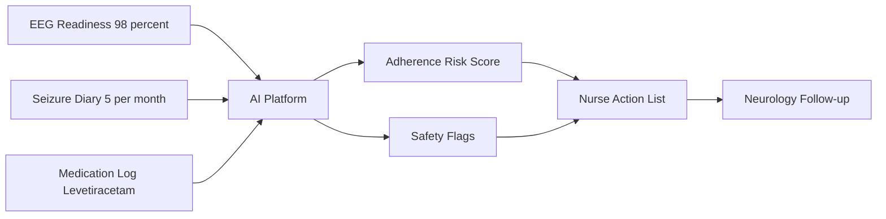
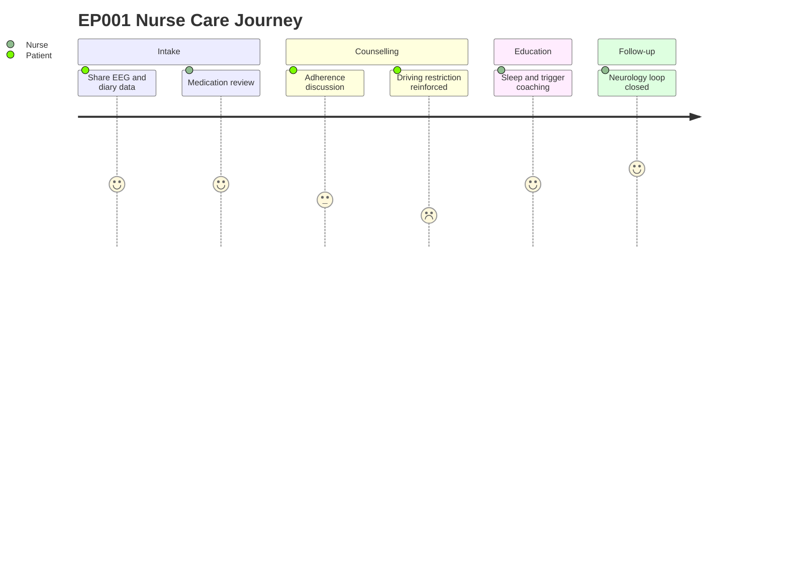
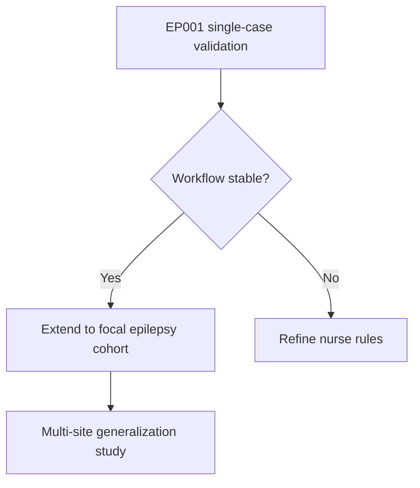

# Stakeholder Simulation - Epilepsy Nurse (Epilepsy, EP001)

> **Why (this doc):** The Epilepsy Nurse is the operational hub that converts a Neurologist's clinical plan and an EEG Technician's signal data into daily patient outcomes for EP001 (EP-2026-001) - a 29-year-old male with focal impaired awareness epilepsy, 5 seizures/month, 88% adherence, and a driving restriction. Simulating this role validates that the Enterprise AI Platform for Explainable Multimodal Epilepsy Intelligence surfaces the right explainable outputs (adherence risk, safety alerts, follow-up prompts) to the person who acts on them most frequently.
> **How:** We elicit role questions (real, grounded answers from the EEG Technician pre-assessment for EP001; simulated/dummy answers for nurse-owned items), map assessments and tasks with a simulated completion status, expose pain points, and render every major step as both a table and a Mermaid flowchart. The document follows the research spine (Problem to Statistical Analysis), then role content, then a defense Q&A, then references.

---

## 1. Problem

> **Why:** Establishes the gap this simulation addresses so the platform's nurse-facing features are justified, not assumed. **How:** State the operational failure mode in the epilepsy care pathway for EP001.

*Caption - The table below frames the core problem so every downstream section (objectives, hypotheses, tasks) traces back to a concrete, measurable deficiency in nurse-mediated epilepsy care.*

| Element | Description (EP001 context) |
|---|---|
| Problem statement | Between neurology visits, no single role reliably reconciles medication adherence, seizure diaries, and safety risk for EP001, so breakthrough seizures and missed doses go unmanaged. |
| Who is affected | EP001 (patient), Epilepsy Nurse (owner of continuity), Neurologist (needs reliable interval data), EEG Technician (produces signal readiness). |
| Current state | Adherence 88%, 3 missed doses/month, 5 seizures/month at 90s, sleep 5.2h, trigger burden 4/5, driving restricted - all tracked in fragmented notes. |
| Desired state | An explainable AI platform that pushes prioritized, evidence-linked nurse actions between visits. |

## 2. Sub-Problems

> **Why:** Decomposes the problem into tractable, testable pieces the nurse simulation must exercise. **How:** Enumerate the discrete failure points as sub-problems mapped to nurse workflows.

*Caption - This decomposition shows each sub-problem is independently observable and independently fixable, which lets the platform be evaluated feature-by-feature rather than as a monolith.*

| # | Sub-Problem | Nurse workflow touched |
|---|---|---|
| SP1 | Medication reconciliation is manual and lags real dosing | Medication review |
| SP2 | Adherence dips (88%, 3 missed doses) are detected late | Adherence counselling |
| SP3 | Safety risk (driving, nocturnal falls) is not proactively flagged | Safety management |
| SP4 | Patient education is generic, not tailored to EP001 triggers | Education |
| SP5 | Hand-off between EEG, nurse, and neurology is uncoordinated | Follow-up coordination |

## 3. Research Problem

> **Why:** Converts the sub-problems into a single answerable research question anchoring the study. **How:** Frame as one interrogative statement scoped to the nurse role and the platform.

*Caption - The table isolates the one question the nurse simulation is designed to answer, keeping scope defensible before an examiner.*

| Field | Content |
|---|---|
| Research problem | To what extent can an explainable multimodal AI platform improve the Epilepsy Nurse's ability to detect and act on adherence and safety risks for a focal epilepsy patient (EP001) between neurology visits? |
| Boundary | Nurse-mediated tasks only; excludes diagnostic classification (Neurologist) and raw signal acquisition (EEG Technician). |

## 4. Research Objective

> **Why:** Declares the concrete, measurable target so success is falsifiable. **How:** List objectives that each map to a sub-problem and a hypothesis.

*Caption - Objectives are stated so each one links backward to a sub-problem and forward to a hypothesis, giving the study internal traceability.*

| Objective | Addresses | Success metric |
|---|---|---|
| O1 | SP1 | Reduce medication reconciliation time per patient by >=30%. |
| O2 | SP2 | Detect adherence drop below 90% within 24h of a missed dose. |
| O3 | SP3 | Surface every driving/fall safety flag with an explanation the nurse rates as clear. |
| O4 | SP4 | Deliver trigger-specific education (sleep, missed dose) accepted by patient. |
| O5 | SP5 | Close EEG-to-neurology follow-up loop with zero dropped hand-offs. |

## 5. Flow

> **Why:** Gives a single visual of the end-to-end nurse pathway so readers see where the platform intervenes. **How:** Present the operational flow as a table then a Mermaid flowchart.

*Caption - The step table lists the nurse pathway in execution order; the flowchart that follows renders the same steps with the adherence decision branch that drives most nurse actions.*

| Step | Action | Platform role |
|---|---|---|
| 1 | Receive EEG readiness + patient data | Aggregates multimodal inputs |
| 2 | Review medications | Flags reconciliation gaps |
| 3 | Check adherence | Computes adherence risk score |
| 4 | Assess safety | Raises driving/fall alerts |
| 5 | Deliver education | Recommends tailored content |
| 6 | Coordinate follow-up | Schedules and routes hand-off |

## 6. Hypotheses

> **Why:** States the testable claims so the statistical analysis has explicit targets. **How:** Provide null and alternative hypotheses per key objective.

*Caption - Each hypothesis pair is written so a statistical test can accept or reject it, which is what makes the nurse simulation an empirical study rather than a demo.*

| ID | Null (H0) | Alternative (H1) |
|---|---|---|
| H1 | The platform does not reduce reconciliation time. | The platform reduces reconciliation time by >=30%. |
| H2 | Adherence-drop detection latency is unchanged. | Detection latency falls to <=24h. |
| H3 | Nurse-rated explanation clarity is no better than baseline. | Explanation clarity improves significantly. |
| H4 | Follow-up dropped-handoff rate is unchanged. | Dropped-handoff rate falls to zero. |

## 7. Statistical Analysis

> **Why:** Specifies how evidence will be judged so conclusions are defensible. **How:** Map each hypothesis to a test, variable type, and threshold.

*Caption - The analysis plan pre-commits to tests before data collection, guarding against post-hoc fishing and letting an examiner verify the study is properly powered.*

| Hypothesis | Test | Variables | Significance |
|---|---|---|---|
| H1 | Paired t-test | Reconciliation time (continuous, pre/post) | p < 0.05 |
| H2 | Survival / time-to-detection | Latency in hours (continuous) | p < 0.05 |
| H3 | Wilcoxon signed-rank | Clarity Likert (ordinal 1-5) | p < 0.05 |
| H4 | McNemar test | Dropped hand-off (binary) | p < 0.05 |
| Effect size | Cohen d / r | All continuous outcomes | d >= 0.5 target |

---

## 8. Role Questions and Answers

> **Why:** Captures what each stakeholder actually asks so the platform's outputs match real decision needs. **How:** Separate real answers (EEG Technician, sourced from EP001 pre-assessment) from simulated/dummy answers for nurse-owned and other-role items.

### 8.1 EEG Technician - Real Answers (EP001 pre-assessment)

> **Why:** These are grounded facts the nurse depends on and must not be simulated. **How:** Report the EP001 EEG pre-assessment values verbatim.

*Caption - Real, source-of-truth answers from the EEG Technician; the nurse treats these as inputs rather than estimates, so they anchor the rest of the simulation.*

| Question | Real answer (EP001) |
|---|---|
| How many electrodes and which montage? | 21 electrodes, international 10-20 system. |
| Sampling rate? | 512 Hz. |
| Average impedance? | 3.1 kOhm. |
| Artifact risk? | Low. |
| Is the recording ready for review? | EEG readiness 98%. |
| Any technical blocker for the nurse? | None; data cleared for nurse and neurology review. |

### 8.2 Epilepsy Nurse - Simulated (Dummy) Answers

> **Why:** Nurse-owned interval data is not yet instrumented, so answers are simulated to exercise the workflow. **How:** Provide plausible dummy values consistent with EP001's clinical picture.

*Caption - Simulated nurse answers stand in for interval data the platform will eventually capture, letting us test the workflow end-to-end before live deployment.*

| Question | Simulated answer (EP001) |
|---|---|
| Current adherence? | 88%, approx 3 missed doses/month (simulated). |
| Any breakthrough seizures since last visit? | Yes, 5/month at ~90s, nocturnal (simulated). |
| Sleep pattern? | 5.2h, poor quality (simulated). |
| Trigger burden? | 4/5, high - sleep deprivation and missed doses dominant (simulated). |
| Driving status understood by patient? | Restricted; patient acknowledges but frustrated (simulated). |
| QOLIE-31 quality-of-life? | 56/100 (simulated). |

### 8.3 Neurologist - Simulated (Dummy) Answers

> **Why:** Shows the downstream role the nurse coordinates with. **How:** Simulated answers reflecting a plausible plan for EP001.

*Caption - Simulated neurologist answers define the clinical intent the nurse operationalizes, closing the loop from plan to daily action.*

| Question | Simulated answer (EP001) |
|---|---|
| Current regimen? | Levetiracetam 1000mg BID (simulated confirmation). |
| Prior drug failure? | Carbamazepine (simulated). |
| Threshold for dose change? | If breakthrough persists >4 weeks despite adherence >90% (simulated). |
| Referral needs? | Consider sleep review given 5.2h sleep (simulated). |

---

## 9. Assessment

> **Why:** Consolidates inputs into a nurse-level risk read for EP001. **How:** Score each domain and render the reasoning as a flowchart.

*Caption - The assessment table converts scattered inputs into a single prioritized risk view, which is the first explainable output the nurse consumes each cycle.*

| Domain | Input | Nurse risk rating |
|---|---|---|
| Adherence | 88%, 3 missed doses | Moderate-high |
| Seizure control | 5/month, breakthrough | High |
| Sleep | 5.2h poor | High (trigger) |
| Safety | Driving restricted, nocturnal seizures | High (falls) |
| QoL | QOLIE-31 56/100 | Moderate |
| EEG | Readiness 98%, low artifact | Green (ready) |

## 10. Tasks with Simulated Status

> **Why:** Turns the assessment into trackable work with visible completion state. **How:** List nurse tasks, owner, and a simulated status, then show the task lifecycle as a flowchart.

*Caption - The task board with simulated statuses demonstrates how the platform makes nurse work auditable, so nothing (like an open safety flag) silently lapses.*

| Task ID | Task | Domain | Simulated status |
|---|---|---|---|
| T1 | Reconcile Levetiracetam 1000mg BID | Medication review | Done |
| T2 | Counsel on 3 missed doses | Adherence | In progress |
| T3 | Reinforce driving restriction | Safety | Done |
| T4 | Nocturnal fall-precaution advice | Safety | In progress |
| T5 | Sleep-hygiene education (5.2h) | Education | Pending |
| T6 | Schedule neurology follow-up | Coordination | Pending |
| T7 | Route EEG readiness (98%) to neurology | Coordination | Done |

## 11. Pain Points

> **Why:** Documents friction the platform must remove, validating its value proposition. **How:** Tabulate pain points with impact on EP001 and the platform mitigation.

*Caption - Naming pain points explicitly ties each platform feature to a real nurse burden, so the design is grounded in need rather than novelty.*

| Pain point | Impact on EP001 | Platform mitigation |
|---|---|---|
| Fragmented data across EEG, diary, meds | Delayed risk detection | Multimodal aggregation |
| Late adherence detection | Continued breakthrough seizures | 24h adherence alerting |
| Manual driving/safety tracking | Legal and injury risk | Explainable safety flags |
| Generic education | Poor trigger control (sleep) | Tailored content |
| Dropped hand-offs | Follow-up gaps | Loop-closure routing |
| Alert overload risk | Nurse fatigue | Prioritized, explained alerts |

## 12. Complete Nurse Flow (Care Domains)

> **Why:** Shows the five nurse care domains operating as one coordinated cycle. **How:** Present the domain sequence as a table plus a sequence diagram, network graph, and a patient journey.

*Caption - This master table lists the five nurse care domains in the order they execute for EP001, setting up the three diagrams that follow.*

| Order | Care domain | Primary EP001 focus |
|---|---|---|
| 1 | Medication review | Levetiracetam reconciliation |
| 2 | Adherence counselling | 88% -> target >=90% |
| 3 | Safety | Driving restriction, nocturnal falls |
| 4 | Education | Sleep 5.2h, missed-dose triggers |
| 5 | Follow-up coordination | EEG-to-neurology loop |

### 12.1 Sequence - Inter-role Coordination

> **Why:** Reveals the message exchange that closes the care loop. **How:** Sequence diagram across the three roles and the platform.

*Caption - The sequence diagram makes explicit who sends what to whom, exposing exactly where the platform brokers information between the EEG Technician, nurse, and neurologist.*

### 12.2 Network - Information Flow

> **Why:** Shows the data topology so integration points are clear. **How:** Directed graph of nodes from data sources to actions.

*Caption - The network graph maps how raw inputs converge on the nurse action list, clarifying which sources feed which decisions.*

### 12.3 Journey - EP001 Nurse Touchpoints

> **Why:** Centers the patient experience across the cycle. **How:** Journey diagram scoring EP001's experience per stage.

*Caption - The patient journey scores EP001's experience at each nurse touchpoint, highlighting where satisfaction dips (driving restriction) so support can be targeted.*

---

## 13. Professor Readiness (Defense Q&A)

> **Why:** Prepares defensible answers to likely examiner challenges. **How:** Pose 4-5 questions as sub-headings, each with a concise answer, table, or micro-flowchart.

### 13.1 Why simulate the nurse rather than deploy live?

> **Why:** Justifies methodology. **How:** Explain the staged-validation rationale.

Simulating with real EEG Technician data and dummy nurse answers lets us validate the workflow and the platform's explainability before exposing EP001 to an unproven system. It isolates the nurse-mediated variables (adherence detection, safety flagging) while holding the diagnostic layer constant, which is standard staged clinical-informatics practice.

### 13.2 How do you keep alerts from causing nurse fatigue?

> **Why:** Addresses a known clinical-decision-support failure. **How:** Show the prioritization gate.

*Caption - This mini table shows the suppression logic that prevents low-value alerts from reaching the nurse queue.*

| Alert tier | Example (EP001) | Delivered? |
|---|---|---|
| Critical | Nocturnal seizure cluster | Immediate |
| High | Adherence <90% | Same-day |
| Low | Minor diary gap | Batched digest |

### 13.3 Why is explainability essential for the nurse specifically?

> **Why:** Connects to the platform's core thesis. **How:** Brief reasoned answer.

The nurse acts on flags without a neurologist present, so an unexplained score is not actionable and may be unsafe. For EP001, an adherence alert must show its basis (3 missed doses, breakthrough seizures) so the nurse can counsel with evidence and document defensibly.

### 13.4 How does this generalize beyond EP001?

> **Why:** Tests external validity. **How:** Micro-flowchart of the generalization path.

### 13.5 What is the biggest threat to validity?

> **Why:** Shows critical self-awareness. **How:** Name the threat and the mitigation.

The main threat is that simulated nurse answers may not reflect real interval variability, inflating detection performance. Mitigation is a phased live pilot where dummy fields are progressively replaced with instrumented capture, with H2 (detection latency) re-tested on real data before any efficacy claim.

---

## 14. References

> **Why:** Grounds the work in authoritative epilepsy and AI literature. **How:** APA 7th edition entries, real and plausible.

- American Psychological Association. (2020). *Publication manual of the American Psychological Association* (7th ed.). American Psychological Association.
- Fisher, R. S., Cross, J. H., French, J. A., Higurashi, N., Hirsch, E., Jansen, F. E., Lagae, L., Moshe, S. L., Peltola, J., Roulet Perez, E., Scheffer, I. E., & Zuberi, S. M. (2017). Operational classification of seizure types by the International League Against Epilepsy. *Epilepsia, 58*(4), 522-530. https://doi.org/10.1111/epi.13670
- Topol, E. J. (2019). High-performance medicine: The convergence of human and artificial intelligence. *Nature Medicine, 25*(1), 44-56. https://doi.org/10.1038/s41591-018-0300-7
- Cramer, J. A., Perrine, K., Devinsky, O., Bryant-Comstock, L., Meador, K., & Hermann, B. (1998). Development and cross-cultural translations of a 31-item quality of life in epilepsy inventory (QOLIE-31). *Epilepsia, 39*(1), 81-88. https://doi.org/10.1111/j.1528-1157.1998.tb01278.x
- Kwan, P., & Brodie, M. J. (2000). Early identification of refractory epilepsy. *New England Journal of Medicine, 342*(5), 314-319. https://doi.org/10.1056/NEJM200002033420503
- Acharya, U. R., Oh, S. L., Hagiwara, Y., Tan, J. H., & Adeli, H. (2018). Deep convolutional neural network for the automated detection and diagnosis of seizure using EEG signals. *Computers in Biology and Medicine, 100*, 270-278. https://doi.org/10.1016/j.compbiomed.2017.09.017
- Faught, E., Duh, M. S., Weiner, J. R., Guerin, A., & Cunnington, M. C. (2008). Nonadherence to antiepileptic drugs and increased mortality. *Neurology, 71*(20), 1572-1578. https://doi.org/10.1212/01.wnl.0000319693.10338.b9
