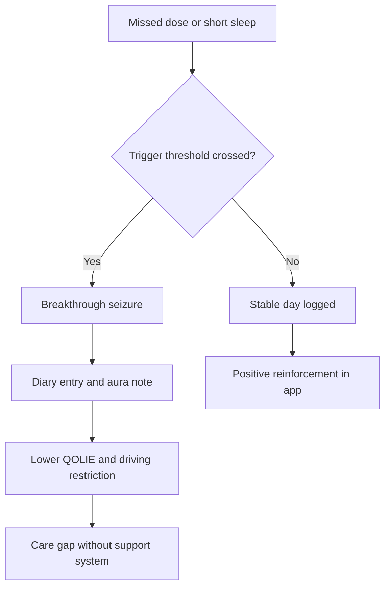
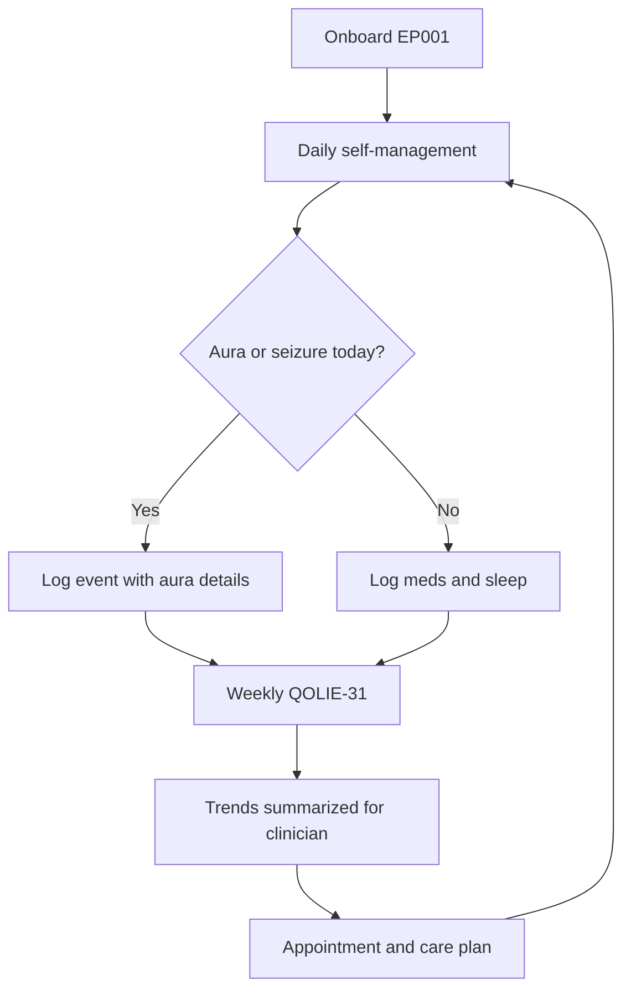
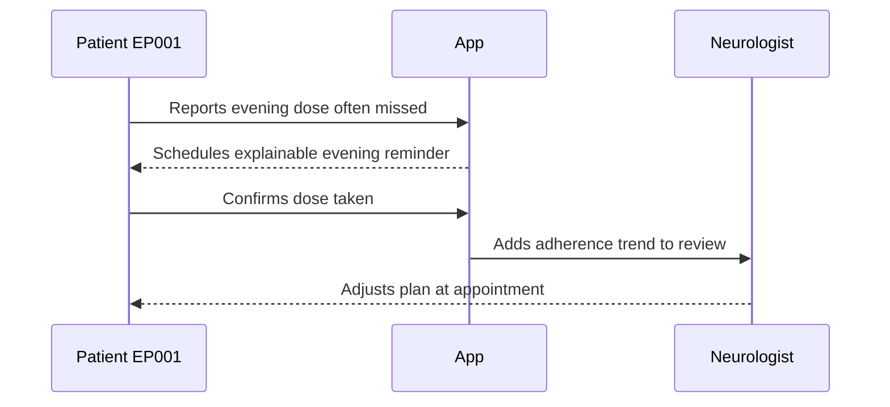
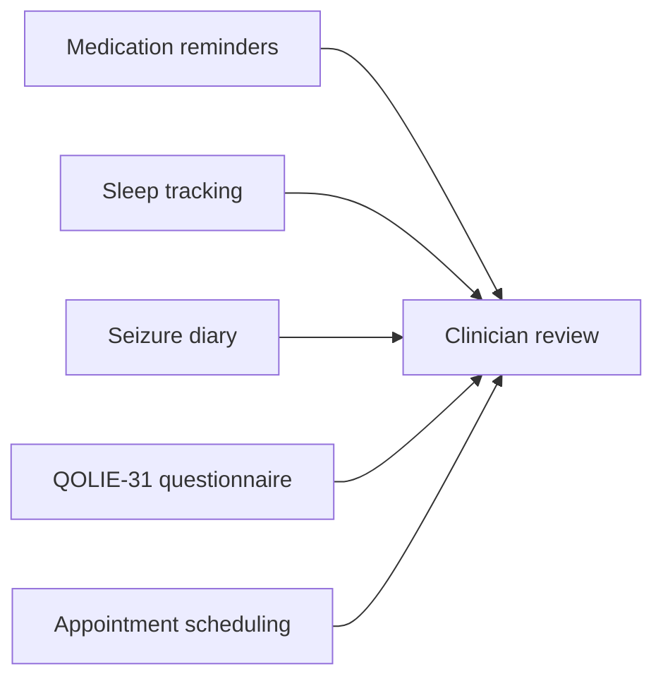
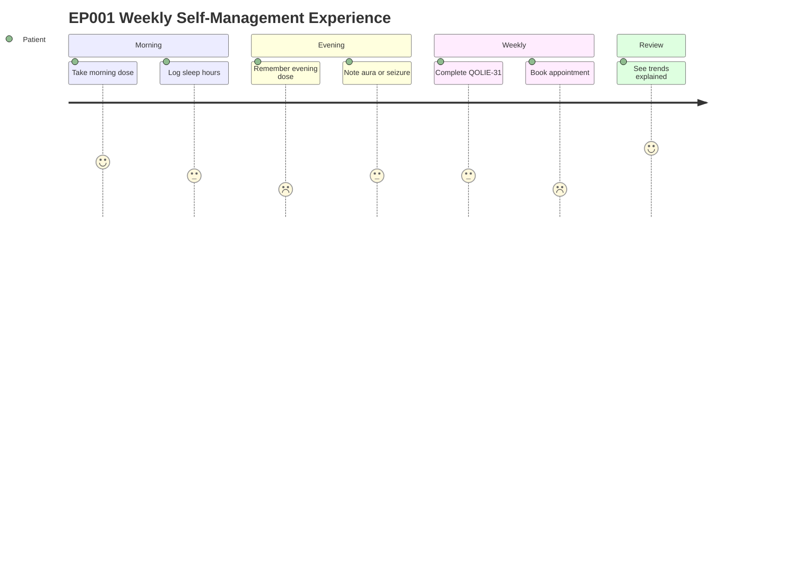

# Stakeholder Simulation - Patient (Epilepsy, EP001)

> **Why (this doc):** The Enterprise AI Platform for Explainable Multimodal Epilepsy Intelligence only earns clinical trust if the patient's lived experience is designed, tested, and defended as rigorously as the models. This document simulates the patient stakeholder (EP001, EP-2026-001) end to end so that role questions, app tasks, pain points, and flows are explicit, testable, and traceable to the research spine.
> **How:** We frame the patient inside the standard research spine (Problem through Statistical Analysis), then simulate role interview questions, self-management app tasks with status, pain points, and the complete engagement flow. Real data is used only where it legitimately originates from the EEG Technician's pre-assessment of EP001; all patient-reported and app-interaction fields are explicitly simulated. The platform is decision-support only and makes **no diagnosis claims**.

---

## 1. Problem

> **Why:** Naming the core problem anchors every downstream design choice to a real patient burden rather than to technology for its own sake. **How:** We state the epilepsy self-management gap that EP001 exemplifies and quantify it from his profile.

People with focal impaired awareness epilepsy carry a heavy day-to-day self-management load - medication timing, sleep hygiene, trigger avoidance, seizure documentation, and appointment continuity - yet most digital tools treat them as passive data sources rather than active, supported participants. EP001 is a concrete instance of this problem: a 29-year-old male averaging 5 seizures/month (approximately 90s, nocturnal, preceded by a metallic-taste and deja vu aura), with 88% medication adherence (3 missed Levetiracetam doses/month), poor sleep (5.2h), a high trigger burden (4), breakthrough seizures despite therapy, and a reduced quality of life (QOLIE-31 = 56/100). The problem is not a lack of data; it is a lack of an explainable, patient-facing system that converts scattered signals into timely, trustworthy support without overstepping into diagnosis.

*Caption - The table below grounds an abstract "self-management gap" in EP001's measured burden so the problem is defensible and specific, not generic.*

| Burden dimension | EP001 value | Why it matters for self-management |
|---|---|---|
| Seizure frequency | 5 / month | High enough to disrupt routine and driving eligibility |
| Seizure duration | ~90 s | Reinforces need for reliable diary capture |
| Adherence | 88% (3 missed doses/mo) | Missed doses are a modifiable breakthrough driver |
| Sleep | 5.2 h (poor) | Sleep loss is a documented seizure trigger |
| Trigger burden | 4 (high) | Multiple concurrent triggers compound risk |
| QOLIE-31 | 56 / 100 | Below-midpoint quality of life to be improved |
| Driving status | Restricted | Tangible life impact that motivates engagement |

*Caption - The flowchart shows how one unmanaged burden dimension cascades into the outcomes we aim to interrupt.*

---

## 2. Sub-Problems

> **Why:** Decomposing the problem exposes the specific, individually testable gaps the platform must close for the patient. **How:** We list sub-problems and map each to an observable EP001 signal.

*Caption - Breaking the core problem into sub-problems lets each app feature and hypothesis trace back to a named gap, which is essential for a defensible design.*

| # | Sub-problem | EP001 evidence | Owning app task |
|---|---|---|---|
| SP1 | Doses missed without timely nudging | 3 missed/mo, 88% adherence | Medication reminders |
| SP2 | Sleep deficit under-monitored | 5.2h, poor | Sleep tracking |
| SP3 | Seizure/aura events inconsistently captured | 90s nocturnal, aura present | Seizure diary |
| SP4 | Patient-reported outcomes collected too rarely | QOLIE-31 56 | Questionnaire (PRO) |
| SP5 | Care continuity friction | Restricted driving, follow-up need | Appointment scheduling |
| SP6 | Low explainability erodes trust | N/A (design gap) | Explainable nudges across all tasks |

---

## 3. Research Problem

> **Why:** A single sharpened research problem keeps the simulation and the platform honest about what is actually being investigated. **How:** We phrase it as one answerable question scoped to patient-facing, decision-support functionality.

**Research problem:** *To what extent can an explainable, multimodal, patient-facing self-management system improve medication adherence, self-monitoring completeness, and reported quality of life for a person with focal impaired awareness epilepsy (exemplified by EP001), without making any diagnostic claim and while preserving patient trust?*

---

## 4. Research Objective

> **Why:** Objectives convert the research problem into targets we can build toward and measure. **How:** We define one primary and three secondary objectives, each tied to a metric.

*Caption - This table binds each objective to a measurable indicator so the defense can show the study is falsifiable, not aspirational.*

| Objective | Statement | Primary metric | Baseline (EP001) |
|---|---|---|---|
| O1 (primary) | Improve medication adherence via explainable reminders | Adherence % | 88% |
| O2 | Increase self-monitoring completeness | Diary + sleep log completion % | Simulated baseline ~60% |
| O3 | Improve reported quality of life | QOLIE-31 | 56 / 100 |
| O4 | Maintain trust and no-diagnosis boundary | Trust survey + boundary audit | Simulated baseline |

---

## 5. Flow

> **Why:** A single canonical patient flow ensures every stakeholder - patient, Neurologist, EEG Technician - shares one mental model of the journey. **How:** We present the flow as a table and a flowchart from onboarding to review.

*Caption - The staged flow table clarifies who acts, what the system does, and where the no-diagnosis boundary is enforced at each step.*

| Stage | Patient action | System action | Boundary safeguard |
|---|---|---|---|
| Onboard | Consent, profile setup | Load EP001 profile, EEG readiness context | Show "support tool, not diagnosis" notice |
| Daily | Take meds, log sleep, note aura/seizure | Explainable reminders, capture entries | Nudges phrased as reminders, not verdicts |
| Weekly | Complete QOLIE-31 short form | Score, trend, flag for clinician review | No auto-interpretation shown as diagnosis |
| Event | Log seizure with aura details | Timestamp, structure, queue for review | Routed to Neurologist, not auto-classified |
| Review | Attend appointment | Summarize trends for clinician | Clinician makes all clinical decisions |

*Caption - The flowchart visualizes the same journey as a loop, showing the daily cycle feeding the clinical review that closes back into care.*

---

## 6. Hypotheses

> **Why:** Explicit hypotheses make the study testable and give the examiner concrete claims to probe. **How:** We state null and alternative hypotheses per objective with directionality.

*Caption - Pairing each hypothesis with its statistical test upfront demonstrates methodological discipline to the committee.*

| ID | Null (H0) | Alternative (H1) | Planned test |
|---|---|---|---|
| H1 | Explainable reminders do not change adherence | Reminders increase adherence above 88% | Paired proportion test |
| H2 | System does not change monitoring completeness | Completeness increases | Paired t-test |
| H3 | QOLIE-31 unchanged | QOLIE-31 improves from 56 | Wilcoxon signed-rank |
| H4 | Trust and no-diagnosis boundary unaffected | Trust maintained, zero boundary breaches | Descriptive + audit count |

---

## 7. Statistical Analysis

> **Why:** Pre-specifying analysis prevents post-hoc cherry-picking and shows the results will be interpretable. **How:** We define design, tests, and thresholds; EP001 is one case within a planned cohort.

*Caption - This table pre-registers the analytic plan so the defense can confirm every hypothesis has a matched, appropriate test and significance criterion.*

| Element | Specification |
|---|---|
| Design | Single-subject baseline vs intervention (EP001), scalable to cohort |
| Unit | Patient-week |
| Primary test | Paired proportion test (adherence) |
| Secondary tests | Paired t-test, Wilcoxon signed-rank |
| Alpha | 0.05, two-sided |
| Effect size | Cohen's d / rank-biserial reported |
| Missing data | Reported; sensitivity analysis on completers |
| Boundary metric | Count of diagnosis-claim violations (target = 0) |

---

## 8. Role Simulation - Interview Questions and Answers

> **Why:** Structured role interviews surface requirements and trust conditions before a line of UI is built. **How:** We answer EEG Technician questions with real EP001 pre-assessment data, and simulate Neurologist and Patient answers, clearly flagged.

### 8.1 EEG Technician (Real - from EP001 Pre-Assessment)

> **Why:** The EEG Technician is the one role whose answers derive from measured EP001 data, so it anchors the simulation in fact. **How:** We map each question to the recorded pre-assessment values.

*Caption - These are the only non-simulated role answers; they carry the real 10-20 EEG readiness data that establishes the platform's factual foundation.*

| Question | Real answer (EP001) |
|---|---|
| What montage was used? | 21 electrodes, 10-20 international system |
| Sampling rate? | 512 Hz |
| Average impedance? | 3.1 kOhm |
| Artifact risk? | Low |
| Overall EEG readiness? | 98% |
| Any prep concerns for this patient? | None; readiness high, low artifact risk |
| Data suitable for downstream analysis? | Yes, quality thresholds met |

### 8.2 Neurologist (Simulated)

> **Why:** The Neurologist consumes patient-generated trends and owns all clinical decisions, so their requirements shape the review surface. **How:** Answers are simulated placeholders pending real clinician input.

*Caption - Simulated clinician answers define what the patient app must summarize while keeping clinical judgment with the physician.*

| Question | Simulated answer |
|---|---|
| What patient data is most useful pre-visit? | Adherence trend, seizure/aura log, sleep, QOLIE-31 |
| How should the app present event data? | Structured, timestamped, no auto-classification |
| What must the app never do? | Never state or imply a diagnosis |
| Preferred review cadence? | Per scheduled appointment plus urgent flags |

### 8.3 Patient - EP001 (Simulated)

> **Why:** The patient's own voice defines usability, motivation, and trust thresholds. **How:** Answers are simulated to represent EP001's likely perspective, not verbatim patient data.

*Caption - Simulated patient answers translate the burden metrics into felt needs the app must serve.*

| Question | Simulated answer (EP001 persona) |
|---|---|
| What is hardest day to day? | Remembering the evening dose after work |
| What worries you most? | Nocturnal seizures I cannot feel happening |
| What would make you trust the app? | Clear reasons for every reminder, no scary verdicts |
| What would make you stop using it? | Too many alerts, or it claiming to diagnose me |
| What win matters most? | Getting driving eligibility back |

*Caption - The sequence diagram shows how a single role-interview insight (missed evening dose) flows into an app behavior.*

---

## 9. Role Assessment and Tasks with Simulated Status

> **Why:** Assessing readiness per role and tracking task status makes the simulation auditable. **How:** We score each role's readiness and list tasks with a simulated status flag.

*Caption - The assessment table lets the committee see which roles are evidence-backed (EEG Technician) versus simulated, avoiding overclaiming.*

| Role | Data basis | Readiness | Notes |
|---|---|---|---|
| EEG Technician | Real EP001 pre-assessment | 98% | Measured, high quality |
| Neurologist | Simulated | 70% | Pending clinician validation |
| Patient EP001 | Simulated persona | 75% | Persona from real burden metrics |

*Caption - Task status shows where the patient journey is complete, in progress, or blocked in the simulation.*

| Task | Owner | Simulated status |
|---|---|---|
| Profile onboarding | Patient | Done |
| Medication reminders live | App | In progress |
| Sleep tracking enabled | Patient | Done |
| Seizure diary capture | Patient | In progress |
| QOLIE-31 short form | Patient | Pending (weekly) |
| Appointment booked | Patient | Blocked (awaiting slot) |
| EEG readiness confirmed | EEG Technician | Done (98%) |

---

## 10. Patient-Facing App Tasks (Simulated)

> **Why:** These five tasks are the concrete surface where the platform meets EP001's daily burden. **How:** We specify each task's purpose, trigger, and no-diagnosis safeguard, then show the network of tasks.

### 10.1 Medication Reminders

> **Why:** Addresses SP1 - three missed Levetiracetam doses/month directly drive breakthrough seizures. **How:** Explainable, time-anchored nudges tied to the BID schedule.

*Caption - Specifying reminder logic against EP001's exact regimen shows the feature is patient-specific, not generic.*

| Attribute | Value |
|---|---|
| Regimen | Levetiracetam 1000mg BID |
| Trigger | Morning and evening dose windows |
| Explanation shown | "Reminder because evening doses are often missed" |
| Escalation | Gentle re-nudge, never alarm |
| Boundary | Does not interpret missed dose as diagnosis |

### 10.2 Sleep Tracking

> **Why:** Addresses SP2 - 5.2h sleep is a high-value modifiable trigger. **How:** Nightly self-report with trend feedback.

*Caption - Tracking sleep against EP001's poor 5.2h baseline gives a concrete target for trigger reduction.*

| Attribute | Value |
|---|---|
| Baseline | 5.2 h (poor) |
| Capture | Nightly self-report |
| Feedback | Weekly trend, no clinical claim |
| Link | Correlated with trigger burden, not causally asserted |

### 10.3 Seizure Diary

> **Why:** Addresses SP3 - nocturnal 90s events with metallic-taste/deja vu aura need reliable capture. **How:** Structured event log with aura fields.

*Caption - A structured diary tuned to EP001's aura profile improves data quality for clinician review.*

| Field | Example (EP001) |
|---|---|
| Onset time | Nocturnal |
| Duration | ~90 s |
| Aura | Metallic taste, deja vu |
| Awareness | Impaired |
| Post-event notes | Free text |

### 10.4 Questionnaire (QOLIE-31)

> **Why:** Addresses SP4 - QOLIE-31 of 56 is the quality-of-life outcome to improve. **How:** Scheduled short-form PRO with trend, no auto-interpretation.

*Caption - Repeating the validated QOLIE-31 turns a one-time score of 56 into a trackable outcome.*

| Attribute | Value |
|---|---|
| Instrument | QOLIE-31 |
| Baseline | 56 / 100 |
| Cadence | Weekly short form |
| Output | Score and trend only |
| Boundary | No diagnostic labeling of scores |

### 10.5 Appointment Scheduling

> **Why:** Addresses SP5 - continuity matters given restricted driving and breakthrough seizures. **How:** In-app booking that surfaces trends to the Neurologist.

*Caption - Appointment tooling closes the loop from self-management back into clinician-led care.*

| Attribute | Value |
|---|---|
| Trigger | Due follow-up or urgent flag |
| Data attached | Adherence, diary, sleep, QOLIE-31 trends |
| Decision owner | Neurologist |
| Boundary | App schedules; clinician decides |

*Caption - The network diagram shows how the five patient tasks feed one clinical review node.*

---

## 11. Patient Experience Journey (Simulated)

> **Why:** A journey view exposes emotional highs and lows that raw task lists hide, guiding trust design. **How:** We map EP001's simulated satisfaction across a typical week.

*Caption - The journey diagram highlights where EP001's experience dips (evening dose, nocturnal worry) so design effort targets real friction.*

---

## 12. Pain Points and Mitigations

> **Why:** Cataloguing pain points ensures the design responds to friction rather than assuming smooth adoption. **How:** We list each pain point, its source metric, and a concrete mitigation.

*Caption - Tracing each pain point to an EP001 metric and a mitigation proves the design is evidence-driven.*

| Pain point | Source | Mitigation |
|---|---|---|
| Evening dose forgotten | 3 missed doses/mo | Explainable evening reminder |
| Nocturnal seizure anxiety | Nocturnal events | Structured diary, reassurance framing |
| Alert fatigue risk | UX concern | Minimal, reasoned nudges only |
| Fear of being "diagnosed" by app | Trust concern | Explicit no-diagnosis notices |
| Booking friction | Restricted driving, blocked slot | In-app scheduling with trend attach |
| Low motivation from low QOLIE | QOLIE 56 | Positive reinforcement on good days |

---

## 13. Professor Readiness (Defense Q&A)

> **Why:** Anticipating examiner questions demonstrates command of the design's assumptions and limits. **How:** We pose five likely questions and answer each concisely.

### 13.1 Which data here is real and which is simulated?

> **Why:** Integrity of claims is the first thing a committee tests. **How:** We draw a clear line.

Only the EEG Technician answers are real, derived from EP001's pre-assessment (21 electrodes, 10-20 system, 512 Hz, 3.1 kOhm, low artifact risk, 98% readiness). All Neurologist and Patient role answers, task statuses, and journey scores are simulated, with the persona grounded in EP001's real burden metrics (adherence 88%, sleep 5.2h, QOLIE-31 56, etc.).

### 13.2 How do you guarantee no diagnosis is claimed?

> **Why:** This is the platform's core ethical boundary. **How:** We describe layered safeguards.

*Caption - The safeguard table shows the no-diagnosis rule is enforced at multiple layers, not by a single disclaimer.*

| Layer | Safeguard |
|---|---|
| UI | Persistent "support tool, not diagnosis" notice |
| Copy | Reminders and trends phrased as observations |
| Routing | Events routed to Neurologist, never auto-classified |
| Audit | Boundary-violation counter, target zero |

### 13.3 Why single-subject EP001 rather than a cohort now?

> **Why:** Examiners probe generalizability. **How:** We justify the staged design.

EP001 is a fully specified, realistic case used to validate the flow, instrumentation, and boundary controls before scaling. The statistical design (Section 7) is explicitly written to extend from single-subject baseline-vs-intervention to a cohort with the same tests, so external validity is a planned next phase, not an afterthought.

### 13.4 How will you know the app helped rather than natural variation?

> **Why:** Attribution is a classic threat to validity. **How:** We cite the baseline design.

We use a baseline-versus-intervention comparison per patient-week with pre-specified paired tests and effect sizes, plus a completers sensitivity analysis. For a single subject we treat results as hypothesis-generating and confirm in the cohort phase, avoiding overclaiming causality.

### 13.5 What stops alert fatigue from lowering adherence?

> **Why:** Over-notification can backfire on the primary objective. **How:** We describe restraint by design.

Reminders are minimal, reasoned, and tied only to EP001's known miss pattern (evening dose). Each nudge carries an explanation, escalation is gentle, and frequency is capped, with the trust survey (H4) monitoring for fatigue so the design self-corrects.

---

## 14. References

> **Why:** Grounding the design in the literature makes claims defensible and non-original where it should be. **How:** APA 7th edition entries spanning epilepsy classification, AI in medicine, PRO measurement, and ethics.

American Psychological Association. (2020). *Publication manual of the American Psychological Association* (7th ed.). American Psychological Association.

Cramer, J. A., Perrine, K., Devinsky, O., Bryant-Comstock, L., Meador, K., & Hermann, B. (1998). Development and cross-cultural translations of a 31-item quality of life in epilepsy inventory (QOLIE-31). *Epilepsia, 39*(1), 81-88.

Fisher, R. S., Cross, J. H., French, J. A., Higurashi, N., Hirsch, E., Jansen, F. E., Lagae, L., Moshe, S. L., Peltola, J., Roulet Perez, E., Scheffer, I. E., & Zuberi, S. M. (2017). Operational classification of seizure types by the International League Against Epilepsy: Position paper of the ILAE Commission for Classification and Terminology. *Epilepsia, 58*(4), 522-530.

Kwan, P., & Brodie, M. J. (2000). Early identification of refractory epilepsy. *New England Journal of Medicine, 342*(5), 314-319.

Topol, E. J. (2019). High-performance medicine: The convergence of human and artificial intelligence. *Nature Medicine, 25*(1), 44-56.

World Health Organization. (2019). *Epilepsy: A public health imperative*. World Health Organization.
