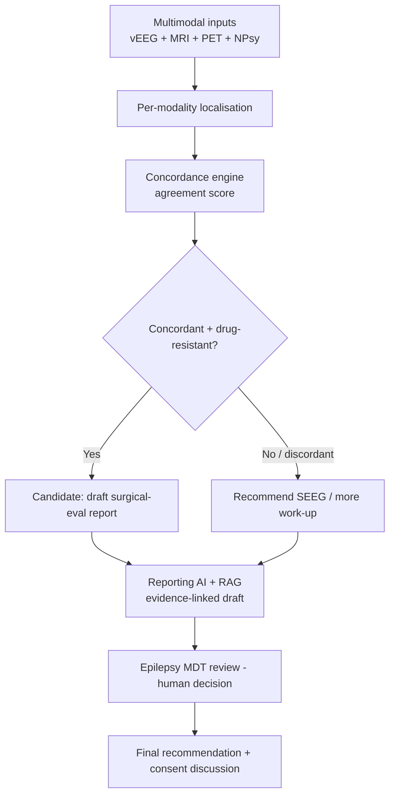
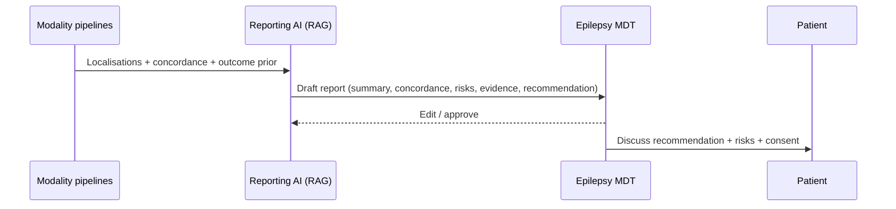
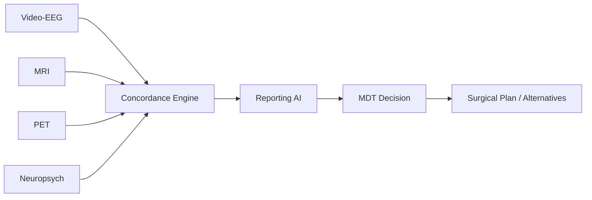
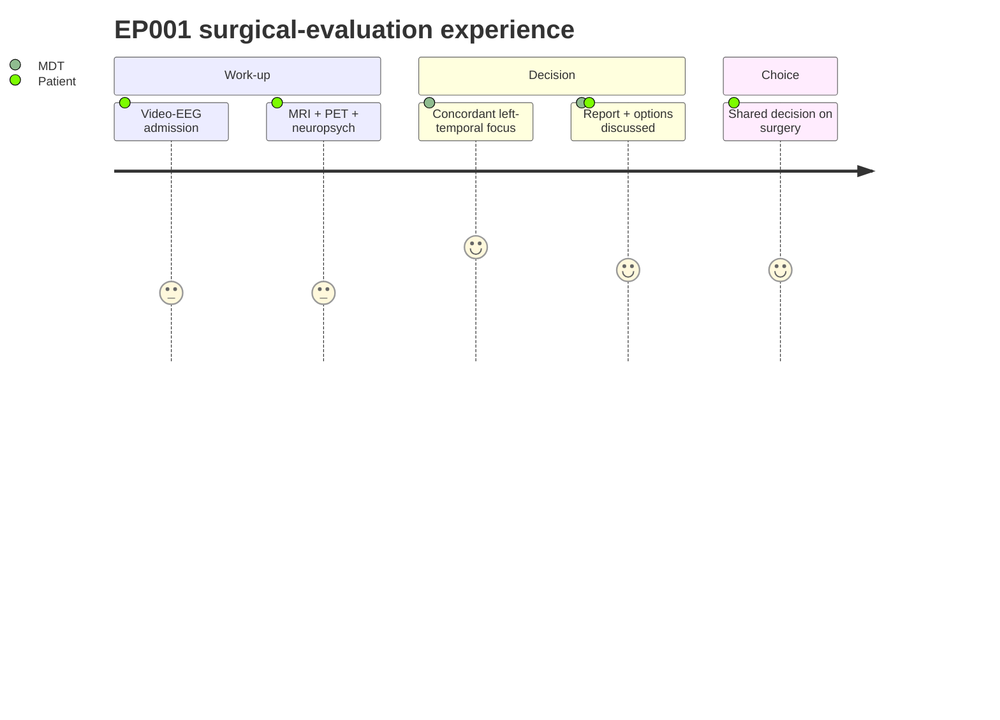

# Surgical Recommendation Report (Problem 5) — Reporting AI + Decision AI

> **Why (this doc):** For drug-resistant focal epilepsy like EP001 (breakthrough on CBZ+LEV,
> left-temporal focus), epilepsy surgery can be curative — but the decision needs a **multimodal,
> concordance-based** work-up, not EEG alone. This defines how **Reporting AI** (+ RAG + Decision AI)
> assembles an evidence-linked epilepsy-surgery evaluation report for the neurologist/MDT, who make
> the final call. **How:** the data-requirement answer, a concordance model, the report structure, and
> the mandated diagrams. Anchors on EP001.

## 1. Is EEG enough? (data requirements)

**No — EEG alone is insufficient for a surgical recommendation.** Presurgical evaluation requires
**concordance across multiple modalities**; the AI's job is to fuse them and flag agreement/conflict.

*Caption - Modalities required for a surgical work-up, what each contributes, and its necessity.*

| Modality | Contributes | Necessity for surgery decision |
|---|---|---|
| Scalp **video-EEG** (long-term) | Ictal onset zone, seizure semiology, lateralisation | **Essential** |
| **MRI** (3T epilepsy protocol) | Structural lesion / mesial temporal sclerosis | **Essential** |
| **PET** (interictal FDG) | Hypometabolic zone (EP001: left temporal) | High — esp. MRI-negative |
| **SPECT** (ictal/interictal) | Hyperperfusion at seizure onset | Moderate–high |
| **MEG** | Magnetic source of spikes | Moderate (MRI-negative / re-op) |
| **fMRI** | Eloquent cortex (language/motor) mapping | High for resection safety |
| **Neuropsychology** | Baseline + material-specific lateralisation, surgical risk | **Essential** |
| **Wada / language mapping** | Language & memory dominance | Case-dependent |
| **Intracranial EEG (SEEG)** | Definitive onset zone when non-invasive is discordant | Case-dependent |
| **EMG** | Peripheral neuromuscular / intra-op monitoring | **Not** a primary epilepsy-localisation modality (minor/adjunct role) |

So: **EEG + MRI + PET/SPECT + video-EEG + neuropsychology (± MEG/fMRI/SEEG)** — EMG is not central.

## 2. AI role in the surgical recommendation

*Caption - What each AI type does in producing the report; the clinician/MDT decides.*

| AI type | Function |
|---|---|
| **Decision AI** | Compute per-modality localisation + a **concordance score**; estimate seizure-freedom likelihood (Engel/ILAE outcome priors) |
| **Explainable AI** | SHAP/attribution linking the recommendation to the concordant evidence |
| **Reporting AI + RAG** | Draft the structured report, citing guidelines + the patient's own findings |
| **Human-in-the-loop** | Epilepsy MDT reviews, edits, and makes the final decision |

## 3. Concordance model → candidacy

*Caption - EP001 worked example: modalities agree on a left-temporal focus → strong candidate.*

| Modality | EP001 finding | Localisation | Concordant? |
|---|---|---|---|
| Video-EEG | Left temporal ictal onset | Left temporal | ✅ |
| MRI | Left hippocampal T2/FLAIR ↑, volume loss (query MTS) | Left mesial temporal | ✅ |
| PET | Left temporal hypometabolism | Left temporal | ✅ |
| Neuropsychology | Verbal-memory + naming deficit (left) | Left dominant | ✅ |
| **Concordance** | 4/4 agree | **Left temporal** | **High → surgical candidate** |

## 4. Report-generation flow

**Reason:** To show how multimodal data becomes a governed recommendation. **Why:** Surgery decisions demand concordance and human authority. **What is happening:** Modalities are localised, scored for concordance, drafted into a report, and decided by the MDT. **How it is happening:** A concordance engine gates the report; RAG cites evidence; the MDT confirms. **Reference:** Rosenow & Luders (2001); Jobst & Cascino (2015).

## 5. Report structure

**Reason:** The report assembly + review sequence. **Why:** The clinician must own and communicate the recommendation. **What is happening:** Pipelines feed a drafted report the MDT edits and discusses with the patient. **How it is happening:** Reporting AI structures the evidence; humans decide and consent. **Reference:** Jobst & Cascino (2015).

Report sections: (1) Clinical summary · (2) Drug-resistance confirmation (failed ≥2 ASMs) ·
(3) Modality findings · (4) **Concordance analysis** · (5) Estimated seizure-freedom likelihood ·
(6) Risks (memory/language/visual field) · (7) Alternatives (SEEG, VNS/RNS/DBS, laser ablation) ·
(8) Evidence citations · (9) **Recommendation (clinician-confirmed)** · (10) Limitations.

## Network + journey

**Reason:** Component view of the surgical-report pipeline. **Why:** Each modality must link to the concordance engine. **What is happening:** Four modalities converge on concordance → report → decision. **How it is happening:** Shared patient id + region codes join the evidence. **Reference:** Rosenow & Luders (2001).

**Reason:** The patient's journey through evaluation. **Why:** Surgery is a major shared decision. **What is happening:** Work-up → concordant finding → informed choice. **How it is happening:** Each step maps to a modality or review. **Reference:** Topol (2019).

## Professor Readiness (Defense Q&A)

**Q1: Why can't EEG alone recommend surgery?** Localisation must be concordant across ictal EEG, structural MRI, functional (PET/SPECT), and neuropsychology; single-modality recommendations risk resecting the wrong zone.

**Q2: Does the AI decide?** No — it computes concordance, estimates outcome likelihood, and drafts an evidence-linked report; the epilepsy MDT makes the decision and obtains consent.

**Q3: Where does EMG fit?** It is not a core epilepsy-localisation modality (peripheral neuromuscular/intra-operative use); the required stack is video-EEG + MRI + PET/SPECT + neuropsych (± MEG/fMRI/SEEG).

## References

Jobst, B. C., & Cascino, G. D. (2015). Resective epilepsy surgery for drug-resistant focal epilepsy. *JAMA, 313*(3), 285–293.

Rosenow, F., & Luders, H. (2001). Presurgical evaluation of epilepsy. *Brain, 124*(9), 1683–1700.

Topol, E. J. (2019). *Deep medicine*. Basic Books.
