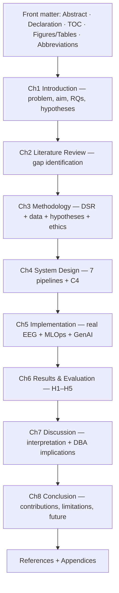
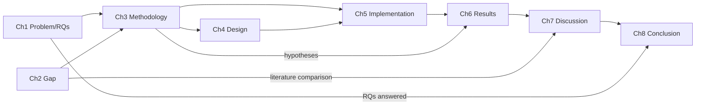
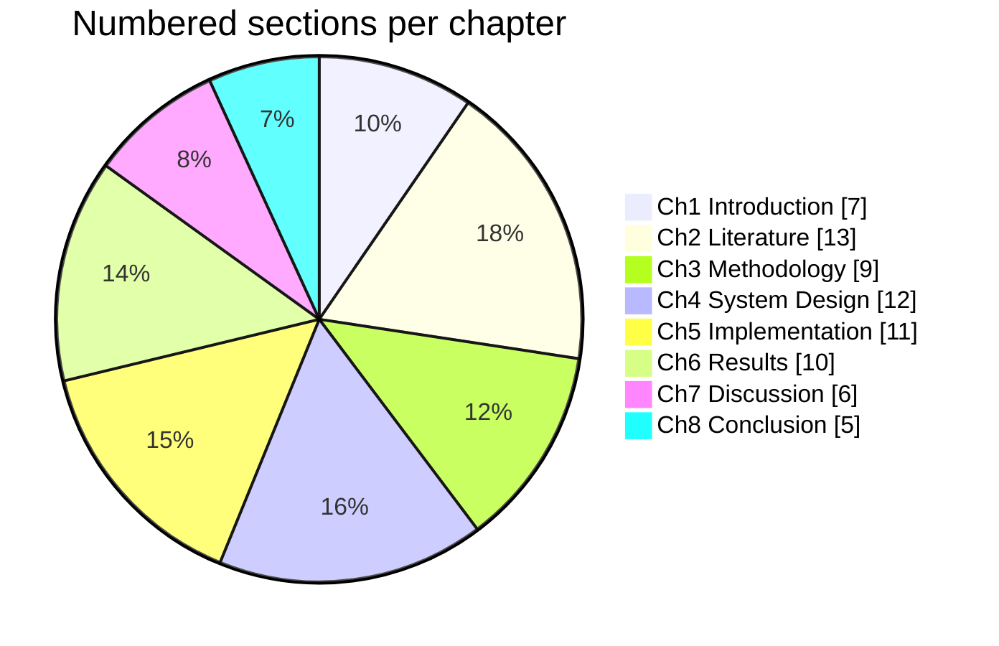

# An Enterprise-Grade Explainable Multimodal AI Platform for Remote Epilepsy Care: Design, Implementation, and Evaluation

**A dissertation submitted in partial fulfilment of the requirements for the degree of Doctor of Business Administration (DBA)**

*Reference index case: Patient EP001 · Scope: Epilepsy*

> **Compiled PDF:** this dissertation is compiled to [DBA-Epilepsy-Thesis.pdf](../DBA-Epilepsy-Thesis.pdf)
> (52 pp) via `python analysis/build_thesis_pdf.py`. The companion technical deliverable is
> [DBA-Epilepsy-Deliverable.pdf](../DBA-Epilepsy-Deliverable.pdf).

---

## Abstract

Epilepsy affects approximately fifty million people worldwide, yet its diagnosis and ongoing
management remain slow, fragmented, and unevenly explained. Clinical history captured by neurologists
and electrophysiological evidence captured by electroencephalography (EEG) technicians are rarely fused
within a single, governed, enterprise workflow, and the machine-learning models that could assist are
too often delivered as isolated artefacts without the data-engineering, deployment, monitoring, and
governance scaffolding that a healthcare organisation requires. This dissertation addresses that
organisational gap. Adopting a Design Science Research paradigm combined with a mixed-methods
evaluation, it designs, implements, and evaluates an enterprise-grade, explainable, multimodal
artificial-intelligence platform for remote epilepsy care, structured as seven connected operating
pipelines spanning research protocol, data engineering, feature engineering, statistical and machine
learning modelling, machine-learning operations, retrieval-augmented generation with a knowledge graph,
and clinical safety with responsible-AI governance.

The empirical core of the work is a reproducible analysis of **real scalp EEG** from the CHB-MIT
database. Using signal preprocessing, time-frequency transforms (short-time Fourier and continuous
wavelet), one-dimensional-to-two-dimensional image representations, and a set of interpretable
biomarkers (spectral band power, Hjorth parameters, Higuchi fractal dimension, spectral entropy,
phase-locking value, and line-length), a hyperparameter-tuned, class-balanced classifier discriminates
ictal from interictal states with a cross-validated area under the receiver-operating-characteristic
curve (ROC-AUC) of approximately 0.92, rising to approximately 0.97 for ictal-versus-interictal
separation, and generalises to an external EEG benchmark (EEG-Eye-State) at a ROC-AUC of approximately
0.979. Explainability via SHAP and permutation importance converges on line-length, gamma-band power,
and phase-locking value as the dominant discriminators, and non-parametric hypothesis testing confirms
their significance. Clinical severity, seizure-recurrence, and longitudinal models are demonstrated on
a clearly labelled synthetic 500-patient cohort pending institutional-review-board-approved clinical
data. The platform is delivered as running code, an interactive viewer with fifteen analytical views,
a knowledge graph exported as Resource Description Framework triples, and a compiled dissertation.

The contribution is fourfold: a theoretical operating model for governed multimodal epilepsy
intelligence; a methodological pipeline demonstrating real-EEG, explainable, reproducible analysis; a
practical deployable artefact; and an honest account of the boundary between what is implemented and
what remains specified. The work argues that the decisive gap in clinical AI is not algorithmic but
operational, and that value accrues when models are embedded in owned, governed, monitored pipelines
with human oversight throughout.

**Keywords:** epilepsy, electroencephalography, explainable AI, multimodal fusion, MLOps, responsible
AI, knowledge graph, retrieval-augmented generation, design science, clinical decision support.

---

## Declaration

I declare that this dissertation is my own work and that all sources have been acknowledged in
accordance with APA 7th-edition conventions. The empirical EEG analyses use publicly available,
de-identified datasets (CHB-MIT via PhysioNet; EEG-Eye-State via OpenML). Clinical cohort data used for
the severity and recurrence demonstrations are synthetic and are labelled as such throughout. The
platform is a research and decision-support artefact; it is not a certified medical device and does not
provide autonomous diagnosis.

## Acknowledgements

The author acknowledges the PhysioNet and OpenML communities for open datasets, the maintainers of the
open-source scientific Python and JavaScript ecosystems on which the artefact is built, and the
clinical framing provided by the International League Against Epilepsy classification.

---

## Table of Contents

*Caption — the dissertation structure; each chapter carries a flowchart, sequence diagram, network
diagram, and C4 model, with supporting tables and figures.*

| Chapter | Title |
|---|---|
| Front matter | Title · Abstract · Declaration · Acknowledgements · Contents · Figures/Tables · Abbreviations |
| 1 | Introduction |
| 2 | Literature Review |
| 3 | Research Methodology |
| 4 | System Design & Architecture |
| 5 | Implementation |
| 6 | Results & Evaluation |
| 7 | Discussion |
| 8 | Conclusion, Limitations & Future Work |
| References | Consolidated APA-7 references (per chapter) |
| Appendices | Governance pack, enterprise-flow specifications, knowledge-graph ontology |

## List of Abbreviations

*Caption — abbreviations used throughout the dissertation.*

| Abbrev. | Meaning |
|---|---|
| AI | Artificial Intelligence |
| ASM | Anti-Seizure Medication |
| AUC | Area Under the ROC Curve |
| CWT | Continuous Wavelet Transform |
| DBA | Doctor of Business Administration |
| DSR | Design Science Research |
| EEG | Electroencephalography |
| HIPAA | Health Insurance Portability and Accountability Act |
| ILAE | International League Against Epilepsy |
| KG | Knowledge Graph |
| MCP | Model Context Protocol |
| MLOps | Machine-Learning Operations |
| NIST | National Institute of Standards and Technology |
| PLV | Phase-Locking Value |
| PR-AUC | Area Under the Precision-Recall Curve |
| RAG | Retrieval-Augmented Generation |
| RDF | Resource Description Framework |
| ROC | Receiver Operating Characteristic |
| SHAP | SHapley Additive exPlanations |
| SMOTE | Synthetic Minority Over-sampling Technique |
| STFT | Short-Time Fourier Transform |

## List of Figures

*Caption — the 30 figures; every chapter carries a flowchart, sequence diagram, network diagram, and C4 model.*

| Figure | Title |
|---|---|
| 1.1 | Flowchart of the seven-pipeline operating model and its feedback loop |
| 1.2 | Sequence diagram of a governed, audited prediction within one encounter |
| 1.3 | Network diagram of the platform's principal components and data flows |
| 1.4 | C4 context model situating the platform among users and external systems |
| 2.1 | PRISMA-style flow of literature identification, screening, and inclusion |
| 2.2 | Sequence of data movement in a representative prior seizure-detection system |
| 2.3 | Thematic network map of the reviewed literature clusters |
| 2.4 | C4-style context model situating the present research |
| 3.1 | Design Science Research cycle (research design flow) |
| 3.2 | Interaction among the principal processing stages |
| 3.3 | Variable-relationships map (IV → DV via mediators/confounders) |
| 3.4 | C4-style container view of the research apparatus |
| 4.1 | Seven-pipeline operating model with cross-pipeline feedback |
| 4.2 | Component/data-relationship network (lakehouse → feature plane → serving) |
| 4.3 | Sequence of an authenticated, audited prediction request |
| 4.4 | C4 Context view |
| 4.5 | C4 Container view |
| 5.1 | Secondary EEG pipeline implementation on real CHB-MIT data |
| 5.2 | Training, experiment-tracking, and registry-promotion sequence |
| 5.3 | MLOps component network |
| 5.4 | C4-style component model of the analytics/MLOps codebase |
| 6.1 | The end-to-end evaluation protocol (flowchart) |
| 6.2 | Prediction-and-audit sequence |
| 6.3 | Real-model ROC-AUC comparison chart |
| 6.4 | Results network linking datasets, models, and metrics |
| 6.5 | C4-style deployment/evaluation context |
| 7.1 | Flowchart from findings to contributions to future work |
| 7.2 | C4-style context of the deployed platform in a health system |
| 8.1 | Contribution map (network) |
| 8.2 | Sequence diagram of the clinical adoption pathway |

## List of Tables

*Caption — the 19 numbered tables across the dissertation.*

| Table | Title |
|---|---|
| 1.1 | From operational pain point to research response |
| 1.2 | Research questions ↔ hypotheses ↔ evidence |
| 2.1 | Synthesis matrix of prior work versus the present study |
| 2.2 | Gap analysis linking literature deficiencies to responses |
| 3.1 | Research questions ↔ hypotheses ↔ confirmatory tests |
| 3.2 | Data-sources catalogue (primary clinical vs secondary EEG) |
| 3.3 | Variable dictionary |
| 4.1 | The seven pipelines — ownership boundaries |
| 4.2 | Lakehouse zones |
| 4.3 | Quality attributes mapped to mechanisms |
| 5.1 | Engineered EEG feature set |
| 5.2 | MLOps modules and function |
| 5.3 | Technology stack and role |
| 6.1 | Accuracy matrix for the real-EEG models |
| 6.2 | Mann-Whitney U feature significance (ictal vs interictal) |
| 6.3 | 40-stage implementation status + phase-gate maturity |
| 6.4 | Hypothesis outcomes (H1–H5) |
| 8.1 | Contributions mapped to research questions |
| 8.2 | Limitations mapped to mitigations |

## Thesis Structure Map

The dissertation comprises **8 chapters, 73 numbered sections, 30 figures, and 19 tables**. The
structure is presented below as a logical-sequence flowchart, a chapter table, a bullet outline, a
dependency network, and a proportion chart.

### Structure as a table
*Caption — chapters with their section, figure, and table counts.*

| Ch | Title | Sections | Figures | Tables |
|---|---|---|---|---|
| 1 | Introduction | 7 | 4 | 2 |
| 2 | Literature Review | 13 | 4 | 2 |
| 3 | Research Methodology | 9 | 4 | 3 |
| 4 | System Design & Architecture | 12 | 5 | 3 |
| 5 | Implementation | 11 | 4 | 3 |
| 6 | Results & Evaluation | 10 | 5 | 4 |
| 7 | Discussion | 6 | 2 | 0 |
| 8 | Conclusion, Limitations & Future Work | 5 | 2 | 2 |
| | **Total** | **73** | **30** | **19** |

### Structure as a logical-sequence flowchart
*Figure FM.1 — the dissertation's logical reading sequence.*

### Structure as a bullet outline
- **Front matter** — Abstract · Declaration · Acknowledgements · Table of Contents · List of Figures · List of Tables · List of Abbreviations
- **Chapter 1 — Introduction:** 1.1 Background · 1.2 Business & Clinical Problem · 1.3 Aim, Questions, Hypotheses · 1.4 Scope · 1.5 Platform in Outline · 1.6 Significance & Contribution · 1.7 Structure
- **Chapter 2 — Literature Review:** 2.1 Scope · 2.2 Review Method · 2.3 Epilepsy & Diagnosis · 2.4 ML for Seizure Detection (2.4.1 Classical · 2.4.2 Deep Learning · 2.4.3 Benchmarks) · 2.5 Time-Frequency & Images · 2.6 Multimodal Fusion · 2.7 Explainable AI · 2.8 Responsible AI & Standards · 2.9 MLOps · 2.10 RAG & Knowledge Graphs · 2.11 Synthesis & Gap · 2.12 Delimitation · 2.13 Summary
- **Chapter 3 — Methodology:** 3.1 Orientation · 3.2 DSR Cycle · 3.3 Questions & Hypotheses · 3.4 Unit/Severity/Roles · 3.5 Data Sources · 3.6 Collection & Analysis Interaction · 3.7 Analytical Methods · 3.8 Rigor, Validity, Ethics · 3.9 Summary
- **Chapter 4 — System Design:** 4.1 Rationale · 4.2 Seven Pipelines · 4.3 Forty-Stage Architecture · 4.4 Data Architecture · 4.5 Feature Architecture · 4.6 Serving · 4.7 Generative-AI · 4.8 Governance-by-Design · 4.9 Prediction Object · 4.10 C4 Views · 4.11 Maturity · 4.12 Summary
- **Chapter 5 — Implementation:** 5.1 Philosophy · 5.2 Signal Processing (real EEG) · 5.3 Time-Frequency/CV · 5.4 Feature Engineering · 5.5 Imbalance & Modelling · 5.6 Primary/Fusion (synthetic) · 5.7 MLOps · 5.8 GenAI · 5.9 Component Model · 5.10 Tech Stack · 5.11 Reproducibility & Viewer
- **Chapter 6 — Results & Evaluation:** 6.1 Philosophy · 6.2 Protocol · 6.3 Real-EEG Detection (6.3.1 External Validation · 6.3.2 Model Comparison) · 6.4 Significance/Ranking/Ablation · 6.5 Explainability · 6.6 Synthetic Clinical/Fusion · 6.7 Fairness · 6.8 Operational/Governance · 6.9 Hypothesis Outcomes · 6.10 Threats to Validity
- **Chapter 7 — Discussion:** 7.1 Overview · 7.2 Interpreting Performance · 7.3 Seven Pipelines · 7.4 Explainability/RAG/KG · 7.5 Governance & Trust · 7.6 Organisational/DBA Implications
- **Chapter 8 — Conclusion:** 8.1 Problem & Response · 8.2 Contributions · 8.3 Limitations · 8.4 Future Work · 8.5 Reflective Closing

### Structure as a dependency network
*Figure FM.2 — how chapters depend on one another beyond linear order.*

### Structure as a chart
*Figure FM.3 — proportion of numbered sections per chapter.*

