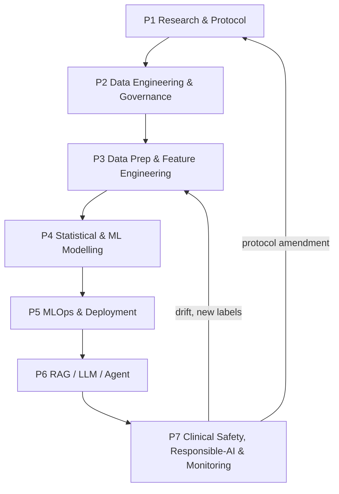
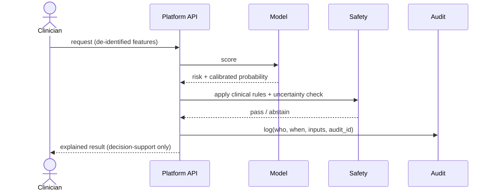
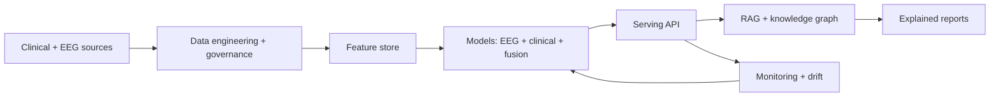
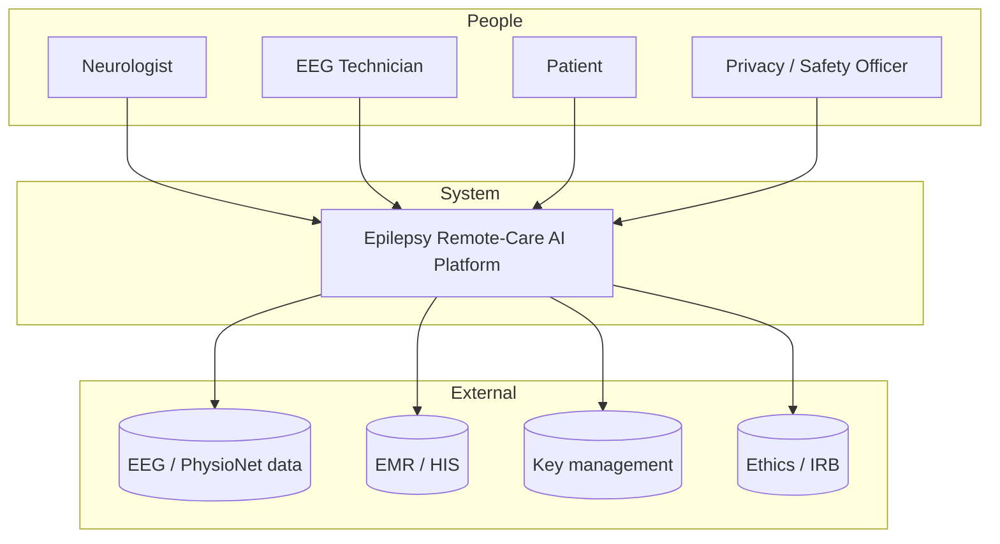

# Chapter 1 — Introduction

## At a glance
- **Problem:** epilepsy care is slow, fragmented, reactive — the gap is *operational*, not algorithmic.
- **Aim:** design, implement, evaluate an enterprise, explainable, multimodal, governed epilepsy platform.
- **Evidence:** real EEG (CHB-MIT) is the empirical core; clinical/fusion models are synthetic (labelled).
- **Structure:** 7 sections, 4 figures (flowchart · sequence · network · C4), 2 tables.

| RQ | Focus |
|---|---|
| RQ1 | interpretable EEG biomarkers discriminate ictal states |
| RQ2 | detector generalises to an external benchmark |
| RQ3 | explanations identify clinically legible drivers |
| RQ4 | governance-by-design is feasible/auditable |
| RQ5 | enterprise operating model improves deployability |

## 1.1 Background

Epilepsy is among the most common serious neurological disorders, affecting an estimated fifty million
people worldwide and imposing a substantial burden on patients, families, and health systems. It is
characterised by a persisting predisposition to recurrent, unprovoked seizures, and its clinical
management depends on the synthesis of two very different kinds of evidence: the narrative clinical
history and examination recorded by a neurologist, and the electrophysiological signal recorded by an
electroencephalography technician. In routine practice these two evidence streams are gathered by
different professionals, stored in different systems, and interpreted at different times. The
consequence is a diagnostic pathway that is frequently slow, expensive, fragmented, and reactive rather
than anticipatory. Patients may wait weeks for an assessment that integrates their history with their
EEG, and clinicians must reconstruct a longitudinal picture from records that were never designed to be
read together.

Artificial intelligence has been proposed repeatedly as a remedy, and the research literature is rich
with models that detect or predict seizures from EEG with impressive accuracy on benchmark datasets.
Yet the translation of these models into dependable clinical operation has lagged far behind their
reported performance. A model is not a service. A healthcare organisation that wishes to use a seizure
detector must first solve a long chain of problems that the typical research paper does not address:
how the data arrives and is contracted, how it is governed and versioned, how features are computed
without leakage, how the model is registered, served, monitored for drift, and rolled back, how its
outputs are explained and audited, and how patient consent and privacy are enforced throughout. This
dissertation takes the position that the decisive gap in clinical epilepsy AI is therefore not
primarily algorithmic but **operational and organisational**, which is precisely the domain of a Doctor
of Business Administration inquiry.

## 1.2 The Business and Clinical Problem

The organisational problem motivating this work can be stated plainly. Current epilepsy assessment
consumes scarce specialist time, produces fragmented records, and recognises clinical deterioration
late. The clinical problem that follows is to support — never to replace — the neurologist and EEG
technician by fusing their evidence, estimating seizure severity and near-term risk, explaining every
recommendation, and doing so within a governed workflow that a health system can trust and audit. The
research problem, in turn, is to design and evaluate an enterprise-grade platform that delivers this
support reproducibly, on real physiological data, with explicit responsible-AI and safety controls.

*Caption — Table 1.1 traces the line from the operational pain point to the research response,
establishing that the contribution is an operating model, not a single algorithm.*

| Layer | Statement |
|---|---|
| Business problem | Specialist assessment is slow, costly, fragmented; deterioration recognised late |
| Business objective | Improve a measurable clinical/operational outcome via an AI-supported process |
| Clinical problem | Fuse clinical + EEG evidence; estimate severity and 90-day seizure risk; explain and govern |
| Research problem | Design + evaluate an enterprise, explainable, multimodal, governed epilepsy platform |
| Research objective | Deliver organisational value across clinical, technical, operational, and governance dimensions |

## 1.3 Research Aim, Questions, and Hypotheses

The aim of the dissertation is to design, implement, and evaluate an explainable multimodal AI platform
for epilepsy that demonstrably embeds machine learning within a governed enterprise operating model.
Five research questions structure the inquiry, and each is paired with a testable hypothesis evaluated
in Chapter 6.

*Caption — Table 1.2 maps each research question to its hypothesis and the principal source of
evidence, foreshadowing the honest separation between real-EEG findings and synthetic demonstrations.*

| # | Research question | Hypothesis (H1) | Evidence |
|---|---|---|---|
| RQ1 | Can interpretable EEG biomarkers discriminate ictal states? | They discriminate above chance | Real CHB-MIT EEG |
| RQ2 | Does the detector generalise beyond its training recording? | It generalises to an external benchmark | EEG-Eye-State external validation |
| RQ3 | Does explainability identify clinically legible drivers? | Top drivers are clinically meaningful | SHAP / permutation importance |
| RQ4 | Is governance-by-design (monitoring, safety, consent) feasible? | It is feasible and auditable | Phase gates, governance pack |
| RQ5 | Does an enterprise operating model improve deployability? | Seven owned pipelines improve maturity | 40-stage architecture status |

## 1.4 Scope and Delimitations

The scope is deliberately bounded to epilepsy. The empirical claims that matter are grounded in real
scalp EEG; the clinical severity, recurrence, and fusion models are demonstrated on a synthetic cohort
and are labelled as such wherever they appear, because responsible practice forbids presenting
synthetic performance as clinical validation. The platform is a research and decision-support artefact,
not a certified medical device, and every predictive output is subject to neurologist review. Deep
neural architectures are represented by a lightweight multilayer-perceptron stand-in, and the
retrieval-augmented-generation layer uses lexical embeddings; these are explicit scoping choices whose
production replacements are identified in Chapter 8.

## 1.5 The Platform in Outline

The platform is organised as seven connected pipelines, each with a distinct owner and control set,
rather than as a single fused flow. Figure 1.1 shows the end-to-end progression from research protocol
to governed clinical output, with the feedback loop through which monitoring and new labels return to
the modelling stages.

*Figure 1.1 — Flowchart of the seven-pipeline operating model and its feedback loop.*

The interaction between the human actors and the platform is equally important. Figure 1.2 shows, at
the level of a single encounter, how a clinician's request is authenticated, grounded in features,
scored, explained, safety-checked, and returned for human approval, with every step audited.

*Figure 1.2 — Sequence diagram of a governed, audited prediction within one clinical encounter.*

The platform's components and their data relationships are summarised in Figure 1.3, which situates the
data sources, the modelling and serving core, and the responsible-AI and knowledge layers.

*Figure 1.3 — Network diagram of the platform's principal components and data flows.*

Finally, Figure 1.4 gives a Context-level C4 view, naming the human roles, the platform as a single
system, and the external systems on which it depends.

*Figure 1.4 — C4 context model situating the platform among its users and external systems.*

## 1.6 Significance and Contribution

The significance of the work is that it reframes clinical epilepsy AI as an enterprise operating
problem and demonstrates, on real data, that the pieces can be assembled coherently and honestly. Its
contribution is theoretical, in offering a governed multimodal operating model; methodological, in
providing a reproducible, explainable, real-EEG pipeline; practical, in delivering a runnable artefact
with an interactive viewer and a compiled dissertation; and reflective, in drawing a candid boundary
between the implemented and the specified. For a DBA, the emphasis falls on organisational value —
ownership, governance, adoption, and risk — rather than on algorithmic novelty alone.

## 1.7 Structure of the Dissertation

Chapter 2 reviews the literature on EEG machine learning, multimodal fusion, explainable and
responsible AI, MLOps, and knowledge-grounded generation, and locates the gap this work fills. Chapter 3
sets out the Design Science methodology, data sources, variables, hypotheses, and ethics. Chapter 4
presents the system design and architecture, and Chapter 5 the implementation on real EEG and the
supporting engineering. Chapter 6 reports the results and evaluation against the five hypotheses.
Chapter 7 discusses the findings and their organisational implications, and Chapter 8 concludes with
contributions, a frank account of limitations, and a future-work agenda.

## References

Fisher, R. S., Cross, J. H., French, J. A., Higurashi, N., Hirsch, E., Jansen, F. E., … Zuberi, S. M.
(2017). Operational classification of seizure types by the International League Against Epilepsy.
*Epilepsia, 58*(4), 522–530.

Hevner, A. R., March, S. T., Park, J., & Ram, S. (2004). Design science in information systems
research. *MIS Quarterly, 28*(1), 75–105.

Sculley, D., Holt, G., Golovin, D., Davydov, E., Phillips, T., Ebner, D., … Dennison, D. (2015). Hidden
technical debt in machine learning systems. *Advances in Neural Information Processing Systems, 28*.

World Health Organization. (2019). *Epilepsy: A public health imperative*. World Health Organization.
