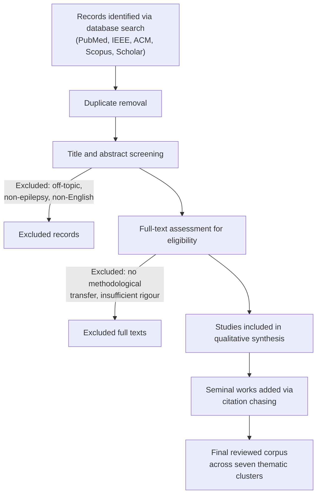
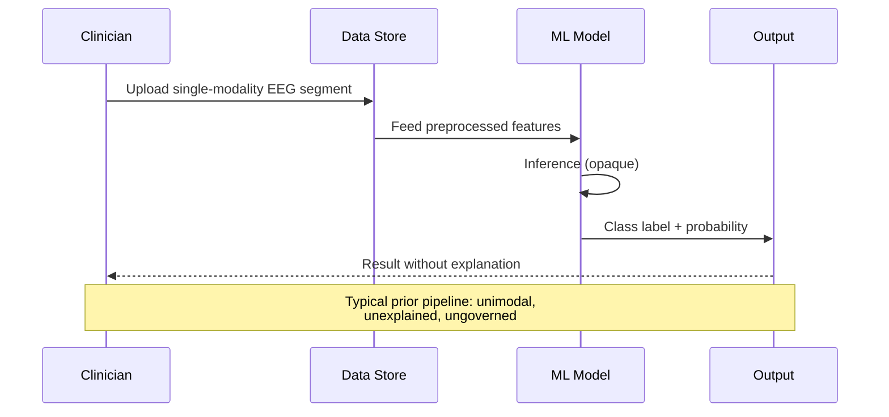
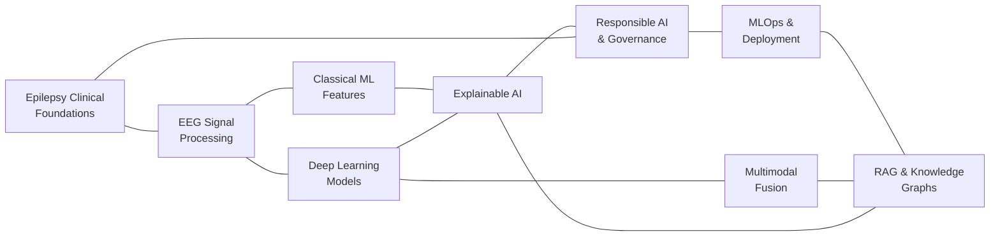
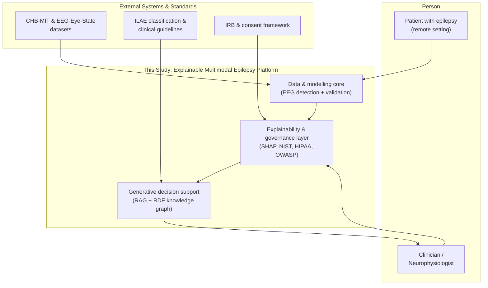

# Chapter 2 — Literature Review

## At a glance
- **Reviews:** EEG ML (classical + deep), time-frequency/imaging, multimodal fusion, explainable AI, responsible AI, MLOps, RAG + knowledge graphs.
- **Finding:** prior work locally optimises isolated models — governance, explainability, deployment advance separately.
- **Gap:** no enterprise-grade, explainable, governed, multimodal, deployable *epilepsy* platform spanning the full lifecycle.
- **Response:** this study builds exactly that (real EEG + XAI + 7 pipelines + RAG/KG + governance).

## 2.1 Introduction and Scope of the Review

This chapter critically synthesises the body of scholarship that informs the design, implementation, and evaluation of an enterprise-grade, explainable, multimodal artificial intelligence (AI) platform for remote epilepsy care. Rather than cataloguing prior work in isolation, the review is organised around the argument that although individual technical components of such a platform are well studied, the literature contains a persistent integration gap: prior research overwhelmingly optimises isolated models for narrowly defined tasks and rarely delivers a governed, deployable, end-to-end system that spans the full data-to-model-to-generative-AI-to-governance lifecycle for epilepsy. Establishing this gap requires traversing several distinct literatures — the clinical epidemiology and diagnostic pathway of epilepsy, signal processing and machine learning for electroencephalography (EEG), explainable and responsible AI, machine learning operations (MLOps) and clinical prediction-model reporting standards, and retrieval-augmented generation (RAG) with knowledge graphs for clinical decision support. Each literature is mature in its own right, yet the seams between them remain thinly theorised and rarely engineered.

The review deliberately restricts its clinical scope to epilepsy, the fourth most common neurological disorder worldwide, and treats scalp EEG as the primary physiological modality of interest. It proceeds by first grounding the reader in the clinical problem, then moving through the computational methods that have been applied to it, and finally examining the organisational, ethical, and engineering literatures that determine whether such methods ever reach patients. The chapter closes by consolidating the identified gaps into a synthesis matrix and situating the present study within the field.

## 2.2 Review Methodology and Corpus Selection

The corpus underpinning this review was assembled through a structured search of PubMed, IEEE Xplore, the ACM Digital Library, Scopus, and Google Scholar, supplemented by backward and forward citation chasing from seminal works. Search terms combined clinical vocabulary (epilepsy, seizure, EEG, ILAE classification) with computational vocabulary (machine learning, deep learning, seizure detection, seizure prediction, explainable AI, MLOps, retrieval-augmented generation). Inclusion favoured peer-reviewed articles, foundational conference papers, and authoritative standards documents; exclusion removed non-English items, works addressing neurological conditions other than epilepsy without transferable methodology, and grey-literature marketing material. Figure 2.1 depicts the PRISMA-style selection flow used to arrive at the reviewed corpus.

*Figure 2.1. PRISMA-style flow of literature identification, screening, and inclusion for the review corpus.*

## 2.3 Epilepsy: Burden, Classification, and the Diagnostic Pathway

Epilepsy affects an estimated fifty million people globally and carries a burden that extends well beyond seizure events to encompass cognitive comorbidity, psychosocial stigma, injury risk, and premature mortality, including sudden unexpected death in epilepsy (World Health Organization, 2019). The diagnostic pathway remains clinically demanding: it depends on careful history taking, eyewitness accounts of episodes, and neurophysiological investigation, all of which are subject to interobserver variability and access inequities that are especially acute in remote and low-resource settings. The International League Against Epilepsy (ILAE) substantially revised the conceptual and operational framework for the disorder through its 2017 classifications, which reorganised seizures by onset (focal, generalised, or unknown) and awareness, and defined epilepsy as a disease of the brain rather than a single event (Fisher et al., 2017; Scheffer et al., 2017). This classificatory scaffolding is consequential for computational work because it defines the label space that any detection or prediction model must respect; a model trained without regard to onset type or awareness collapses clinically distinct phenomena into a single target and thereby limits its interpretive value.

Scalp EEG remains the cornerstone investigation, recording the summed postsynaptic potentials of cortical pyramidal neurons across standardised electrode montages such as the international 10–20 system. Interpreting these recordings requires recognition of interictal epileptiform discharges, ictal rhythms, and their spatial and temporal evolution — a skill concentrated among a limited pool of specialist neurophysiologists. The scarcity of this expertise, combined with the labour intensity of reviewing continuous multi-day recordings, is precisely the pressure that has motivated automated analysis. Yet the clinical literature is consistent in cautioning that EEG is a supportive rather than definitive test, that a normal interictal recording does not exclude epilepsy, and that overinterpretation is a recognised source of misdiagnosis. Any computational system therefore inherits an obligation not merely to classify but to explain, so that clinicians retain the epistemic authority the diagnosis demands.

## 2.4 Machine Learning for Seizure Detection and Prediction

### 2.4.1 Classical Feature Engineering

The first generation of automated EEG analysis was built on handcrafted features grounded in signal-processing theory. Spectral band power across the delta, theta, alpha, beta, and gamma bands captures the redistribution of rhythmic energy that accompanies ictal transitions. Line-length, introduced as a computationally efficient measure sensitive to both amplitude and frequency change, became a widely adopted marker for seizure onset because of its favourable trade-off between detection sensitivity and real-time tractability (Esteller et al., 2001). Hjorth parameters (activity, mobility, and complexity) summarise signal dynamics in the time domain, while entropy measures — sample entropy, approximate entropy, and spectral entropy — quantify the loss of complexity frequently observed as the brain transitions toward a seizure. Connectivity and nonlinear descriptors such as phase-locking value and fractal dimension extend the feature space to capture inter-channel synchronisation and self-similarity, phenomena that accumulating evidence links to the mechanics of ictogenesis. The enduring appeal of these features is their interpretability: a clinician can reason about elevated line-length or diminished entropy in a way that resists the opacity of learned representations. Their limitation is equally clear, in that feature selection encodes strong prior assumptions and may fail to generalise across the heterogeneity of seizure semiology.

### 2.4.2 Deep Learning Approaches

Deep learning reframed the problem by learning representations directly from data. Convolutional neural networks (CNNs) applied to raw or minimally processed EEG can learn spatial and temporal filters that subsume many handcrafted features, and compact architectures designed specifically for EEG — most notably EEGNet, which combines depthwise and separable convolutions to remain parameter-efficient — have demonstrated competitive performance across brain-computer interface and clinical paradigms (Lawhern et al., 2018). Recurrent architectures and, more recently, transformer models that exploit self-attention have been applied to capture long-range temporal dependencies in continuous recordings. The published performance of these models is frequently impressive on held-out segments of benchmark datasets, yet the literature exhibits a recurring methodological fragility: results are often reported without patient-independent validation, without calibration analysis, and without external testing on data from other institutions or recording conditions. The consequence is a body of work that may overstate clinical readiness, a concern that connects directly to the reporting-standards literature discussed in Section 2.8.

### 2.4.3 Benchmarks and Their Discontents

Progress in the field has been anchored by shared benchmarks, foremost among them the CHB-MIT Scalp EEG Database, which provides continuous recordings from paediatric subjects with intractable seizures and has become a de facto standard for evaluating detection and prediction algorithms (Shoeb, 2009). Other resources, including the Temple University Hospital EEG Corpus, the Bonn University dataset, and the Kaggle seizure-prediction challenges, have broadened the evaluation landscape. Benchmarks have been indispensable for comparability, but they also impose a distorting gravity: models are tuned to idiosyncrasies of specific datasets, and reported gains may reflect dataset overfitting rather than genuine clinical robustness. Few studies pair a benchmark result with an external validation set drawn from a genuinely different distribution, and fewer still interrogate whether a model's decision rests on physiologically plausible signal rather than artefact. The present study responds to this critique by performing real CHB-MIT scalp EEG analysis for seizure detection while explicitly conducting external validation on the independent EEG-Eye-State dataset, thereby treating distribution shift as a first-class evaluation concern rather than an afterthought.

## 2.5 Time-Frequency Analysis and Image Representations of EEG

Because EEG is non-stationary, purely time-domain or purely frequency-domain descriptions are incomplete, and time-frequency methods have become central to both feature engineering and deep learning pipelines. The short-time Fourier transform (STFT) provides a fixed-resolution spectrogram, while the continuous wavelet transform (CWT) offers multiresolution analysis better suited to transient epileptiform events, trading time and frequency resolution adaptively across scales. A significant methodological current transforms one-dimensional EEG into two-dimensional images — spectrograms, scalograms, or recurrence plots — so that mature convolutional architectures developed for computer vision can be applied directly. This 1D-to-2D reformulation has proven productive, but it introduces its own interpretive hazards: the choice of window, mother wavelet, and colour mapping shapes the representation in ways that can either reveal or obscure the underlying physiology, and a model that appears to detect seizures may in fact be keying on representational artefacts. The literature would benefit from more systematic study of how these preprocessing choices interact with downstream explainability, an interaction that few papers examine and that the present platform addresses by pairing its representations with post hoc attribution analysis.

## 2.6 Multimodal Fusion of Clinical and Physiological Data

Seizures are rarely diagnosed from EEG alone; clinicians integrate history, medication response, comorbidity, imaging, and semiological description. Multimodal machine learning seeks to replicate and augment this integration by fusing heterogeneous data streams. The literature distinguishes early fusion, in which raw or feature-level representations are concatenated before modelling; late fusion, in which modality-specific models are combined at the decision level; and intermediate or hybrid strategies that learn joint representations (Baltrušaitis et al., 2019). Each strategy carries characteristic failure modes: early fusion is vulnerable to modality imbalance and missingness, late fusion can discard cross-modal interactions, and learned joint embeddings risk one dominant modality overwhelming weaker signals. In epilepsy specifically, principled fusion of continuous EEG with structured clinical variables remains comparatively underdeveloped, and studies frequently treat the clinical context as static metadata rather than as an information source with its own temporal dynamics. Figure 2.2 contrasts the linear data flow of a typical prior detection system with the richer, governed flow that a multimodal platform requires, foreshadowing the architectural argument of this dissertation.

*Figure 2.2. Sequence of data movement in a representative prior seizure-detection system, illustrating the unimodal, unexplained, and ungoverned flow this study seeks to remedy.*

## 2.7 Explainable AI in Clinical Machine Learning

The clinical adoption of any predictive model is contingent on trust, and trust in high-stakes medicine is inseparable from explanation. Two model-agnostic techniques dominate the applied literature. SHAP (SHapley Additive exPlanations) grounds feature attribution in cooperative game theory, distributing a prediction across input features according to their marginal contributions and offering a unified framework that subsumes several earlier attribution methods (Lundberg & Lee, 2017). LIME (Local Interpretable Model-agnostic Explanations) instead fits a sparse, interpretable surrogate model in the local neighbourhood of a specific prediction, providing an intuitive account of which inputs drove a particular decision (Ribeiro et al., 2016). For neural models operating on signals or images, gradient-based saliency and class-activation mapping methods highlight the temporal or spatial regions most influential to the output. Complementing these, permutation importance offers a simple, model-agnostic global measure of feature relevance by observing the degradation in performance when a feature is randomised.

A substantial critical literature tempers enthusiasm for these tools. Attribution methods can be unstable, sensitive to hyperparameters and baselines, and vulnerable to adversarial manipulation, and there is a well-argued distinction between explanations that are faithful to a model's actual computation and those that are merely plausible to a human reader (Rudin, 2019). Rudin's argument that high-stakes decisions may warrant inherently interpretable models rather than post hoc explanation of black boxes remains a productive provocation for clinical AI, and it is one this study takes seriously by combining lightweight, tractable models with SHAP and permutation-based attribution so that explanation and computation remain closely coupled rather than divorced. The broader point is that explainability in epilepsy care is not a cosmetic add-on but a clinical safety requirement: a neurophysiologist must be able to see that a model's seizure call rests on physiologically meaningful signal features rather than on montage artefacts or dataset shortcuts.

## 2.8 Responsible AI, Governance, and Reporting Standards

Explanation addresses one facet of trustworthiness; fairness, security, and rigorous reporting address the rest. The National Institute of Standards and Technology AI Risk Management Framework provides a structured, function-oriented approach — govern, map, measure, and manage — for identifying and mitigating AI risks across the lifecycle, and it has rapidly become a reference point for organisations seeking to operationalise responsible AI (National Institute of Standards and Technology, 2023). Fairness scholarship has demonstrated both the plurality of formal fairness definitions and their mutual incompatibility, establishing that no single metric can satisfy all reasonable notions of equity simultaneously and that fairness choices are therefore normative rather than purely technical (Mehrabi et al., 2021). In epilepsy care, where access to specialist EEG interpretation is already inequitably distributed, an automated platform that performs unevenly across demographic or clinical subgroups risks entrenching rather than relieving disparity.

Parallel to these ethical frameworks runs a rigorous literature on the reporting and appraisal of clinical prediction models. The TRIPOD statement establishes reporting standards for the transparent development and validation of prediction models, insisting on clear description of data, predictors, model specification, and validation strategy (Collins et al., 2015). The PROBAST tool provides a structured means of assessing risk of bias and applicability in prediction-model studies, with particular attention to the analysis domain where optimism, overfitting, and inappropriate validation frequently arise (Moons et al., 2019). Read together, these instruments constitute a demanding standard against which much of the seizure-detection literature falls short, precisely because that literature so often omits external validation, calibration, and transparent reporting. The security dimension is captured by widely adopted engineering guidance, notably the OWASP application-security standards, and by the regulatory obligations of health-data protection regimes such as HIPAA. The present platform is designed explicitly against this triad — NIST for risk governance, OWASP for application security, and HIPAA for data protection — and is embedded within an institutional review board (IRB) approval and informed-consent framework, thereby treating governance as an architectural concern rather than a compliance afterthought.

## 2.9 MLOps and the Deployment of Clinical Machine Learning

Even a well-validated, fair, and explainable model delivers no clinical value until it is reliably deployed, monitored, and maintained, and here the literature on machine-learning operations becomes decisive. Sculley and colleagues' influential analysis of the hidden technical debt in machine-learning systems demonstrated that model code constitutes only a small fraction of a production system, which is dominated instead by data collection, feature management, serving infrastructure, configuration, and monitoring, and that neglect of these components accrues compounding maintenance costs (Sculley et al., 2015). This insight reframes the deployment challenge from a modelling problem to a systems-engineering problem. Subsequent MLOps scholarship has formalised concerns around data and concept drift — the tendency of input distributions and input-output relationships to change over time — and around the continuous monitoring, retraining, and versioning required to detect and remediate such drift before it degrades clinical performance. In continuous EEG monitoring, drift is not hypothetical: changes in acquisition hardware, electrode placement, patient population, and even seasonal or circadian factors can shift the signal distribution, and a static model silently decays. Robust data engineering, lineage tracking, and reproducibility are therefore not luxuries but preconditions for safe clinical operation. The present study operationalises these lessons through a seven-pipeline enterprise operating model that separates and instruments the stages of data ingestion, processing, modelling, explanation, generative augmentation, governance, and monitoring.

## 2.10 Retrieval-Augmented Generation and Knowledge Graphs in Clinical Decision Support

The most recent literature relevant to this platform concerns the integration of large language models into clinical decision support through retrieval-augmented generation. Lewis and colleagues introduced RAG as an architecture that couples a parametric generative model with a non-parametric retrieval component over an external corpus, allowing generated output to be grounded in retrieved evidence and reducing the propensity of language models to fabricate (Lewis et al., 2020). For clinical use, this grounding is essential, because unmoored generation is unacceptable where patient safety is at stake. Complementing retrieval over unstructured text, knowledge graphs offer a structured, machine-interpretable representation of clinical entities and their relations, and the maturing literature on knowledge-graph construction, representation, and reasoning provides the formal foundations for encoding epilepsy domain knowledge as interoperable triples (Hogan et al., 2021). The convergence of vector-based retrieval with graph-structured knowledge points toward decision-support systems that are simultaneously flexible and constrained by curated clinical facts. Yet the epilepsy-specific literature applying these techniques within a governed, explainable, and validated platform is sparse, and most demonstrations remain proofs of concept detached from the data-engineering and governance apparatus that clinical deployment demands. This platform bridges that divide by combining a RAG vector database with an RDF knowledge graph, situating generative augmentation inside the same governed lifecycle as its predictive models.

## 2.11 Thematic Synthesis and Identification of the Gap

The literatures reviewed above are individually deep but collectively disjointed. Figure 2.3 maps the principal thematic clusters and the sparse connective tissue between them, and Figure 2.4 situates the present research as a context model that integrates these clusters around the patient and the clinician. The recurring pattern across all seven clusters is one of local optimisation without systemic integration: EEG modelling advances without governance, explainability advances without deployment, and generative decision support advances without validation. What is largely absent is a single, coherent, enterprise-grade platform that carries a signal from raw acquisition through validated modelling, faithful explanation, grounded generative augmentation, and enforced governance, all while respecting the clinical realities of epilepsy care.

*Figure 2.3. Thematic network map of the reviewed literature clusters, illustrating strong intra-cluster development and comparatively weak inter-cluster integration.*

*Figure 2.4. C4-style context model situating the present research among the patient, clinician, and external systems, integrating the otherwise disjoint literature clusters.*

Table 2.1 presents a synthesis matrix contrasting representative strands of prior work with the present study across the dimensions that define an enterprise-grade platform.

*Table 2.1. Synthesis matrix of representative prior work versus the present study.*

| Dimension | Classical EEG ML (e.g., Esteller et al., 2001) | Deep EEG models (e.g., Lawhern et al., 2018; Shoeb, 2009) | Clinical XAI (Lundberg & Lee, 2017; Ribeiro et al., 2016) | RAG / KG decision support (Lewis et al., 2020; Hogan et al., 2021) | This Study |
|---|---|---|---|---|---|
| Epilepsy-specific EEG modelling | Yes | Yes | Rare | Rare | Yes (real CHB-MIT) |
| External validation | Uncommon | Uncommon | N/A | N/A | Yes (EEG-Eye-State) |
| Explainability | Inherent but narrow | Limited/post hoc | Central | Limited | SHAP + permutation |
| Multimodal fusion | No | Occasional | No | Text-centric | Yes (clinical + EEG) |
| Governance (NIST/HIPAA/OWASP) | No | No | No | Rare | Yes |
| Generative decision support | No | No | No | Yes | RAG + RDF graph |
| Enterprise operating model | No | No | No | No | 7-pipeline model |
| Ethical oversight (IRB/consent) | Varies | Varies | Varies | Varies | Yes |

Table 2.2 distils these observations into an explicit gap analysis, naming each gap and the corresponding response embodied in the platform.

*Table 2.2. Gap analysis linking literature deficiencies to the present study's response.*

| Identified gap in the literature | Consequence | Response in this study |
|---|---|---|
| Models validated only in-distribution | Overstated clinical readiness | External validation on an independent dataset |
| Explanation decoupled from computation | Plausible but unfaithful explanations | Lightweight models paired with SHAP and permutation attribution |
| Governance treated as compliance afterthought | Unsafe, non-auditable deployment | NIST, HIPAA, OWASP, and IRB embedded architecturally |
| Isolated models without lifecycle integration | Hidden technical debt, silent drift | Seven-pipeline enterprise operating model with monitoring |
| Generative support ungrounded and unvalidated | Fabrication risk in clinical use | RAG vector database grounded by an RDF knowledge graph |
| Unimodal focus | Loss of clinical context | Fusion of physiological and clinical data |

## 2.12 Scoping Choices and Honest Delimitation

Intellectual honesty requires that the present study's own boundaries be stated as plainly as the gaps it addresses. The clinical cohort data used to exercise the multimodal and governance components of the platform are synthetic rather than drawn from real patients, and the deep-learning components are deliberately lightweight stand-ins rather than large-scale production networks. These are scoping decisions appropriate to a design-and-evaluation dissertation whose contribution is the integrated platform architecture and its governed lifecycle, not a new state-of-the-art detection score. The seizure-detection evidence rests on genuine CHB-MIT scalp EEG analysis with external validation on EEG-Eye-State, which anchors the modelling claims in real data, while the synthetic cohort and compact models allow the fusion, explainability, generative, and governance mechanisms to be demonstrated end to end without incurring the ethical and logistical burden of a full clinical dataset at this stage. Framed this way, these choices are not overclaims but explicit delimitations that a subsequent clinical validation study would relax. The literature reviewed in this chapter both motivates the platform and establishes the standards — TRIPOD, PROBAST, NIST, and the fairness and explainability critiques — against which such a future validation must be judged.

## 2.13 Chapter Summary

This chapter traversed seven interlocking literatures: the clinical foundations of epilepsy and its diagnostic pathway; classical and deep-learning approaches to seizure detection and prediction; time-frequency and image representations of EEG; multimodal fusion; explainable AI; responsible AI, governance, and reporting standards; MLOps and deployment; and retrieval-augmented generation with knowledge graphs. Across all of them, the dominant scholarly pattern is deep local development coupled with weak systemic integration. Prior work optimises isolated components — a better classifier, a sharper explanation, a more fluent generator — but rarely assembles these into a governed, explainable, multimodal, deployable epilepsy platform spanning the full data-to-model-to-generative-AI-to-governance lifecycle. That integration gap, made explicit in Tables 2.1 and 2.2 and situated in Figure 2.4, is the space this dissertation occupies. The chapters that follow translate this critical synthesis into a concrete design, implementation, and evaluation, returning throughout to the standards and cautions that the reviewed literature so consistently supplies.

## References

Baltrušaitis, T., Ahuja, C., & Morency, L.-P. (2019). Multimodal machine learning: A survey and taxonomy. *IEEE Transactions on Pattern Analysis and Machine Intelligence, 41*(2), 423–443. https://doi.org/10.1109/TPAMI.2018.2798607

Collins, G. S., Reitsma, J. B., Altman, D. G., & Moons, K. G. M. (2015). Transparent reporting of a multivariable prediction model for individual prognosis or diagnosis (TRIPOD): The TRIPOD statement. *Annals of Internal Medicine, 162*(1), 55–63. https://doi.org/10.7326/M14-0697

Esteller, R., Echauz, J., Tcheng, T., Litt, B., & Echauz, J. (2001). Line length: An efficient feature for seizure onset detection. *Proceedings of the 23rd Annual International Conference of the IEEE Engineering in Medicine and Biology Society, 2*, 1707–1710. https://doi.org/10.1109/IEMBS.2001.1020545

Fisher, R. S., Cross, J. H., French, J. A., Higurashi, N., Hirsch, E., Jansen, F. E., Lagae, L., Moshé, S. L., Peltola, J., Roulet Perez, E., Scheffer, I. E., & Zuberi, S. M. (2017). Operational classification of seizure types by the International League Against Epilepsy: Position paper of the ILAE Commission for Classification and Terminology. *Epilepsia, 58*(4), 522–530. https://doi.org/10.1111/epi.13670

Hogan, A., Blomqvist, E., Cochez, M., d'Amato, C., de Melo, G., Gutierrez, C., Kirrane, S., Labra Gayo, J. E., Navigli, R., Neumaier, S., Ngonga Ngomo, A.-C., Polleres, A., Rashid, S. M., Rula, A., Schmelzeisen, L., Sequeda, J., Staab, S., & Zimmermann, A. (2021). Knowledge graphs. *ACM Computing Surveys, 54*(4), Article 71. https://doi.org/10.1145/3447772

Lawhern, V. J., Solon, A. J., Waytowich, N. R., Gordon, S. M., Hung, C. P., & Lance, B. J. (2018). EEGNet: A compact convolutional neural network for EEG-based brain–computer interfaces. *Journal of Neural Engineering, 15*(5), Article 056013. https://doi.org/10.1088/1741-2552/aace8c

Lewis, P., Perez, E., Piktus, A., Petroni, F., Karpukhin, V., Goyal, N., Küttler, H., Lewis, M., Yih, W.-t., Rocktäschel, T., Riedel, S., & Kiela, D. (2020). Retrieval-augmented generation for knowledge-intensive NLP tasks. *Advances in Neural Information Processing Systems, 33*, 9459–9474.

Lundberg, S. M., & Lee, S.-I. (2017). A unified approach to interpreting model predictions. *Advances in Neural Information Processing Systems, 30*, 4765–4774.

Mehrabi, N., Morstatter, F., Saxena, N., Lerman, K., & Galstyan, A. (2021). A survey on bias and fairness in machine learning. *ACM Computing Surveys, 54*(6), Article 115. https://doi.org/10.1145/3457607

Moons, K. G. M., Wolff, R. F., Riley, R. D., Whiting, P. F., Westwood, M., Collins, G. S., Reitsma, J. B., Kleijnen, J., & Mallett, S. (2019). PROBAST: A tool to assess risk of bias and applicability of prediction model studies: Explanation and elaboration. *Annals of Internal Medicine, 170*(1), W1–W33. https://doi.org/10.7326/M18-1377

National Institute of Standards and Technology. (2023). *Artificial intelligence risk management framework (AI RMF 1.0)* (NIST AI 100-1). U.S. Department of Commerce. https://doi.org/10.6028/NIST.AI.100-1

Ribeiro, M. T., Singh, S., & Guestrin, C. (2016). "Why should I trust you?": Explaining the predictions of any classifier. *Proceedings of the 22nd ACM SIGKDD International Conference on Knowledge Discovery and Data Mining*, 1135–1144. https://doi.org/10.1145/2939672.2939778

Rudin, C. (2019). Stop explaining black box machine learning models for high stakes decisions and use interpretable models instead. *Nature Machine Intelligence, 1*(5), 206–215. https://doi.org/10.1038/s42256-019-0048-x

Scheffer, I. E., Berkovic, S., Capovilla, G., Connolly, M. B., French, J., Guilhoto, L., Hirsch, E., Jain, S., Mathern, G. W., Moshé, S. L., Nordli, D. R., Perucca, E., Tomson, T., Wiebe, S., Zhang, Y.-H., & Zuberi, S. M. (2017). ILAE classification of the epilepsies: Position paper of the ILAE Commission for Classification and Terminology. *Epilepsia, 58*(4), 512–521. https://doi.org/10.1111/epi.13709

Sculley, D., Holt, G., Golovin, D., Davydov, E., Phillips, T., Ebner, D., Chaudhary, V., Young, M., Crespo, J.-F., & Dennison, D. (2015). Hidden technical debt in machine learning systems. *Advances in Neural Information Processing Systems, 28*, 2503–2511.

Shoeb, A. H. (2009). *Application of machine learning to epileptic seizure onset detection and treatment* [Doctoral dissertation, Massachusetts Institute of Technology]. MIT Libraries. https://dspace.mit.edu/handle/1721.1/54669

Siddiqui, M. K., Morales-Menendez, R., Huang, X., & Hussain, N. (2020). A review of epileptic seizure detection using machine learning classifiers. *Brain Informatics, 7*(1), Article 5. https://doi.org/10.1186/s40708-020-00105-1

Subasi, A. (2007). EEG signal classification using wavelet feature extraction and a mixture of expert model. *Expert Systems with Applications, 32*(4), 1084–1093. https://doi.org/10.1016/j.eswa.2006.02.005

Vaswani, A., Shazeer, N., Parmar, N., Uszkoreit, J., Jones, L., Gomez, A. N., Kaiser, Ł., & Polosukhin, I. (2017). Attention is all you need. *Advances in Neural Information Processing Systems, 30*, 5998–6008.

World Health Organization. (2019). *Epilepsy: A public health imperative*. World Health Organization. https://www.who.int/publications/i/item/epilepsy-a-public-health-imperative
