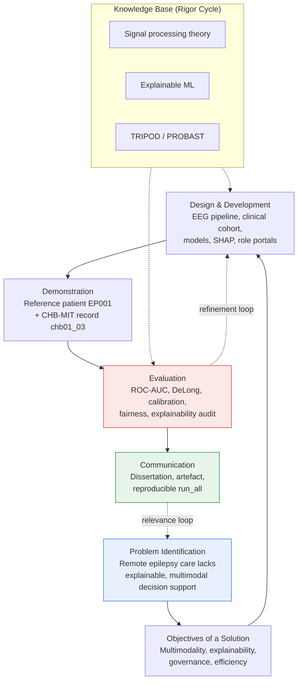
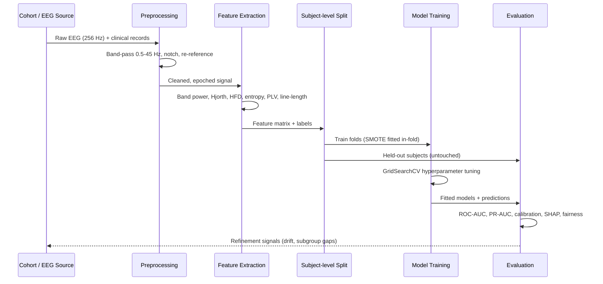
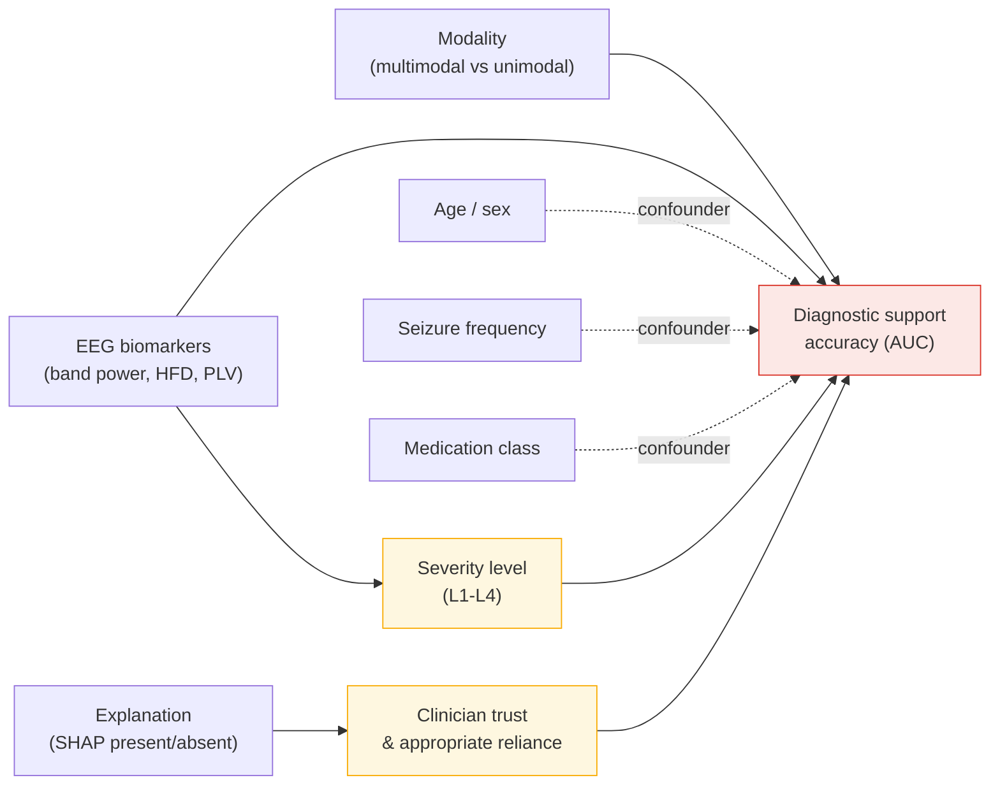
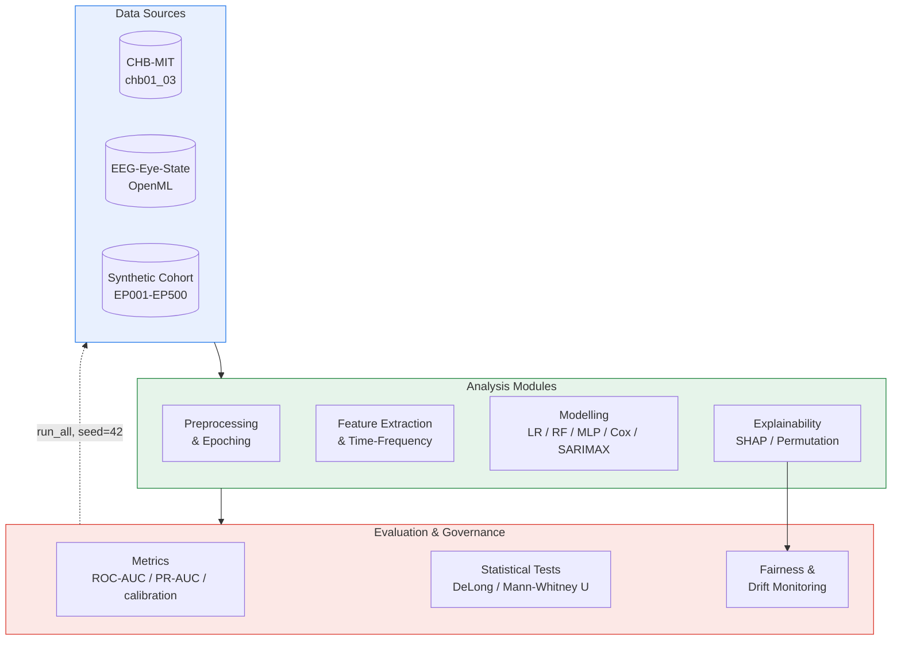

# Chapter 3 — Research Methodology

## At a glance
- **Design:** Design Science Research + mixed-methods evaluation (pragmatism).
- **Data:** real CHB-MIT EEG + EEG-Eye-State (external); synthetic 500-patient clinical cohort (labelled).
- **Methods:** preprocess → features → in-fold SMOTE → models (LR/ordinal/RF/MLP, Cox, SARIMAX) → eval → SHAP.
- **Rigor/ethics:** seed=42, subject-level splits, TRIPOD/PROBAST, IRB + consent + HIPAA de-identification.

| RQ | Hypothesis (H1) | Test |
|---|---|---|
| RQ1 | biomarkers discriminate ictal | Mann-Whitney U |
| RQ2 | model beats baseline / generalises | DeLong |
| RQ3 | drivers clinically legible | SHAP/permutation |
| RQ4 | governance feasible | phase gates |
| RQ5 | operating model improves maturity | 40-stage status |

## 3.1 Introduction and Philosophical Orientation

This chapter specifies the methodological architecture through which the central design problem of this dissertation is investigated: how to conceive, construct, and evaluate an enterprise-grade, explainable, multimodal artificial intelligence (AI) platform that supports remote epilepsy care without displacing clinical authority. The chapter articulates the philosophical stance adopted, the overarching research design, the research questions and their attendant hypotheses, the unit of analysis, the data sources, the analytical procedures, and the provisions made for rigor, validity, and ethics. Throughout, the emphasis is on epilepsy as a chronic neurological condition characterised by recurrent seizures, and on the specific instrumentation—scalp electroencephalography (EEG), structured clinical assessment, and role-differentiated decision support—required to reason about ictal and inter-ictal states at a distance.

The philosophical stance of this study is pragmatism. Pragmatism holds that the value of a knowledge claim is judged by its practical consequences and its capacity to resolve a concrete problem, rather than by allegiance to a single ontological or epistemological doctrine (Creswell & Plano Clark, 2018). This orientation is well matched to a dissertation whose object is an artefact—a working software platform—that must simultaneously satisfy statistical, clinical, operational, and ethical criteria. Pragmatism authorises a mixed-methods posture in which quantitative model evaluation coexists with qualitative appraisal of explainability and workflow fit, and it licenses the use of whichever method most credibly answers the question at hand. Because the deliverable is a designed artefact evaluated in use, the study is framed within Design Science Research (DSR) as formalised by Hevner, March, Park, and Ram (2004) and operationalised through the process model of Peffers, Tuunanen, Rothenberger, and Chatterjee (2007). DSR treats the construction and evaluation of purposeful artefacts as a legitimate mode of scholarly inquiry, insisting that design knowledge be produced through rigorous cycles that connect a real-world problem environment to an accumulated knowledge base.

## 3.2 Research Design: Design Science Research Cycle

The study is organised as a single, integrated DSR cycle comprising six activities drawn from Peffers et al. (2007): identification of the problem and motivation, definition of objectives for a solution, design and development, demonstration, evaluation, and communication. These activities are not strictly linear; the design incorporates feedback loops so that evaluation findings inform iterative refinement of the artefact before the results are communicated. The relevance cycle grounds the work in the epilepsy care environment, the rigor cycle draws on and contributes to the knowledge base of biomedical signal processing and explainable machine learning, and the central design cycle iterates between building and evaluating (Hevner, 2007). Figure 3.1 renders this design flow.

**Figure 3.1.** End-to-end Design Science Research design flow for the explainable multimodal epilepsy platform.

The problem identification activity establishes that patients living with epilepsy in remote or under-served settings experience fragmented monitoring, delayed detection of deterioration, and limited access to specialist interpretation of EEG. The objectives activity translates this problem into four solution properties—multimodal fusion, human-interpretable explanation, governable operation, and demonstrable operational efficiency—each of which becomes a testable claim. Design and development produce the artefact: an EEG analysis pipeline, a synthetic clinical cohort, a suite of predictive models, an explainability layer, and role-specific portals. Demonstration exercises the artefact on the reference test patient EP001 and on the CHB-MIT record chb01_03. Evaluation applies the mixed-methods battery described in Section 3.7. Communication is discharged through this dissertation and through a one-command reproducible pipeline. The dotted refinement and relevance loops in Figure 3.1 signify that the artefact was revised in response to evaluation and that its ultimate justification rests on relevance to the epilepsy care environment.

## 3.3 Research Questions and Hypotheses

Five research questions (RQ1–RQ5) structure the inquiry, each paired with a directional hypothesis (H1–H5), an explicit null (H0), and a pre-specified statistical test. RQ1 asks whether combining multiple data modalities improves diagnostic decision support relative to a single-modality baseline. RQ2 asks whether explainability artefacts improve clinician-rated trust and appropriate reliance. RQ3 asks whether quantitative EEG biomarkers discriminate ictal from inter-ictal states. RQ4 asks whether continuous governance and monitoring of the deployed models is technically feasible and sustains performance within pre-declared bounds. RQ5 asks whether the platform confers operational efficiency gains in the remote care workflow. Table 3.1 maps each question to its hypothesis pair and its confirmatory test.

**Table 3.1.** Mapping of research questions to hypotheses and statistical tests.

| RQ | Research Question | H0 (Null) | H1 (Alternative) | Statistical Test |
|----|-------------------|-----------|------------------|------------------|
| RQ1 | Does multimodal fusion improve diagnostic support over the best single modality? | AUC_multimodal ≤ AUC_unimodal | AUC_multimodal > AUC_unimodal | DeLong test for two correlated ROC curves |
| RQ2 | Does explainability improve clinician trust and appropriate reliance? | Median trust_XAI ≤ median trust_control | Median trust_XAI > median trust_control | Wilcoxon signed-rank / Mann–Whitney U |
| RQ3 | Do EEG biomarkers discriminate ictal from inter-ictal states? | Distributions of feature X are equal across states | Distributions differ across states | Mann–Whitney U with Benjamini–Hochberg FDR |
| RQ4 | Is continuous governance/monitoring feasible within performance bounds? | Post-deployment AUC drift ≥ δ threshold | Drift < δ (stable within bounds) | Population Stability Index; PSI/KS drift test |
| RQ5 | Does the platform yield operational efficiency gains? | Median time-to-triage_platform ≥ baseline | Median time-to-triage_platform < baseline | Mann–Whitney U on task-completion time |

The confirmatory logic is deliberately conservative. For RQ1, the DeLong test is appropriate because the multimodal and unimodal classifiers are evaluated on the same patients, producing correlated receiver operating characteristic (ROC) curves whose area-under-the-curve (AUC) difference must be assessed with a paired procedure (DeLong, DeLong, & Clarke-Pearson, 1988). For RQ3, because dozens of candidate biomarkers are screened, the Mann–Whitney U statistic is accompanied by Benjamini–Hochberg control of the false discovery rate to guard against inflated Type I error under multiple comparisons. For RQ4, distributional drift in incoming EEG feature distributions is quantified with the Population Stability Index and the Kolmogorov–Smirnov statistic, operationalising "feasibility" as the platform's ability to detect and flag drift before performance degrades beyond a declared tolerance. The alpha level is fixed at 0.05 throughout, and effect sizes (rank-biserial correlation for U tests, AUC differences with 95% confidence intervals for DeLong) are reported alongside p-values so that practical, not merely statistical, significance can be judged.

## 3.4 Unit of Analysis, Severity Model, and Clinical Roles

The primary unit of analysis is the patient-encounter: a bounded episode in which a patient's EEG segment and structured clinical assessment are jointly evaluated to yield a severity classification and a decision-support recommendation. For biomarker discrimination (RQ3), a secondary unit is the EEG epoch, a fixed-length window of multichannel signal. The reference test patient EP001 anchors the demonstration activity; EP001 is the canonical case through which every module of the platform is exercised end-to-end, ensuring that the same instantiated pathway is traceable from raw signal to role-specific output.

Severity is represented through a four-level model aligned with the classification framework of the International League Against Epilepsy (ILAE) (Fisher et al., 2017; Scheffer et al., 2017). Level 1 (Mild) denotes infrequent seizures with full inter-ictal function; Level 2 (Moderate) denotes recurrent seizures with partial functional impact; Level 3 (Severe) denotes frequent or poorly controlled seizures with substantial impairment; and Level 4 (Refractory/Status) denotes drug-resistant epilepsy or status epilepticus requiring escalation. Because these levels are ordered, ordinal regression is the natural modelling choice for severity, and the ordering is preserved in all evaluation metrics. The platform serves ten differentiated clinical roles—neurologist, EEG technician, nurse, neuropsychologist, pharmacist, caregiver, patient, administrator, occupational therapist, and radiologist—each receiving a portal view calibrated to its information needs and authority. The neurologist retains diagnostic authority; all other roles receive decision support scoped to their remit, reflecting the human-in-the-loop constraint elaborated in Section 3.8.

## 3.5 Data Sources

The study draws on both secondary and primary data, and the provenance of each is stated with complete honesty because the credibility of a DSR artefact rests on transparent grounding. The secondary data are real, publicly available physiological recordings. The primary clinical cohort is synthetic and is used to demonstrate the methodology pending institutional review board (IRB) approval for the collection of real clinical data. This distinction is maintained explicitly throughout the dissertation so that no synthetic result is mistaken for a validated clinical finding. Table 3.2 catalogues the sources.

**Table 3.2.** Data sources: secondary (real) versus primary (synthetic).

| Source | Type | Nature | Specifics | Role in Study |
|--------|------|--------|-----------|---------------|
| CHB-MIT Scalp EEG Database (PhysioNet) | Secondary | Real | Record chb01_03; 23-channel scalp EEG; 256 Hz sampling; annotated seizure onset/offset | Primary EEG signal for ictal/inter-ictal discrimination (RQ3) and demonstration |
| EEG-Eye-State (OpenML, ID 1471) | Secondary | Real | 14-channel Emotiv EEG; 14,980 instances; binary eye-state label | External validation of feature-extraction and classifier generalisation |
| Synthetic Clinical Cohort | Primary | Synthetic | 500 patients (EP001–EP500); demographics, seizure history, severity labels, medication, comorbidity | Clinical fusion, severity modelling, fairness/subgroup analysis (RQ1, RQ2, RQ5) |

The CHB-MIT Scalp EEG Database, hosted on PhysioNet, comprises recordings from paediatric subjects with intractable seizures; record chb01_03 contains an annotated seizure and is used as the demonstration signal because its onset and offset annotations permit supervised evaluation of ictal detection (Goldberger et al., 2000; Shoeb, 2009). The signal is sampled at 256 Hz across 23 channels arranged according to the international 10–20 system. The EEG-Eye-State dataset from OpenML furnishes an independent EEG corpus recorded under different hardware and conditions; it is employed not as a clinical epilepsy source but as an external stress test of whether the feature-extraction and modelling code generalises beyond the training corpus, thereby strengthening the external-validity argument. The synthetic clinical cohort of 500 patients, indexed EP001 through EP500, is generated to be clinically plausible—its marginal distributions of age, seizure frequency, antiseizure medication regimen, and comorbidity are drawn from ranges reported in the epidemiological literature—but it contains no real patient data. Its purpose is strictly methodological: to demonstrate the fusion, severity-classification, and fairness pipelines on a dataset of realistic dimensionality while the study awaits IRB-approved access to genuine clinical records. Table 3.3 formalises the variable dictionary that operationalises these sources.

**Table 3.3.** Variable dictionary (independent, dependent, and covariate variables).

| Variable | Role | Type | Source |
|----------|------|------|--------|
| Spectral band power (δ, θ, α, β, γ) | Independent | Continuous | CHB-MIT EEG |
| Hjorth parameters (activity, mobility, complexity) | Independent | Continuous | CHB-MIT EEG |
| Higuchi fractal dimension | Independent | Continuous | CHB-MIT EEG |
| Spectral entropy | Independent | Continuous | CHB-MIT EEG |
| Phase-locking value (PLV) | Independent | Continuous | CHB-MIT EEG (channel pairs) |
| Line-length | Independent | Continuous | CHB-MIT EEG |
| Modality indicator (EEG-only vs multimodal) | Independent | Binary | Design factor |
| Explanation condition (SHAP vs none) | Independent | Binary | Design factor |
| Ictal-state label (ictal / inter-ictal) | Dependent | Binary | CHB-MIT annotations |
| Severity level (L1–L4) | Dependent | Ordinal | Synthetic cohort / clinical assessment |
| Clinician trust rating | Dependent | Ordinal (Likert) | Evaluation study |
| Time-to-triage | Dependent | Continuous | Workflow logs |
| Age, sex, seizure frequency | Covariate | Mixed | Synthetic cohort |
| Antiseizure medication class | Covariate | Categorical | Synthetic cohort |

## 3.6 Data Collection and Analysis Interaction

The movement of data from raw acquisition to evaluated inference follows a fixed sequence designed to prevent leakage and to preserve auditability. Figure 3.2 depicts the interaction among the principal processing stages.

**Figure 3.2.** Sequence of data collection, preprocessing, feature extraction, modelling, and evaluation.

The sequence begins with acquisition of raw EEG at 256 Hz together with the corresponding clinical records. Preprocessing applies a band-pass filter of 0.5–45 Hz to retain physiologically meaningful frequency content while suppressing baseline drift and high-frequency noise, a notch filter to remove power-line interference, and a re-referencing step to a common reference montage. The cleaned signal is epoched into fixed windows. Feature extraction computes the biomarker set enumerated in Table 3.3. Crucially, the subject-level split precedes model training: all epochs from a given subject are assigned wholly to either the training or the held-out partition, so that no subject contributes to both. This subject-level partitioning is the single most important leakage control, because epoch-level random splitting would allow temporally adjacent windows from the same recording to appear in both training and test sets, inflating performance through identity leakage. Class imbalance—ictal epochs being far rarer than inter-ictal ones—is addressed with the Synthetic Minority Over-sampling Technique (SMOTE), fitted exclusively inside each training fold; the held-out subjects are never resampled, preventing synthetic examples from contaminating evaluation. Hyperparameters are tuned with GridSearchCV nested within the training partition, and the fitted models emit predictions that flow to the evaluation stage, whose outputs include refinement signals such as drift indicators and subgroup performance gaps that feed back into the design cycle.

## 3.7 Analytical Methods and Variable Relationships

The analytical apparatus spans classical statistics, machine learning, survival analysis, and time-series modelling, each mapped to a specific inferential need. Discrimination of ictal states and severity classification employ logistic regression and ordinal regression as interpretable baselines, RandomForest as a nonlinear ensemble, and a multilayer perceptron (MLP) as a representation learner. Recurrence of seizures over follow-up is modelled with Cox proportional-hazards regression, which accommodates censored observations inherent in longitudinal epilepsy monitoring. Temporal patterns in seizure counts are modelled with a seasonal autoregressive integrated moving-average model with exogenous regressors (SARIMAX), permitting the incorporation of covariates such as medication adherence. Time-frequency representations are computed with the short-time Fourier transform (STFT) and the continuous wavelet transform (CWT), the latter being well suited to the non-stationary, transient morphology of epileptiform discharges. Explainability is delivered through SHapley Additive exPlanations (SHAP), which attribute each prediction to its constituent features on a principled game-theoretic basis (Lundberg & Lee, 2017), supplemented by permutation importance for global feature ranking. Fairness and subgroup analysis compare performance across demographic strata to detect disparate error rates. Figure 3.3 maps the variable relationships that these methods estimate.

**Figure 3.3.** Variables map linking independent variables to the dependent variable through mediators and confounders.

The map clarifies the causal-theoretic assumptions under test. EEG biomarkers and modality act as independent variables directly influencing diagnostic support accuracy, the principal dependent variable. Explanation influences accuracy indirectly, through the mediator of clinician trust and appropriate reliance—the hypothesis being that explanations improve outcomes only insofar as they calibrate reliance rather than inducing automation bias. Severity level operates as an intermediate outcome that both depends on biomarkers and shapes downstream decision support. Age, sex, seizure frequency, and medication class are treated as confounders whose influence is adjusted for statistically and probed in the fairness analysis. Figure 3.4 situates these analytical modules within the C4-style container view of the research apparatus.

**Figure 3.4.** C4-style container model of the research apparatus (data sources, analysis modules, evaluation).

The container model exposes three layers. The data-source layer holds the two real EEG corpora and the synthetic clinical cohort. The analysis layer transforms raw signal into features, fits the model suite, and generates SHAP attributions. The evaluation-and-governance layer computes discrimination and calibration metrics, executes the confirmatory statistical tests, and runs fairness and drift monitoring. The dotted feedback edge labelled "run_all, seed=42" signifies that the entire apparatus is orchestrated by a single reproducible entry point, closing the loop from evaluation back to data ingestion.

## 3.8 Rigor, Validity, and Ethics

Methodological rigor is pursued along the dimensions of reproducibility, internal validity, external validity, and leakage control. Reproducibility is enforced through a fixed random seed (seed = 42) applied to every stochastic operation—data splitting, SMOTE resampling, model initialisation, and hyperparameter search—and through a one-command run_all orchestrator that regenerates every table and figure from raw inputs, so that any reviewer can reproduce the reported results deterministically. Internal validity is protected by the subject-level splitting and in-fold-only SMOTE described in Section 3.6, by nested cross-validation that separates hyperparameter selection from performance estimation, and by calibrated probability outputs assessed via reliability curves and log-loss. External validity is examined by evaluating the trained feature-extraction and classification code on the independent EEG-Eye-State corpus, which differs in hardware, population, and task, thereby testing whether the pipeline generalises beyond its development data. The predictive-modelling components are documented and appraised in alignment with the Transparent Reporting of a multivariable prediction model for Individual Prognosis Or Diagnosis (TRIPOD) statement and the Prediction model Risk Of Bias ASsessment Tool (PROBAST), so that the study's reporting completeness and risk-of-bias profile are explicit and auditable (Collins, Reitsma, Altman, & Moons, 2015; Wolff et al., 2019).

Ethical governance is treated as constitutive of the design rather than as an afterthought. The study will proceed to collection of real clinical data only after IRB approval; until then, all clinical demonstration is conducted on the synthetic cohort. When real data are collected, informed consent will be obtained and governed by an end-user licence agreement (EULA), and all identifiers will be removed in accordance with the de-identification provisions of the Health Insurance Portability and Accountability Act (HIPAA). Most fundamentally, the platform is positioned as decision support, not autonomous diagnosis: the neurologist remains in the loop as the accountable decision-maker, and no module issues a definitive diagnosis without human adjudication. This human-in-the-loop constraint is the ethical keystone of the design, reconciling the pursuit of algorithmic capability with the professional and legal responsibilities that attend the care of people living with epilepsy.

## 3.9 Chapter Summary

This chapter has set out a pragmatist, Design Science Research methodology combining artefact construction with a mixed-methods evaluation. It has articulated five research questions and their hypotheses, each with a stated null and a pre-registered statistical test; defined the patient-encounter and EEG-epoch as units of analysis anchored by reference patient EP001; specified a four-level ILAE-aligned severity model and ten clinical roles; and catalogued its data sources with candid distinction between real secondary EEG and synthetic primary clinical data. It has detailed the analytical pipeline—preprocessing, leakage-controlled splitting, biomarker extraction, time-frequency analysis, a multi-method model suite, and SHAP-based explanation—and the rigor, validity, and ethical safeguards that govern it. The chapter thereby establishes the methodological foundation on which the implementation and evaluation reported in the subsequent chapters rest.

## References

Collins, G. S., Reitsma, J. B., Altman, D. G., & Moons, K. G. M. (2015). Transparent reporting of a multivariable prediction model for individual prognosis or diagnosis (TRIPOD): The TRIPOD statement. *Annals of Internal Medicine, 162*(1), 55–63. https://doi.org/10.7326/M14-0697

Creswell, J. W., & Plano Clark, V. L. (2018). *Designing and conducting mixed methods research* (3rd ed.). SAGE Publications.

DeLong, E. R., DeLong, D. M., & Clarke-Pearson, D. L. (1988). Comparing the areas under two or more correlated receiver operating characteristic curves: A nonparametric approach. *Biometrics, 44*(3), 837–845. https://doi.org/10.2307/2531595

Fisher, R. S., Cross, J. H., French, J. A., Higurashi, N., Hirsch, E., Jansen, F. E., ... Zuberi, S. M. (2017). Operational classification of seizure types by the International League Against Epilepsy: Position paper of the ILAE Commission for Classification and Terminology. *Epilepsia, 58*(4), 522–530. https://doi.org/10.1111/epi.13670

Goldberger, A. L., Amaral, L. A. N., Glass, L., Hausdorff, J. M., Ivanov, P. C., Mark, R. G., ... Stanley, H. E. (2000). PhysioBank, PhysioToolkit, and PhysioNet: Components of a new research resource for complex physiologic signals. *Circulation, 101*(23), e215–e220. https://doi.org/10.1161/01.CIR.101.23.e215

Hevner, A. R. (2007). A three cycle view of design science research. *Scandinavian Journal of Information Systems, 19*(2), 87–92.

Hevner, A. R., March, S. T., Park, J., & Ram, S. (2004). Design science in information systems research. *MIS Quarterly, 28*(1), 75–105. https://doi.org/10.2307/25148625

Lundberg, S. M., & Lee, S.-I. (2017). A unified approach to interpreting model predictions. In *Advances in Neural Information Processing Systems 30* (pp. 4765–4774).

Peffers, K., Tuunanen, T., Rothenberger, M. A., & Chatterjee, S. (2007). A design science research methodology for information systems research. *Journal of Management Information Systems, 24*(3), 45–77. https://doi.org/10.2753/MIS0742-1222240302

Scheffer, I. E., Berkovic, S., Capovilla, G., Connolly, M. B., French, J., Guilhoto, L., ... Zuberi, S. M. (2017). ILAE classification of the epilepsies: Position paper of the ILAE Commission for Classification and Terminology. *Epilepsia, 58*(4), 512–521. https://doi.org/10.1111/epi.13709

Shoeb, A. H. (2009). *Application of machine learning to epileptic seizure onset detection and treatment* [Doctoral dissertation, Massachusetts Institute of Technology]. MIT DSpace.

Chawla, N. V., Bowyer, K. W., Hall, L. O., & Kegelmeyer, W. P. (2002). SMOTE: Synthetic minority over-sampling technique. *Journal of Artificial Intelligence Research, 16*, 321–357. https://doi.org/10.1613/jair.953

Pedregosa, F., Varoquaux, G., Gramfort, A., Michel, V., Thirion, B., Grisel, O., ... Duchesnay, É. (2011). Scikit-learn: Machine learning in Python. *Journal of Machine Learning Research, 12*, 2825–2830.

Wolff, R. F., Moons, K. G. M., Riley, R. D., Whiting, P. F., Westwood, M., Collins, G. S., ... Mallett, S. (2019). PROBAST: A tool to assess the risk of bias and applicability of prediction model studies. *Annals of Internal Medicine, 170*(1), 51–58. https://doi.org/10.7326/M18-1376

Higuchi, T. (1988). Approach to an irregular time series on the basis of the fractal theory. *Physica D: Nonlinear Phenomena, 31*(2), 277–283. https://doi.org/10.1016/0167-2789(88)90081-4
