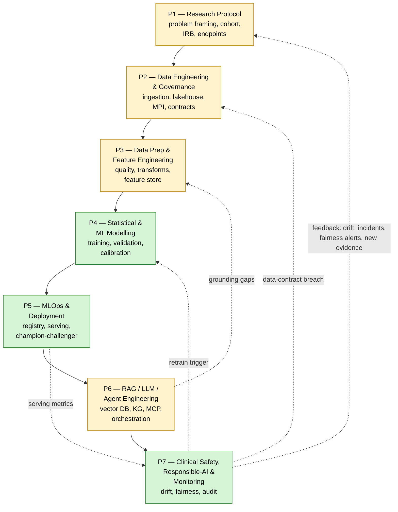
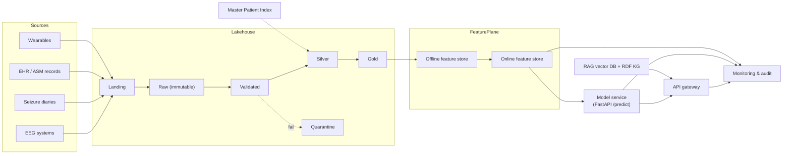
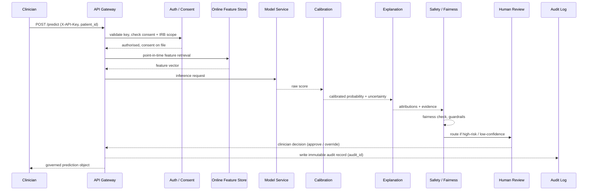
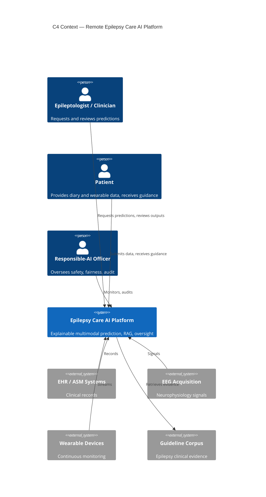
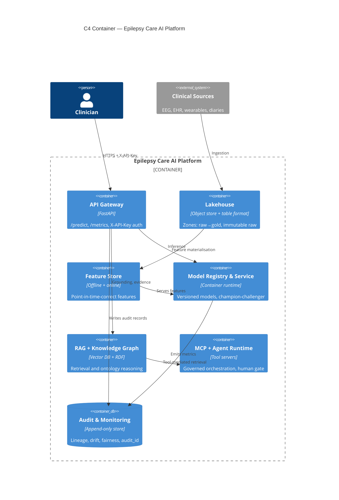

# Chapter 4 — System Design & Architecture

## 4.1 Introduction and Design Rationale

This chapter presents the system design and architecture for the explainable, multimodal artificial intelligence (AI) platform that underpins the remote epilepsy care programme evaluated in this dissertation. The purpose of the chapter is to translate the clinical and organisational requirements established in the preceding chapters into a coherent enterprise architecture that is defensible on grounds of security, scalability, explainability, and auditability. The design follows the principles of design-science research articulated by Hevner, March, Park, and Ram (2004), in which a purposeful artefact is constructed and evaluated against a real organisational problem — in this instance, the fragmented, episodic, and often inequitable delivery of epilepsy care to patients who live at a distance from specialist epileptology services.

A central argument of this chapter is that clinical machine learning at enterprise scale cannot be delivered as a single monolithic model wrapped in an application. Sculley et al. (2015) demonstrated that the machine-learning code in a production system is a small fraction of the surrounding infrastructure, and that hidden technical debt accumulates precisely at the boundaries where data engineering, modelling, and operations meet without clear ownership. Accordingly, the platform is conceived not as one fused flow but as seven connected yet independently governed pipelines, each with a defined owner, a defined set of artefacts, and a defined contract with its neighbours. The remainder of the chapter develops this operating model, the underlying data and feature architectures, the serving and generative-AI subsystems, and the cross-cutting governance that binds them, before summarising the current maturity of each component honestly.

## 4.2 The Seven-Pipeline Operating Model

The naive approach to building a clinical prediction service is to construct a single flow that ingests data, trains a model, and returns a score. Such a design conflates concerns that have fundamentally different rates of change, risk profiles, and accountable owners. Research protocol design changes on the cadence of ethics review; data engineering changes when source systems change; model retraining changes when drift is detected; and the generative and agentic layer changes as clinical guidelines and language models evolve. Binding these into one flow produces the entanglement that Sculley et al. (2015) named "changing anything changes everything" (the CACE principle). The platform therefore decomposes the work into seven pipelines with explicit boundaries, mirroring the domain-oriented decomposition advocated in data mesh thinking (Dehghani, 2022).

*Figure 4.1. The seven-pipeline operating model with cross-pipeline feedback. Green nodes denote pipelines whose core is implemented; amber nodes denote pipelines that are partly specified design.*

Figure 4.1 shows the seven pipelines arranged as a directed flow from research protocol (P1) through to clinical safety and monitoring (P7), together with the feedback loop that returns operational signal to the upstream pipelines. The feedback loop is the feature that distinguishes an enterprise operating model from a linear project plan: monitoring in P7 does not merely observe the system but actively triggers retraining in P4, raises data-contract breaches back to P2, and surfaces new clinical evidence and fairness concerns that reopen the research question in P1. Each pipeline owns its artefacts and exposes a contract to the next, so that a change within a pipeline — for example, a new feature transformation in P3 — is absorbed locally rather than propagating uncontrolled through the whole system. Table 4.1 sets out the ownership boundaries in full.

**Table 4.1.** *The seven pipelines with accountable owner, primary responsibility, and key artefacts.*

| Pipeline | Accountable owner | Primary responsibility | Key artefacts |
|---|---|---|---|
| P1 Research Protocol | Principal investigator / clinical lead | Problem framing, cohort definition, endpoint selection, IRB/ethics approval | Protocol, cohort spec, consent forms, statistical analysis plan |
| P2 Data Engineering & Governance | Data platform engineering | Ingestion, lakehouse zones, master patient index, data contracts, lineage | Ingestion jobs, zone tables, MPI, catalog entries, data contracts |
| P3 Data Prep & Feature Engineering | Feature/analytics engineering | Quality validation, transformations, point-in-time-correct features | Quality rules, feature definitions, offline/online feature tables |
| P4 Statistical & ML Modelling | Data science / biostatistics | Model training, internal/external validation, probability calibration | Training pipelines, validated models, calibration curves, model cards |
| P5 MLOps & Deployment | ML platform / DevOps | Model registry, batch and real-time serving, rollback, champion-challenger | Registry, container images, serving API, deployment manifests |
| P6 RAG/LLM/Agent Engineering | Applied GenAI engineering | Retrieval, knowledge graph, MCP tool servers, governed orchestration | Vector index, RDF graph, MCP servers, agent policies |
| P7 Clinical Safety & Monitoring | Responsible-AI / clinical safety officer | Drift and performance monitoring, fairness, incident and audit management | Monitors, fairness reports, audit logs, incident register |

## 4.3 The Forty-Stage Enterprise Architecture

Beneath the seven pipelines sits a more granular reference architecture of forty stages that trace a unit of work from an unframed clinical problem to a retained, auditable prediction. The forty stages are not a separate design but a decomposition of the seven pipelines, so that each stage belongs to exactly one pipeline and inherits its ownership. The stages proceed, in summary, from problem definition and cohort assembly (P1); through ingestion, landing in the lakehouse, master-patient-index resolution, and quality gating (P2); through feature engineering and registration in the feature store (P3); through model training, cross-validation, external validation, calibration, and registration (P4); through packaging, batch and real-time serving, and champion-challenger promotion (P5); through retrieval-augmented generation, knowledge-graph grounding, and human oversight (P6); and finally through monitoring, drift detection, fairness auditing, incident handling, and retention or archival (P7). Enumerating every stage is unnecessary here; the salient design property is that the forty stages form an unbroken, individually observable chain in which no transition between stages is unowned or unlogged. This granularity is what allows the platform to answer, for any given prediction, precisely which data, which features, which model version, and which human decision produced it.

## 4.4 Data Architecture

The data architecture adopts a lakehouse pattern, combining the low-cost, schema-flexible storage of a data lake with the transactional guarantees and governance of a warehouse. Kleppmann (2017) frames the central challenge of such systems as maintaining correctness and evolvability as data flows through successive representations; the lakehouse zone model addresses this by making each transformation explicit and by treating the earliest representation as immutable. Data enters a landing zone exactly as received, is copied to an immutable raw zone that is never mutated in place, and then progresses through validation, quarantine, silver, gold, feature, serving, and archive zones. Immutability of the raw zone is a deliberate governance decision: it guarantees that any downstream artefact can be reconstructed and that the provenance of every prediction is traceable to bytes that were never altered. Table 4.2 defines each zone.

**Table 4.2.** *Lakehouse zones, their purpose, mutability, and typical consumers.*

| Zone | Purpose | Mutability | Typical consumer |
|---|---|---|---|
| Landing | First point of arrival, source-fidelity capture | Transient | Ingestion validators |
| Raw | Permanent, unaltered system of record | Immutable (append-only) | Reprocessing, audit |
| Validated | Records passing schema and data-contract checks | Append-only | Feature engineering |
| Quarantine | Records failing quality gates, held for remediation | Write-once, review | Data stewards |
| Silver | Cleaned, conformed, de-duplicated entities | Versioned | Analytics, features |
| Gold | Curated, business-level aggregates and cohorts | Versioned | Modelling, reporting |
| Feature | Point-in-time-correct feature values | Versioned, time-indexed | Feature store |
| Serving | Low-latency, denormalised read models | Materialised | Online API |
| Archive | Cold retention for compliance and reproducibility | Immutable, sealed | Legal, reproducibility |

Three architectural concepts govern how data moves through these zones. Data contracts specify, for each source, the schema, semantics, quality expectations, and service levels to which the producer commits; a breach of contract routes records to quarantine and raises a signal back to P2, rather than silently corrupting downstream models. A master patient index (MPI) performs entity resolution so that records describing the same individual across electroencephalography (EEG) systems, seizure diaries, medication records, and wearable devices are reconciled to a single patient identity — an essential precondition for a longitudinal view of an epilepsy patient's condition. A metadata catalogue records schemas, ownership, and end-to-end lineage, so that the path from a raw EEG file to a served prediction is queryable.

It is important to distinguish three organising paradigms that are frequently conflated. Data mesh (Dehghani, 2022) is an organisational and ownership pattern in which domain teams publish curated data products; data fabric is an integration pattern that provides a unified access and semantic layer across heterogeneous stores; and the lakehouse is a storage-and-compute pattern. These are complementary rather than competing: the platform stores data in a lakehouse, exposes domain-owned data products in the spirit of data mesh, and integrates them through a fabric-like catalogue and semantic layer.

*Figure 4.2. Component and data-relationship diagram, tracing data from clinical sources through the lakehouse zones and feature plane to the model service, API, generative-AI layer, and monitoring.*

Figure 4.2 renders these relationships as a network. The diagram makes visible the single most important leakage-prevention control in the architecture: served features flow only from the online feature store, which is populated by point-in-time-correct offline computations, and never directly from mutable operational sources.

## 4.5 Feature Architecture

The feature architecture separates offline and online feature stores that share a single set of feature definitions. The offline store computes and holds historical feature values for training and batch scoring; the online store holds the latest values for low-latency serving. The unifying discipline is point-in-time-correct retrieval: when a training example for a patient at time *t* is assembled, only feature values that were knowable at or before *t* are joined. This prevents temporal leakage — the subtle and common error in which a model is inadvertently trained on information from the future relative to the prediction it must make, producing optimistic validation results that collapse in production. By sharing definitions between the offline and online stores, the architecture also eliminates training–serving skew, in which a feature is computed one way in training and another way at inference.

## 4.6 Serving Architecture

The serving layer exposes models through both batch and real-time paths. Batch scoring runs against the gold and feature zones for population-level tasks such as cohort risk stratification, while a real-time application programming interface serves individual predictions. The real-time service is implemented in FastAPI and exposes a small, deliberately constrained surface: a `/predict` endpoint that returns a governed prediction object, and a `/metrics` endpoint that exposes operational and model-health telemetry for scraping by the monitoring subsystem. Every request is authenticated with an `X-API-Key` header, and unauthenticated requests are rejected before any feature retrieval or inference occurs.

Behind the API, a model registry holds versioned, validated models together with their model cards and calibration artefacts. Promotion follows a champion-challenger pattern: a new challenger model is served in shadow or to a limited cohort alongside the incumbent champion, its performance and fairness are compared on live traffic, and promotion or rollback is an explicit, logged, reversible operation. Rollback to a previous registered version is a first-class capability rather than an emergency improvisation.

*Figure 4.3. Sequence of an authenticated, audited prediction request across the pipelines, from clinician request through authorisation, feature retrieval, inference, calibration, explanation, safety review, human oversight, and audit.*

Figure 4.3 traces a single prediction request end to end. The sequence encodes several non-negotiable controls: authorisation and consent are verified before any patient data is touched; calibration and uncertainty estimation sit between the raw model output and the clinician; a fairness and safety stage can route high-risk or low-confidence cases to human review; and an immutable audit record carrying a unique `audit_id` is written before the response is returned. No prediction reaches a clinician without traversing this full chain.

## 4.7 Generative-AI Architecture

The generative-AI layer augments the predictive models with retrieval, structured knowledge, tool use, and governed orchestration. Retrieval-augmented generation (RAG) grounds language-model outputs in an authoritative corpus of epilepsy guidelines and evidence held in a vector database, so that natural-language explanations and clinical summaries cite retrievable sources rather than relying on the parametric memory of the model. Complementing the vector store is a Resource Description Framework (RDF) knowledge graph encoding an epilepsy ontology whose principal classes are Patient, SeizureType, EEGFeature, antiseizure medication (ASM), Outcome, and Guideline, connected by relations such as *diagnosed-with*, *treated-by*, *contraindicated-for*, and *recommended-by*. Where the vector store supports fuzzy semantic recall, the knowledge graph supports precise, explainable reasoning over clinically meaningful relationships — for example, retrieving guideline-endorsed ASM options for a given seizure type while excluding contraindicated agents.

Tool access is mediated by Model Context Protocol (MCP) servers, which expose capabilities — feature lookups, guideline retrieval, knowledge-graph queries — as governed, discoverable tools with explicit input and output schemas. A multi-agent orchestration coordinates these tools to accomplish composite tasks, but the orchestration is deliberately constrained: it operates under an allow-list of tools, cannot mutate clinical records, and terminates at a mandatory human-approval gate before any recommendation is issued to a patient or clinician. This governed-autonomy posture reflects the guidance of the NIST AI Risk Management Framework (2023), which emphasises that automation in high-stakes settings must be bounded by human oversight and demonstrable accountability.

## 4.8 Governance-by-Design as a Cross-Cutting Concern

Governance is not a pipeline but a property that cuts across all seven. The platform aligns its controls with the HIPAA Security Rule for protected health information, the NIST AI Risk Management Framework (2023) for AI-specific risk, and the OWASP guidance for application and large-language-model security, including the OWASP Top 10 for LLM Applications (OWASP Foundation, 2023). Protected data is encrypted with AES-256 at rest and protected with TLS in transit. De-identification is applied before data is used for modelling, and re-identification keys are held under separate control. Every use of patient data is bound to documented consent and IRB approval, and every consequential action — data access, inference, override, promotion, and rollback — is written to an append-only audit log. Table 4.3 maps the principal quality attributes to the mechanisms that satisfy them.

**Table 4.3.** *Architectural quality attributes and the mechanisms by which each is achieved.*

| Quality attribute | Mechanisms in the architecture | Governing reference |
|---|---|---|
| Security | AES-256 at rest, TLS in transit, X-API-Key authentication, secrets isolation, de-identification, MCP tool allow-listing | HIPAA; OWASP (2023); NIST (2023) |
| Scalability | Lakehouse separation of storage and compute, offline/online feature stores, batch + real-time serving, stateless API | Kleppmann (2017) |
| Explainability | Calibrated probabilities with uncertainty, per-prediction attributions, RAG citations, RDF knowledge-graph reasoning | Hevner et al. (2004); NIST (2023) |
| Auditability | Immutable raw zone, end-to-end lineage catalogue, append-only audit log with audit_id, model registry versioning | Kleppmann (2017); Sculley et al. (2015) |

## 4.9 The Governed Prediction Output Object

The visible artefact of the entire architecture is the governed prediction object returned by `/predict`. Rather than a bare score, every prediction is a structured object that carries its own provenance and governance metadata: the source data and feature versions that produced it; a calibrated probability accompanied by an explicit uncertainty estimate; a human-readable explanation with feature attributions; a fairness flag indicating whether subgroup guardrails were satisfied; supporting evidence retrieved from the vector store and knowledge graph; the human-review status recording whether a clinician approved or overrode the result; and the `audit_id` linking the prediction to its immutable audit record. This object operationalises the principle that in clinical AI a prediction is not merely a number but an accountable claim, and it is the mechanism through which the abstract quality attributes of Table 4.3 become concrete and inspectable at the point of care.

## 4.10 The C4 Architectural Views

To communicate the architecture at two levels of abstraction, the design is expressed using the C4 model. The Context view situates the platform among its human actors and external systems, while the Container view decomposes the platform into its principal deployable and data components.

*Figure 4.4. C4 Context view — the platform, its human actors, and the external systems with which it exchanges data.*

*Figure 4.5. C4 Container view — the principal deployable and data containers within the platform boundary and their runtime relationships.*

Figures 4.4 and 4.5 provide the two mandated C4 perspectives. The Context view (Figure 4.4) establishes the platform's responsibilities and trust boundaries with clinicians, patients, the responsible-AI function, and external clinical systems. The Container view (Figure 4.5) decomposes the platform into the API gateway, lakehouse, feature store, model registry and service, RAG and knowledge-graph subsystem, MCP and agent runtime, and the audit-and-monitoring store, showing how a request flows across them.

## 4.11 Honest Assessment of Architectural Maturity

Intellectual honesty about maturity is itself a governance obligation, and the platform's components sit at different levels of realisation. The statistical and machine-learning modelling pipeline (P4), the batch and real-time serving with model registry and rollback (P5), the monitoring and audit subsystem (P7), the RAG vector database, and the RDF knowledge graph are implemented and operational within the evaluated system. In contrast, several components are specified designs — documented in detail and architecturally committed, but not yet fully running in production. These include the full nine-zone lakehouse with automated quarantine, the master patient index and entity-resolution service, the online feature store with production point-in-time retrieval, and the MCP tool servers together with the multi-agent runtime and its human-approval gate. Presenting these as complete would misrepresent the artefact; presenting them as designed rather than implemented locates the contribution correctly within the design-science tradition, in which a rigorously specified and partially instantiated architecture is a legitimate and evaluable research output (Hevner et al., 2004). Chapter 5 proceeds to describe the implementation of the components that are operational, and Chapter 7 returns to the specified-but-unbuilt components as a roadmap for maturation.

## 4.12 Summary

This chapter has presented an enterprise architecture for a remote epilepsy care AI platform organised as seven independently governed pipelines rather than a single fused flow, decomposed further into a forty-stage reference architecture in which every stage is owned and observable. It has detailed the lakehouse data architecture with its immutable raw zone and quality gates, the offline and online feature stores with point-in-time-correct retrieval, the batch and real-time serving layer with champion-challenger promotion, and the generative-AI layer combining RAG, an RDF epilepsy knowledge graph, MCP tool servers, and governed multi-agent orchestration under a human gate. Governance-by-design has been shown to cut across all pipelines through encryption, de-identification, consent, and immutable audit, and to crystallise in the governed prediction object returned at the point of care. The chapter closed with an honest appraisal of which components are implemented and which remain specified designs, positioning the work squarely within design-science research.

## References

Dehghani, Z. (2022). *Data mesh: Delivering data-driven value at scale*. O'Reilly Media.

Hevner, A. R., March, S. T., Park, J., & Ram, S. (2004). Design science in information systems research. *MIS Quarterly, 28*(1), 75–105. https://doi.org/10.2307/25148625

Kleppmann, M. (2017). *Designing data-intensive applications: The big ideas behind reliable, scalable, and maintainable systems*. O'Reilly Media.

National Institute of Standards and Technology. (2023). *Artificial intelligence risk management framework (AI RMF 1.0)* (NIST AI 100-1). U.S. Department of Commerce. https://doi.org/10.6028/NIST.AI.100-1

Office for Civil Rights, U.S. Department of Health and Human Services. (2013). *HIPAA Security Rule* (45 C.F.R. Parts 160 and 164). U.S. Government Publishing Office.

OWASP Foundation. (2023). *OWASP Top 10 for large language model applications*. https://owasp.org/www-project-top-10-for-large-language-model-applications/

Richardson, C. (2018). *Microservices patterns: With examples in Java*. Manning Publications.

Sculley, D., Holt, G., Golovin, D., Davydov, E., Phillips, T., Ebner, D., Chaudhary, V., Young, M., Crespo, J.-F., & Dennison, D. (2015). Hidden technical debt in machine learning systems. In C. Cortes, N. Lawrence, D. Lee, M. Sugiyama, & R. Garnett (Eds.), *Advances in neural information processing systems* (Vol. 28, pp. 2503–2511). Curran Associates.

The Open Group. (2018). *TOGAF standard, version 9.2*. Van Haren Publishing.
