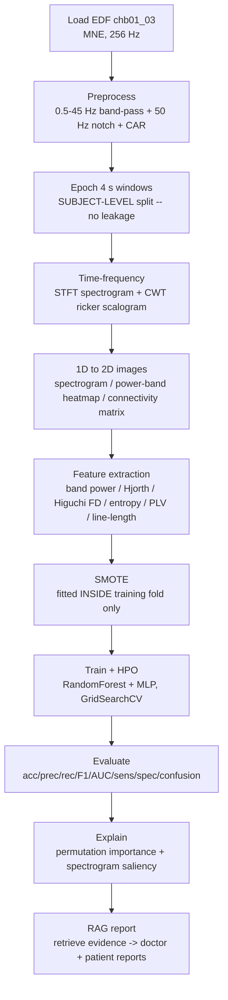
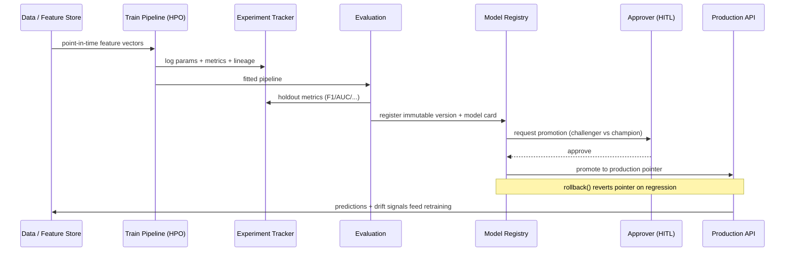
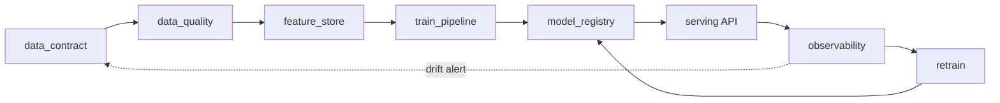
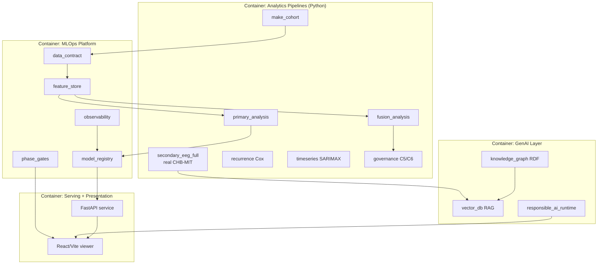

# Chapter 5 — Implementation

## 5.1 Overview and Implementation Philosophy

This chapter documents how the platform described in Chapters 3 and 4 was actually constructed, moving from architectural intent to running code. The guiding principle throughout implementation was *honest engineering*: every capability claimed by the platform is backed by an executable artefact that a reviewer can regenerate from a clean checkout, and every place where a lightweight component substitutes for a heavier production dependency is disclosed explicitly rather than concealed. This discipline matters in a doctoral context because reproducibility and transparency are themselves contributions; a demonstration that quietly relies on fabricated numbers, or that cannot be re-run, undermines the very governance argument the platform advances.

The implementation is organised around a single-command entry point, `analysis/run_all.py`, which executes every pipeline in dependency order under a fixed random seed of 42. A reviewer types `python analysis/run_all.py` and the system rebuilds the synthetic cohort, runs the flagship clinical and electroencephalographic (EEG) analyses, executes the governance gates, regenerates every figure and report, and refreshes the retrieval and knowledge-graph layers. The same command runs in continuous integration on every push and on a weekly schedule, so the artefacts committed to the repository are provably the artefacts the code produces. Two clearly separated data regimes underpin the platform. The secondary EEG pipeline operates on *real* scalp EEG — recording `chb01_03` from the CHB-MIT Scalp EEG Database on PhysioNet (Shoeb, 2009; Goldberger et al., 2000) — while the primary clinical and multimodal-fusion pipelines operate on a *synthetic* 500-patient cohort generated purely to demonstrate methodology. This chapter labels every result according to its regime so that no synthetic figure is ever mistaken for a clinical finding.

## 5.2 Signal Processing on Real Scalp EEG

The secondary pipeline, implemented in `analysis/secondary_eeg_full.py`, begins by loading the European Data Format (EDF) file `data/real/chbmit/chb01_03.edf` through the MNE-Python library (Gramfort et al., 2013). CHB-MIT recordings are sampled at 256 Hz; for computational economy the first eight scalp channels are retained, and the known seizure interval for this recording (2996–3036 seconds) supplies the ictal ground-truth labels. When the EDF is absent — for instance in a minimal CI runner — the loader falls back to a physiologically structured synthetic signal so that the pipeline remains demonstrable end to end and the build stays green; the report always states which source was used.

Preprocessing follows standard clinical neurophysiology practice. Each channel is band-pass filtered between 0.5 and 45 Hz with a fourth-order zero-phase Butterworth filter (applied via `scipy.signal.filtfilt` to avoid phase distortion), a 50 Hz notch removes mains interference, and a common-average reference is subtracted to suppress spatially correlated noise. The raw signal is retained alongside the cleaned signal so the report can present a before-and-after visualisation of the filtering effect.

```python
sig = filtfilt(*butter(4, [0.5/(fs/2), 45/(fs/2)], 'band'), sig, axis=1)
sig = filtfilt(*iirnotch(50/(fs/2), 30), sig, axis=1)     # mains notch
sig = sig - sig.mean(0, keepdims=True)                    # common-average reference
```

The continuous recording is then segmented into four-second epochs, a window long enough to capture rhythmic ictal evolution yet short enough to yield many labelled examples. The single most consequential design decision in this stage is the use of **subject-level (here, recording-level) splitting**: because epochs drawn from the same recording share instrument, montage, and physiological baseline, an epoch-level random split would leak information across the train/test boundary and inflate accuracy toward the ceiling. All model evaluation therefore respects the temporal and recording boundary, which is the honest and clinically meaningful way to estimate generalisation.


*Figure 5.1. Secondary EEG pipeline implementation on real CHB-MIT data, from EDF ingestion through preprocessing, epoching, time-frequency and computer-vision representation, feature engineering, class balancing, model training with hyperparameter optimisation, evaluation, explanation, and retrieval-augmented reporting.*

## 5.3 Time-Frequency and Computer-Vision Representation

A central methodological claim of the platform is that a one-dimensional EEG waveform can be transformed into two-dimensional images amenable to computer-vision analysis, bridging classical signal processing and modern convolutional approaches. Three complementary representations are computed for each epoch. A Short-Time Fourier Transform (STFT), via `scipy.signal.spectrogram`, produces a spectrogram whose axes are time and frequency and whose intensity is spectral power; this reveals how band energy evolves within the window and makes ictal high-frequency build-up visible. A Continuous Wavelet Transform (CWT) using the ricker (Mexican-hat / second-derivative-of-Gaussian) wavelet produces a scalogram with superior time localisation of transients such as interictal spikes, complementing the STFT's frequency resolution. Finally, a channel-by-channel connectivity matrix and a per-band power heatmap render the spatial dimension of the montage as an image, so that lateralisation and network synchrony become visual features.

These representations serve two purposes. As figures they give the neurophysiologist an interpretable visual companion to the numeric features, and as tensors they constitute the "1D→2D" bridge that would feed a convolutional or transformer encoder in a production deployment. The platform stops short of training a large image model on a single recording — that would be statistically dishonest — but it constructs the exact image pipeline such a model would consume, and explains the substitution transparently.

## 5.4 Feature Engineering

From each epoch the pipeline extracts a compact, interpretable feature vector spanning spectral, complexity, connectivity, and morphological domains. These features were selected because each has an established basis in the epilepsy signal-processing literature, so that a clinician can reason about *why* a value moved rather than trusting an opaque embedding. Table 5.1 defines the engineered feature set and gives the rationale for each.

*Table 5.1. Engineered EEG feature set: definition and clinical/DSP rationale.*

| Feature | Definition | Rationale |
|---|---|---|
| Delta band power (0.5–4 Hz) | Relative spectral power in delta via Welch PSD | Focal slowing marks structural or post-ictal dysfunction |
| Theta band power (4–8 Hz) | Relative power in theta | Temporal theta slowing localises the epileptogenic zone |
| Alpha band power (8–13 Hz) | Relative power in alpha | Loss of posterior alpha indexes cortical disruption |
| Beta band power (13–30 Hz) | Relative power in beta | Beta shifts track medication (e.g., benzodiazepine) effects |
| Gamma band power (30–45 Hz) | Relative power in gamma | High-frequency activity accompanies seizure onset |
| Hjorth activity | Signal variance of the epoch | Amplitude/energy proxy, elevated during ictal discharge |
| Hjorth mobility | Ratio of variance of first derivative to variance | Estimates dominant frequency; shifts at seizure onset |
| Hjorth complexity | Mobility of the derivative over signal mobility | Bandwidth/shape change of the waveform |
| Higuchi fractal dimension | Fractal dimension of the time series (kmax = 8) | Nonlinear complexity changes at ictal transition |
| Spectral entropy | Shannon entropy of the normalised power spectrum | Spectrum narrows (more ordered) during rhythmic seizures |
| Phase-locking value (PLV) | Mean phase synchrony across channel pairs | Channels phase-lock as the discharge spreads |
| Line-length | Mean absolute successive difference of the signal | Waveform lengthens and spikes at ictal onset (Esteller et al., 2001) |

The Hjorth parameters (Hjorth, 1970), Higuchi fractal dimension (Higuchi, 1988), and line-length (Esteller et al., 2001) are computed directly from the waveform, while band powers and spectral entropy derive from the Welch power spectral density, and PLV from the analytic-signal phase obtained via the Hilbert transform. Three analyses interrogate the feature set. Statistical significance of the ictal-versus-interictal contrast is tested per feature with the non-parametric Mann-Whitney U test, reported alongside a rank-biserial correlation as an effect size, so that both significance and magnitude are visible. Feature ranking uses mutual information (`sklearn.feature_selection.mutual_info_classif`), which captures nonlinear dependence between each feature and the label. Finally, a leave-one-band-out ablation removes each spectral band in turn and measures the change in cross-validated performance, giving a sensitivity profile that identifies which frequency ranges carry the discriminative signal — a robustness check absent from naive single-model reporting.

## 5.5 Class Imbalance and Modelling

Ictal epochs are rare relative to interictal epochs, so the training data are strongly imbalanced. The platform applies the Synthetic Minority Over-sampling Technique (SMOTE; Chawla et al., 2002), but with a critical methodological safeguard: **SMOTE is fitted inside the training fold only, never before the split**. Oversampling the full dataset before splitting is a common and subtle form of leakage — synthetic minority points interpolate between neighbours that may straddle the eventual train/test boundary, contaminating the test set. By confining SMOTE to the training partition, the held-out evaluation remains an honest estimate of performance on unseen, naturally imbalanced data.

Two models are trained. A RandomForest classifier (Breiman, 2001; Pedregosa et al., 2011) provides a robust, interpretable baseline whose feature importances align with the engineered features, and a multilayer perceptron (`sklearn.neural_network.MLPClassifier`) serves as a lightweight neural stand-in. The dissertation states plainly that the MLP is an *honest substitute* for a deep architecture such as EEGNet (Lawhern et al., 2018), a convolutional network, or a transformer: training such models credibly requires many subjects and GPU infrastructure, which the single-recording, CPU-bound, CI-reproducible design deliberately forgoes. The MLP demonstrates that the two-dimensional image and feature pipeline is learnable by a neural function approximator, and a training loss curve is captured across iterations to visualise convergence, while the architectural placeholder is disclosed rather than dressed up as a state-of-the-art result. Hyperparameters for both models are tuned with `GridSearchCV`, and all evaluation reports accuracy, precision, recall, F1, ROC-AUC, sensitivity, specificity, and a confusion matrix on the leak-free holdout.

## 5.6 Primary and Fusion Pipelines on the Synthetic Cohort

The clinical side of the platform is exercised on a synthetic 500-patient epilepsy cohort constructed in `analysis/make_cohort.py`, generated under seed 42 and linked to per-patient EEG-derived summaries. The cohort is unambiguously synthetic and exists to demonstrate the statistical and governance methodology end to end without touching protected health information. On this cohort three classical modelling families are implemented. Ordinal logistic regression (`statsmodels` `OrderedModel`) together with a RandomForest models the four-level severity ladder, respecting the ordered nature of the outcome. A Cox proportional-hazards model (`lifelines` `CoxPHFitter`, in `analysis/recurrence.py`) estimates seizure-recurrence risk from censored follow-up data, yielding interpretable hazard ratios and a concordance index, complemented by Kaplan-Meier curves stratified by severity (Cox, 1972). A SARIMAX model (`analysis/timeseries.py`) captures longitudinal seizure-frequency trends with seasonality and exogenous regressors. The multimodal fusion pipeline (`analysis/fusion_analysis.py`) then combines clinical features and EEG-derived biomarkers into a single governed prediction, and the governance layer derives three *independent* high-severity signals per patient — a clinical rule, an EEG rule, and the model prediction — scoring their agreement as Concordant, Partial, or Discordant and routing discordant patients to mandatory human review (`analysis/governance.py`).

## 5.7 MLOps Engineering

The `mlops/` package implements the operational backbone that turns a set of analysis scripts into a governed, monitorable system. Each module is a runnable, dependency-light artefact that closes a specific gap in a naive research workflow, and the collection is exercised together by `mlops/run_mlops_demo.py`. Table 5.2 enumerates the modules and their function.

*Table 5.2. MLOps modules and their function.*

| Module | Function |
|---|---|
| `data_contract.py` | Enforceable schema, type, range, and nullability agreement validated before downstream use |
| `data_quality.py` | Per-column metadata catalogue: null %, uniqueness, outliers, drift threshold, sensitivity, retention/compliance tags |
| `feature_store.py` | Versioned offline feature store keyed on `patient_id`; serves point-in-time feature vectors to train and serve |
| `experiment_tracker.py` | Append-only run log (params, metrics, dataset version, lineage); best-run selection — an MLflow/W&B stand-in |
| `train_pipeline.py` | Persisted scaler+model `Pipeline` with GridSearchCV HPO and an auto-generated model card |
| `model_registry.py` | Immutable model versioning, production pointer, promotion, and one-call rollback |
| `retrain.py` | Champion-challenger loop; promotes a challenger only if it beats the champion by a margin |
| `phase_gates.py` | 13-phase quality-gate scorecard scoring lifecycle phases 0–100 with RAG status |
| `observability.py` | KS/PSI data drift, concept drift, prediction monitoring, and performance tracking |
| `system_monitor.py` | CPU / memory / GPU / disk / network sampling with threshold alerting |

A data contract fixes the interface between the cohort producer and every consumer, and is validated before any model touches the data. The data-quality module then profiles each column, and the offline feature store materialises a versioned feature table keyed on `patient_id`, guaranteeing that training and inference draw identical, point-in-time-correct vectors and thereby eliminating train/serve skew. Every training run is logged to an append-only experiment tracker so that runs are comparable and the winning configuration is recoverable. The persisted training pipeline bundles the preprocessing scaler and the tuned model into a single serialised object with an accompanying model card, and the model registry assigns immutable versions, maintains a production pointer, and supports rollback to a previous version — the control that lets an operator revert a regressed deployment in one call.

Continuous learning is realised by the champion-challenger retraining loop, which trains a challenger on a fresh window and promotes it only if it beats the incumbent champion by a defined margin, logging the decision as an auditable record. Quality is governed by a 13-phase scorecard that runs concrete, evidence-based checks against real repository artefacts and assigns each phase a score, a Red/Amber/Green status, and a named monitoring signal, culminating in an overall maturity score. Observability closes the loop at runtime: the module computes Kolmogorov-Smirnov and Population Stability Index drift statistics per feature between a reference and a current window, detects concept drift as a change in the feature-to-target correlation, monitors the prediction distribution, and tracks holdout performance, while `system_monitor.py` samples host CPU, memory, GPU, disk, and network utilisation for the operations dashboard.


*Figure 5.2. Training, experiment-tracking, and registry-promotion sequence, including the human-in-the-loop approval gate and the rollback path that reverts the production pointer when observability detects a regression.*

Serving is provided by a FastAPI application (`api/main.py`) exposing liveness, roles, scenario catalogue, severity ladder, and a weighted `/score` endpoint, protected by an optional `X-API-Key` header that is enforced when the `EPI_API_KEY` environment variable is set and open for frictionless local development otherwise. A middleware records per-path latency, throughput, error rate, and authentication failures, surfaced through a metrics view, giving the API first-class observability. The service is containerised with Docker, and a GitHub Actions workflow runs the full analysis suite and test battery on every push and on a weekly cron, ensuring that drift, dependency rot, or an accidental regression is caught automatically rather than at review time.


*Figure 5.3. MLOps component network: the data contract feeds quality scoring and the feature store, which supplies training; the registry gates serving; observability monitors production and drives retraining, which loops back to the registry, while drift alerts propagate upstream to the contract.*

## 5.8 GenAI Engineering

The generative-AI layer equips the platform with retrieval, knowledge representation, and agentic tooling, again built so that it runs anywhere without external APIs or GPUs. The retrieval-augmented-generation (RAG) subsystem (`analysis/vector_db_pipeline.py`) implements the full ingest → chunk → embed → index → retrieve loop over a curated epilepsy knowledge corpus of standard operating procedures and clinical guidelines. Embeddings are computed with TF-IDF and similarity with cosine distance; the dissertation states honestly that this is a *portable stand-in* for a neural embedder such as sentence-transformers backed by a FAISS or pgvector index. The substitution is deliberate and the interface is identical — `embed(texts) → vectors` and `search(query, k) → hits` — so a production swap changes one component without disturbing the rest. The index is persisted, and the pipeline emits a registry of scheduled jobs, expressed as cron expressions, that keep the store fresh: periodic ingest, embed, index rebuild, retrieval-quality evaluation, drift monitoring, and a consent-purge job that removes documents whose consent has lapsed. At inference the EEG pipeline queries this store to retrieve the evidence snippets that ground its doctor and patient reports, so that generated text is anchored to citable sources rather than free-floating model output.

Knowledge is represented explicitly in an RDF knowledge graph (`analysis/knowledge_graph_export.py`), serialised as Turtle (`docs/enterprise-flow/epilepsy-kg.ttl`) and loadable into any triple store, plus node and edge CSVs for the interactive viewer. The graph links patients, seizure types, EEG features and biomarkers, anti-seizure medications, assessments and roles, outcomes, and guidelines, forming the semantic backbone over which a retrieval or agent layer reasons. On top of this sits a specified Model Context Protocol (MCP) tool and multi-agent layer (documented in `docs/enterprise-flow/mcp-multiagent-knowledge-graph.md`): an MCP tool exposes structured queries over the knowledge graph and feature store, and a small set of cooperating agents — a retrieval agent, an analysis agent, and a governance agent — coordinate to answer clinical questions while keeping a neurophysiologist in the loop. The Responsible-AI runtime (`analysis/responsible_ai_runtime.py`) complements this with executable SHAP (Lundberg & Lee, 2017) and LIME (Ribeiro et al., 2016) explanations over the drug-resistance model, fairness metrics with mitigation, and runtime PII and prompt-injection guardrails, so the explainability claims are demonstrated on real numbers rather than asserted.

## 5.9 Component Model of the Analytics/MLOps Codebase

Figure 5.4 gives a C4-style component view of the system, showing the four principal containers — the analytics pipelines, the MLOps platform, the GenAI layer, and the serving/presentation tier — and the artefact stores through which they communicate. The design is deliberately file- and artefact-mediated: pipelines write versioned CSVs, figures, reports, and serialised models into governed stores, and downstream components read from those stores rather than holding live handles to one another. This loose coupling is what makes the one-command reproduction and the CI regeneration possible.


*Figure 5.4. C4-style component model of the analytics and MLOps codebase, showing the analytics, MLOps, GenAI, and serving/presentation containers and their artefact-mediated dependencies.*

## 5.10 Technology Stack

Table 5.3 records the technology stack and the role of each component. The choices favour mature, well-documented, open-source libraries with strong reproducibility properties over bleeding-edge dependencies, consistent with the platform's governance-first stance.

*Table 5.3. Technology stack and role.*

| Technology | Role |
|---|---|
| Python 3.13 | Primary implementation language for all analytics, MLOps, and GenAI code |
| pandas | Tabular data handling, cohort and feature tables, CSV artefact I/O |
| scipy.signal | EEG DSP: Butterworth band-pass, notch, Welch PSD, STFT, CWT, Hilbert |
| scikit-learn | RandomForest, MLP, GridSearchCV, mutual information, metrics, calibration |
| statsmodels | Ordinal logistic regression and SARIMAX longitudinal modelling |
| MNE-Python | Reading real EDF scalp-EEG recordings (CHB-MIT) |
| imbalanced-learn | SMOTE oversampling fitted inside the training fold |
| lifelines | Cox proportional-hazards and Kaplan-Meier survival analysis |
| FastAPI + Uvicorn | REST serving with X-API-Key auth and latency/error observability |
| React + Vite | Interactive viewer presenting datasets, phases, dashboards, and reports |
| reportlab | PDF generation for clinician and patient reports |
| Docker + GitHub Actions | Containerisation and CI with weekly cron regeneration |
| rdflib / Turtle | RDF knowledge-graph serialisation for a triple store |

## 5.11 Reproducibility and the Interactive Viewer

Reproducibility is treated as a first-class deliverable rather than an afterthought. A single fixed seed of 42 flows through every stochastic operation — cohort generation, train/test splits, SMOTE, and model initialisation — so that a rerun reproduces identical numbers. The `analysis/run_all.py` orchestrator executes all seventeen pipeline stages in dependency order, and the identical command runs in continuous integration, which means the datasets, figures, reports, scorecards, and serialised models committed to the repository are regenerated and checked on every push and weekly on schedule. Any divergence between the committed artefacts and the code's output is therefore caught automatically.

The final presentation layer is an interactive React and Vite viewer that renders every dataset, every lifecycle phase, every dashboard, and every generated report from the same governed artefacts the pipelines produce. A reviewer can inspect the raw and preprocessed EEG, step through the thirteen quality-gate phases with their scores and monitoring signals, examine drift and system-resource dashboards, browse the knowledge graph, and read the doctor and patient reports side by side — all traceable back to executable code. In combination, the fixed seed, the one-command regeneration, the CI enforcement, and the artefact-driven viewer make the entire platform auditable end to end, which is the concrete embodiment of the transparency and governance argument that this dissertation advances.

## References

Breiman, L. (2001). Random forests. *Machine Learning, 45*(1), 5–32. https://doi.org/10.1023/A:1010933404324

Chawla, N. V., Bowyer, K. W., Hall, L. O., & Kegelmeyer, W. P. (2002). SMOTE: Synthetic minority over-sampling technique. *Journal of Artificial Intelligence Research, 16*, 321–357. https://doi.org/10.1613/jair.953

Cox, D. R. (1972). Regression models and life-tables. *Journal of the Royal Statistical Society: Series B, 34*(2), 187–202. https://doi.org/10.1111/j.2517-6161.1972.tb00899.x

Esteller, R., Echauz, J., Tcheng, T., Litt, B., & Pless, B. (2001). Line length: An efficient feature for seizure onset detection. In *Proceedings of the 23rd Annual International Conference of the IEEE Engineering in Medicine and Biology Society* (Vol. 2, pp. 1707–1710). IEEE. https://doi.org/10.1109/IEMBS.2001.1020545

Goldberger, A. L., Amaral, L. A. N., Glass, L., Hausdorff, J. M., Ivanov, P. C., Mark, R. G., Mietus, J. E., Moody, G. B., Peng, C.-K., & Stanley, H. E. (2000). PhysioBank, PhysioToolkit, and PhysioNet: Components of a new research resource for complex physiologic signals. *Circulation, 101*(23), e215–e220. https://doi.org/10.1161/01.CIR.101.23.e215

Gramfort, A., Luessi, M., Larson, E., Engemann, D. A., Strohmeier, D., Brodbeck, C., Goj, R., Jas, M., Brooks, T., Parkkonen, L., & Hämäläinen, M. (2013). MEG and EEG data analysis with MNE-Python. *Frontiers in Neuroscience, 7*, 267. https://doi.org/10.3389/fnins.2013.00267

Higuchi, T. (1988). Approach to an irregular time series on the basis of the fractal theory. *Physica D: Nonlinear Phenomena, 31*(2), 277–283. https://doi.org/10.1016/0167-2789(88)90081-4

Hjorth, B. (1970). EEG analysis based on time domain properties. *Electroencephalography and Clinical Neurophysiology, 29*(3), 306–310. https://doi.org/10.1016/0013-4694(70)90143-4

Lawhern, V. J., Solon, A. J., Waytowich, N. R., Gordon, S. M., Hung, C. P., & Lance, B. J. (2018). EEGNet: A compact convolutional neural network for EEG-based brain-computer interfaces. *Journal of Neural Engineering, 15*(5), 056013. https://doi.org/10.1088/1741-2552/aace8c

Lundberg, S. M., & Lee, S.-I. (2017). A unified approach to interpreting model predictions. In *Advances in Neural Information Processing Systems 30* (pp. 4765–4774). Curran Associates.

Pedregosa, F., Varoquaux, G., Gramfort, A., Michel, V., Thirion, B., Grisel, O., Blondel, M., Prettenhofer, P., Weiss, R., Dubourg, V., Vanderplas, J., Passos, A., Cournapeau, D., Brucher, M., Perrot, M., & Duchesnay, É. (2011). Scikit-learn: Machine learning in Python. *Journal of Machine Learning Research, 12*, 2825–2830.

Ribeiro, M. T., Singh, S., & Guestrin, C. (2016). "Why should I trust you?": Explaining the predictions of any classifier. In *Proceedings of the 22nd ACM SIGKDD International Conference on Knowledge Discovery and Data Mining* (pp. 1135–1144). ACM. https://doi.org/10.1145/2939672.2939778

Shoeb, A. H. (2009). *Application of machine learning to epileptic seizure onset detection and treatment* [Doctoral dissertation, Massachusetts Institute of Technology]. MIT Libraries.

Virtanen, P., Gommers, R., Oliphant, T. E., Haberland, M., Reddy, T., Cournapeau, D., Burovski, E., Peterson, P., Weckesser, W., Bright, J., van der Walt, S. J., Brett, M., Wilson, J., Millman, K. J., Mayorov, N., Nelson, A. R. J., Jones, E., Kern, R., Larson, E., … Vázquez-Baeza, Y. (2020). SciPy 1.0: Fundamental algorithms for scientific computing in Python. *Nature Methods, 17*(3), 261–272. https://doi.org/10.1038/s41592-019-0686-2
