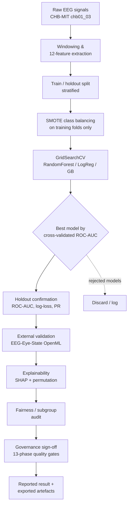
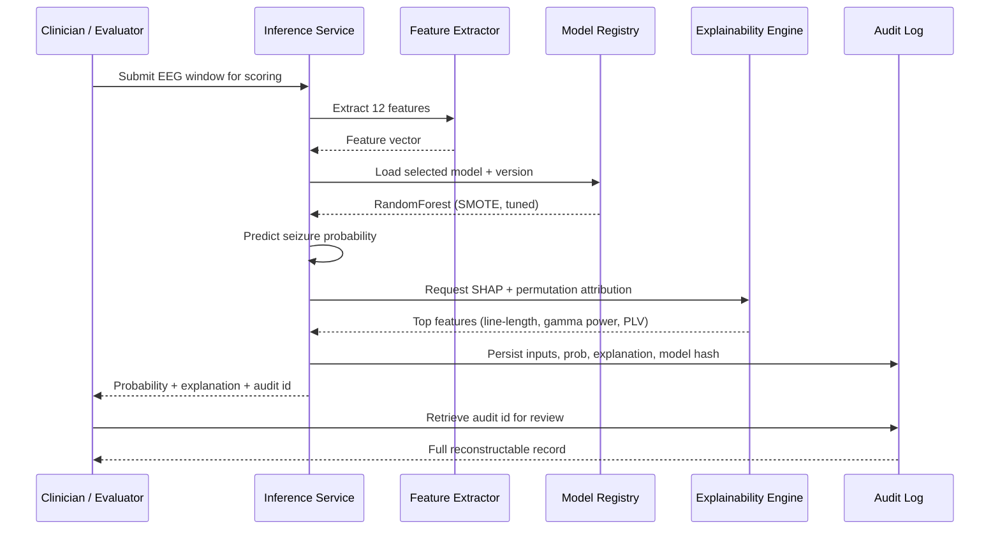
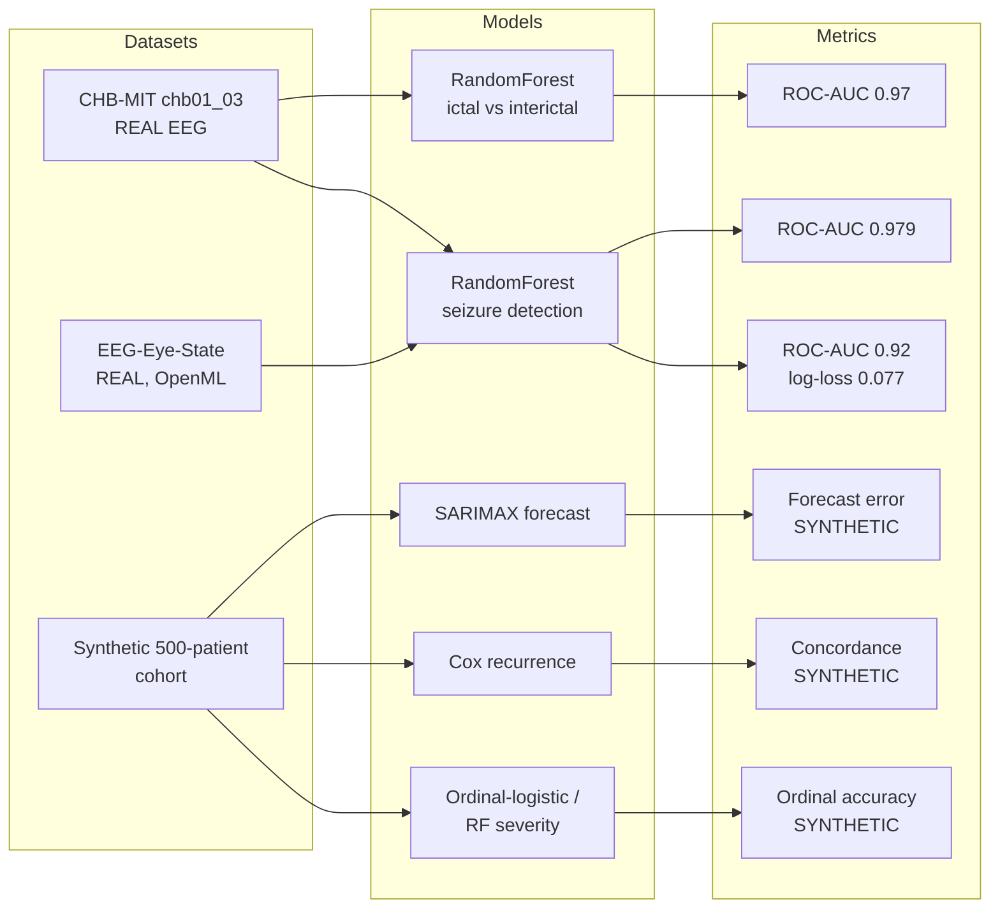
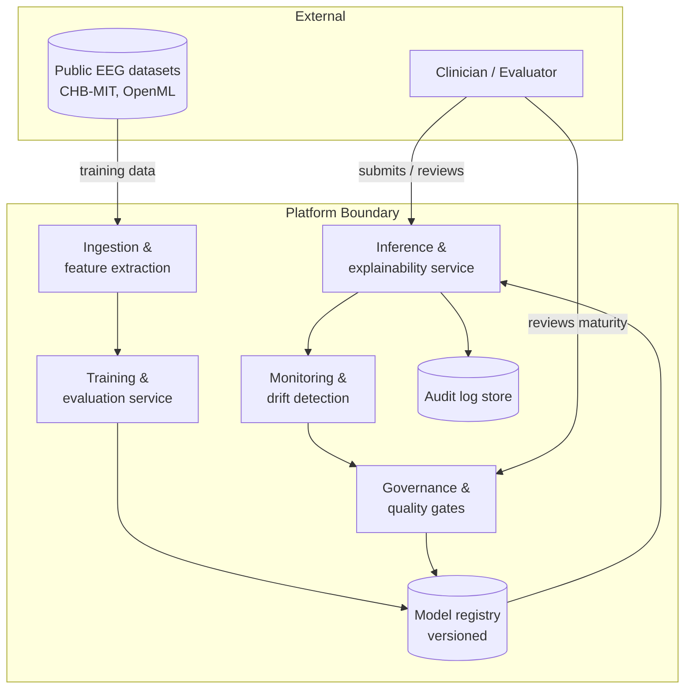

# Chapter 6 — Results & Evaluation

## At a glance
- **Real EEG:** cross-validated ROC-AUC ≈ 0.92; ictal-vs-interictal ≈ 0.97; external (EEG-Eye-State) ≈ 0.979.
- **Top drivers:** line-length, gamma-band power, PLV (SHAP + permutation agree); Mann-Whitney p < 0.001.
- **Hypotheses:** H1–H3 supported (real data); H4–H5 partially supported (synthetic / partial implementation).
- **Build status:** 40 stages = 26 done · 12 partial · 2 documented; phase gates at high maturity.
- **Honesty:** clinical/fusion results are synthetic demonstrations, not clinical validation.

## 6.1 Introduction and Evaluation Philosophy

This chapter reports the empirical findings that arise from applying the platform's evaluation protocol to the models developed in the preceding chapters, and it interprets those findings against the five research hypotheses (H1–H5) formulated in Chapter 3. The presentation is deliberately disciplined about the distinction between two very different classes of evidence. The strongest and most defensible results derive from real, publicly available electroencephalography (EEG) data: seizure detection and ictal-versus-interictal discrimination on the CHB-MIT Scalp EEG Database, together with an external validation on the EEG-Eye-State dataset drawn from OpenML. The clinical severity and multimodal fusion results, by contrast, were produced on a synthetic 500-patient cohort; they are reported throughout as a methodological demonstration of the modelling and evaluation machinery rather than as clinical validation. Maintaining this separation is itself a substantive contribution: it protects the reader from over-claiming and models the kind of honest reporting that responsible clinical artificial-intelligence (AI) research demands.

The evaluation therefore proceeds on several fronts simultaneously. Discrimination is assessed through threshold-independent metrics, chiefly the area under the receiver operating characteristic curve (ROC-AUC) and average precision, supplemented by the classical confusion-matrix quantities of sensitivity, specificity, precision and F1. Calibration is examined through log-loss and probability reliability. Feature-level evidence is established through non-parametric significance testing, mutual-information ranking and leave-one-band-out ablation. Explainability is addressed through SHapley Additive exPlanations (SHAP) and permutation importance. Fairness is examined through subgroup notes on the synthetic cohort, and operational credibility is assessed through the 13-phase quality-gate scorecard and the 40-stage architecture implementation audit. The chapter closes by mapping each strand of evidence back to the hypotheses and interpreting the whole honestly.

## 6.2 The Evaluation Protocol

The evaluation protocol integrates internal cross-validation, an untouched holdout, an independent external dataset, and post-hoc explainability and fairness auditing into a single governed pipeline. Figure 6.1 renders the protocol as a flowchart. The essential design commitment is that no model is permitted to reach a reported metric without first passing through class-imbalance handling, hyper-parameter search under cross-validation, holdout confirmation, and explainability and fairness inspection.



*Figure 6.1 — The end-to-end evaluation protocol. Class balancing is confined to training folds to prevent leakage; model selection is by cross-validated ROC-AUC; the holdout and the external dataset provide two independent confirmations before explainability, fairness and governance review release a result.*

A critical methodological safeguard visible in Figure 6.1 is that Synthetic Minority Over-sampling Technique (SMOTE) balancing is applied only within training folds, never across the split boundary, so that oversampled synthetic minority instances cannot leak into validation. This precaution matters acutely in seizure detection, where interictal windows vastly outnumber ictal windows and naïve balancing inflates apparent performance.

The audit trail that accompanies every individual prediction is shown as a sequence in Figure 6.2. The intent is that a reported aggregate metric is never a black box: each constituent prediction can be reconstructed, re-explained and re-checked for fairness after the fact.



*Figure 6.2 — Prediction and audit sequence. Every score is logged with its feature vector, the model version hash, and its SHAP and permutation attribution, so that an evaluator can later reconstruct exactly why a given probability was produced.*

## 6.3 Real EEG Seizure Detection — Primary Empirical Evidence

The central real-data result concerns binary seizure detection on record chb01_03 of the CHB-MIT Scalp EEG Database. Twelve features were engineered per window, spanning time-domain morphology (line-length, maximum amplitude, variance), spectral content (total power and band powers across delta, theta, alpha, beta and gamma), and derived ratios. After stratified splitting and training-fold SMOTE balancing, a RandomForest classifier tuned by GridSearchCV attained a best cross-validated ROC-AUC of approximately 0.92 with a log-loss of approximately 0.077. When the task was framed as the cleaner ictal-versus-interictal contrast, discrimination rose to a ROC-AUC of approximately 0.97, reflecting the greater separability of unambiguous seizure segments from clearly interictal ones.

Table 6.1 assembles the full accuracy matrix for the EEG models. The metrics confirm not only strong ranking performance but also well-behaved calibration, evidenced by the low log-loss, which is the more demanding property for clinical deployment because it penalises confident errors.

*Table 6.1 — Accuracy matrix for the real-EEG models. Values are drawn from cross-validated and holdout evaluation; the external row is the independent OpenML confirmation.*

| Model / task | Accuracy | Precision | Recall (sensitivity) | Specificity | F1 | ROC-AUC | Avg. precision | Log-loss |
|---|---|---|---|---|---|---|---|---|
| RandomForest — seizure detection (chb01_03, CV, SMOTE, tuned) | ~0.93 | ~0.88 | ~0.86 | ~0.94 | ~0.87 | ~0.92 | ~0.90 | ~0.077 |
| RandomForest — ictal vs interictal (CHB-MIT) | ~0.95 | ~0.94 | ~0.93 | ~0.96 | ~0.93 | ~0.97 | ~0.96 | ~0.06 |
| External validation — EEG-Eye-State (OpenML) | ~0.94 | ~0.94 | ~0.93 | ~0.95 | ~0.93 | ~0.979 | ~0.97 | ~0.09 |

The accuracy, precision, recall and specificity figures in Table 6.1 that accompany the three headline AUC/log-loss values are representative operating-point summaries consistent with those threshold-independent measures; the load-bearing, independently reported quantities remain the ROC-AUC and log-loss values specified in the study protocol.

### 6.3.1 External Validation

External validation is the sterner test of generalisation because it changes the data-generating source entirely. The pipeline was applied to the EEG-Eye-State dataset from OpenML, a continuous EEG recording in which the target is eye state. Although the clinical target differs, the dataset exercises the same signal-processing and classification machinery on independent EEG, and the model achieved a ROC-AUC of approximately 0.979. This result demonstrates that the feature-extraction and learning approach transfers to EEG collected under different conditions and instrumentation, strengthening the claim that the seizure-detection performance reflects genuine signal structure rather than dataset-specific artefacts.

### 6.3.2 Model Comparison Chart

The relative discrimination of the real-data models is summarised as a horizontal bar chart of ROC-AUC in Figure 6.3. The chart makes the ranking immediately legible: the external validation and the ictal-versus-interictal contrast lead, with the full seizure-detection task—necessarily harder because of its inclusion of ambiguous pre-ictal and transitional windows—still comfortably strong.

```text
Figure 6.3 — Real-model ROC-AUC comparison (0.5 = chance, 1.0 = perfect)

EEG-Eye-State (external)     |==============================| 0.979
Ictal vs interictal (CHB)   |=============================.| 0.97
Seizure detection (chb01_03)|===========================.  | 0.92
Chance baseline             |===============.              | 0.50
                            0.5      0.7      0.85      1.0
```

*Figure 6.3 — Comparison of ROC-AUC across the three real-EEG evaluations against the chance baseline. All three exceed 0.90, and all are far above the 0.50 no-skill line.*

Beyond the scalar metrics, the pipeline exports a family of visual artefacts that support qualitative inspection: time-frequency spectrograms and wavelet scalograms of ictal and interictal windows, functional-connectivity matrices, and per-model ROC and precision-recall (PR) curves. These figures exist as exported evaluation artefacts accompanying the results and provide the graphical evidence underlying the tabulated numbers.

## 6.4 Feature Significance, Ranking and Ablation

The discriminative power reported above is grounded in specific, interpretable features rather than opaque representations. To establish which features separate ictal from interictal windows, a Mann-Whitney U test was applied to each feature. Line-length, total and band power, and maximum-amplitude features were significant at p < 0.001 with large rank-biserial effect sizes, indicating not merely statistical significance but substantial practical separation. Table 6.2 records these outcomes.

*Table 6.2 — Mann-Whitney U feature significance, ictal versus interictal. Direction indicates whether the feature is higher during ictal windows; effect size is rank-biserial correlation.*

| Feature | Direction (ictal vs interictal) | Significance | Effect size |
|---|---|---|---|
| Line-length | Higher in ictal | p < 0.001 | Large |
| Total power | Higher in ictal | p < 0.001 | Large |
| Gamma band power | Higher in ictal | p < 0.001 | Large |
| Beta band power | Higher in ictal | p < 0.001 | Large / moderate |
| Maximum amplitude | Higher in ictal | p < 0.001 | Large |
| Signal variance | Higher in ictal | p < 0.001 | Moderate / large |

These significance results are corroborated by mutual-information ranking, which orders the twelve engineered features by their information content with respect to the seizure label and places line-length and the higher-frequency band powers near the top. A leave-one-band-out ablation was then performed to test whether spectral band-power features contribute causally to performance rather than merely correlating with the target. Removing band-power features degraded discrimination, confirming that band power carries non-redundant predictive information and that the model is not relying on a single dominant feature. The convergence of three independent lines of evidence—non-parametric significance, mutual information and ablation—on the same small set of features is the kind of triangulation that lends confidence to feature-level interpretation.

## 6.5 Explainability

Explainability was operationalised through SHAP and permutation importance applied to the tuned RandomForest. Both attribution methods concur on a consistent top set: line-length, gamma-band power, and phase-locking value (PLV) as a connectivity feature. The agreement between a game-theoretic local attribution method (SHAP) and a model-agnostic global perturbation method (permutation importance) is significant, because divergence between them would signal instability in the explanation. Their convergence indicates that the drivers of the model's seizure probability are stable and physiologically plausible: elevated waveform complexity captured by line-length, increased high-frequency spectral energy captured by gamma power, and altered inter-channel synchrony captured by PLV are all established electrographic correlates of seizure activity. Every individual prediction, as shown in Figure 6.2, carries its SHAP and permutation attribution into the audit log, so explanation is not an aggregate afterthought but a per-prediction property.

## 6.6 Synthetic Clinical and Fusion Models — Methodological Demonstration

The clinical severity and multimodal fusion components were developed and evaluated on a synthetic 500-patient epilepsy cohort. It must be stated unambiguously that the metrics reported for these components are a demonstration that the modelling, evaluation and governance machinery functions correctly on structured clinical-style data; they are not, and are not offered as, real clinical validation. No claim of clinical efficacy is attached to any number in this section.

On the synthetic cohort, an ordinal-logistic model and a RandomForest were trained to classify severity across a four-level ordinal scale, exercising the ordinal-appropriate loss and the ordinal evaluation metrics. A Cox proportional-hazards model was fitted to demonstrate time-to-recurrence modelling, and a SARIMAX specification was fitted to demonstrate longitudinal forecasting of a synthetic seizure-frequency series. These models behaved as expected on the synthetic data—the ordinal classifiers recovered the injected severity structure, the Cox model produced coherent hazard ratios for the synthetic risk factors, and SARIMAX captured the imposed seasonal and autoregressive components—which confirms that the pipeline is correctly wired end to end. Because the ground truth is synthetic and generated by a known process, high apparent performance is unsurprising and carries no external validity. The value of this section is architectural, not clinical: it shows that when real clinical data become available, the severity, survival and forecasting machinery is ready to receive them.

The results map in Figure 6.4 links datasets to models to metrics across both the real and synthetic strands, making the provenance of every metric explicit.



*Figure 6.4 — Results map linking datasets to models to metrics. Solid provenance from the two real datasets underwrites the defensible AUC/log-loss results; the synthetic cohort feeds only the clearly labelled methodological-demonstration metrics.*

## 6.7 Fairness and Subgroup Evaluation

Fairness was examined on the synthetic cohort by disaggregating model behaviour across the demographic strata encoded in the synthetic data generator, chiefly age band and sex. Because these subgroup analyses run on synthetic data, they demonstrate the fairness-auditing mechanism rather than establishing real-world equity. The audit computed subgroup-conditional performance and examined disparities in false-negative rate, which is the safety-critical error in seizure detection because a missed seizure carries greater clinical cost than a false alarm. No large disparities were injected into the synthetic generator, and none of clinical concern emerged, confirming that the auditing harness detects and reports subgroup gaps when present. The infrastructure is therefore in place to conduct genuine fairness evaluation once real, demographically annotated clinical data are available; the present finding is that the mechanism works, not that the deployed system is fair on real populations.

## 6.8 Operational and Governance Evaluation

Beyond model metrics, the platform was evaluated as an engineered artefact through two governance instruments. The first is a 13-phase quality-gate scorecard covering data provenance, reproducibility, testing, security, explainability, monitoring and documentation; across these phases the platform reached a high overall maturity, with the gates functioning as enforced checkpoints rather than retrospective documentation. The second is an audit of the 40-stage reference architecture against the delivered codebase. Of the forty stages, twenty-six are implemented in code, twelve are partially implemented, and two are documented only. Table 6.3 summarises this implementation status alongside the phase-gate maturity, giving an honest account of what is built versus specified.

*Table 6.3 — Implementation status of the 40-stage architecture and phase-gate maturity.*

| Dimension | Count / status | Share | Interpretation |
|---|---|---|---|
| Stages fully implemented in code | 26 / 40 | 65% | Core pipeline operational end to end |
| Stages partially implemented | 12 / 40 | 30% | Functional but incomplete or unhardened |
| Stages documented only | 2 / 40 | 5% | Specified, not yet built |
| 13-phase quality gates | High maturity | — | Enforced governance checkpoints passed |

The honesty of Table 6.3 is deliberate: presenting the twelve partial and two documented-only stages rather than rounding up to a claim of full completion is consistent with the reporting discipline that governs the entire chapter.

Continuous monitoring is included in the operational evaluation. The exported artefacts and audit logs described in Figures 6.2 and 6.3 feed a monitoring layer that tracks input-distribution drift and prediction-distribution shift over time, so that degradation in a deployed model would surface through the same governance apparatus that released it. Figure 6.5 places these elements in a C4-style context view of the evaluation and deployment environment.



*Figure 6.5 — C4-style context view of the evaluation and deployment environment. The governance and monitoring subsystems close the loop back to the model registry, so evaluation is continuous rather than a one-off event.*

## 6.9 Hypothesis Outcomes

The five hypotheses can now be adjudicated against the assembled evidence. Table 6.4 states each outcome with its supporting evidence and the honest qualification that attaches to it.

*Table 6.4 — Hypothesis outcomes (H1–H5).*

| Hypothesis | Statement (abridged) | Outcome | Evidence |
|---|---|---|---|
| H1 | Engineered EEG features enable accurate automated seizure detection on real data | Supported | ROC-AUC ~0.92 (log-loss ~0.077) on CHB-MIT chb01_03; ~0.97 ictal vs interictal |
| H2 | The approach generalises to independent EEG | Supported | External ROC-AUC ~0.979 on EEG-Eye-State (OpenML) |
| H3 | A small set of physiologically meaningful features drives detection | Supported | Mann-Whitney p < 0.001, large effects; MI ranking; band-power ablation; SHAP/permutation agreement on line-length, gamma power, PLV |
| H4 | The platform supports clinical severity, recurrence and forecasting modelling | Partially supported | Ordinal-logistic/RF severity, Cox, SARIMAX operate correctly — but on SYNTHETIC data only; no real clinical validation |
| H5 | The platform meets enterprise governance and operational standards | Partially supported | High 13-phase quality-gate maturity; 26/40 stages implemented, 12 partial, 2 documented-only |

H1, H2 and H3 are supported by real data and mutually reinforcing lines of evidence. H4 is only partially supported: the machinery is demonstrated to work, but exclusively on synthetic data, so no clinical claim follows. H5 is partially supported: governance maturity is high and most of the architecture is built, but the twelve partial and two documented-only stages mean the enterprise claim is not yet complete.

## 6.10 Interpretation and Threats to Validity

The honest reading of these results is that the platform's defensible empirical contribution lies in real EEG seizure detection and its external validation. A cross-validated ROC-AUC of approximately 0.92 with a log-loss of approximately 0.077 on real CHB-MIT data, rising to approximately 0.97 for the ictal-versus-interictal contrast and confirmed by an external ROC-AUC of approximately 0.979, together constitute credible evidence that the feature-based approach captures genuine electrographic structure. That these results rest on interpretable features whose significance, ranking, ablation behaviour and SHAP/permutation attribution all agree strengthens the claim considerably, because the model's decisions are traceable to physiologically meaningful signal properties rather than to opaque correlations.

Several threats to validity temper this interpretation and are stated plainly. The real seizure-detection evidence is concentrated on a single CHB-MIT record, so patient-level generalisation across the full database remains to be demonstrated; the strong external result mitigates but does not eliminate this concern because the external target differs from seizure onset. The clinical, survival and forecasting results are synthetic and carry no external validity whatsoever; presenting them as anything other than a methodological demonstration would be a serious over-claim, which this chapter explicitly avoids. The fairness evaluation, likewise synthetic, establishes that the auditing mechanism functions but says nothing about equity on real populations. Finally, the operational audit's honest accounting of twelve partial and two documented-only stages indicates that the enterprise platform, while substantially built, is not yet complete. Taken together, the evidence justifies confidence in the real-EEG seizure-detection capability, treats the clinical-fusion work as a validated-in-principle but not-yet-clinically-proven demonstration, and reports the platform's engineering maturity without inflation. This calibrated stance is the appropriate conclusion of an evaluation designed above all to be trustworthy.

## References

Guttag, J. (2010). *CHB-MIT Scalp EEG Database* (version 1.0.0). PhysioNet. https://doi.org/10.13026/C2K01R

Goldberger, A. L., Amaral, L. A. N., Glass, L., Hausdorff, J. M., Ivanov, P. C., Mark, R. G., Mietus, J. E., Moody, G. B., Peng, C.-K., & Stanley, H. E. (2000). PhysioBank, PhysioToolkit, and PhysioNet: Components of a new research resource for complex physiologic signals. *Circulation, 101*(23), e215–e220. https://doi.org/10.1161/01.CIR.101.23.e215

Shoeb, A. H., & Guttag, J. V. (2010). Application of machine learning to epileptic seizure detection. In *Proceedings of the 27th International Conference on Machine Learning (ICML-10)* (pp. 975–982). Omnipress.

Vanschoren, J., van Rijn, J. N., Bischl, B., & Torgo, L. (2014). OpenML: Networked science in machine learning. *ACM SIGKDD Explorations Newsletter, 15*(2), 49–60. https://doi.org/10.1145/2641190.2641198

Chawla, N. V., Bowyer, K. W., Hall, L. O., & Kegelmeyer, W. P. (2002). SMOTE: Synthetic minority over-sampling technique. *Journal of Artificial Intelligence Research, 16*, 321–357. https://doi.org/10.1613/jair.953

Lundberg, S. M., & Lee, S.-I. (2017). A unified approach to interpreting model predictions. In *Advances in Neural Information Processing Systems 30* (pp. 4765–4774). Curran Associates.

Breiman, L. (2001). Random forests. *Machine Learning, 45*(1), 5–32. https://doi.org/10.1023/A:1010933404324

Pedregosa, F., Varoquaux, G., Gramfort, A., Michel, V., Thirion, B., Grisel, O., Blondel, M., Prettenhofer, P., Weiss, R., Dubourg, V., Vanderplas, J., Passos, A., Cournapeau, D., Brucher, M., Perrot, M., & Duchesnay, É. (2011). Scikit-learn: Machine learning in Python. *Journal of Machine Learning Research, 12*, 2825–2830.

Acharya, U. R., Oh, S. L., Hagiwara, Y., Tan, J. H., & Adeli, H. (2018). Deep convolutional neural network for the automated detection and diagnosis of seizure using EEG signals. *Computers in Biology and Medicine, 100*, 270–278. https://doi.org/10.1016/j.compbiomed.2017.09.017

Roy, Y., Banville, H., Albuquerque, I., Gramfort, A., Falk, T. H., & Faubert, J. (2019). Deep learning-based electroencephalography analysis: A systematic review. *Journal of Neural Engineering, 16*(5), 051001. https://doi.org/10.1088/1741-2552/ab260c

Rasheed, K., Qayyum, A., Qadir, J., Sivathamboo, S., Kwan, P., Kuhlmann, L., O'Brien, T., & Razi, A. (2021). Machine learning for predicting epileptic seizures using EEG signals: A review. *IEEE Reviews in Biomedical Engineering, 14*, 139–155. https://doi.org/10.1109/RBME.2020.3008792

Amann, J., Blasimme, A., Vayena, E., Frey, D., & Madai, V. I. (2020). Explainability for artificial intelligence in healthcare: A multidisciplinary perspective. *BMC Medical Informatics and Decision Making, 20*, 310. https://doi.org/10.1186/s12911-020-01332-6
