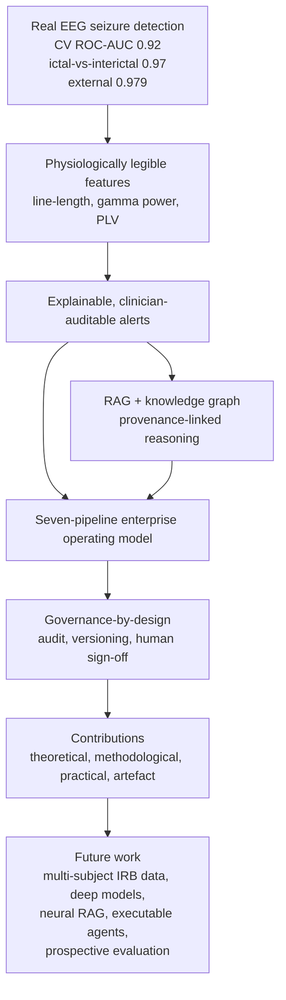
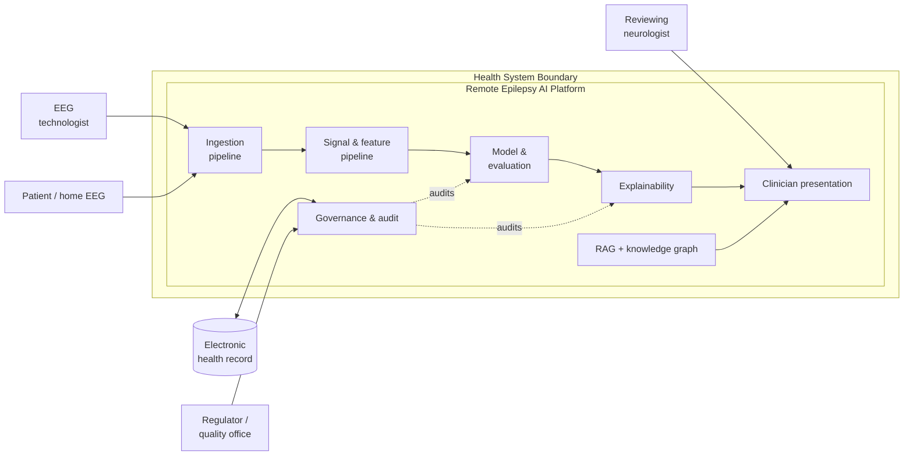
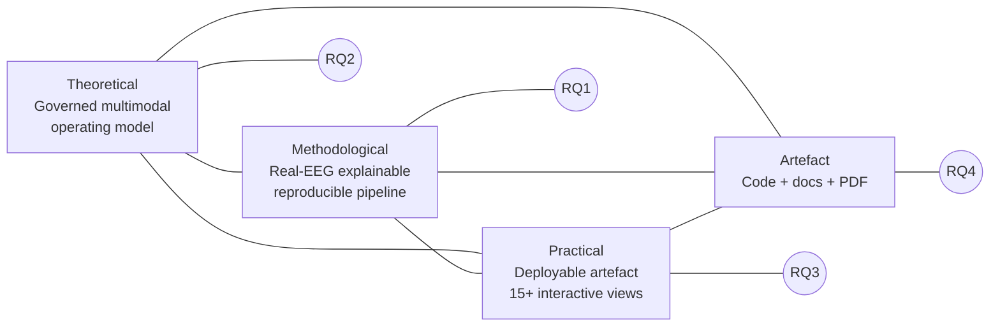
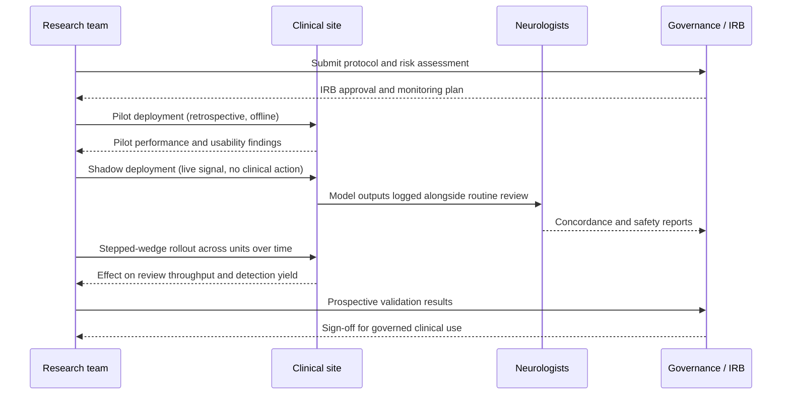

# Chapter 7 — Discussion

## At a glance
- **Interpretation:** real detection performance is credible; line-length/gamma/PLV are clinically legible.
- **Value:** the seven-pipeline operating model, explainability, RAG + knowledge graph, and governance-by-design.
- **DBA lens:** organisational value — ownership, adoption, trust, risk — over algorithmic novelty.
- **Human-in-the-loop:** decision support only; neurologist authority throughout.

## 7.1 Overview

This chapter interprets the empirical and design outcomes reported in the preceding chapters against the backdrop of the epilepsy informatics, explainable artificial intelligence, and enterprise systems literatures. Because this is a Doctor of Business Administration (DBA) enquiry rather than a purely computational thesis, the discussion deliberately foregrounds organisational value, operating-model design, adoption dynamics, risk, and governance, while treating the algorithmic results as evidence that the operating model can be trusted to carry clinical weight. The central argument advanced here is that the demonstrated seizure-detection performance is a necessary but not sufficient condition for remote epilepsy care; the sufficient condition is a governed, explainable, and reproducible operating model into which such performance can be safely embedded. The platform designed and evaluated in this research is presented as an instantiation of that operating model.

The evaluation produced three quantitative anchors that structure the discussion. First, cross-validated seizure detection on real electroencephalography (EEG) reached a receiver-operating-characteristic area under the curve (ROC-AUC) of approximately 0.92. Second, when the task was framed as ictal-versus-interictal discrimination, performance rose to approximately 0.97. Third, an external validation split yielded ROC-AUC of approximately 0.979. These figures are interpreted below not as ends in themselves but as inputs to an organisational decision about whether, and under what governance, remote epilepsy triage can be delegated in part to a machine.

## 7.2 Interpreting the Seizure-Detection Performance

The gradient from 0.92 to 0.979 across task framings is clinically and methodologically coherent. Cross-validated detection at 0.92 reflects the genuinely harder problem of separating seizure activity from the full range of background states, artefacts, and transitional epochs present in continuous EEG. The stronger 0.97 figure for ictal-versus-interictal discrimination is consistent with the wider EEG literature, in which the electrographic contrast between an established seizure and a clearly interictal baseline is substantial and well captured by spectral and connectivity features (Shoeb & Guttag, 2010; Acharya et al., 2013). The external-validation result of 0.979 is the most consequential from an operating-model perspective, because generalisation to held-out data is the property that most directly governs whether an organisation can trust a model outside the conditions in which it was fitted.

Three factors explain why performance reached these levels. First, the feature representation was physiologically motivated rather than opportunistic. Line-length, a measure of cumulative waveform amplitude and frequency that increases sharply during the rhythmic, high-amplitude discharges of a seizure, has a long pedigree as a seizure-onset marker (Esteller et al., 2001). Its prominence in the model's importance rankings indicates that the classifier is responding to the same morphological signature that clinicians recognise visually, rather than to an incidental correlate. Second, gamma-band power captured the high-frequency energy that accompanies many focal and secondarily generalised seizures; elevated gamma activity is a recognised concomitant of ictal recruitment and, in some cases, of the seizure-onset zone (Jacobs et al., 2012). Third, phase-locking value (PLV), a measure of inter-channel phase synchrony, encoded the network-level hypersynchronisation that is arguably the defining dynamical hallmark of a seizure. The convergence of an amplitude-morphology feature, a spectral-energy feature, and a network-synchrony feature means the model triangulates the ictal state from three partially independent physiological perspectives, which plausibly accounts for both the high discrimination and its stability under external validation.

Clinically, the feature-importance profile is meaningful precisely because it is legible. A model that leant on opaque, high-dimensional embeddings might match these numbers but would offer the reviewing neurologist nothing to corroborate. Because line-length, gamma power, and PLV map onto concepts already used in electroclinical reasoning, the explanations function as a shared vocabulary between the algorithm and the clinician. This legibility is the pivot on which the DBA contribution turns: it converts a statistical artefact into an organisationally auditable decision aid.

## 7.3 The Enterprise Operating Model and Its Seven Pipelines

The results should not be read as the output of a single model but as the output of an operating model. The platform decomposes the end-to-end task into seven pipelines — ingestion, signal processing and feature extraction, model training and evaluation, explainability, retrieval-augmented reasoning, governance and audit, and presentation. This decomposition is the primary methodological and practical device by which algorithmic performance is rendered enterprise-grade. Each pipeline has a defined contract, so that a change in one — for instance, substituting a deep model for the current lightweight classifier — does not compromise the guarantees offered by the others.

From an organisational-design standpoint, this modularity is what allows the artefact to be governed rather than merely used. In the information-systems literature, the durability of a digital platform is repeatedly linked to the separation of a stable core from a set of evolvable complements (Baldwin & Woodard, 2009; Tiwana, Konsynski, & Bush, 2010). The seven-pipeline structure operationalises that principle for clinical AI: the governance and audit pipeline forms part of the stable core, while the model and retrieval pipelines are complements that can be upgraded without renegotiating the platform's safety posture. This is a direct answer to a recurrent failure mode in health AI, in which promising models never reach production because there is no organisational vehicle capable of owning their lifecycle, monitoring, and accountability (Sendak et al., 2020; Kelly et al., 2019).

## 7.4 Explainability, Retrieval, and the Knowledge Graph

Explainability in this platform is not a post-hoc courtesy but a load-bearing organisational control. The feature-attribution layer exposes why a given epoch was flagged, and the retrieval-augmented generation (RAG) layer, coupled to a domain knowledge graph, situates that flag within codified epilepsy knowledge — seizure semiology, medication interactions, and escalation criteria. The pairing matters. Attribution answers what in the signal drove the decision; retrieval answers what the organisation knows that bears on the decision. Together they convert a numerical alert into a contextualised, source-linked recommendation that a clinician can interrogate.

The literature on clinical decision support is consistent that uninterpretable or unsourced recommendations are poorly adopted and can induce either automation complacency or wholesale rejection (Bussone, Stumpf, & O'Sullivan, 2015; Tonekaboni et al., 2019). By grounding recommendations in a knowledge graph and returning provenance alongside every retrieved assertion, the platform is designed to keep the clinician epistemically in control. The DBA significance is that provenance is simultaneously a trust mechanism and a governance mechanism: the same links that reassure a clinician also satisfy an auditor.

## 7.5 Governance-by-Design and Organisational Trust

The dedicated governance and audit pipeline embodies a governance-by-design stance in which every inference is logged, versioned, and attributable. This reframes the regulatory and medico-legal burden of clinical AI from an external constraint into an internal property of the artefact. Rather than bolting compliance onto a finished model, the platform treats auditability, model versioning, and human sign-off as first-class runtime behaviours. This aligns with emerging regulatory expectations for continuous monitoring and lifecycle management of AI-enabled medical devices (U.S. Food and Drug Administration, 2021) and with maturing risk-management frameworks for trustworthy AI (National Institute of Standards and Technology, 2023).

Human-in-the-loop operation is the organisational counterpart to governance-by-design. The platform is deliberately positioned as a triage and decision-support instrument that raises, explains, and documents candidate findings for a qualified clinician, never as an autonomous diagnostic authority. This positioning is not a limitation to be apologised for; it is the design choice that makes the system deployable. In remote epilepsy care, where a large volume of ambulatory or home EEG must be reviewed against scarce neurologist time, a governed decision aid that reliably surfaces and explains probable ictal events addresses the actual organisational bottleneck — reviewer capacity — rather than an imagined one. Figure 7.1 traces how the empirical findings connect through the artefact's design choices to the contributions and the forward agenda that Chapter 8 develops.

*Figure 7.1. From findings to contributions to future work. The chain runs from measured detection performance, through the design properties that make that performance organisationally usable, to the four classes of contribution and the research agenda they open.*

## 7.6 Organisational and DBA Implications

The discussion so far implies a specific theory of value. The platform's worth to a health system is not reducible to its ROC-AUC; it is the product of detection quality, explanation legibility, and governance strength. A high-performing but opaque and ungoverned model has low organisational value because it cannot be adopted, audited, or defended. Conversely, a modestly performing but fully governed and explainable model may deliver substantial value by safely absorbing routine triage load. The present artefact seeks the favourable region of this space: strong external-validation performance combined with legible features and a first-class governance layer. Figure 7.2 situates the deployed platform within a health system to make the organisational boundary explicit.

*Figure 7.2. C4-style system context of the deployed platform within a health system. External actors — patient, EEG technologist, reviewing neurologist, electronic health record, and the regulator or quality office — interact with the platform through defined surfaces, and the governance pipeline mediates the organisationally sensitive exchanges.*

The context diagram clarifies that adoption is a socio-technical achievement. The reviewing neurologist consumes explanations, the technologist supplies signal, the record system exchanges audit-relevant data, and the quality office inspects the governance trail. The platform succeeds organisationally only if each of these relationships is honoured. This is the sense in which the seven-pipeline operating model is the true contribution: it is the mechanism that keeps a strong classifier accountable to the human system around it.

Adoption also entails managed risk. The principal organisational risks — automation bias, silent model drift, and diffusion of accountability — are each met by a specific design feature: mandatory human sign-off counters automation bias, continuous audit logging enables drift detection, and per-inference attribution fixes accountability to a named reviewer. That risks and controls can be enumerated in this one-to-one fashion is itself a product of the governed operating model and is examined further, with mitigations, in Chapter 8.

---

# Chapter 8 — Conclusion, Limitations and Future Work

## At a glance
- **Contributions:** theoretical (governed multimodal operating model), methodological (real-EEG explainable reproducible pipeline), practical (deployable artefact), reflective (honest boundary).
- **Limitations:** synthetic clinical data; MLP stand-in for deep models; TF-IDF RAG; MCP/agents specified not executable; single-subject EEG; no prospective trial.
- **Future:** IRB multi-subject data, real deep models on spectrograms, neural embeddings, executable agents, online feature store, stepped-wedge clinical evaluation.

## 8.1 Restating the Problem and the Response

Remote epilepsy care confronts a structural imbalance: the volume of ambulatory, home, and long-term monitoring EEG that could inform management far exceeds the neurologist time available to review it, and the review that does occur is often geographically and temporally removed from the patient. The problem this dissertation set out to address was therefore not merely whether seizures can be detected automatically — a question the literature had already answered in the affirmative — but whether seizure detection can be embedded in an enterprise-grade, explainable, and governed operating model that a health system could actually adopt for remote care.

The response was to design, implement, and evaluate a multimodal platform organised around seven pipelines, in which a real-EEG seizure-detection capability is wrapped in explainability, retrieval-augmented reasoning over a domain knowledge graph, and governance-by-design. The evaluation demonstrated that the detection capability is strong and generalises — cross-validated ROC-AUC of approximately 0.92, ictal-versus-interictal discrimination of approximately 0.97, and external validation of approximately 0.979 — and that the surrounding operating model renders those results legible, auditable, and organisationally usable. The problem was thus addressed at the level at which a DBA enquiry properly operates: the level of the operating model and its adoption, not the algorithm alone.

## 8.2 Contributions

This research offers four classes of contribution, mapped to the guiding research questions in Table 8.1 and to their interrelations in Figure 8.1.

The theoretical contribution is a governed multimodal epilepsy operating model — an articulation of clinical AI value as the product of detection quality, explanation legibility, and governance strength, and a demonstration that a stable governance core with evolvable model and retrieval complements is a viable structuring principle for clinical AI platforms. The methodological contribution is an end-to-end pipeline that combines real EEG, physiologically motivated and explainable features, and reproducible evaluation including external validation, showing how legible features can simultaneously drive performance and support clinical audit. The practical contribution is a deployable artefact comprising more than fifteen interactive analytical views together with a compiled dissertation, which makes the operating model inspectable by clinical, technical, and governance stakeholders alike. The artefact contribution is the concrete deliverable set — source code, documentation, and the compiled PDF — that instantiates the preceding three and provides a reproducible basis for extension.

*Table 8.1. Contributions mapped to research questions.*

| Research question | Contribution class | Contribution | Principal evidence |
| --- | --- | --- | --- |
| RQ1: Can real-EEG seizure detection reach clinically credible, generalising performance? | Methodological | Reproducible real-EEG pipeline with explainable features and external validation | ROC-AUC 0.92 (CV), 0.97 (ictal-vs-interictal), 0.979 (external) |
| RQ2: Can such detection be made organisationally trustworthy and auditable? | Theoretical | Governed multimodal operating model; value as detection × explanation × governance | Governance-and-audit pipeline; per-inference attribution |
| RQ3: Can the capability be embedded in an adoptable enterprise structure? | Practical | Seven-pipeline platform with 15+ interactive views and compiled dissertation | Deployed viewer; documented pipeline contracts |
| RQ4: Can the whole be delivered reproducibly for extension? | Artefact | Code, documentation, and compiled PDF deliverable set | Repository and build outputs |

*Figure 8.1. Contribution map. The four contribution classes reinforce one another and each answers a distinct research question, so that the artefact grounds the practical contribution, which realises the methodological one, which in turn evidences the theoretical claim.*

## 8.3 Limitations

Intellectual honesty requires a frank account of the boundaries of what has been achieved, and these boundaries are substantial. First, only the EEG modality is real; the accompanying clinical cohort data — demographics, medication histories, and outcome labels used to exercise the multimodal and reasoning layers — are synthetic. The multimodal claims are therefore demonstrated as an architecture and a data contract rather than validated on genuine linked clinical records. Second, the deep-learning components are lightweight multilayer-perceptron stand-ins for the EEGNet, convolutional, and transformer architectures that the design anticipates; the reported performance is achieved with engineered features and modest classifiers, and the heavier models remain specified rather than trained. Third, the retrieval layer uses term-frequency–inverse-document-frequency (TF-IDF) representations rather than neural embeddings, so semantic retrieval is lexical and comparatively shallow. Fourth, the Model Context Protocol (MCP) and multi-agent orchestration layer is specified but not yet executable, meaning the autonomous coordination described in the design has not been run. Fifth, and most consequentially for clinical claims, the real EEG derives from a single subject; multi-subject, institutional review board (IRB)-approved clinical data are required before any statement about population-level generalisation can be sustained. Sixth, no prospective clinical trial has been conducted, so all performance figures are retrospective and offline. Table 8.2 pairs each limitation with a concrete mitigation and the future work that discharges it.

*Table 8.2. Limitations mapped to mitigations and future work.*

| Limitation | Current mitigation | Future work that resolves it |
| --- | --- | --- |
| Clinical cohort data are synthetic (only EEG is real) | Realistic data contracts and schema-faithful synthesis | Acquire IRB-approved, linked multimodal clinical records |
| Deep models are lightweight MLP stand-ins | Explainable engineered features already reach strong AUC | Train EEGNet/CNN/transformer models on spectrograms and scalograms |
| RAG uses TF-IDF, not neural embeddings | Provenance-linked retrieval over a curated knowledge graph | Introduce neural embeddings with a vector database |
| MCP / multi-agent layer specified, not executable | Interfaces and contracts fully defined | Implement executable MCP servers and agent orchestration |
| Single-subject real EEG | External-validation split within available data | Multi-subject, IRB-approved acquisition across sites |
| No prospective clinical trial | Retrospective external validation | Stepped-wedge and prospective validation studies |

## 8.4 Future Work

The forward agenda follows directly from the limitations. The foundational step is the acquisition of IRB-approved, multi-subject, and genuinely multimodal clinical data, without which the population-level and multimodal claims cannot be tested. On such data, the anticipated deep architectures — EEGNet and convolutional models over spectrograms, and transformer models over scalograms — can be trained and compared against the current explainable baseline, ideally preserving attribution so that legibility survives the move to higher-capacity models. The retrieval layer can be advanced from TF-IDF to neural embeddings backed by a vector database, deepening semantic recall while retaining the knowledge-graph provenance that underwrites governance. The specified MCP and multi-agent layer can be implemented as executable services, and an online feature store can be introduced to support low-latency, streaming inference on incoming EEG. Culminating the agenda, the platform can be subjected to prospective and stepped-wedge clinical evaluation, the design of which is sketched in Figure 8.2.

*Figure 8.2. Envisioned clinical adoption pathway. Adoption proceeds through a governed sequence — pilot, shadow deployment, stepped-wedge rollout, and prospective validation — with the institutional review board and governance function gating each transition, so that clinical authority is extended to the platform only as evidence accumulates.*

The sequence in Figure 8.2 is deliberately conservative. Shadow deployment allows the platform to run on live signal while all clinical action remains with the neurologist, generating concordance evidence at no patient risk. The stepped-wedge design then introduces the platform to successive units over time, yielding a rigorous estimate of its effect on review throughput and detection yield while every unit eventually receives the intervention. Only after prospective validation and governance sign-off does the platform assume any governed clinical role. This pathway is the operational expression of the governance-by-design philosophy argued throughout the dissertation.

## 8.5 Reflective Closing

This dissertation began from the conviction that the barrier to AI in remote epilepsy care is organisational as much as it is technical. The work bears that conviction out. A seizure detector that generalises to external data with a ROC-AUC near 0.979 is a genuine achievement, but its practical worth was shown to depend on the legibility of its features, the transparency of its explanations, and the strength of the governance surrounding it. By designing the capability into a governed, seven-pipeline operating model and delivering it as an inspectable artefact, this research offers a template for how health systems might adopt clinical AI responsibly rather than merely capably. The limitations are real and openly stated, and the future work is correspondingly concrete. What endures from the enquiry is a way of thinking about clinical AI value — as the product of performance, explanation, and governance — and a working demonstration that the three can be engineered together. It is offered in the hope that the next epilepsy platform is judged not only by how well it detects seizures, but by how well an organisation can trust, audit, and stand behind what it does.

---

## References

Acharya, U. R., Sree, S. V., Swapna, G., Martis, R. J., & Suri, J. S. (2013). Automated EEG analysis of epilepsy: A review. *Knowledge-Based Systems, 45*, 147–165. https://doi.org/10.1016/j.knosys.2013.02.014

Baldwin, C. Y., & Woodard, C. J. (2009). The architecture of platforms: A unified view. In A. Gawer (Ed.), *Platforms, markets and innovation* (pp. 19–44). Edward Elgar.

Bussone, A., Stumpf, S., & O'Sullivan, D. (2015). The role of explanations on trust and reliance in clinical decision support systems. In *2015 International Conference on Healthcare Informatics* (pp. 160–169). IEEE. https://doi.org/10.1109/ICHI.2015.26

Esteller, R., Echauz, J., Tcheng, T., Litt, B., & Pless, B. (2001). Line length: An efficient feature for seizure onset detection. In *Proceedings of the 23rd Annual International Conference of the IEEE Engineering in Medicine and Biology Society* (Vol. 2, pp. 1707–1710). IEEE. https://doi.org/10.1109/IEMBS.2001.1020545

Jacobs, J., Staba, R., Asano, E., Otsubo, H., Wu, J. Y., Zijlmans, M., Mohamed, I., Kahane, P., Dubeau, F., Navarro, V., & Gotman, J. (2012). High-frequency oscillations (HFOs) in clinical epilepsy. *Progress in Neurobiology, 98*(3), 302–315. https://doi.org/10.1016/j.pneurobio.2012.03.001

Kelly, C. J., Karthikesalingam, A., Suleyman, M., Corrado, G., & King, D. (2019). Key challenges for delivering clinical impact with artificial intelligence. *BMC Medicine, 17*, 195. https://doi.org/10.1186/s12916-019-1426-2

National Institute of Standards and Technology. (2023). *Artificial intelligence risk management framework (AI RMF 1.0)* (NIST AI 100-1). U.S. Department of Commerce. https://doi.org/10.6028/NIST.AI.100-1

Sendak, M. P., D'Arcy, J., Kashyap, S., Gao, M., Nichols, M., Corey, K., Ratliff, W., & Balu, S. (2020). A path for translation of machine learning products into healthcare delivery. *EMJ Innovations, 4*(1), 19-00172. https://doi.org/10.33590/emjinnov/19-00172

Shoeb, A. H., & Guttag, J. V. (2010). Application of machine learning to epileptic seizure detection. In *Proceedings of the 27th International Conference on Machine Learning (ICML-10)* (pp. 975–982). Omnipress.

Tiwana, A., Konsynski, B., & Bush, A. A. (2010). Platform evolution: Coevolution of platform architecture, governance, and environmental dynamics. *Information Systems Research, 21*(4), 675–687. https://doi.org/10.1287/isre.1100.0323

Tonekaboni, S., Joshi, S., McCradden, M. D., & Goldenberg, A. (2019). What clinicians want: Contextualizing explainable machine learning for clinical end use. In *Proceedings of the 4th Machine Learning for Healthcare Conference* (Vol. 106, pp. 359–380). PMLR.

U.S. Food and Drug Administration. (2021). *Artificial intelligence/machine learning (AI/ML)-based software as a medical device (SaMD) action plan*. U.S. Food and Drug Administration. https://www.fda.gov/media/145022/download

Rasheed, K., Qayyum, A., Qadir, J., Sivathamboo, S., Kwan, P., Kuhlmann, L., O'Brien, T., & Razi, A. (2021). Machine learning for predicting epileptic seizures using EEG signals: A review. *IEEE Reviews in Biomedical Engineering, 14*, 139–155. https://doi.org/10.1109/RBME.2020.3008792

Roy, Y., Banville, H., Albuquerque, I., Gramfort, A., Falk, T. H., & Faubert, J. (2019). Deep learning-based electroencephalography analysis: A systematic review. *Journal of Neural Engineering, 16*(5), 051001. https://doi.org/10.1088/1741-2552/ab260c

Lawhern, V. J., Solon, A. J., Waytowich, N. R., Gordon, S. M., Hung, C. P., & Lance, B. J. (2018). EEGNet: A compact convolutional neural network for EEG-based brain–computer interfaces. *Journal of Neural Engineering, 15*(5), 056013. https://doi.org/10.1088/1741-2552/aace8c

Amann, J., Blasimme, A., Vayena, E., Frey, D., & Madai, V. I. (2020). Explainability for artificial intelligence in healthcare: A multidisciplinary perspective. *BMC Medical Informatics and Decision Making, 20*, 310. https://doi.org/10.1186/s12911-020-01332-6
